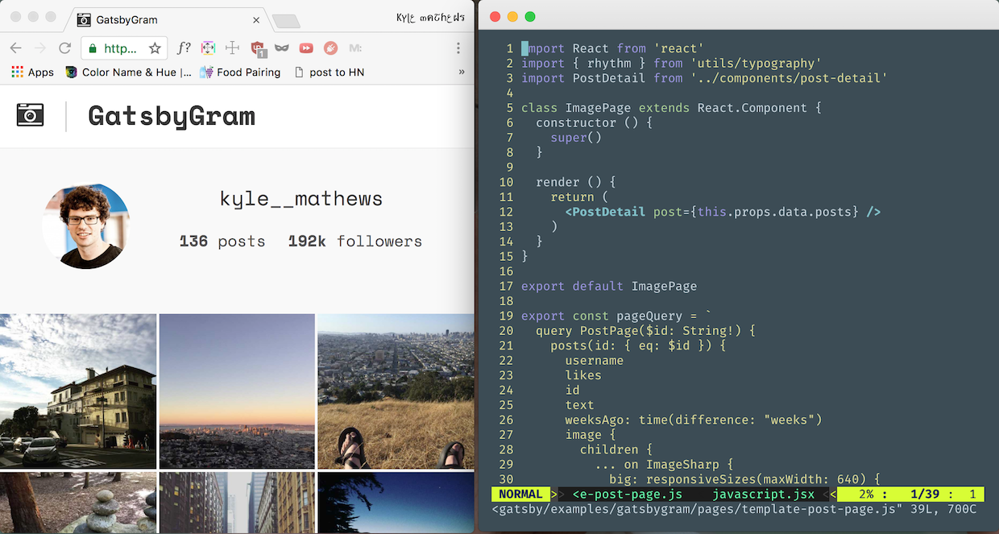

Imagine for a moment the perfect website framework. One that produced
really fast sites by default, that let you use the latest web tools and
browser features without complicated setup, and that helped your team
stay coordinated as you develop, ship, and maintain sites.

This framework would have to be:

* **universal**, work for all types of sites from simple brocurewares to
complex web-apps.
* **simple**, not requiring any setup to start using and with thoughtful
APIs to extend the framework.
* **fast**, doesn't lose customers to slow page loads. Takes advantage of
HTTP/2, browser caching, service workers, inlined critical css, and code
splitting so your site always loads incredibly fast—no matter what you
build.
* **JavaScript-driven**, the web is huge and intensely competitive.
Sites that win are fast and richly interactive. Your framework must make
it trivial to use advanced JavaScript.
* **team ready**, use industry standard collaboration tools like NPM,
Git, and continuous deployment, so your team is always on the same page
and shipping new features is easy.
* **modular**, allows for cleanly separated features so fixing bugs and
adding new features is easy and complexity is contained.
* **internet scale**, launch your site to millions without crashing your
site (or your wallet).
* **secure**, doesn't put your your users' data at risk of hacking.

I believe that Gatsby fulfills these requirements. After several years
of working on the project and seeing it used successfully by many people
on a wide variety of sites, I'm confident that Gatsby works.

Since I open sourced Gatsby in 2015, it's collected over **8000 stars**
on Github (by far the most stars on Github for a project of its type),
been joined by **122 contributors**, and **downloaded 130,000** times!

In mid-2016, I decided to [work full-time on
Gatsby](https://www.bricolage.io/gatsby-open-source-work/) and started
researching and prototyping ideas that are now coming together as Gatsby
1.0.

## What is Gatsby

Gatsby combines the fast performance of static websites with the
powerful abstractions, excellent tools, and client capabilities of
the web-app world.

It is a general purpose data-centric web framework that is [successfully
being used for a wide variety of
sites](https://github.com/gatsbyjs/gatsby#sites-built-with-gatsby)
including blogs, marketing sites, documentation sites, and e-commerce.

It wraps three of the most popular web app tools into a cohesive website
framework:

* [React](https://facebook.github.io/react/) from Facebook for building UIs
* [Webpack](https://webpack.js.org/) for bundling JavaScript and CSS
* [GraphQL](http://graphql.org/) from Facebook for declarative data queries

While designing Gatsby, I wanted a synthesis of two of my favorite
developer experiences. The simplicity of building sites with markdown
and static site generators and the powerful hot-reloading environment of
the React world.


When loading a page in a Gatsby site, browsers first load the page's
pre-built HTML file and then load the minimum JavaScript needed to make
that page interactive.

Because Gatsby sites are just static files, you're ensured a much more
*carefree deployment*. There are no *complicated databases* to install
and maintain and *web-servers to scale* and protect against hacking.

Serving static files ensures consistent *super fast load times*. Once
your site is loaded, Gatsby automatically *pre-fetches* adjacent pages.
This means navigating around your site feels *instantaneous* as all the
content and scripts for the next page has been loaded already.  Since
you're reading this on a Gatsby site, try clicking on a link in the
header and then click back (note, this site is still being worked on as we
approach 1.0).  A bit faster than your current site no? 😜

## Apps vs sites

From nearly the beginning of the web, the idea of the web as an
application platform has competed with the idea of the web as a series
of "documents".

In recent years, the "app" paradigm has gained steam as dozens of
JavaScript frameworks and other JavaScript tools have been released,
exploring ideas and competing for mind-share.

100s of millions of dollars have been invested by the largest companies
in the world in these JavaScript frameworks and the larger ecosystem of
tools surrounding them.

The improvement has been dramatic and exhilarating. I can remember many
things I struggled for weeks to build in ~2010-2013 that took me days or
even hours once I'd adopted React.

React has taken over the web world and for good reason. Its three big
ideas, composable components, lifecycle APIs, and one-way data flow
dramatically *simplify* web UI development. Things that are really hard
to build within other paradigms feel almost easy with React.

## Time for a JavaScript web framework?

The internet runs on Open Source CMSs—primarily Wordpress and Drupal.  I
spent most of college building Drupal websites and writing [open-source
Drupal
modules](https://www.bricolage.io/first-beta-release-drupal-native-mailinglist-module/).
My first startup job was at [Pantheon](https://pantheon.io)—where I
helped [design and build developer tools](https://www.bricolage.io/new-beginnings/)
for teams building Drupal & Wordpress sites.

These open source CMSs are *extraordinary tools and have remarkably dynamic
ecosystems*. They truly run the web.  Wordpress alone runs more than 25%
of all websites on the internet!

But still, the time seems ripe for a client-centric web framework.

As more and more sites are expected to become app-like there's been a
*rush to add more JavaScript into our sites* resulting in an explosion of
tool complexity resulting in, at times, poorly optimized sites that ship
far too much JavaScript at the wrong times bogging down the site.

But it doesn't need to be this way. We use web frameworks because they
*embed smart ideas about how to organize our code* so we're guided towards
building fast sites that are simple to build and maintain.

Gatsby aims to be a *modern web framework* that's designed with the
assumption that you need a rich client. Gatsby bakes in modern
JavaScript compiler and bundling tools along with a full asset pipeline
so you can just start writing your website and *be confident things will
work*.

## Gatsby 1.0: Setting the foundation for a modern JavaScript website framework

I started working on the [1.0
branch](https://github.com/gatsbyjs/gatsby/tree/1.0) in August and after
months of hard work, our first beta release is in sight.

The changes for 1.0 can be organized into a few areas.

### Add service worker and offline support

Service workers are perhaps the most exciting technology that's come to
the web in the past several years. It makes possible (finally!)
sophisticated client caching plus true offline support. I've added
excellent on-by-default support to Gatsby for Service Workers and a
great offline experience. If you're using Chrome or Firefox, this site
loads offline! *Service workers make your site much more resilient
against bad networks*. If someone loads your site on a train and goes
through a tunnel, you won't lose them as they'll still be able to keep
clicking around.

### Route-based code splitting

Many sites generate one JavaScript bundle for the *entire* site. Which
means someone loading your frontpage loads far more code than is
necessary.

Gatsby 1.0 only loads the scripts necessary for the page you're on. As you
navigate around, Gatsby loads the JavaScript needed for each route.

This means that one page with heavy imports:

```javascript
import d3 from "d3"
import threejs from "react-threejs"
```

...won't affect the performance of the rest of the site.

This is particularly helpful for teams of people collaborating on a site
with pages with very different technical and business requirements.
Different parts of the site can evolve independently of each other.

One client I'm working with on Gatsby 1.0 (a stealth startup in San
Francisco) is using Gatsby to build both their marketing site *and* SaaS
app within the *same Gatsby codebase*.

The marketing pages of their site are built using markdown and React
components along with a modern css-in-js library
[Glamor](https://github.com/threepointone/glamor) for styling.
The SaaS portion uses [Redux](http://redux.js.org/) to communicate with
their Django API.

The marketing portion of the site loads quickly with minimal JavaScript.
When a potential customer goes to sign-up for the app, there's no
*awkward jump from the marketing website to the web app*—just a simple
page change which seamlessly loads in the needed JavaScript. The *team
is sharing components and styles across the site* without stepping on
each others shoes as they rapidly iterate on features.

### Plugin and Theme systems

Wordpress & Jekyll are both great examples of open source communities
with robust theme & plugins ecosystems.

Themes and plugins help accelerate building as you can build on what
others have done and help collaborate with others on basic building
blocks

Gatsby 1.0 will be adding plugin and theme support.

The plugin system will let you hook into lifecycle APIs from events
during the bootstrap and build processes and in the browser.

There are a [number of official Gatsby plugins](/docs/plugins/) already
built—all distributed as separate NPM packages. It'll be easy to create
your own plugins for internal projects and as open source projects
published on NPM.

Plugins can:

* add support for webpack loaders such as Sass, Less
* add drop-in support for lightweight React-compatible frameworks
[Preact](https://preactjs.com/) and [Inferno](https://infernojs.org/)
* add a sitemap or RSS feed
* add [Google Analytics](/docs/packages/gatsby-plugin-google-analytics/)
* ...and many more!

Plugins also drive the new GraphQL data processing layer.

The final pieces for theme support are coming soon. Gatsby's theme system
will have some unique properties. You'll be able to add multiple themes
to a site. So you could start a site with a "blog" theme and later add
on a "portfolio" theme. Themes will also be able to *compose* other
themes. So a large organization could have a standard "base" theme and
then individual departments could extend the base theme to meet their
specific requirements.

Themes (like plugins) will be published on NPM. So soon, starting a new
Gatsby blog will be as simple as:

```bash
npm install --save gatsby-super-cool-theme
gatsby build --theme gatsby-super-cool-theme
```

### GraphQL data layer

Currently data in Gatsby (like pretty much every static site generator)
is processed then *pushed* into templates to be rendered into HTML. This
is a simple pattern and works great for many use cases. But when you
start working on more complex sites, you really start to miss the
flexibility of building a database-driven site. With a database, all
your data is available to query against in any fashion you'd like.
Whatever bits of data you need to assemble a page, you can *pull* in.
You want to create author pages showing their bio and last 5 posts? It's
just a query away.

I wanted this same flexibility for Gatsby. So for 1.0, I've built a new
data processing layer which converts your static data files (or any
other data source) into a *GraphQL schema* which you can query against
like a database.

Every Gatsby page or page template can have a GraphQL query which tells
Gatsby what data is required for that page. The data layer runs the
GraphQL queries during development and at build time and writes out a
JSON file with the result of the query. This JSON file is then injected
into the React component as props.

Because we know at build-time what data is needed for every page, we can
easily pre-fetch page data meaning even very complex, data-heavy pages
load almost instantly.

This pattern of *colocating* your queries next to your views is copied
from the [Relay data framework from
Facebook](https://facebook.github.io/relay/). Colocaton makes it easy to
fully understand your views as everything necessary for that view
is fully described there.

A simple example of how this works in practice.

Say we had a markdown file that looked like:

```markdown
---
title: A sweet post
date: "2017-02-23"
---

This is my sweet blog post. **Cool!**
```

In our site, we would write a React component which acts as a template
for all the blog posts. Included with the component is an exported
`pageQuery`.

```javascript
// A simple React component for rendering a blog page.
import React from "react"

class BlogPostTemplate extends React.Component {
  render () {
    <div>
      <h1>{this.props.data.markdown.frontmatter.title}</h1>
      <small>{this.props.data.markdown.frontmatter.date}</small>
      <div
        dangerouslySetInnerHTML={{
          __html: this.props.data.markdown.html,
        }}
      />
    </div>
  }
}

export default BlogPostTemplate

export const pageQuery = `
  query BlogPost($slug: String!) {
    markdown(slug: { eq: $slug }) {
      // Get the markdown body compiled to HTML.
      html
      frontmatter {
        title
        // Transform the date at build time!
        date(formatString: "MMM D, YYYY")
      }
    }
  }
`

```

All data parsing and processing is plugin-driven. So in time, any
imaginable data format and source and potential way of processing its
data will be an npm install away.

So far I've focused on building out the markdown ecosystem. So there are
plugins to [parse markdown](/docs/packages/gatsby-parser-remark/) and
process it in a variety of ways (including [adding syntax highlighting
with PrismJS](/docs/packages/gatsby-typegen-remark-prismjs/) and
[resizing images referenced in markdown
files](/docs/packages/gatsby-typegen-remark-responsive-image/) so
they're mobile ready). I've also added parsers for
[YAML](/docs/packages/gatsby-parser-yaml/),
[JSON](/docs/packages/gatsby-parser-json/), and
[images](/docs/packages/gatsby-parser-sharp/).

These plugins are easy to write (somewhat similar to webpack loaders) so
I expect to see the list of plugins grow rapidly.

The GraphQL layer can also connect to external data sources like
databases, APIs, or 3rd party services e.g. the various hosted CMSs such
as [Contentful](https://www.contentful.com/) and
[DataCMS](https://www.datocms.com/).

## Getting started with Gatsby 1.0

Gatsby 1.0 is still in alpha so I don't recommend it yet for
casual use. If you don't mind some growth pains and diving it to fix
bugs and add features, Gatsby 1.0 is mostly feature-complete now and can
be used to build real sites.

The first beta will be released in the coming weeks along with more
documentation and a getting started tutorial. Subscribe to the [1.0 meta
issue](https://github.com/gatsbyjs/gatsby/issues/419) on Github to get
updates.

This has been a super fun project to work on. I'm really interested to
hear your reactions and what kind of problems you face that you think
Gatsby will help with.

If you're interested in contributing, please join the [#gatsby
channel](https://discord.gg/0ZcbPKXt5bVoxkfV) on Discord, check out the
[issues](https://github.com/gatsbyjs/gatsby/issues), and help bikeshed
on names and APIs and other ideas.
