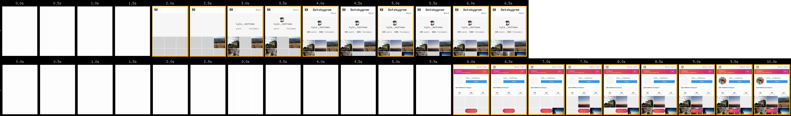
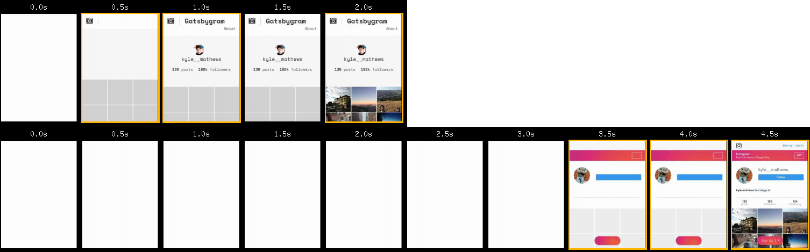

[Gatsbygram](https://gatsbygram.gatsbyjs.org) is a clone of Instagram
built with Gatsby v1.

## What is Gatsby

Gatsby is a JavaScript web framework that combines the fast performance
of static websites with the powerful abstractions, excellent tools, and
client capabilities of the React.js world.

### Gatsby is fast

Gatsby automatically optimizes your site for the modern web. You
provide pages and Gatsby stiches them together so they load as fast as
possible.

As proof of this, Gatsbygram loads *2-3x faster* than the real Instagram site.

I tested Gatsbygram and Instagram on
[webpagetest.org](https://www.webpagetest.org/) using a simulated 3G
network and a Moto G smartphone which is a budget Android released 3.5
years ago. So typical of many lower-end phones used still today.  The
median [speed
index](https://sites.google.com/a/webpagetest.org/docs/using-webpagetest/metrics/speed-index)
score for
[Gatsbygram](http://www.webpagetest.org/result/170307_10_17H0/) was 3128
vs. 8145 for
[Instagram](http://www.webpagetest.org/result/170307_VS_16JZ/).

*Filmstrip of Gatsbygram (top)
and Instagram (bottom) loading on webpagetest.org*

The second view is even faster for Gatsbygram as it now loads the site
from its service worker. It has pixels on the screen in under a second
on a budget Android device!

*Filmstrip of a repeat view of Gatsbygram (top)
and Instagram (bottom) loading on webpagetest.org*

Gatsby uses modern web performance ideas developed by the Google Chrome
Developer Relations team including Progressive Web App and PRPL.

### Gasby is built for the next billion internet users

Gatsby leverages service workers to *cache* site assets so users on
slow connections don't wait for...

mention Flipkart, Kongo (african ecommerce), housing.com and link to
their case studies.

Page refreshes almost instantly—regardless of the connection speed of
your user.

<div>
<video controls="controls" autoplay="true" loop="true">
  <source type="video/mp4" src="/gatsbygram.mp4"></source>
  <p>Your browser does not support the video element.</p>
</video>
</div>

### Gatsby is simple

Gatsby combines React, Webpack, and an innovative declarative data
processing layer so you don't waste time with painful or time-consuming
configuration and data processing scripting.

Stop wasting time and build something.

## App structure

Gatsby uses standard React.js components for building websites.

There are three types of components.

* *general layout components* for general site structure and headers and
footers.
* *template components* for *types* of pages like blog posts or
documentation pages
* *React.js pages* for individual pages you build with React.js
components.

*Gatsbygram's site
structure with its three page components*

### Layout components

Each Gatsby site is required to have a top-level layout component at
`layouts/default.js`. This layout component is used on every page of
your site so can contain things like your header, footer, and default
page structure. It is also used as the "[app
shell](https://developers.google.com/web/updates/2015/11/app-shell)"
when loading your site from a service worker.

The simplest possible layout component would look something like this.

```jsx
import React from "react"
import Link from "gatsby-link"

class Layout extends React.Component {
  render () {
    return (
      <div>
        <Link
          to="/"
        >
          Home
        </Link>
        <br />
        {this.props.children}
      </div>
    )
  }
}

export default Layout
```

Gatsbygram's layout component is somewhat more complicated than most
sites as it has logic to switch between showing images when clicked in
either a modal on larger screens or on their own page on smaller
screens.

[Read Gatsbygram's Layout component on
Github](https://github.com/gatsbyjs/gatsby/blob/1.0/examples/gatsbygram/layouts/default.js).

The default layout component is a handy place to
load various global items to your site. Gatsbygram's layout loads the
font used for the site, [Space
Mono](https://fonts.google.com/specimen/Space+Mono), by requiring its
[Typefaces](https://github.com/KyleAMathews/typefaces) package.

### Template components

Gatsby 1.0 allows you to create pages programatically with an object that
looks like this:

```javascript
{
  path: slugify(node.id),
  component: postTemplate, // Absolute path to the template component.
  context: {
    id: edge.node.id,
  },
}
```

*Gatsbygram post detail page
created using a template component*

These page objects are created in the site's `gatsby-node.js` using
Gatsby's lifecycle API `createPages`.

```javascript
const _ = require("lodash")
const Promise = require("bluebird")
const path = require("path")
const slug = require("slug")

// Implement the Gatsby lifecycle API “createPages”. This is
// called after the Gatsby bootstrap is finished so you have
// access to any information necessary to programatically
// create pages.

exports.createPages = ({ args }) => (
  new Promise((resolve, reject) => {
    // The “graphql” function allows us to run arbitrary
    // queries against this site's graphql schema. Think of
    // it like this site has a built-in database constructed
    // from static data that you can run queries against.
    const { graphql } = args
    const pages = []
    // Post is a data node type generated from
    // data/posts.json which is generated when
    // scrapping Instagram. “allPosts” gives us an
    // easy way to query all Post nodes.
    graphql(`
      {
        allPosts(limit: 1000) {
          edges {
            node {
              id
            }
          }
        }
      }
    `)
    .then(result => {
      if (result.errors) {
        console.log(result.errors)
        reject(result.errors)
      }

      // Create image post pages.
      const postPage = path.resolve(`pages/template-post-page.js`)
      // We want to create a detailed page for each
      // Instagram post. Since the scrapped Instagram data
      // already includes an ID field, we just use that for
      // each page's path.
      _.each(result.data.allPosts.edges, (edge) => {
        pages.push({
          // Each page is required to have a `path` as well
          // as a template component. The `context` is
          // optional but is often necessary as data in
          // `context` is passed as GraphQL *variables* when
          // running the GraphQL query for each page for a
          // template.
          path: slug(edge.node.id),
          component: postPage,
          context: {
            id: edge.node.id,
          },
        })
      })

      resolve(pages)
    })
  })
)
```

Template components themselves are again just plain React.js components.
The optional context data you specify when creating pages is
automatically passed in as a prop to the component. They're also passed
as [GraphQL variables](http://graphql.org/learn/queries/#variables) so
you can easily write dynamic queries for additional information.

This is what Gatsbygram's post template component looks like:

```jsx
import React from 'react'
import PostDetail from '../components/post-detail'

class PostTemplate extends React.Component {
  render () {
    return (
      // PostDetail is used for this detail page and
      // also in the modal.
      <PostDetail post={this.props.data.posts} />
    )
  }
}

export default PostTemplate

// The post template's GraphQL query. Notice the “id”
// variable which is passed in. We set this on the page
// context in gatsby-node.js.
//
// All GraphQL queries in Gatsby are run at build-time and
// loaded as plain JSON files so have zero client cost.
export const pageQuery = `
  query PostPage($id: String!) {
    # Select the post which equals this id.
    posts(id: { eq: $id }) {
      # Specify the fields from the post we need.
      username
      likes
      id
      text
      # Date fields have special arguments. This one computes
      # how many weeks have passed since the post was created.
      # All calculations like this (like all GraphQL query
      # activity) happens at build-time! So has zero cost
      # for the client.
      weeksAgo: time(difference: "weeks")
      image {
        children {
          ... on ImageSharp {
            # Here we query for *multiple* image thumbnails to be
            # created. So with no effort on our part, 100s of
            # thumbnails are created. This makes iterating on
            # designs effortless as we simply change the args
            # for the query and we get new thumbnails.
            big: responsiveSizes(maxWidth: 640) {
              src
              srcSet
            }
          }
        }
      }
    }
  }
`
```

### React.js pages

Gatsby lets you build pages from individual React.js components. Like
template components, you can add GraphQL queries to query for data.

Gatsbygram has two React.js pages, `pages/index.js` and
`pages/about.js`. `about.js` is a simple React component with no query.
`index.js` is more complex as the frontpage of Gatsby queries for
thumbnails for all images and has an infinite scroll implementation to
lazy load in image thumbnails.

[Read pages/index.js on
Github](https://github.com/gatsbyjs/gatsby/blob/1.0/examples/gatsbygram/pages/index.js)  
[Read pages/about.js on
Github](https://github.com/gatsbyjs/gatsby/blob/1.0/examples/gatsbygram/pages/about.js)

## Client routing

react-router under the hood but with no setup necessary.

links use gatsby-link — clientside routing + preloads necessary
code/data for subsequent pages on non-sw pages

## Plugins

Gatsby has always had a rich set of lifecycle APIs to allow you to hook
into various events during development, building, and in the client.

Gatsby 1.0 extends this and adds a [new plugin
architecture](/docs/plugins/). So generally useful code can be extracted
from sites and made reusable. Most of the new functionality in Gatsby
1.0 is powered by plugins.

Plugins are added to a site in its `gatsby-config.js`. Here's what
Gatsbygram's config file looks like:

```javascript
module.exports = {
  siteMetadata: {
    title: `Gatsbygram`,
  },
  plugins: [
    /*
     * Gatsby's data processing layer begins with “source”
     * plugins.  You can source data nodes from anywhere but
     * most sites, like Gatsbygram, will include data from
     * the filesystem so we start here with
     * “gatsby-source-filesystem”.
     *
     * A site can have as many instances of
     * gatsby-source-filesystem as you need.  Each plugin
     * instance is configured with a root path where it then
     * recursively reads in files and adds them to the data
     * tree.
     */
    {
      resolve: `gatsby-source-filesystem`,
      options: {
        name: `data`,
        path: `${__dirname}/data`,
      },
    },
    // This plugin exposes helper functions for processing
    // images with the NPM package “sharp”. It's used by
    // several other plugins.
    `gatsby-plugin-sharp`,
    // This plugin identifies file nodes that are images and
    // extends these to create new "ImageSharp" nodes.
    `gatsby-parser-sharp`,
    // This plugin parses JSON file nodes.
    `gatsby-parser-json`,
    `gatsby-typegen-filesystem`,
    `gatsby-typegen-sharp`,
    // This plugin sets up the popular css-in-js library
    // Glamor. It handles adding a Babel plugin and webpack
    // configuration as well as setting up optimized server
    // rendering and client rehydration.
    `gatsby-plugin-glamor`,
    // This plugin takes your configuration and generates a
    // web manifest file so Gatsbygram can be added to your
    // homescreen on Android.
    {
      resolve: `gatsby-plugin-manifest`,
      options: {
        name: `Gatsbygram`,
        short_name: `Gatsbygram`,
        start_url: `/`,
        background_color: `#f7f7f7`,
        theme_color: `#191919`,
        display: `minimal-ui`,
      },
    },
    // This plugin generates a service worker and AppShell
    // html file so the site works offline and is otherwise
    // resistent to bad networks. Works with almost any
    // site!
    `gatsby-plugin-offline`,
    // This plugin sets up Google Analytics for you.
    {
      resolve: `gatsby-plugin-google-analytics`,
      options: {
        trackingId: `UA-91652198-1`,
      },
    },
  ],
}
```

## Data

explain GraphQL & walk through two queries.

## Styles

Glamor — totally sweet css-in-js

## Offline caching

The data for the entire front page is generated from the following
GraphQL query:

```graphql
query allImages {
  allPosts {
    edges {
      node {
        username
        likes
        id
        text
        weeksAgo: time(difference: "weeks")
        image {
          children {
            ... on ImageSharp {
              small: responsiveSizes(maxWidth: 292) {
                src
                srcSet
              }
              big: responsiveSizes(maxWidth: 640) {
                src
                srcSet
              }
            }
          }
        }
      }
    }
  }
}
```
