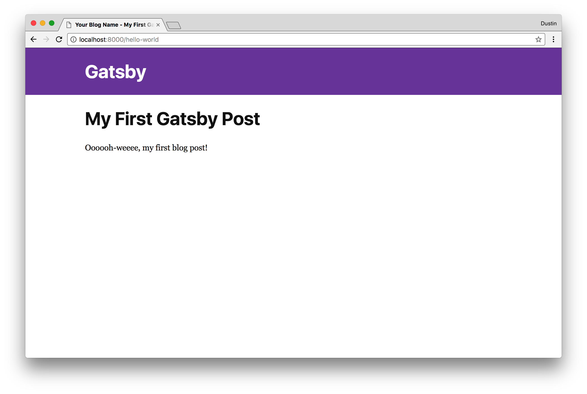
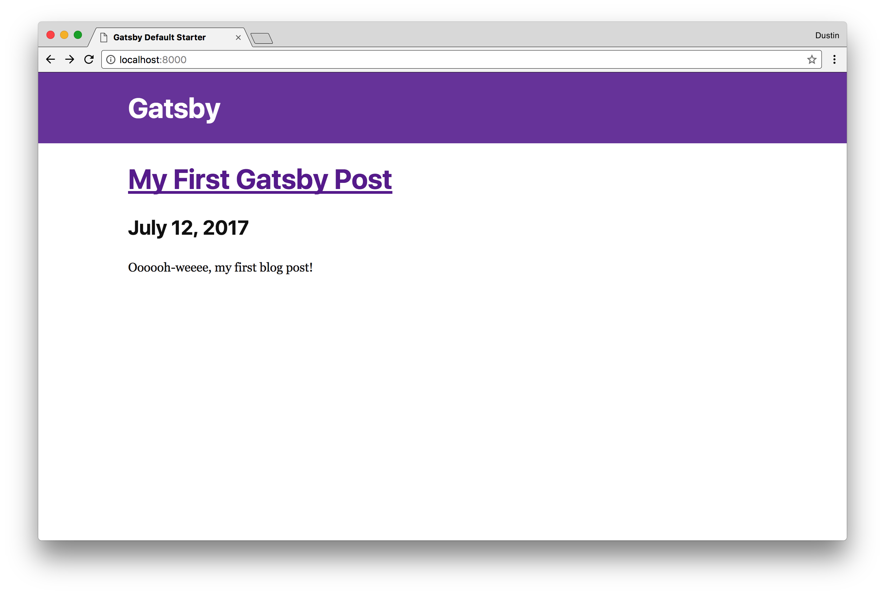

Gatsby is an incredible static site generator that allows for React to be used
as the underlying rendering engine to scaffold out a static site that truly has
all the benefits expected in a modern web application. It does this by rendering
dynamic React components into static HTML content via [server side
rendering][react-dom-server] at build time. This means that your users get all
the benefits of a static site such as the ability to work without JavaScript,
search engine friendliness, speedy load times, etc. without losing the dynamism
and interactivity that is expected of the modern web. Once rendered to static
HTML, client-side React/JavaScript _can_ take over (if creating stateful
components or logic in `componentDidMount`) and add dynamism to the statically
generated content.

Gatsby [recently released][gatsby-release] a v1.0.0 with a bunch of new
features, including (but not limited to) the ability to create content queries
with GraphQL, integration with various CMSs--including WordPress, Contentful,
Drupal, etc., and route based code splitting to keep the end user experience as
snappy as possible. In this post, we'll take a deep dive into Gatsby and some of
these new features by creating a static blog. Let's get on it!

## Getting started

### Using the CLI

Gatsby ships with a great CLI (command line interface) that contains the
functionality of scaffolding out a working site as well as commands to help
develop the site once created.

`gatsby new personal-blog && cd $_`

This command will create the folder `personal-blog` and then change into that
directory. A working `gatsby` statically generated application can now be
developed upon. The CLI generates common development scripts to help you get started.
For example you can run `npm run build` (build a production, statically generated version of the project) or `npm run develop` (launch a hot-reload enabled web development server),
etc.

You can now begin the exciting task of _actually_ developing on the site and
creating a functional, modern blog. You'll generally want to use `npm run develop` to launch the local development server to validate functionality as you
progress through the steps.

## Adding necessary plugins

Gatsby supports a [rich plugin interface][gatsby-plugins], and many incredibly
useful plugins have been authored to make accomplishing common tasks a breeze.
Plugins can be broken up into three main categories: **functional** plugins,
**source** plugins, and **transformer** plugins.

### Functional plugins

Functional plugins either implement some functionality (e.g. offline support,
generating a sitemap, etc.) _or_ they extend Gatsby's webpack configuration
adding support for TypeScript, Sass, etc.

For this particular blog post, you will make a single page app-like feel (without page
reloads) as well as the ability to dynamically change the `title` tag within
the `head` tags. As noted, the Gatsby plugin ecosystem is rich, vibrant, and
growing, so oftentimes a plugin already exists that solves the particular
problem you're trying to solve. To address the functionality you want for _this_
blog, you can use the following plugins:

- [`gatsby-plugin-catch-links`][gatsby-plugin-catch-links]
  - implements the history `pushState` API and does not require a page reload
    on navigating to a different page in the blog
- [`gatsby-plugin-react-helmet`][gatsby-plugin-react-helmet]
  - [react-helmet][react-helmet] is a tool that allows for modification of the
    `head` tags; Gatsby statically renders any of these `head` tag changes

with the following command:

```bash
yarn add gatsby-plugin-catch-links gatsby-plugin-react-helmet
```

You will be using [yarn][yarn], but npm can just as easily be used with `npm i --save [deps]`.

After installing each of these functional plugins, edit
`gatsby-config.js`, which Gatsby loads at build-time to implement the exposed
functionality of the specified plugins.

```javascript:title=gatsby-config.js
module.exports = {
  siteMetadata: {
    title: `Your Name - Blog`,
    author: `Your Name`,
  },
  // highlight-start
  plugins: ["gatsby-plugin-catch-links", "gatsby-plugin-react-helmet"],
}
// highlight-end
```

Without any additional work besides a `yarn install` and editing a config file,
you now have the ability to edit your site's head tags as well as implement a
single page app feel without reloads. Now, let's enhance the base functionality
by implementing a source plugin which can load blog posts from your local file
system.

### Source plugins

Source plugins create _nodes_ which can then be transformed into a usable format
(if not already usable) by a transformer plugin. For instance, a typical
workflow often involves using
[`gatsby-source-filesystem`][gatsby-source-filesystem], which loads files off of
disk--e.g. Markdown files--and then specifying a Markdown transformer to
transform the Markdown into HTML.

Since the bulk of the blog's content and each article will be authored in
Markdown, let's add that [`gatsby-source-filesystem`][gatsby-source-filesystem]
plugin. Similarly to the previous step, install the plugin and then inject
into your `gatsby-config.js`, like so:

```bash
yarn add gatsby-source-filesystem
```

```javascript:title=gatsby-config.js
module.exports = {
  // previous configuration
  plugins: [
    "gatsby-plugin-catch-links",
    "gatsby-plugin-react-helmet",
    // highlight-start
    {
      resolve: `gatsby-source-filesystem`,
      options: {
        path: `${__dirname}/src/pages`,
        name: "pages",
      },
    },
    // highlight-end
  ],
}
```

Some explanation will be helpful here! An `options` object can be passed to a
plugin, and you're passing the filesystem `path` (which is where your Markdown files
will be located) and then a `name` for the source files. Now that Gatsby knows
about your source files, you can begin applying some useful transformers to
convert those files into usable data!

### Transformer plugins

As mentioned, a transformer plugin takes some underlying data format that is not
inherently usable in its current form (e.g. Markdown, json, yaml, etc.) and
transforms it into a format that Gatsby can understand and that you can query
against with GraphQL. Jointly, the filesystem source plugin will load file nodes
(as Markdown) off of your filesystem, and then the Markdown transformer will take
over and convert to usable HTML.

You only need one transformer plugin (for Markdown), so let's get that
installed.

- [gatsby-transformer-remark][gatsby-transformer-remark]
  - Uses the [remark][remark] Markdown parser to transform .md files on disk
    into HTML; additionally, this transformer can optionally take plugins to
    further extend functionality--e.g. add syntax highlighting with
    `gatsby-remark-prismjs`, `gatsby-remark-copy-linked-files` to copy relative
    files specified in markdown, `gatsby-remark-images` to compress images and
    add responsive images with `srcset`, etc.

The process should be familiar by now, install and then add to config.

```bash
yarn add gatsby-transformer-remark
```

and editing `gatsby-config.js`

```javascript:title=gatsby-config.js
module.exports = {
  // previous setup
  plugins: [
    "gatsby-plugin-catch-links",
    "gatsby-plugin-react-helmet",
    {
      resolve: `gatsby-source-filesystem`,
      options: {
        path: `${__dirname}/src/pages`,
        name: "pages",
      },
    },
    // highlight-start
    {
      resolve: "gatsby-transformer-remark",
      options: {
        plugins: [], // just in case those previously mentioned remark plugins sound cool :)
      },
    },
    // highlight-end
  ],
}
```

Whew! Seems like a lot of set up, but collectively these plugins are going to
super charge Gatsby and give us an incredibly powerful (yet relatively simple!)
development environment. There is one more setup step and it's an easy one.
You're simply going to create a Markdown file that will contain the content of
your first blog post. Let's get to it.

## Writing your first Markdown blog post

The `gatsby-source-filesystem` plugin you configured earlier expects your content
to be in `src/pages`, so that's exactly where it needs to be put in!

Gatsby is not at all prescriptive in naming conventions, but a typical practice
for blog posts is to name the folder something like `MM-DD-YYYY-title`, e.g.
`07-12-2017-hello-world`. Let's do just that. Create the folder
`src/pages/07-12-2017-getting-started` and place an `index.md` inside!

The content of this Markdown file will be your blog post, authored in Markdown
(of course!). Here's what it'll look like:

```markdown:title=src/pages/07-12-2017-getting-started/index.md
---
path: "/hello-world"
date: 2017-07-12T17:12:33.962Z
title: "My First Gatsby Post"
---

Oooooh-weeee, my first blog post!
```

_Fairly_ typical stuff, except for the block surrounded in dashes. What is that?
That is what is referred to as [`frontmatter`][frontmatter], and the contents of
the block can be used to inject React components with the specified data, e.g.
path, date, title, etc. Any piece of data can be injected here (e.g. tags,
sub-title, draft, etc.), so feel free to experiment and find what necessary
pieces of frontmatter are required to achieve an ideal blogging system for your
usage. One important note is that `path` will be used when you dynamically create
your pages to specify the URL/path to render the file (in a later step!). In this
instance, `http://localhost:8000/hello-world` will be the path to this file.

Now that you have created a blog post with frontmatter and some content, you can
begin actually writing some React components that will display this data!

## Creating the (React) template

As Gatsby supports server side rendering (to string) of React components, you can
write your template in... you guessed it, React! (Or
[Preact][gatsby-plugin-preact], if that's more your style)

You should create the file `src/templates/blog-post.js` (please create the
`src/templates` folder if it does not yet exist!).

```javascript:title=src/templates/blog-post.js
import React from "react"
import { Helmet } from "react-helmet"

// import '../css/blog-post.css'; // make it pretty!

export default function Template({
  data, // this prop will be injected by the GraphQL query we'll write in a bit
}) {
  const { markdownRemark: post } = data // data.markdownRemark holds your post data
  return (
    <div className="blog-post-container">
      <Helmet title={`Your Blog Name - ${post.frontmatter.title}`} />
      <div className="blog-post">
        <h1>{post.frontmatter.title}</h1>
        <div
          className="blog-post-content"
          dangerouslySetInnerHTML={{ __html: post.html }}
        />
      </div>
    </div>
  )
}
```

Whoa, neat! This React component will be rendered to a static HTML string (for
each route/blog post you define), which will serve as the basis of your
routing/navigation for your blog.

At this point, there is a reasonable level of confusion and "magic" occurring,
particularly with the props injection. What is `markdownRemark`? Where is this
`data` prop injected from? All good questions, so let's answer them by writing a
GraphQL query to seed your `<Template />` component with content!

### Writing the GraphQL query

Below the `Template` declaration, you'll want to add a GraphQL query. This is an
incredibly powerful utility provided by Gatsby which lets us pick and choose
very simply the pieces of data that you want to display for your blog post. Each
piece of data your query selects will be injected via the `data` property that you
specified earlier.

```javascript:title=src/templates/blog-post.js
import React from "react"
import { Helmet } from "react-helmet"
import { graphql } from "gatsby"

// import '../css/blog-post.css';

export default function Template({ data }) {
  const { markdownRemark: post } = data
  return (
    <div className="blog-post-container">
      <Helmet title={`Your Blog Name - ${post.frontmatter.title}`} />
      <div className="blog-post">
        <h1>{post.frontmatter.title}</h1>
        <div
          className="blog-post-content"
          dangerouslySetInnerHTML={{ __html: post.html }}
        />
      </div>
    </div>
  )
}

// highlight-start
export const pageQuery = graphql`
  query BlogPostByPath($path: String!) {
    markdownRemark(frontmatter: { path: { eq: $path } }) {
      html
      frontmatter {
        date(formatString: "MMMM DD, YYYY")
        path
        title
      }
    }
  }
`
// highlight-end
```

If you're not familiar with GraphQL, this may seem slightly confusing, but you can
break down what's going down here piece by piece.

_Note: To learn more about GraphQL, consider this [excellent
resource][learn-graphql]_

The underlying query name `BlogPostByPath` (note: these query names need to be
unique!) will be injected with the current path, e.g. the specific blog post we
are viewing. This path will be available as `$path` in your query. For instance,
if you were viewing your previously created blog post, the path of the file that
data will be pulled from will be `/hello-world`.

`markdownRemark` will be the injected property available via the prop `data`, as
named in the GraphQL query. Each property you pull via the GraphQL query will be
available under this `markdownRemark` property. For example, to access the
transformed HTML, you would access the `data` prop via `data.markdownRemark.html`.

`frontmatter`, is of course the data structure we provided at the beginning of
the Markdown file. Each key you define there will be available to be injected
into the query.

At this point, you have a bunch of plugins installed to load files off of disk,
transform Markdown to HTML, and other utilities. You have a single, lonely
Markdown file that will be rendered as a blog post. Finally, you have a React
template for blog posts as well as a wired up GraphQL query to query for a blog
post and inject the React template with the queried data. Next up:
programmatically creating the necessary static pages (and injecting the
templates) with Gatsby's Node API. Let's get down to it.

An important note to make at this point is that the GraphQL query takes place at
**build** time. The component is injected with the `data` prop that is seeded by
the GraphQL query. Unless anything dynamic (e.g. logic in `componentDidMount`,
state changes, etc.) occurs, this component will be pure, rendered HTML
generated via the React rendering engine, GraphQL, and Gatsby!

## Creating the static pages

Gatsby exposes a powerful Node API, which allows for functionality such as
creating dynamic pages (blog posts!), extending the babel or webpack configs,
modifying the created nodes or pages, etc. This API is exposed in the
`gatsby-node.js` file in the root directory of your project—e.g. at the same
level as `gatsby-config.js`. Each export found in this file will be parsed by
Gatsby, as detailed in its [Node API specification][node-spec]. However, you only need to
care about one particular API in this instance, `createPages`.

```javascript:title=gatsby-node.js
const path = require("path")

exports.createPages = async ({ actions, graphql }) => {
  const { createPage } = actions

  const blogPostTemplate = path.resolve(`src/templates/blog-post.js`)
}
```

Nothing super complex yet! You're using the `createPages` API (which Gatsby will
call at build time with injected parameters). You're also grabbing the _path_ to
your blogPostTemplate that you created earlier. Finally, you're using the `createPage`
action creator/function made available in actions. Gatsby uses Redux
internally to manage its state, and `actions` are simply the exposed
action creators of Gatsby, of which `createPage` is one of the action creators!
For the full list of exposed action creators, check out [Gatsby's
documentation][gatsby-actions]. You can now construct the GraphQL
query, which will fetch all of your Markdown posts.

### Querying for posts

```javascript:title=gatsby-node.js
const path = require("path")

exports.createPages = async ({ actions, graphql, reporter }) => {
  const { createPage } = actions

  const blogPostTemplate = path.resolve(`src/templates/blog-post.js`)

  // highlight-start
  const result = await graphql(`
    {
      allMarkdownRemark(
        sort: { order: DESC, fields: [frontmatter___date] }
        limit: 1000
      ) {
        edges {
          node {
            frontmatter {
              path
            }
          }
        }
      }
    }
  `)

  if (result.errors) {
    reporter.panicOnBuild(`Error while running GraphQL query.`)
    return
  }
}
// highlight-end
```

You're using GraphQL to get all Markdown nodes and making them available under
the `allMarkdownRemark` GraphQL property. Each exposed property (on `node`) is
made available for querying against. You're effectively seeding a GraphQL
"database" that you can then query against via page-level GraphQL queries. One
note here is that the `exports.createPages` API expects a Promise to be
returned, so it works seamlessly with the `graphql` function, which returns a
Promise (although note a callback API is also available if that's more your
thing).

One cool note here is that the `gatsby-plugin-remark` plugin exposes some useful
data for us to query with GraphQL, e.g. `excerpt` (a short snippet to display as
a preview), `id` (a unique identifier for each post), etc.

You now have your query written, but are yet programmatically created the
pages (with the `createPage` action creator). Let's do that!

### Creating the pages

```javascript:title=gatsby-node.js
const path = require("path")

exports.createPages = async ({ actions, graphql, reporter }) => {
  const { createPage } = actions

  const blogPostTemplate = path.resolve(`src/templates/blog-post.js`)

  const result = await graphql(`
    {
      allMarkdownRemark(
        sort: { order: DESC, fields: [frontmatter___date] }
        limit: 1000
      ) {
        edges {
          node {
            frontmatter {
              path
            }
          }
        }
      }
    }
  `)

  if (result.errors) {
    reporter.panicOnBuild(`Error while running GraphQL query.`)
    return
  }

  // highlight-start
  result.data.allMarkdownRemark.edges.forEach(({ node }) => {
    createPage({
      path: node.frontmatter.path,
      component: blogPostTemplate,
      context: {}, // additional data can be passed via context
    })
  })
  // highlight-end
}
```

You've now tied into the Promise chain exposed by the `graphql` query. The actual
posts are available via the path `result.data.allMarkdownRemark.edges`. Each
edge contains an internal node, and this node holds the useful data that you will
use to construct a page with Gatsby. Your GraphQL "shape" is directly reflected
in this data object, so each property you pulled from that query will be
available when you are querying in your GraphQL blog post template.

The `createPage` API accepts an object which requires `path` and `component`
properties to be defined, which you have done above. Additionally, an optional
property `context` can be used to inject data and make it available to the blog
post template component via injected props (log out props to see each available
prop!). Each time you build with Gatsby, `createPage` will be called, and Gatsby
will create a static HTML file of the path you specified in the post's
frontmatter--the result of which will be your stringified and parsed React
template injected with the data from your GraphQL query. Whoa, it's actually
starting to come together!

You can run `yarn develop` at this point and then navigate to
`http://localhost:8000/hello-world` to see your first blog post, which should
look something like below:



At this point, you've created a single static blog post as an HTML file, which
was created by a React component and several GraphQL queries. However, this
isn't a blog! You can't expect your users to guess the path of each post, you need
to have an index or listing page, where you display each blog post, a short
snippet, and a link to the full blog post. Wouldn't you know it, this can be done
incredibly easily with Gatsby, using a similar strategy that was used in the blog
template, i.e. a React component and a GraphQL query.

## Creating the Blog Listing

I won't go into quite as much detail for this section because we've already
done something very similar for our blog template! Look at us, we're pro
Gatsby-ers at this point!

Gatsby has a standard for "listing pages," and they're placed in the root of our
filesystem we specified in `gatsby-source-filesystem`, e.g.
`src/pages/index.js`. So, create that file if it does not exist, and let's get it
working! Additionally, note that any static JavaScript files (that export a React
component!) will get a corresponding static HTML file. For instance, if we
create `src/pages/tags.js`, the path `http://localhost:8000/tags/` will be
available within the browser and the statically generated site.

```javascript:title=src/pages/index.js
import React from "react"
import { Link, graphql } from "gatsby"
import { Helmet } from "react-helmet"

// import '../css/index.css'; // add some style if you want!

export default function Index({ data }) {
  const { edges: posts } = data.allMarkdownRemark
  return (
    <div className="blog-posts">
      {posts
        .filter(post => post.node.frontmatter.title.length > 0)
        .map(({ node: post }) => {
          return (
            <div className="blog-post-preview" key={post.id}>
              <h1>
                <Link to={post.frontmatter.path}>{post.frontmatter.title}</Link>
              </h1>
              <h2>{post.frontmatter.date}</h2>
              <p>{post.excerpt}</p>
            </div>
          )
        })}
    </div>
  )
}

export const pageQuery = graphql`
  query IndexQuery {
    allMarkdownRemark(sort: { order: DESC, fields: [frontmatter___date] }) {
      edges {
        node {
          excerpt(pruneLength: 250)
          id
          frontmatter {
            title
            date(formatString: "MMMM DD, YYYY")
            path
          }
        }
      }
    }
  }
`
```

OK! So we've followed a similar approach to your blog post template, so this
should hopefully seem pretty familiar. Once more we're exporting `pageQuery`
which contains a GraphQL query. Note that we're pulling a slightly different
data set -- specifically, we are pulling an `excerpt` of 250 characters rather than
the full HTML as we are formatting the pulled date with a format
string! GraphQL is awesome.

The actual React component is fairly trivial, but one important note should be
made. It's important that when linking to internal content, e.g. other blog
links, that you should always use `Link` from `gatsby`. Gatsby does not work if pages
are not routed via this utility. Additionally, this utility also works with
`pathPrefix`, which allows for a Gatsby site to be deployed on a non-root domain.
This is useful if this blog will be hosted on something like GitHub Pages or
perhaps hosted at `/blog`.

Now, this is getting exciting and it feels like we're finally getting somewhere!
At this point, we have a fully functional blog generated by Gatsby, with real
content authored in Markdown, a blog listing, and the ability to navigate around
in the blog. If you run `yarn develop`, `http://localhost:8000` should display a
preview of each blog post, and each post title links to the content of the blog
post. A real blog!



It's now on you to make something incredible with the knowledge you've gained in
following along with this tutorial! You can not only make it pretty and style
with CSS (or [styled-components][styled-components]!), but you could improve it
functionally by implementing some of the following:

- Add a tag listing and tag search page
  - hint: the `createPages` API in `gatsby-node.js` file is useful here, as is
    frontmatter
- adding navigation between a specific blog post and past/present blog posts
  (the `context` API of `createPages` is useful here), etc.

With your new found knowledge of Gatsby and its API, you should feel empowered to
begin to utilize Gatsby to its fullest potential. A blog is just the starting
point; Gatsby's rich ecosystem, extensible API, and advanced querying
capabilities provide a powerful toolset for building truly incredible,
performant sites.

Now go build something great.


## Links

- [`@dschau/gatsby-blog-starter-kit`][source-code]
  - A working repo demonstrating all of the aforementioned functionality of
    Gatsby
- [`@dschau/create-gatsby-blog-post`][create-gatsby-blog-post]
  - A utility and CLI I created to scaffold out a blog post following the
    predefined Gatsby structure with frontmatter, date, path, etc.
- [Source code for my blog][blog-source-code]
  - The source code for my blog, which takes the gatsby-starter-blog-post
    (previous link), and expands upon it with a bunch of features and some more
    advanced functionality

[react-dom-server]: https://reactjs.org/docs/react-dom-server.html
[gatsby-release]: /blog/gatsby-v1/
[gatsby-plugins]: /docs/plugins/
[gatsby-plugin-catch-links]: /packages/gatsby-plugin-catch-links/
[gatsby-plugin-react-helmet]: /packages/gatsby-plugin-react-helmet/
[gatsby-plugin-preact]: /packages/gatsby-plugin-preact/
[gatsby-transformer-remark]: /packages/gatsby-transformer-remark/
[remark]: https://github.com/wooorm/remark
[gatsby-source-filesystem]: /packages/gatsby-source-filesystem/
[react-helmet]: https://github.com/nfl/react-helmet
[frontmatter]: https://jekyllrb.com/docs/frontmatter/
[learn-graphql]: https://www.howtographql.com
[node-spec]: /docs/node-apis/
[gatsby-actions]: /docs/actions/
[styled-components]: https://github.com/styled-components/styled-components
[yarn]: https://yarnpkg.com/en/
[source-code]: https://github.com/dschau/gatsby-blog-starter-kit
[blog-source-code]: https://github.com/dschau/blog
[create-gatsby-blog-post]: https://github.com/DSchau/create-gatsby-blog-post
