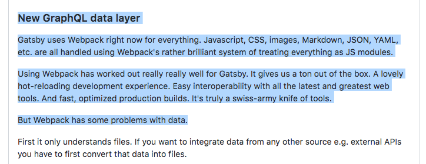

Before I built [React FAQ](https://reactfaq.site/), I went looking for a static
site generator.

I had a few criteria in mind.

* Fast (hopefully a given for a static site)
* Easy to use
* React-based
* Easy to update

Gatsby at the time was still pre-1.0 but its workflow met my needs. I loved that
I could drop my existing Markdown files into a `pages` directory and Gatsby
would do the rest.

Webpack loader —> React.js wrapper component —> static HTML page. Done.

Well...done until I read this
[GitHub Issue](https://github.com/gatsbyjs/gatsby/issues/420) … "New GraphQL
data layer".



Things in Gatsby were about to change. I read on to see how easy it’d be to
upgrade.

Having never used GraphQL, the new “routeQuery” in components looked very
foreign.

```javascript
export const routeQuery = `
{
  allMarkdown {
    edges {
      node {
        path
        frontmatter {
          title
        }
      }
    }
  }
}
```

What happened to my “drop files into a folder and call it a day” setup? What
_is_ all this weird syntax [@kylemathews](https://twitter.com/kylemathews)?

Reading the issue, Kyle's reasoning made sense but this didn't seem to be simple
at all. 0.x seemed more “automatic” to me. Drop in your files and go.

## 1.0 Released

When 1.0 landed, I waited for a while before trying to update my website. The
reviews were solid but I was still stuck on my pre-1.0 mindset.

Then three weeks ago I saw this tweet from
[@ryanflorence](https://twitter.com/ryanflorence):

<blockquote class="twitter-tweet" data-lang="en"><p lang="en" dir="ltr">.<a href="https://twitter.com/gatsbyjs">@gatsbyjs</a> is a completely original approach to web development. The mix of static/dynamic and how it handles data is really interesting.</p>&mdash; Ryan Florence (@ryanflorence) <a href="https://twitter.com/ryanflorence/status/906233888560758784">September 8, 2017</a></blockquote>

Well, that sounded like a pretty good endorsement.

## Taking the leap

With the [gatsby-starter-blog](https://github.com/gatsbyjs/gatsby-starter-blog)
in hand as a solid example, I started converting my website over to v1.0.

There were a few bumps into the road but thanks to the starter example, I pieced
things together quickly. Quickly as in “I have no idea how this GraphQL stuff
works, but I have it working, so cool”. Easy to update — check.

## Digging Deeper

I'm not the type of person to settle on “It's working so don't touch anything”.
So I started digging into how Gatsby 1.x works—particular the
[data layer](/tutorial/part-four/#data-in-gatsby).

Things really clicked when I read this part about the GraphiQL IDE and watched
how to drill down on the data.


Prior to reading / seeing that part in the documentation, looking at the code I
could understand roughly what was going on but it didn’t feel familiar. Like
anything new, there’s that “I don’t know what I’m doing” stage. I know what I
want to do, but I don’t understand the syntax enough to make it happen. Seeing
the docs and how you can explore the schema in GraphiQL (autocomplete is 👌) to
see what data is available really helped in my “play around and break stuff”
phase.

**From the docs:**

> You first sketch out the data query by playing in GraphiQL, then copy this to
> a React page component to start building the UI.

“Sketch & Copy” using the GraphiQL was a revelation. I was thinking it’s going
to be tricky to manually write the queries until I become more familiar with the
syntax. Using GraphiQL helped me make a quick leap forward with the learning
curve. “Aha this is amazing”. I have lots to learn still but the comfort level
is going up.

## That's a wrap

With my 1.x update complete, I'm feeling that not only was GatsbyJS a solid
pick, but it's something that is going to evolve the way I build websites. It's
a nice starter push into GraphQL and many other advanced features the websites
of the future will need to be performant.

Sometimes we don’t do things because they are unfamiliar to us. Sometimes we
need a little push. Thanks for the push GatsbyJS. The learning curve may seem
daunting but the payoff is huge. GatsbyJS has become a powerful tool in my
arsenal and I’m happy to have extended my development skills.
