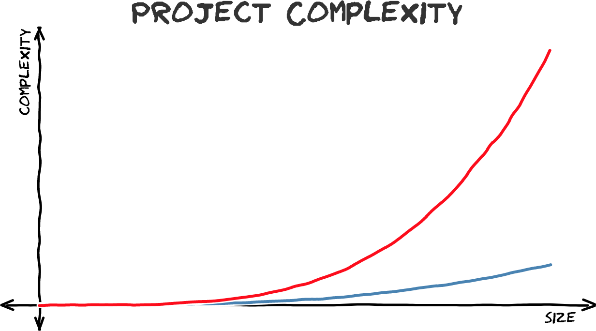

I still remember the first non-trivial React component I built in 2014—not long
after I started using React seriously.

I decided to port to React [headroom.js](http://wicky.nillia.ms/headroom.js/)—a
JavaScript library that shows & hides headers as you scroll up & down a site.

After a day or two of working through the niceties of writing a React component
and publishing it to NPM, I started writing the documentation and realized…
there was almost nothing to write.

Using [react-headroom](https://github.com/KyleAMathews/react-headroom) is so
simple I realized you almost don't need documentation. A React header component
using it would look like this:

```jsx
import React from "react";
import Headroom from "react-headroom";

export default () => (
  <Headroom>
    <h1>You can put anything you'd like inside the Headroom Component</h1>
  </Headroom>
);
```

Having coming from years of building things with Backbone.js and jQuery where
implementing a new plugin felt like following a long & intricate cooking recipe,
the simplicity of react-headroom was astounding. That's all you do? Import it
and use it like an HTML element?

Compare this with the minimum code necessary for the original headroom.js.

#### HTML

```html
<header class="headroom">
  <h1>header content</h1>
</header>
```

#### JavaScript

```js
// grab the element
var myElement = document.querySelector("header");
// construct an instance of Headroom, passing the element
var headroom = new Headroom(myElement);
// initialise
headroom.init();
```

#### CSS

```css
.headroom {
  will-change: transform;
  transition: transform 200ms linear;
}
.headroom--pinned {
  transform: translateY(0%);
}
.headroom--unpinned {
  transform: translateY(-100%);
}
```

The original vanilla web technology version has **7x** the lines of code and
worst, the code for your header is now split across three parts of your code
base with at best, only a comment to indicate their purpose.

The React version of headroom.js is far simpler and _safer_ to use as the HTML,
CSS, and JavaScript are all neatly encapsulated.

## What makes technology fun?

This is a complex philosophical question and I'm writing this on a Saturday
afternoon so I'll cheat a bit and just cut the gordian knot by saying
"simplicity is fun" and conversely, "complexity is not fun".

Every one loves new projects. Why? Because they're simple! We can dive in and
experiment and reliably get something done. The more complex the project, the
more things seem to break, the more time gets wasted on various yak shaves, and
critically, the gap between thinking up an idea and being able to try it grows
larger and larger.

Fred Brooks wrote in his classic book _The Mythical Man-Month_:

> The programmer, like the poet, works only slightly removed from pure
> thought-stuff. He builds his castles in the air, from air, creating by
> exertion of the imagination. Few media of creation are so flexible, so easy to
> polish and rework, so readily capable of realizing grand conceptual
> structures…
>
> Yet the program construct, unlike the poet's words, is real in the sense that
> it moves and works, producing visible outputs separate from the construct
> itself. […] The magic of myth and legend has come true in our time. One types
> the correct incantation on a keyboard, and a display screen comes to life,
> showing things that never were nor could be.

Technology is incredibly fun when we, like the wizard of fantasy, can type an
incantation on our computer and a new creation comes to life.

When this incantation is simple and takes seconds, we can easily get lost for
hours in the rush of creation trying one thing after another improvising our way
to an eventual design.

## Why do projects stop being simple (and fun)?

Easy—they get complex so doing anything feels hard and burdensome.

Why do projects get complex?

The simple but wrong answer is they get big.

But big doesn't necessarily mean complex.



Perhaps you've been on projects that followed the red curve as well as others,
the blue curve.

Projects _do_ get more complex as they scale but there are very large projects
that still don't feel very complex while there are relatively small projects
that are mired in complexity.

Alan Kay told a great story in his recent talk
[The Power of Simplicity](https://www.youtube.com/watch?v=NdSD07U5uBs) (story
starts at 5:45) about the history of modeling planet orbits in our solar system.


From ancient times to the 1600s, people believed that the planets' orbits must
be perfect circles. This false belief introduced a ton of complexity into their
models. This complexity persisted until Kepler came along with the stunning
insight (hindsight sarcasm) that no, orbits were elliptical not circular. With
this new insight, models of planetary motion became dramatically simpler.

This false belief, that orbits must be circular, helped stall our understanding
of the solar system for _1000s of years_! All the complex calculations that the
astronomers studiously completed to force-fit the circular idea into their
models just got in the way of understanding what was actually going on.

## Find the right building blocks

Later in the talk, Alan Kay summarized his message by stating that "you get
simplicity by finding _slightly more sophisticated building blocks_".

Each problem space has a "particularly felicitous point-of-view". Find that
point-of-view and problem complexity collapses.

The right building blocks allows us to directly manipulate the parts of the
problem that we actually care about. They create
[an immediate connection](http://blog.ezyang.com/2012/02/transcript-of-inventing-on-principleb/)
between our thoughts and the visible outputs.

With the right building blocks, creating is fun! It's play! With bad building
blocks, it's tedious work and muddy thinking.

## How do you design the right building blocks?

Ahhh, now we're getting to the really interesting question.

This isn't trivial. As we saw, many of the brightest minds for 1000s of years
couldn't figure out that planets' orbits aren't circles. Leonardo da Vinci
couldn't build most of the machines he dreamt up. And I, no Leonardo, couldn't
ever improve on headroom.js.

But literally weeks into using React.js, I was able to easily make a new React
headroom component that is dramatically simpler than headroom.js.

Which suggests React is a far better building block for the web than raw
HTML/JS/CSS.

Which also suggests the general principle that **if you're mired in complexity
at one layer, you need to step _down_ a layer or two and redesign the building
blocks at _that_ layer.**

headroom.js is probably as simple as vanilla HTML/JS/CSS will allow it. We
couldn't make building for the web simpler until we moved to a more
sophisticated component model like React provides.

## Another case study: gatsby-image

I recently introduced a new Gatsby/React component called
[gatsby-image](/packages/gatsby-image/).

It has some nice tricks that you'd expect from a modern image component. It uses
the new
[IntersectionObserver API](https://developer.mozilla.org/en-US/docs/Web/API/Intersection_Observer_API)
to cheaply lazy load images. It holds an image's position so your page doesn't
jump around as images load. It makes it easy to add a placeholder—either a gray
background or a blurry version of the image.

Here's what a really simple Gatsby page component using gatsby-image would look
like:

```jsx
import React from "react";
import Img from "gatsby-image";

export default ({ data }) => (
  <div>
    <h1>Hello gatsby-image</h1>
    
  </div>
);
```

So this is all very nice and it's far better to be able to use this from NPM vs.
implementing it yourself or cobbling together several standalone libraries.

But if this was all gatsby-image did, it'd be a nice new component to have
around, but it wouldn't be anything special.

## Reducing the complexity around the _entire_ process of building a website

If we think about the process of building for the web, there are many steps
before we get to actually coding the frontend.

For example, how does a single image typically get on a website?

1. A page is designed
2. Specific images are chosen
3. The images are resized (with ideally multiple thumbnails to fit different
   devices)
4. And finally, the image(s) are included in the HTML/CSS/JS (or React
   component) for the page.

What makes gatsby-image really interesting is it's _seamlessly integrated into
Gatsby's data layer_ which has native image processing capabilities.

Gatsby lets you _query your site data_ with GraphQL _including_ querying for
different sizes and shapes of images.

So not only do we skip all the complexity around setting up lazy-loading images
that hold their place with nice placeholders but we can also skip the complexity
around generating (and regenerating as design requirements change) the right
sized image thumbnails.

The code I showed above was missing the GraphQL query. A full image component
would look like:

```jsx
import React from "react";
import Img from "gatsby-image";

export default ({ data }) => (
  <div>
    <h1>Hello gatsby-image</h1>
    
  </div>
);

export const query = graphql`
  query GatsbyImageSampleQuery {
    file(relativePath: { eq: "images/an-image.jpeg" }) {
      childImageSharp {
        resolutions(width: l25, height: 125) {
          src
          srcSet
          width
          height
        }
      }
    }
  }
`;
```

So instead of a long pipeline of tasks to setup optimized images for your site,
the steps now are:

1. Install gatsby-image
2. Decide what size of image you need (125x125 in the example above)
3. Add your query and the gatsby-image component to your page
4. And… that's it!

Now playing with images is fun! Want to tweak your design? No problem, just
change your query a bit and see how the page updates. By eliminating the
complexity around adding images, building performant sites with many images
becomes fun again.

## Gatsby is a playground for discovering new building blocks for the web

The goal of Gatsby is to make it easy to build incredibly fast websites. Right
now, that's far too hard to do and
[most sites fail at it](/blog/2017-09-13-why-is-gatsby-so-fast/).

We’ll make website building fun by creating higher-level components and design
tools that allow us to more easily express our intent.

We'll make the web fast again through efforts like gatsby-image where we
re-examine basic building blocks of the web like `` and improve their
design through **seamless integration of data processing and React components**.

We live at an extraordinary time. We work on the largest platform that has ever
existed. Tools like [Babel](https://babeljs.io/) let us easily experiment with
new syntax.
[CSS-in-JS](https://medium.com/seek-blog/a-unified-styling-language-d0c208de2660)
enables entirely new ways of thinking about styles and theming. Browser vendors
are pushing hard to improve all parts of the web platform. There's never been a
better time to re-examine old doctrines and try audacious experiments. Radical
improvements to the web are waiting us.

Gatsby's claim is that a React website, built with our highly performant React
component building blocks and compiled by Gatsby, is faster than all but the
most tightly tuned, hand-crafted websites and at a _tiny_ fraction of the
effort.

And I think we're just getting started. Come join us and help design and write
the building blocks for the fastest possible websites which take the least
amount of effort.
