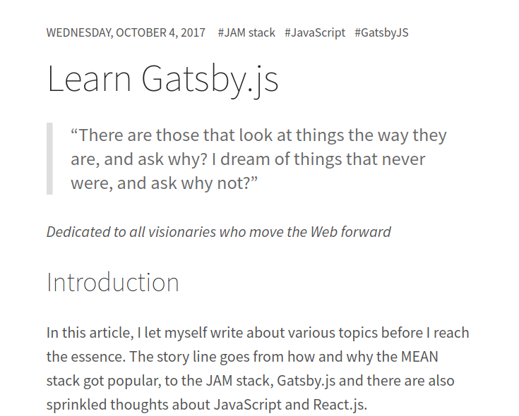
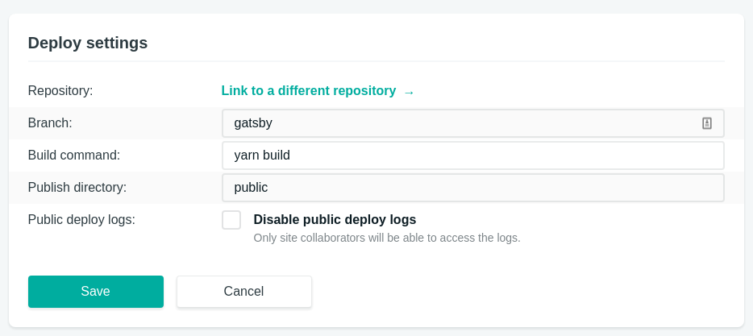
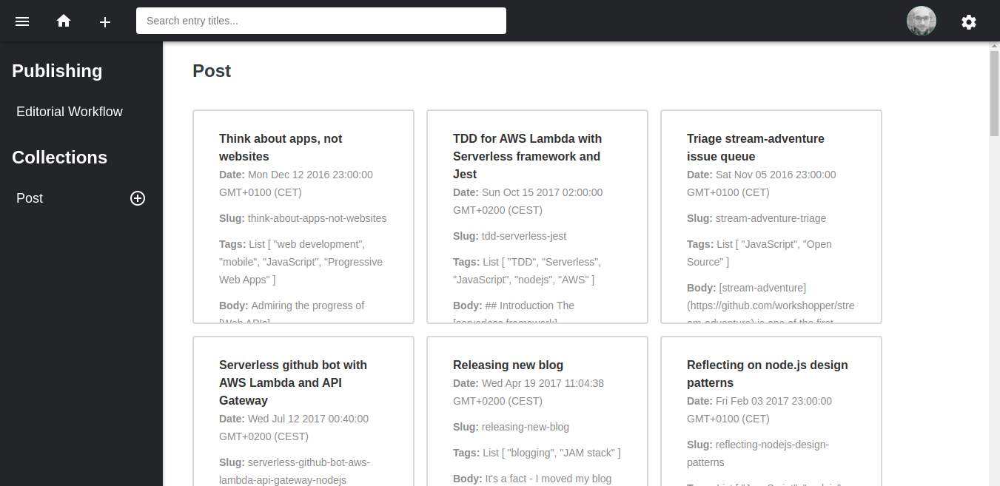
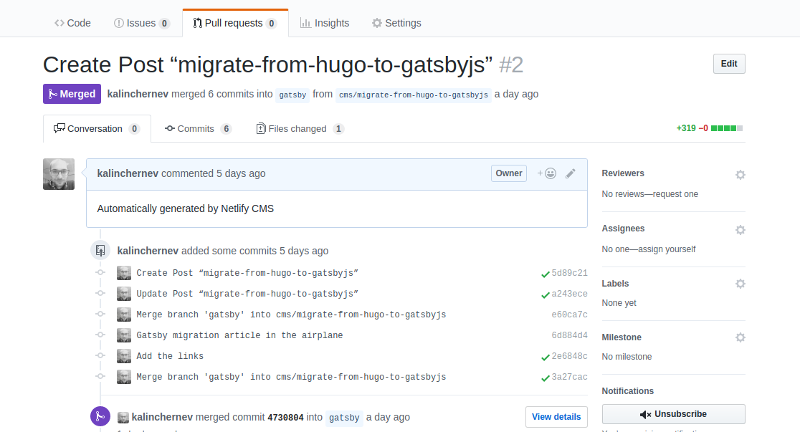

## Introduction

As my
[recent evaluations of Gatsby](https://kalinchernev.github.io/learn-gatsbyjs)
were positive, I decided to migrate my personal blog.

Instead of quickly picking an already built theme with a lot of code I might not
use—which I did during the previous migration from Medium to Hugo—this time, I
decided to take a different route—building it from scratch.

I focused on the process, looking for ways to make site building more generic
and reusable.

* Content migration
* Programatic page creation in Gatsby
* Manage styles with
  [`Typography.js`](http://kyleamathews.github.io/typography.js/)
* Automatic pagination
* Tag pages
* Add an admin panel with [NetlifyCMS](https://www.netlifycms.org/)

This article will highlight lessons learned from the process, with the aim to
provide high-level guidelines about patterns which can be applied in migrations
from other static site generators to Gatsby.

### Background before you start

[Hugo](https://gohugo.io/) is a super fast, convenient and well-supported tool
for working with static sites. I think today it's still more mature and closer
to classical CMS comparing to Gatsby workflows.

As it's an older ecosystem, when you need a ready plugin or a theme for quick
gratification, it's more likely to find something ready online for Hugo.

Gatsby, on the other hand, is based on React, GraphQL, Webpack and its way of
thinking is closer to how a developer would approach the problems from a
single-page-application point of view.

Gatsby might feel a bit more "raw"—there are starters and typography.js, but not
so many ready made solutions in the conventional sense. Probably the closest
marketplace for themes compared to others is
[gatsbythemes](https://gatsbythemes.com/) which is a young project.

If you have landed at this article researching which tool is better for your
job, take a look at
[comparisons](https://www.slant.co/versus/1016/18503/~hugo_vs_gatsby-js) and
keep in mind that selecting a
[stack](https://stackshare.io/stackups/gatsby-vs-hugo) boils down to being
effective with it.

For me, using Gatsby is
[valuable learning experience](https://kalinchernev.github.io/learn-gatsbyjs)
and it has also been so easy to work with, it feels "unfair". For example, the
plugin system of Gatsby keeps me sane and productive, even in cases where I know
only the briefest overview concepts of Webpack. Without Gatsby, I might have
spent hours and days configuring what Gatsby provides out of the box.

Last, but not least, the biggest benefit of using Gatsby compared to Hugo, is
the JavaScript tool-chain. Important tasks such as making a progressive web app,
hot module reloading, etc are much easier in comparison to other static site
generators.

### Content migration

This task was easier than expected. The file structure is preserved between my
previous blog and the current version. Both Hugo and Gatsby work well when
markdown files are stored at a `content/post` folder.

The only work I had to do on the content migration was to reformat the
[frontmatter](https://gohugo.io/content-management/front-matter/). In Hugo, I
used TOML, whereas `gatsby-transformer-remark` works only with YAML for the
moment. Luckily, I still had the Hugo CLI on my system so could make use of its
[build-in conversion tool](https://gohugo.io/commands/hugo_convert_toyaml/). The
only issue I had was that sometimes titles were longer than 1 line and were not
parse-able, so I just had to cut some words out where problematic.

My previous frontmatter already contained `title`, `date`, `tags`, and most
importantly - the `slug` fields. These were enough for my later work on the
programatic creation of pages explained in the next section.

### Programatic page creation

This is the official
[documentation](/docs/creating-and-modifying-pages/),
plus there is a
[tutorial](/tutorial/part-four/#data-in-gatsby), which
gives examples. In sum, I created a `gatsby-node.js` file which exports
`createPages` method using the `createPage` action from
[`boundActionCreators`](/docs/bound-action-creators/).

This might sound way more complicated than what it is:

```jsx
exports.createPages = ({ graphql, boundActionCreators }) => {
  const { createPage } = boundActionCreators;
  graphql(`
    {
      allMarkdownRemark {
        edges {
          node {
            frontmatter {
              title
              slug
              tags
            }
          }
        }
      }
    }
  `).then(result => {
    const posts = result.data.allMarkdownRemark.edges;
    // Create content programatically here
  });
};
```

As you see, getting the list of posts can be done in a single query.

The result of this query can later be handled by a "creator" function, which I
prefer to keep in a separate module. For example, creating posts works like
following:

```jsx
const path = require(`path`);

module.exports = (createPage, nodes) => {
  const template = path.resolve(`src/templates/post.js`);

  nodes.map(({ node }) => {
    if (node.frontmatter.slug) {
      createPage({
        path: node.frontmatter.slug,
        component: template,
        context: {
          slug: node.frontmatter.slug,
        },
      });
    }
  });
};
```

I re-use the `slug` field of the frontmatter of my existing structure. I don't
have to generate or calculate slugs based on information of other fields, i.e.
my scenario is easier than the tutorial on the official docs.

This is an example of "unfair" easy - I don't have to do literally anything to
keep my previous URLs of existing content the same in the new system.

The display of the data is handled by a React component acting as a template. My
case is nothing different than the
[official documentation](/docs/building-with-components/#page-template-components).

### Adding styles

Now that the system displays the content, it's time to style it. I decided to go
for the
[`typography.js` route](/tutorial/part-two/#typographyjs).
The approach is well documented and you can also see
[previews of the themes online](http://kyleamathews.github.io/typography.js/).

Steps were:

Add `gatsby-plugin-typography` and `typography-theme-moraga` (for example) and
"enable" the plugin in the `gatsby-config.js` file:

```javascript=
{
  resolve: `gatsby-plugin-typography`,
  options: {
    pathToConfigModule: `src/utils/typography`,
  },
},
```

In `src/utils/typograhy` add:

```javascript=
import Typography from 'typography';
import theme from 'typography-theme-moraga';

theme.overrideThemeStyles = () => {
  return {
    // Color contrast correction https://dequeuniversity.com/rules/axe/2.2/color-contrast
    a: {
      color: `#185D8B`,
    },
    img: {
      position: `relative`,
      left: `50%`,
      transform: `translateX(-50%)`,
    },
  };
};

theme.baseFontSize = `22px`;
const typography = new Typography(theme);

module.exports = typography;
```

and start the project again to see:



As you can see, with minimal efforts, the styles are basically ready! :)

I import any theme with `theme` variable since the plugin can change and the
rest of the code will stay intact.

### Pagination and tags pages

Having a decent grasp of how to create content in my new site, I proceeded with
creating pagination. I have about 30 blog posts, so I went for a split by 10 to
give an impression I have a lot of content :)

As usual, a good starting point was searching for example implementations
available in
[`examples`](https://github.com/gatsbyjs/gatsby/tree/master/examples/) and the
issue queue. There, in the issue queue, is a gem
[epic about plugins wishlist](https://github.com/gatsbyjs/gatsby/issues/1199)
where I found the discussion leading to
[gatsby-paginate](https://github.com/pixelstew/gatsby-paginate).

I wanted to have different contexts than the plugin, so I took inspiration for
both tags and pagination scenarios. I kept them as separate action creators and
I just called them in the main creator function like this:

```jsx
const createPostPages = require(`./gatsby-actions/createPostPages`);
const createPaginatedPostsPages = require(`./gatsby-actions/createPaginatedPostsPages`);
const createTagPages = require(`./gatsby-actions/createTagPages`);

exports.createPages = ({ graphql, boundActionCreators }) => {
  const { createPage } = boundActionCreators;
  graphql(`
    {
      allMarkdownRemark(sort: { fields: [frontmatter___date], order: DESC }) {
        edges {
          node {
            frontmatter {
              title
              slug
              tags
            }
          }
        }
      }
    }
  `).then(result => {
    const posts = result.data.allMarkdownRemark.edges;
    createPostPages(createPage, posts);
    createPaginatedPostsPages(createPage, posts);
    createTagPages(createPage, posts);
  });
};
```

Easy to read, understand and mantain. The pagination module is a bit longer than
the one of the posts:

```jsx
const path = require(`path`);

module.exports = (createPage, nodes) => {
  const template = path.resolve(`src/templates/postList.js`);
  const paginateSize = 10;

  // Split posts into arrays of length equal to number posts on each page/paginateSize
  const groupedPages = nodes
    .map((node, index) => {
      return index % paginateSize === 0
        ? nodes.slice(index, index + paginateSize)
        : null;
    })
    .filter(item => item);

  // Create new indexed route for each array
  groupedPages.forEach((group, index, groups) => {
    const pageIndex = index === 0 ? `` : index + 1;
    const paginationRoute = `/blog/${pageIndex}`;
    // Avoid showing `Previous` link on first page - passed to context
    const first = index === 0 ? true : false;
    // Avoid showing `Next` link if this is the last page - passed to context
    const last = index === groups.length - 1 ? true : false;

    return createPage({
      path: paginationRoute,
      component: template,
      context: {
        group,
        first,
        last,
        index: index + 1,
      },
    });
  });
};
```

Then, pull context information in the React component:

```jsx
const BlogPagedIndex = ({ pathContext }) => {
  const { group, index, first, last } = pathContext;
  return (
    <div>
      // Some elements
      ...

      // The posts
      <ul>
        {group.map((node, key) => <Post key={key} node={node} />)}
      </ul>

      // The pager
      <div>
        {!first && (
          <Link to={`/blog/${index > 2 ? index - 1 : ''}`}>Newer posts<Link>
        )}
        {!last && (
          <Link to={`/blog/${index + 1}`}>Older posts</Link>
        )}
      </div>
    </div>
  );
};

export default BlogPagedIndex;
```

This is a cut-down version of the component only for the blog post, do not copy
with too much trust…

I have to be honest—I haven't built pagination before with React/Redux, but I
feel this pagination approach is easier. Also, I want the pagination pages to be
accessible at all times, not only on state change, so the content creation
approach of building the list works well for me.

I will say again that I see this is "unfair" easy. It's probably the quickest
implementation of pagination I've made in my life.

For the list of tags and inner tags pages, the approach was similar but passing
different context to the template component:

For the overview page of tags:

```javascript
createPage({
  path: `/tags`,
  component: template,
  context: {
    posts,
  },
});
```

For the inner tag page:

```javascript
createPage({
  path: `/tags/` + slugify(tagName),
  component: template,
  context: {
    posts,
    post,
    tag: tagName,
  },
});
```

### Admin panel

Initially, I tried to use the `git-gateway` identity management approach in
Netlify, but it didn't work for me. I could not reach the point to validate or
reset the password for my user 1, so I kept the "old-school" way of github
integration which works just fine for me at the moment, having the fact I will
be 1 user to work on the site.

Not to mention also that I add this admin panel mostly for demoing the concept
of JAM stack with admin panel to friends, colleagues and potential clients.

Long story short, this is the `config.yml` configuration file:

```yaml
backend:
  name: github
  repo: kalinchernev/kalinchernev.github.io # Path to your GitHub repository
  branch: gatsby # Branch to update (master by default)

publish_mode: editorial_workflow
media_folder: "static/images" # Folder where user uploaded files should go

collections: # A list of collections the CMS should be able to edit
  - name: "post" # Used in routes, ie.: /admin/collections/:slug/edit
    label: "Post" # Used in the UI, ie.: "New Post"
    folder: "content/post" # The path to the folder where the documents are stored
    sort: "date:desc" # Default is title:asc
    create: true # Allow users to create new documents in this collection
    slug: "{{slug}}"
    fields: # The fields each document in this collection have
      - {label: Title, name: "title", widget: "string", tagname: "h1"}
      - {label: "Date", name: "date", widget: "datetime"}
      - {label: Slug, name: "slug", widget: "string"}
      - {label: Tags, name: tags, widget: list, default: ['APIs', 'JavaScript']}
      - {label: "Body", name: "body", widget: "markdown"}
```

The only interesting part is the `gatsby` branch which I used in parallel to the
`blog` branch. The `gatsby` branch is my development/staging and `blog` is my
production.

The branch in this configuration has to match to deployment branch of Netlify
service:



This is my admin page React component which is placed in `src/pages/admin` so
that Gatsby delivers the HTML page at `/admin`.

```jsx
import React from "react";
import Helmet from "react-helmet";

const AdminPage = () => (
  <div className="admin">
    <Helmet>
      <meta charSet="utf-8" />
      <meta name="viewport" content="width=device-width, initial-scale=1.0" />
      <title>Content Manager</title>
      <link
        rel="stylesheet"
        href="https://unpkg.com/netlify-cms@^0.5.0/dist/cms.css"
      />
      <script
        type="text/javascript"
        charSet="utf-8"
        async
        src="https://unpkg.com/netlify-cms@^0.5.0/dist/cms.js"
      />
    </Helmet>
  </div>
);

export default AdminPage;
```

In order for NetlifyCMS script to find the configuration file correctly,
`config.yml` should be placed in `static/admin/config.yml`.

Any other location or file name will result in an error.

So, here's how my admin panel looks:



Creating a new draft post yields a pull request:



Interesting part is that NetlifyCMS creates the pull request on my behalf with a
given state of the branch. I could continue working on the content of the post
when I'm offline (in an airplane) and push to the branch later when I'm back
online to trigger a new
[preview from Netlify](https://www.netlify.com/blog/2016/07/20/introducing-deploy-previews-in-netlify/).
Only when I decide to, I merge latest changes for styles and PWA tweaks back to
the post preview branch to see whole picture and approve the post, merging it to
the main branch.

This content workflow fits very well in the model we have as developers and
provides granular previews of changes when and how we decide to manage.

### Conclusions

In this blog post I shared how a migration to Gatsby from a static generator
like Hugo can work. The reasons for doing a migration like this are part
development benefits (it's a lot easier) and also a better production site which
feels as smooth as a single page application.

We also went through the few technical details necessary to realize the
migration, using GraphQL query, creators and templates.

Lastly, we added an admin panel to make content management easier for our
editors and clients.

Enjoy!
