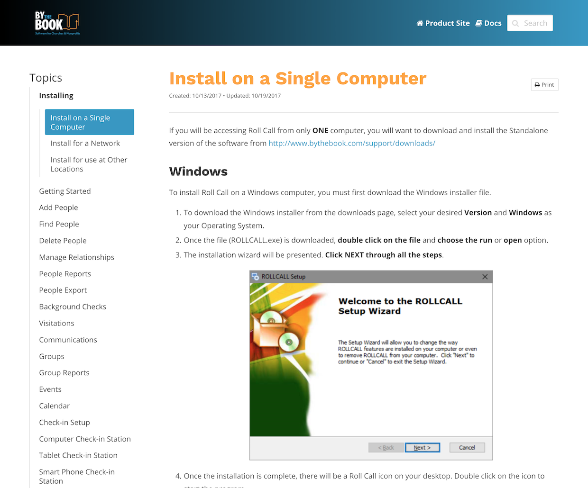
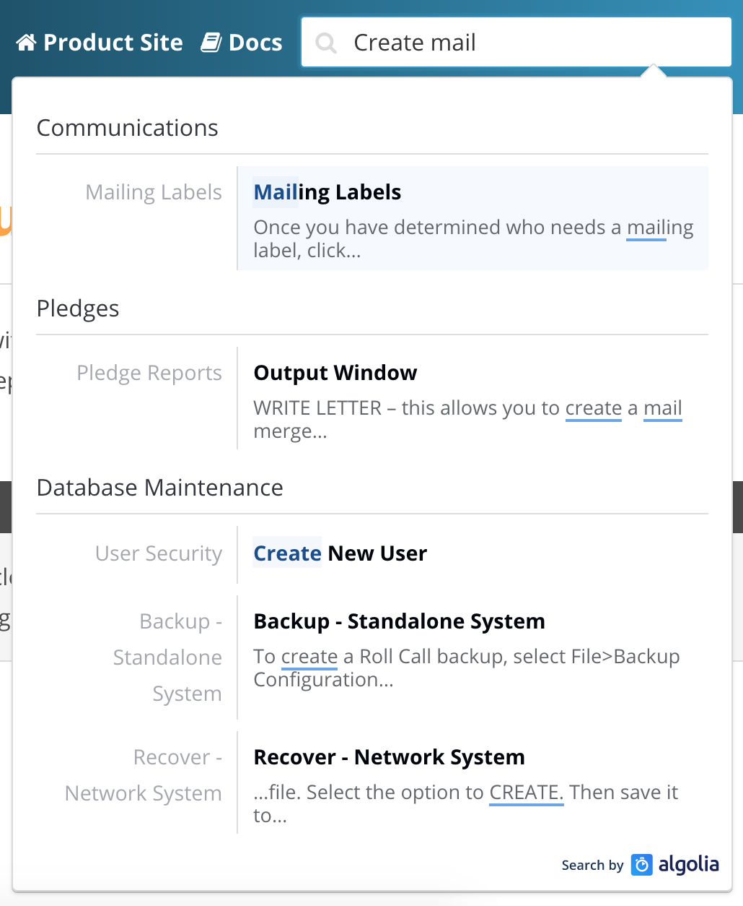
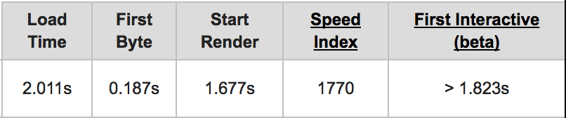

Gatsby has been getting a lot of recognition and
[adoption](https://github.com/gatsbyjs/gatsby#showcase) lately, and for good
reason. It’s so flexible and it works well with nearly everything.

If you’re on a tight budget and don’t want to sacrifice developer experience or
cutting-edge deployments, I’ve landed on a favorite set of tools (Gatsby
included, of course) for developing static sites that solves multiple problems
at once.

The use case I’ll be covering is a documentation site for our company’s main
software product. The site contains a lot of content with hundreds of articles.

Here’s a list of my requirements for this site:

* Speed - both in development and site performance
* Ease of use - both in developer experience and content upkeep
* Searchable content - it is a doc site after all
* Inexpensive Hosting - maximize value (who doesn’t want this?)
* Automated continuous deployment

The following is a report on my high-level experience of using Gatsby with
Contentful, Netlify and Algolia and the problems they solve — without getting
down into code.

# Static to the Rescue?

I know it’s bad to make assumptions, but I’m going to assume that if you’re here
and reading this, you at least know a little about the perks of static sites and
the JAMstack. If not, check out [https://jamstack.org/](https://jamstack.org/)
for a quick breakdown on why web development is, for lack of a better phrase,
“going back to the basics.”

Having dealt with my share of CMS headaches with Joomla in the almost-forgotten
past, and Wordpress in the more recent years, I’ve been on a quest to simplify
things. I don’t want to worry about having a plugin or theme get hacked or the
constant nagging to install updates. I also would prefer to not deal with themes
at all and just have flexible building blocks to shape my site’s appearance via
my own codebase. Static sites excel at these things.

But while static sites give you lots of perks, they do create some extra hurdles
over going the traditional route.

<iframe src="https://giphy.com/embed/LfjSCQ5ivKH3q" width="100%" height="100%" style="position:absolute" frameBorder="0" class="giphy-embed" allowFullScreen></iframe>

<a href="https://giphy.com/gifs/jump-rabbit-mixed-LfjSCQ5ivKH3q">via GIPHY</a>

While they’re generally fast out of the box, static sites don’t make their
content easily editable. After all, a static site’s content is usually just that
— static. That means, traditionally, you would have to edit the page code to
make content changes or add a markdown file then fire off a site rebuild
command, and finally redeploy. Even though static site generators have solved
this in many clever ways, I feel Gatsby solves this problem in a particularly
elegant fashion via it’s GraphQL data layer (more on that later) and its vast
ecosystem of data [source plugins](/docs/plugins/).

Before I jump into the topic of content and “data”, I want to briefly say that
building a static site template with React-based architecture and hot module
reloading is just plain fun. Gatsby’s CLI gets you going so quickly. It really
is a joy to use. Judging from all the
[twitter comments](http://twitter.com/gatsbyjs) saying the same thing, I think
that’s a common consensus.

Okay, now back to some static hurdles.

# A Problem of Content

Our site has a lot of content (~300 articles) that needs to be maintained by
non-developers, my co-workers. This meant we needed an approachable interface
for copy and content editing. I wanted to make it as convenient as logging into
Wordpress and publishing from there, without the Wordpress. So the publishing
experience couldn’t rely on creating a file and committing changes to a git
repo.

> Sidebar: There is
> [Gatsby-Source-Wordpress](/packages/gatsby-source-wordpress/)
> plugin that pulls in content via a Wordpress API. However, to me, this was not
> appealing because I was trying to avoid hosting a traditional CMS entirely.

# Solution: Contentful + Gatsby

Contentful is a hosted headless CMS with a fantastic user experience. It’s
similar to having a backend like Wordpress, but you are fully responsible for
the front-end layer. The beauty of Contentful is threefold.

* Intuitive and attractive UI
* Simple content modeling
* [Free tier](https://www.contentful.com/pricing/)

Dealing with the back-end of Contentful is refreshing and the content modeling
really leads the pack when compared to other headless content management
systems. It doesn’t feel like something that just gets the job done, it’s
actually really nice to use. They also just pushed some
[great new changes](https://www.contentful.com/blog/2017/11/28/work-smarter-with-our-new-search-features/)
that made it even easier to search and filter our articles on the back-end.

Contentful also happens to offer a
[generous free tier](https://www.contentful.com/pricing/) with useful features
for a small company or a few projects. At the time of this writing, you get a
few spaces (think projects), ten thousand content records, and five users that
can be admins, editors or authors of content. All they ask in return is that you
display a Contentful logo on your site footer or attribute them in your code
repo.

With that salesy pitch out of the way, how does Contentful work within our
Gatsby site?

Our documentation exists in 40 different parent topics and numerous articles in
each topic. The largest challenge with this was creating topic-based navigation.

Gatsby’s data handling makes these problems easy to manage by simplifying how
you get data to your site from external sources. It’s not _entirely_ unique from
other static site generators in that regard — other generators utilize plugins
for grabbing content as well, but how you deal with actually pulling it into
your React components/pages with GraphQL is beautiful.

After you install the `gatsby-source-contentful`
[plugin](/packages/gatsby-source-contentful/) with NPM
and add your Contentful API credentials to the gatsby-config file, the fun
begins.

Every time you run Gatsby with the `develop` command or do a new build with the
`build` command, the plugin fetches any new content from the Contentful API. All
this data is then available and ready to query locally in your development
environment. This means you can start pulling in Contentful assets and content
(assets = images/media, content = pages/articles/text/markdown, etc.) using
GraphQL queries right inside the template files.

> Sidenote: I had created a blog for my wife with Gatsby prior to this doc site,
> so I had a little experience with the Gatsby APIs. But I still consider myself
> a complete newbie when it comes to GraphQL. Lucky for me, Gatsby’s tutorials
> and community are awesome at answering questions or handling general usage
> issues.

In a single GraphQL query I was able to pull in all the topics and related
article titles set up in my Contentful Content Model for navigation. By
leveraging React and some GraphQL, I was able to create a dynamically generated
sidebar menu based off the content that got pulled in from Contentful. I have to
say, it feels so freeing being about to create static content with dynamic data
like this.

The articles themselves are written in markdown in the Contentful editor. They
get converted to HTML via a transformer plugin within Gatsby. The markdown
editing in Contentful is quite practical with standard WYSIWYG-like editor
features. I haven’t heard any complaints from my co-workers.

# Searching for a Search Solution

Another “problem” with static sites is the lack of out-of-the-box site search.
Most search implementations occur between the server and the database. As a doc
site, users typically expect solid search functionality. There are a few
frontend only javascript search libraries (like [lunr.js](https://lunrjs.com/))
that take a search query and parse a pre-built JSON index of your content.

I could have created this index by tying into the `onPostBuild` Gatsby API. This
event fires after all the pages are generated, so all page nodes are available
to parse to create a search index.

I quickly decided that this approach wouldn’t work well for our case because of
the vast number of articles. The index file alone would have been rather large
and present a hefty chunk of the site download which I felt was antithetical to
the performance benefits of using Gatsby (or even any static site). I needed
something that would operate client-side, but that had the search brains still
residing in the cloud somewhere. Though an option, I didn’t have time to build
my own solution.

# Solution: Algolia + Gatsby

This solution was a bit of a trial and error process for me. I had seen many doc
sites use Algolia online in my dev travels. I knew it offered a usable free tier
(again with logo attribution) with what seemed like enough free API calls to
suit our user base. What I didn’t know was how I would get all my content
indexed properly. Algolia does have helpful documentation on indexing.

It was more of a challenge of how to break down the content in the articles into
the chunks that the index requires. The
[Algolia Docs](https://www.algolia.com/doc/guides/indexing/structuring-your-data/?language=php#indexing-long-documents)
state that your index records shouldn’t be more than 10kb each which roughly
equates to a paragraph or two each. This suddenly became a challenge in how to
parse my article content by section. There wasn’t a good example out there of
how to accomplish this.

Eventually I settled on an HTML to JSON library that turned the page hierarchy
into a parseable JSON object. I set up a script in the `onPostBuild` Gatsby
event API that took the built HTML from each article. The library did the magic
of converting the HTML to JSON, then I iterated through the JSON. While keeping
track of the last linked heading (h tag), I set the index record’s page link
accordingly for each article section. The index was then uploaded to Algolia via
their node.js client.

It wasn’t pretty, but it worked.

I ended up coupling this indexing method with
[React InstantSearch](https://community.algolia.com/react-instantsearch/). This
is Algolia’s official React component library for utilizing with their service.
The final product was a search input with highlighted suggested results that
allowed the user to click one of those results and be taken directly to a parent
heading on a particular article.

Not bad.

Though after I wired all this up, it turned out that I was having some issues
with my implementation that left me seeking help from support. I was receiving
emails about quota usage, and I was sure I wasn’t even coming close to actual
usage limits.

This was ironically about the same time I discovered
[DocSearch](https://community.algolia.com/docsearch/) by Algolia. So as any good
developer would do, I scrapped all my hard work and just signed up for
DocSearch. Long story short is that they crawl your site every 24 hours,
updating the index for you. You include a script tag that ties their API to your
search input. Style it with some CSS. Bam. Done.

And it worked better out of the box than my implementation did. I felt kinda
stupid after going through all the effort because I realized that the
Reactjs.org repo had the answer right in their
[source](https://github.com/reactjs/reactjs.org/search?utf8=%E2%9C%93&q=docsearch&type=).
They use DocSearch instead of rolling their own indexing and search interface.
Oh well.

# Hosting & Deployment

A great thing about static sites is that you can host them just about anywhere.
You get a folder of pre-built files that you can throw up on any web server and
you’re done. You can even dump it in an Amazon S3 bucket and save a ton of money
with very little work.

So while hosting is easy, static sites adds a manual step for deploying changes
made to a site’s code or content — unlike WordPress or other traditional CMSes
where a content change goes live immediately.

If you don’t configure some form of deployment automation, you have to manually
initiate a build and upload it yourself. I wanted a continuous development
workflow — push a commit to my code repo and have Gatsby run its build in the
cloud and automatically deploy the new version of the site to a hosting
provider.

Can this be done with AWS? Sure, with a bit of configuration and more grunt work
in setup. Can it be done elsewhere with little to no configuration? How about
for free?

Luckily I already knew the answers to these questions because I had already
discovered Netlify for some other projects.

# Solution: Netlify + Gatsby

Plugging any static site into the Netlify workflow is a no brainer, but after I
found Gatsby, I knew there was no other option for me. These two pair so well
together!

Netlify recently changed [their pricing](https://www.netlify.com/pricing/) to
improve what was already an awesome hosting per dollar value. I can’t get
through this section without a bullet list of why Netlify is so fantastic.

* Free to use for personal/commercial project (seriously great free tier)
* Push button HTTPS via Let’s Encrypt built in
* Fast Global CDN
* Support for custom domains
* Atomic deploys
* A crazy-cool, integrated build engine
* [And a lot more....](https://www.netlify.com/features/)
* Did I mention you get all this for FREE?

<iframe src="https://giphy.com/embed/vMnuZGHJfFSTe" width="100%" height="100%" style="position:absolute" frameBorder="0" class="giphy-embed" allowFullScreen></iframe>

<a href="https://giphy.com/gifs/vMnuZGHJfFSTe">via GIPHY</a>

And back to using it with Gatsby.

After you link your Netlify site to a specific code repository, Netlify’s build
bots take care of the rest. From that point on, when you push a change to your
repo, the build bot says, “Hey look! a change! I need to run the `gatsby build`
command...”, then it follows the package.json (or yarn file) in the repo and
downloads the necessary dependencies if they aren’t already cached, and then
builds out the static site.

And during this build process, Gatsby’s clever APIs are taking care of grabbing
content from Contentful and generating the static pages for the articles.
Awesome. When this process is done, you can even be notified via Slack, or
Email.

Netlify is the easy-button for your deploy/hosting problem.

Coupled with your Gatsby site, the site performance is outstanding. Both
perceived performance and measurable performance are there. You get
time-to-first-byte measurements in the single digits. The code-splitting and
pre-fetching perks of Gatsby also help to make your site score well in web
performance tests. All out of the box.

Now, to come full circle I needed something that would trigger a new site build
when someone edited or added an article from Contentful. Again, Contentful and
Netlify to the rescue.

Contentful has webhook functionality built-in and lets you fire off a request
when an action is taken on a piece of content or when content is created.
Perfect. With this hook, Contentful talks to Netlify when there’s a change or
addition, and Netlify rebuilds the site and deploys it.

It’s a match made in JAMstack heaven.

# Is it Magic?

Gatsby makes building the site fun and painless. It gets out of the way and lets
you be creative with your craft — yet also adds some insane perks, like
responsive image handling and lazy loading, with very little effort on your
part. Contentful lets you focus on your content the same way Gatsby lets you
focus on developing, and Netlify really “just works.” It lets you hit a few
buttons and leaves you with a “Is it really this easy?” kind of feeling.

Now, hopefully, our customers will feel the same with our site.

<iframe src="https://giphy.com/embed/12NUbkX6p4xOO4" width="100%" height="100%" style="position:absolute" frameBorder="0" class="giphy-embed" allowFullScreen></iframe>

<a href="https://giphy.com/gifs/shia-labeouf-12NUbkX6p4xOO4">via GIPHY</a>

