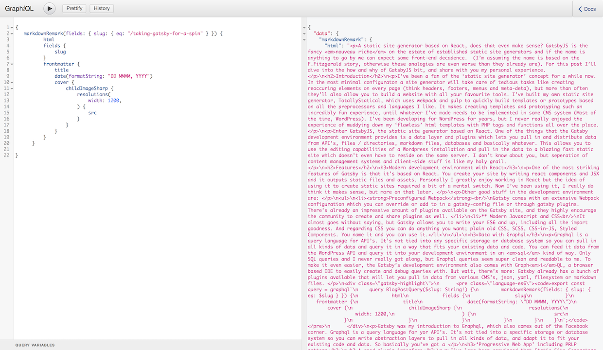

A static site generator based on React, does that even make sense? [GatsbyJS](/) tries to answer this question with a hypermodern, feature-packed, _jamstacked_ development tool that you can try out right now! In this post I'll give you a quick introduction and an overview of my own thoughts on Gatsby.

## Introducing: Gatsby

Ever since I started following the [Gatsby Twitter account](https://twitter.com/gatsbyjs), I've wanted in on the action. It's not that I really _need_ a new tool to create static sites, it's just that every developer tweeting about Gatsby seems to think it's the most exciting thing on the web since they learned they could combine the `marquee` and `blink` tag. Call it FOMO. Also, the sites that these developers have been showcasing were all so fast and snappy, I had to see what the buzz was about.

Let’s jump in. Here are some of the important features of Gatsby:

### React

GatsbyJS is based on React which means that you'll be writing almost everything in JavaScript / JSX. That doesn't mean though you need loads of React experience to start out with Gatsby The [tutorials](/tutorial/) are a great resource and will teach you some React along the way. If you already like React, you'll most definitely enjoy creating static sites with Gatsby. As your final JavaScript bundle includes the React library, you can include React components as if it was a regular React app.

### Graphql

Gatsby was my first introduction to [GraphQL](http://graphql.org/learn/) and I'm loving it already. GraphQL is a query language used by Gatsby to let you connect to all kinds of APIs. With it as an abstraction layer, you can pull in all the data you can think of and utilize it in your app. Gatsby comes with plugins to pull in data from several APIs, CMS systems and local files. With GraphQL, you're able to query data from all these sources in a clear and readable way. The data is instantly available in your components and that's just super cool. Also, it comes with a browser-based IDE called Graph*i*QL which starts along with your development environment. You can use it to see which queries are available, test them out, and see what data these queries return.



### Progressive Web App and PRPL Pattern (Blazing fast)

With an eye on the future, Gatsby already implements lots of Googles so called '**P**ush, **R**ender **P**re-Cache and **L**azy-load pattern (PRPL, I'm not sure if that acronym will catch on). Gatsby takes care of the pre-loading and code-splitting, which makes browsing around Gatsby sites an insanely fast experience. PRPL + the gatsby offline plugin mean that your site will be considered a PWA, will load insanely fast on any device and scores great in Google lighthouse. Read more on [PRPL](/docs/prpl-pattern/).

### Webpack and Plugins

Can you say React without webpack? I can hardly say `hello world` without webpack anymore, although I'm still not sure how to configure it right on the first go. Gatsby comes with an extensive webpack configuration and you don't really need to touch if you don't want to. If you do, you can modify and add to the default configuration with a plugin or in the `gatsby-node` file. There's already a great range of plugins so most likely any webpack tweak is a plugin install away. With all the plenty of good examples, it’s often straightforward to write your own plugin too.

### Community

Even though Gatsby is pretty new, the developers using it seem really involved. There are quite a few [articles on the Gatsby blog](/blog/). People seem to be happy to answer your Gatsby questions on Twitter and on Github you can ask anything without being shot down. Everyone is encouraged to contribute in form of plugins and pull requests, which gives me confidence that we'll see a lot of additions and improvements in the future.

## Some thoughts on Gatsby

It's telling that [most of the websites that are made with Gatsby](https://github.com/gatsbyjs/gatsby#showcase) are developer portfolios and documentation websites. It shows that Gatsby is still a bit in its early-adopters phase. But seeing what kind of sites are already made with Gatsby, I'm sure the future is bright. I've had a blast creating my own site with Gatsby ([checkout the github repo here](https://github.com/aderaaij/ardennl-gatsby)) and in the end it didn't take more than a weekend to complete, including doing the [tutorial](/tutorial/) and experimenting with the [Gatsby starters](/docs/gatsby-starters/).

Some other thoughts I had while working with Gatsby:

### It's fast

Gatsby definitely delivers on speed. The whole PRPL pattern thing seems to work miracles. I tried browsing the [list of sites made with Gatsby](https://github.com/gatsbyjs/gatsby#showcase) with network throttling set to 'slow 3g' in Google Chrome and the performance of these sites is still impressive.

### GraphQL is amazing

Data from anywhere with static output. That's sort of the holy grail isn't it? Right now the data I use in this site comes from markdown files, but I can already see that switching to another content source is going to be a breeze with GraphQL. The queries are clean and readable and the Graph*i*QL IDE is the perfect helper. In a way, GraphQL allows you to separate your front-end from the type of data source.

```es6
export const query = graphql`
  query BlogPostQuery($slug: String!) {
    markdownRemark(fields: { slug: { eq: $slug } }) {
      html
      fields {
        slug
      }
      frontmatter {
        title
        date(formatString: "DD MMMM, YYYY")
        cover {
          childImageSharp {
            resolutions(width: 1200) {
              src
            }
          }
        }
      }
    }
  }
`;
```

### Deployment and content management can be so good!

After reading some articles on the Gatsby site, I decided to set up my Gatsby hosting on a free plan from [Netlify](https://www.netlify.com/) (which is ridiculously generous by the way, what's the catch?) and that has been a fun experience. Netlify already supports Gatsby out of the box, which means you can configure automatic deploys with `git` in a few clicks. Every time I push to master, the site gets rebuild and uploaded by Netlify. _Magic_. There's also the possibility to configure staging servers based on your branches, so you can always test out your changes before merging to master and deploying.

But wait, there's more. If you use [Contentful](https://www.contentful.com/) as Content Management System and Netlify as your host, you can easily create a Webhook to trigger a rebuild on every content update! I haven't tried this myself yet, but [this posts](https://www.halfelectronic.com/post/setting-up-gatsby-js-contentful-and-netlify/) by [Fernando Poumián](https://twitter.com/fernandopoumian) is a great resource to get you going.

Incremental builds aren't yet possible, so every update means a complete rebuild. I'm sure that's no cause for concern on smaller sites, but with larger sites that are updated often it could be a problem. Luckily, incremental builds will be part of Gatsby ['sooner than later'](https://twitter.com/gatsbyjs/status/937053640652611584), which will take care of that problem.

### Gatsby Image plugin is cool

Did you see the SVG traced image before the image was loaded? If not, you're probably on Safari and I still haven't implemented the `intersection observer` polyfill. But in other browsers, images you add with the [gatsby image](https://using-gatsby-image.gatsbyjs.org/) component will include a blur or traced svg placeholder effect by default. It also has `srcset` and `webp`. It can use some work though it adds a few wrappers around your images that are hard to reconfigure without using `!important`. Oh and be warned, it uses `object-fit` by default, which is unsupported by IE11 and older browsers. Of course, you don't have to use this plugin and every addition / change is discussable on Github.

### Keep an eye on the output

I'll start by admitting that I haven't validated the HTML of my own site yet, but I'm sure it'll need some work. I feel like the combination of JSX and using loads of React Components can make the HTML output messy real quick . Combined with the use of Gatsby plugins that also manipulate your output, I'd say it's extra important to keep an eye out on the generated code. I understand that GatsbyJS is very much about the modern web, but that's why we've got _progressive enhancement_.

### When your favorite tool is a hammer…

Doing everything in React is a blessing and a curse. You can solve everything with JavaScript but that doesn't mean you HAVE to solve everything with JavaScript. At times I find myself in such a flow of writing just JavaScript that I tend to use it to solve problems that could have been fixed with a `hover` selector in CSS.

### CSS in JavaScript, I can dig it.

You can use anything to style your Gatsby site; CSS, SCSS, Styled Components, CSS-in-JS, you name it. I wanted to give the whole "Use CSS in your JavaScript" a spin and chose for a library called [emotion-js](https://github.com/emotion-js/emotion) based on the fact that I dig the Bowie emoji on its page. After trying it out for a few days I have to admit that I really like it. Creating and styling a component in the same place is such a nice way of working. Even without the cleverness of using React state to toggle CSS values, it's a great tool. There's still some work to do considering autocomplete and syntax highlighting, but when working with components like this it makes a lot of sense.

## In conclusion

I like Gatsby and I like the ideas that it promotes. The sites created with Gatsby are blazing fast, as promised. The development environment is one big party and GraphQL makes me rethink my life. I am really looking forward to develop more sites with Gatsby and I'm hoping to find an opportunity to replace a traditional WordPress install with a Gatsby site that pulls in the WP data. When that time comes, I'll report back of course.

If you have any questions based on this post, don't hesitate to contact me on [Twitter](http://twitter.com/ardennl) or via [mail](mailto:a.de.raaij@gmail.com). Thanks for reading!
