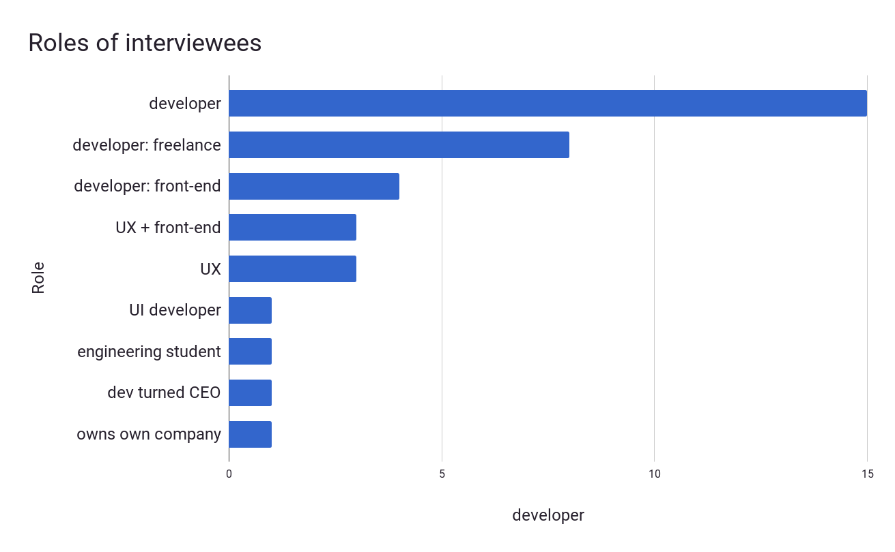
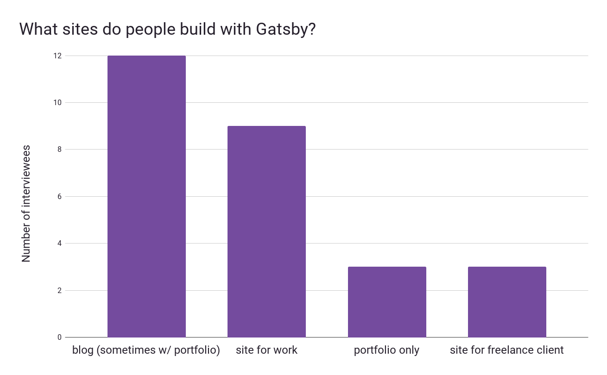
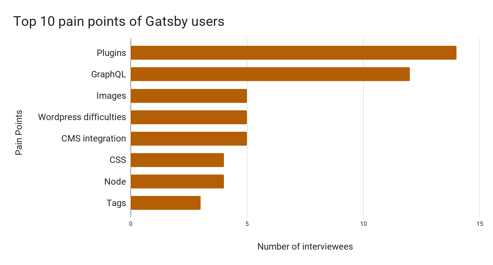

## How this all started

After teaching college-level writing and training sales people for the last several years, I’d been contemplating a career change. Earlier this year on a road trip with my brother, as we drove past [red rock cliffs](https://utah.com/hiking/st-george) in Utah, he suggested that UX design could be a natural fit. After serious reflection, I applied to a UX bootcamp and got in. Fast-forward to August where Kyle Mathews and I are sitting with a bunch of friends in a dry grass field in Idaho, waiting for the solar eclipse. We’ve been friends since college, and he asked if I’d be interested in doing UX interviews for Gatsby. 

I’d been watching Gatsby grow from the beginning and felt enthusiastic about the chance to dive deep into a project with passionate community members working on such an interesting project. I saw that UX research would inform the community how to maintain and enhance Gatsby’s awesome developer experience.

All this leads me to this blog post, in which I’d like to summarize the research I’ve done with [GatsbyJS] users the past few months and how it’s informing upcoming projects and design decisions. If you already use GatsbyJS, I hope you’ll compare your experience with the following results and [let me know](https://twitter.com/shannonb_ux/status/938551014956732418) if you have more feedback that is not reflected in our data. If you don’t use GatsbyJS and would like to, it’d be great to start with these [tutorials](https://www.gatsbyjs.org/tutorial/) and by following us on [Twitter](https://twitter.com/gatsbyjs).

## Why do UX research for Gatsby?

One of the goals of Gatsby is to enable an awesome developer experience and continual feedback from the community on the project guides us towards that goal. To gather feedback, I started reaching out to Gatsby users through Twitter and Discord and wow, the response has been amazing! Many people have generously offered to chat over the phone, Google hangouts, Discord, email, and more to tell me their experiences. These interviews allowed me to talk with a wide breadth of people and get in-depth information about the Gatsby development experience.

To gather more feedback, we also added a question at the bottom of each doc and tutorial that says: “Was this page helpful?” with thumbs-up and thumbs-down icons. In the future, we’ll implement more feedback systems to make sure we always understand Gatsby users.

In interviews I asked open-ended questions that are intended to gather candid feedback:

* What is your name and where do you live?
* How did you hear about Gatsby and why did you get interested in it?
* What is your role / job?
* Tell me about what you built using Gatsby, and what was the building process like? Or, if you haven’t finished building it yet, what do you hope to build and where are you at in the process, and what has it been like so far?

If interviewees didn’t give enough information with the above open-ended questions, I asked more pointed questions like these:

* What do you like about Gatsby so far?
* What obstacles have you run into when building your site with Gatsby? Were you able to overcome them? If so, how?
* What things (if any) helped make the process easier?
* What do you think could be improved in the tutorials or the whole experience of building with Gatsby?

Questions added later to reflect recurring comments from interviewees:

* What else do you think you might build with Gatsby in the future?
* What could we do to make those future projects easier for you? 
* Did you use any plugins? Starters? If so, how did you find them?
* Have you built any plugins or starters? If so, what was that process like?

## What we found out

Here are some general statistics we gathered from over 30 interviewees (and counting).

### What job roles do Gatsby users have?

About 73% of interviewees are developers, with UX designers being the next biggest group. Several users were business owners and students a who develops in addition to their schooling or other job.

### What sites do people build with Gatsby?

Most sites built with Gatsby are blogs or a combined portfolio plus blog, with sites for work being the second most common site built with Gatsby. People working on bigger work projects experienced pain points including how to build complex navigation and menu bars and how to handle complex workflows that involve multiple writers and editors.

### What are the top 10 pain points of Gatsby users?

Plugin-related issues take home the gold medal for biggest pain point; many more people than we expected are interested in plugins and have struggled to find the plugin they need, make sure the plugin they find isn’t going to break their site, or build a new plugin. The community has done some excellent work with plugins so far, and we wanted to celebrate that accomplishment, enable future contributors to learn more from existing plugins, and solve the aforementioned problems by building a plugin library.

The second biggest pain point is GraphQL. About half of our interviewees expressed that GraphQL has a steep learning curve and more effective learning resources could make it easier and faster to learn.

Other salient feedback includes the fact that people who have used Wordpress for a long time are looking for other solutions and want Gatsby to play well with different kinds of CMSs. Finally, almost every interviewee loves the Gatsby development experience because it is smooth and fast. Here are some fun quotes:

> You guys are pretty much nailing it. Just keep killin’ it, I guess! 
> – Alec Lomas, AZ, front-end dev and design

> I’ve played around with static sites in Jekyll in the past, but I’ve always hit a pain point with how much functionality I could build into the different includes and partials and things that were starting to become popular with different templating languages. So I’ve always loved React for all the encapsulation of style and functionality. And components--but I never really knew how to use it. And Gatsby has been that first opportunity where everything comes together, everything can be in one system. My background is really design focused, so I think of a component library along those lines. Until Gatsby, I never really had a way to see how I could use that across all of our pages instead of relying on a content management library that was kind of slow to develop in. 
> – David Luhr, UT, UX

> If you ever decide to sell to consumers, I really think that the speed / responsiveness of Gatsby is a really good selling point. Like when I tried to sell my idea of building the new site in Gatsby (which would take a little longer compared to building it in Squarespace) to my husband, I simply showed him how quick it is to navigate around a Gatsby site and he was instantly sold. The explicit awareness that website speed matters a lot is currently kinda limited to Silicon Valley etc, but the benefits are definitely apparent as well to the average consumer. Pair that with stats around how speed increases conversions and it'd definitely be a pretty appealing offer to people. 
> – Juliette Pichot, Germany, web dev

## So what does this all mean?

All the pain points and suggestions are incredibly important to us and we have a thorough record of them. For my final project in my UX bootcamp, I decided that I’d take the top pain point from our interviews and improve plugin discoverability. Along with members of the Gatsby community, I’ve been working on mockups and testing out the designs. 

## Details on why a plugin library matters

Currently, everyone is installing plugins and many awesome users are building plugins. Building a searchable plugin library will both increase discoverability of awesome plugins and also solve the pain points that currently exist (it can be a bit difficult to find plugins and sparse and inconsistent information about them leads to extra work for users). Some specific problem scenarios that you interviewees described to me:

* Your site breaks because you installed a plugin that wasn’t compatible with the current version of Gatsby.
* You are working after hours trying to build a plugin to help some CMS play nicely with Gatsby and you’re having trouble finding a good plugin to imitate.
* Your fingers are super tired from scrolling up and down the plugin list and you don’t have enough Advil to support this activity and now you’re stuck on the couch with a cramped hand. (_Ok, no one actually said this, but they were thinking it, I’m sure_).

## Until next time

We’re currently working on the final prototypes for the plugin library and welcome contributions from the community. Here are ways you can contribute:

* Follow the plugin library’s progress and contribute to it in [Github](https://github.com/gatsbyjs/gatsby/issues/3003).
* [Contact me](https://twitter.com/shannonb_ux/status/938551014956732418) here if you have feedback that differs from or provides deeper insight into one of the pain points this article mentions
* Follow us on [Twitter](https://twitter.com/gatsbyjs)
* Contribute by solving issues in the [Github repo](https://github.com/gatsbyjs/gatsby/issues) 

Again, many thanks to all the community members who have contributed to this research and to making Gatsby awesome. Stay tuned for updates on the plugin library and future Gatsby UX research projects!

