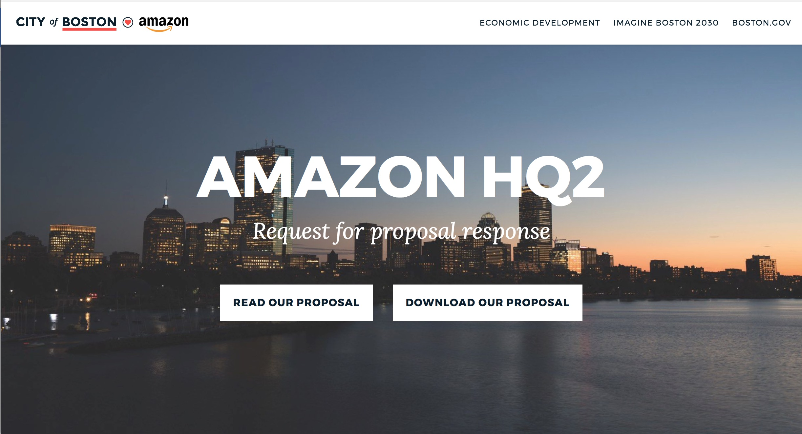
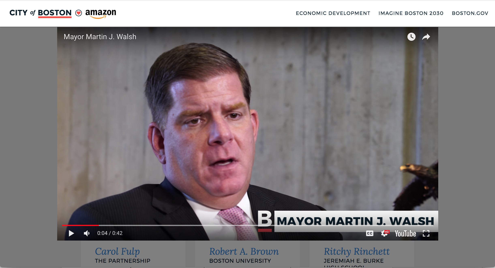
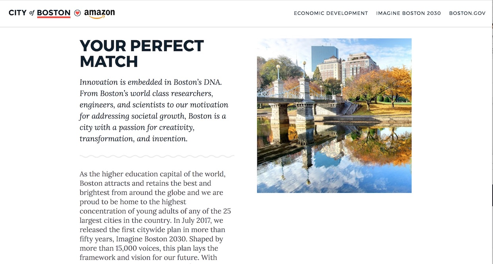

[Boston.gov](http://boston.gov) is a small team with a huge responsibility: ten people tasked with the digital presence of New England’s most iconic city.

Today, the team and the city scored a huge victory when Amazon announced that Boston was [selected as one among 20 candidate cities](https://www.amazon.com/b?node=17044620011) for its North America HQ2.

When Amazon announced in September that it was looking to build a new headquarters, bringing 50,000 jobs and billions of investment to the chosen city, Boston’s city government jumped to throw their hat in the ring.

As a technology hub, the city wanted to put their best digital foot forward, so they turned to the Boston.gov team to build a website as the city’s application — [amazon.boston.gov](http://amazon.boston.gov) .

With a compressed application process, the Boston.gov team had a week and a half to build two websites -- a public-facing site, as well as a password-protected site with additional information.

They needed tools that let them get off the ground immediately, iterate quickly, and build something beautiful -- so they turned to Gatsby.

"Within 10 minutes, we had our environment set up, with the website building and deploying,” said Matthew Crist, lead engineer for the project.

With Gatsby, the team was able to complete the website from basic comps in around a week, compared to about a month for similar projects in the past. “We generally haven’t been able to do anything as fast,” Crist said.

As an engineer, Crist really appreciated Gatsby’s out-of-the-box hot reloading support.
“The fact that you can save your code, tab back to your browser, and see the change sped up development so much,” Crist said.

And the whole team appreciated Gatsby’s support for component libraries.

“We were able to use our pattern library that we’ve built for Boston.gov,” said Crist. “Our city’s website is nothing but components, stacked together to create a page. [amazon.boston.gov](http://amazon.boston.gov) is the same.”

“Our pattern library has already been A/B tested, and stakeholders are already bought in,” said Crystal Torman, an economic development advisor for Boston, and the project’s internal client. “We could make just one decision about website styling and then spend more time drilling into the content.”

"Crystal and I were probably on the phone straight for two days, giving feedback,” said Reilly Zlab, the product manager.

“Normally we don’t do so many iterations in such a short time,” laughs Torman.

The iterations paid off.

"Both internally and externally we’ve heard overwhelmingly positive feedback,” Torman says. "People here love the website."

Apparently, so did Amazon.
