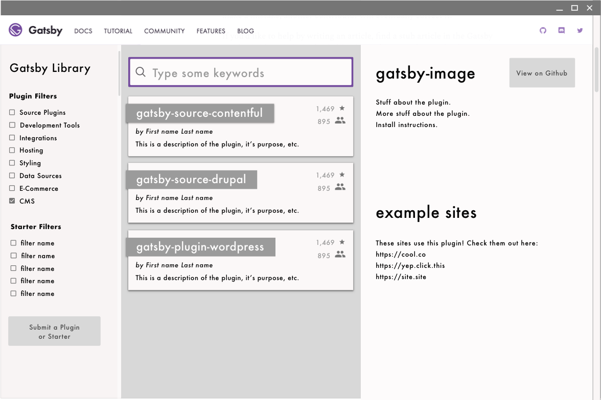
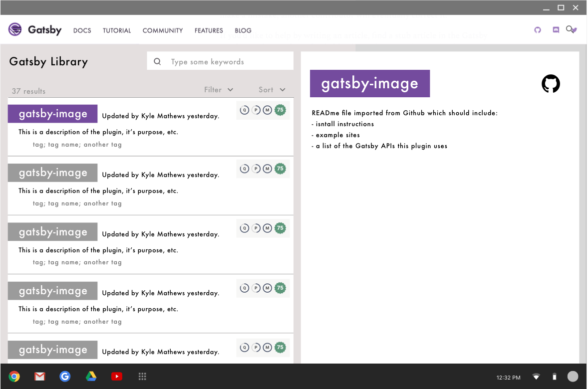
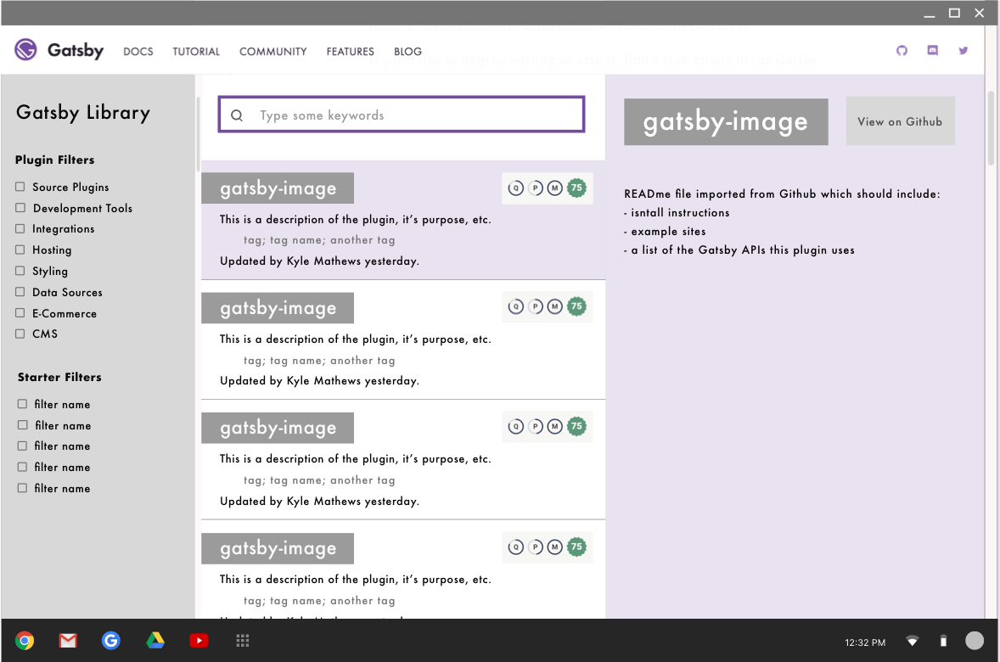
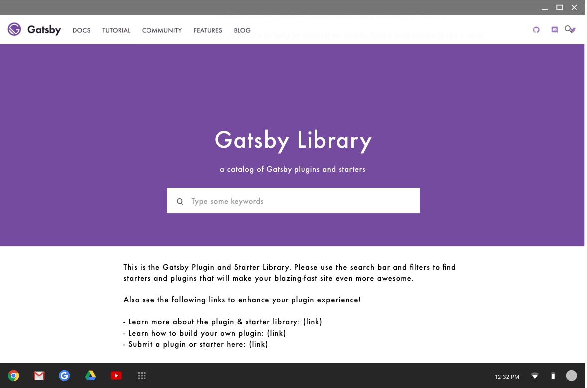
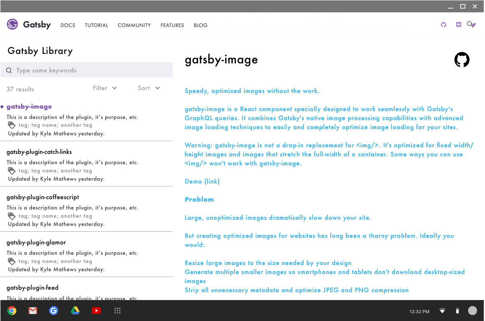
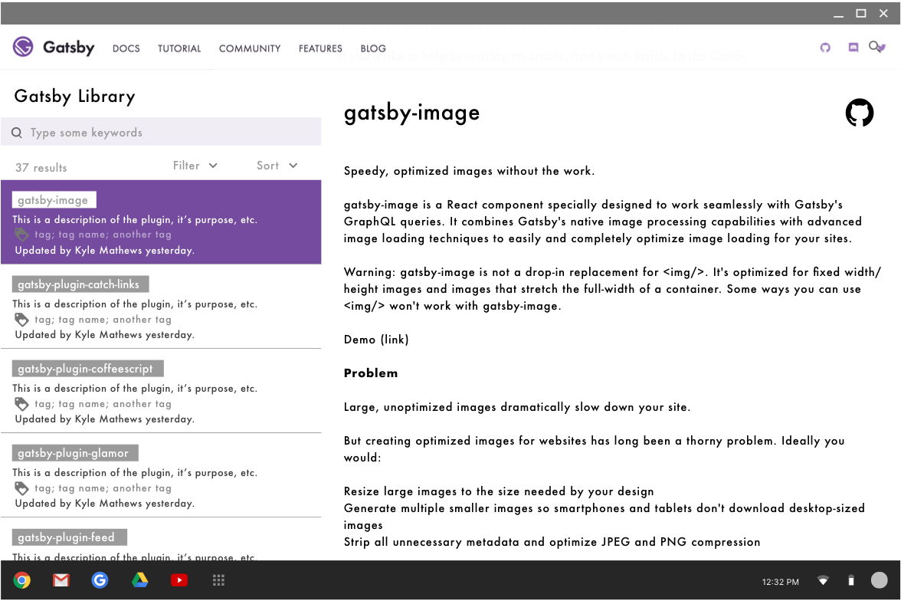

## Why build a plugin / package library

In over 60 interviews with Gatsby users, plugin discoverability appeared as a top pain point (see [blog post on the Gatsby UX research program](/2017-12-20-introducing-the-gatsby-ux-research-program/) for a full list of pain points). So we built a plugin / package library [here](/packages/)!

In this article, I want to explain how UX research drove the development and design of this plugin library and invite you all to follow and contribute as the library continues to improve.

## Jobs to be done

After talking to over 60 Gatsby users, I compiled what’s called an “empathy map” in UX design to put myself in the shoes of Gatsby users; basically, this map describes a summary of what the typical Gatsby user experiences when searching for plugins.

Based on the empathy map above, we identified five “jobs” that Gatsby users want done regarding plugins and packages:
* Make it easy to search for and find the best, most recent, and relevant plugin for their site.
    * Scrollable, searchable list of plugins with a search bar at the top, tags attached to each plugin, and accurate information on version compatibility, popularity, maintenance, stability.
    * Each profile card should have a short description and the profile page should have the Github READme file.
* Make it easy to imitate plugins as they build their own.
    * The profile cards and pages should easily link to the Github repo.
* Recommend plugins based on their needs.
    * You could fill out a profile and login and get suggestions based on the kind of site you’re building, your level of experience, etc.
    * There could be permanent categories like “for beginners” or other categories.
    * There can also be changing categories like “editor’s picks,” “trending,” “most popular,” etc.
* Show (or at least explain) what plugins do (preview) before installation.
    * Make sure READme files are filled out with instructions and a list of sites that use the plugin.
    * Possible showcase every week?
* Make it easy to share plugins they build and/or plugins they like.
    * A huge thank you to @jlengstorf and all involved in building the [Plugin Authoring page in the docs](https://www.gatsbyjs.org/docs/plugin-authoring/#what-files-does-gatsby-look-for-in-a-plugin)
    * Share buttons from the profile card and/or profile page.

## Learning from other plugin libraries

We also analyzed over 10 admirable and/or popular plugin libraries to draw from their strengths and learn from their weaknesses. Examples in no particular order include [JS.coach](https://js.coach/), [VIM Awesome](https://vimawesome.com/), [Best of JS](https://bestof.js.org/), [Sketch extension library](https://sketchapp.com/extensions/), [Chrome plugin library](https://chrome.google.com/webstore/detail/plugins/mmcblfncjaclajmegihojiekebofjcen?hl=en), [Microsoft Visual Studio Code Extensions](https://marketplace.visualstudio.com/VSCode), [Wordpress Plugins](https://wordpress.org/plugins/), [Npms.io](https://npms.io/), [Yarnpkg.com](https://yarnpkg.com/en/packages), [Apple App store](https://www.apple.com/ios/app-store/), which just got redesigned, so I’m interested to learn from their changes, [Google Play store](https://play.google.com/store/apps/top?utm_source=na_Med&utm_medium=hasem&utm_content=Jan3118&utm_campaign=Evergreen&pcampaignid=MKT-DR-na-us-1000189-Med-hasem-py-Evergreen-Jan3118-Text_Search_BKWS-audiencetest%7cEXA%7cONSEM_kwid_43700029906604977&gclid=EAIaIQobChMIt5mJ--ja2QIVAdtkCh0-PQWgEAAYASAAEgK_0vD_BwE&gclsrc=aw.ds&dclid=CPaIm_zo2tkCFdWUfgodw58Gaw).

## Card sorting

We gathered, and are continuing to gather, feedback from Github issues, the Product Hive slack community, and face-to-face usability testing. Also, as part of our plugin library UX research, I wanted to know what keywords people might use to search for Gatsby plugins in order to create filters, categories, and tags that make sense. 

I used card sort software to generate dendrograms, other kinds of -grams, and matrices that show the way 20 different Gatsby users typically organize plugins in their minds (big thank you to all who participated here!). Creating filters, categories, and tags are possible future enhancements based off of these results: 
* [Card Sort Results 1](https://www.optimalworkshop.com/optimalsort/x87kpp82/0mv7111b/shared-results/f24tt2xcxj7di7303t46hec077unam75)
* [Card Sort Results 2](https://www.optimalworkshop.com/optimalsort/x87kpp82/bt0c01w0/shared-results/1yo4d868hponypjyk1we3xz53sag7uc7)

## Prototypes and their evolutions

Here’s a sampling of screenshots that many community members contributed to and gave feedback about. It’s rewarding to see how much the design has progressed (and will keep progressing).

## Until next time

The purpose of creating the library goes beyond solving a pain point: it also can help people enjoy the full value of the Gatsby ecosystem. The plugin ecosystem is a huge part of what makes Gatsby awesome because plugins and packages make Gatsby extensible and capable of a huge range of powerful things. I hope the library will make it easier for people to find plugins, using them, contribute to them and create them with the help of the Plugin Authoring page in the docs. Anything we can do to make that cycle faster will help the Gatsby ecosystem develop faster and help people build awesome sites. 

Here are some ways you can help make the Gatsby plugin ecoystem great:

We just merged the current version of the plugin library. You can follow its progress and contribute in [Github](https://github.com/gatsbyjs/gatsby/issues/4394).
See the [Plugin Authoring](https://www.gatsbyjs.org/docs/plugin-authoring/#what-files-does-gatsby-look-for-in-a-plugin) page if you’re interested in creating your own plugin. This is a new page and feel free to suggest edits and improvements.
Here’s a reminder to [contact me](https://twitter.com/shannonb_ux/status/938551014956732418) here if you have feedback that differs from or provides deeper insight into one of the pain points this article mentions. 
Follow us on [Twitter](https://twitter.com/gatsbyjs) and contribute by solving issues in the [Github repo](https://github.com/gatsbyjs/gatsby/issues). 

Again, many thanks to all the community members who have contributed to this research and to making Gatsby awesome. Stay tuned for updates on the plugin library and future Gatsby UX research projects!