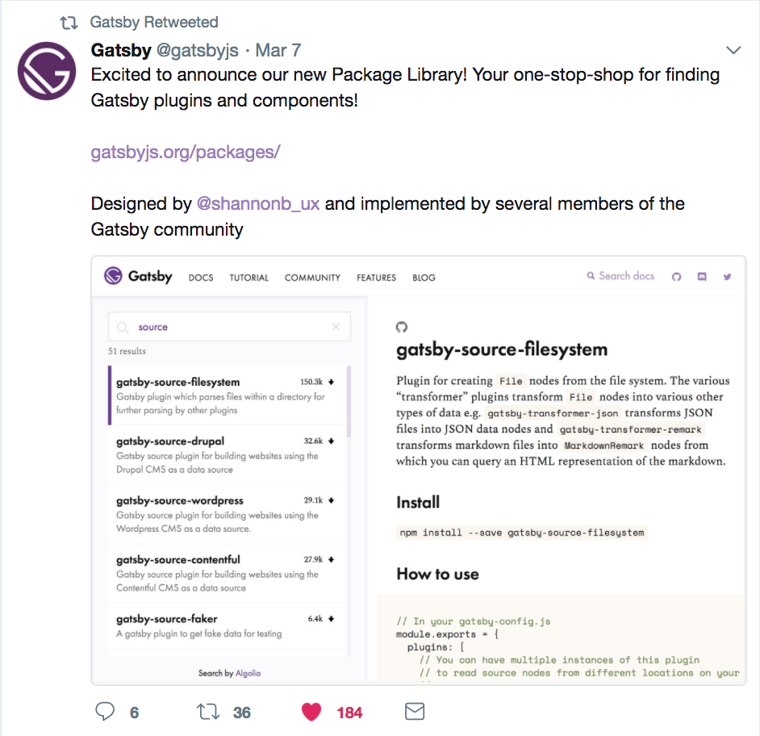
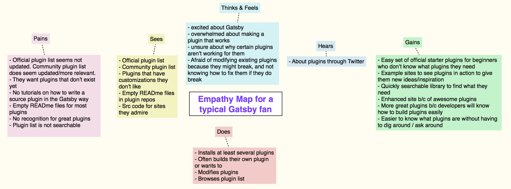

Earlier this week, we launched a [Plugin Library](/packages/) on Gatsbyjs.org and are excited for you to use it! This article explains how UX research drove the design of this library and the accompanying [Plugin Authoring](/docs/plugin-authoring/) doc.

## Why build a plugin / package library

From October 2017 to February 2018, I conducted over 60 interviews with Gatsby users, and plugin discoverability and plugin authoring appeared as top pain points (see [blog post on the Gatsby UX research program](/blog/2017-12-20-introducing-the-gatsby-ux-research-program/) for a full list of pain points).

## Jobs to be done

After compiling data from the interviews, I drew what’s called an “empathy map” to put myself in the shoes of Gatsby users. This map describes what Gatsby users usually experienced when searching for plugins.

This map reflects how it took most people a lot of time browsing through the plugin list and searching example sites to figure out what plugins they need and want. They also frequently mentioned how difficult it was to build their own plugin with no tutorials available.

With the empathy map and the interviews as our guide, we learned that most people want to:

1.  Find the best, most recent, and relevant plugin, library, or component for their site.
2.  Learn how to build a plugin.
3.  Preview plugin functionality before installation.
4.  Share plugins with others.

## Learning from other plugin libraries

Next, we analyzed over 10 admirable and/or popular plugin libraries to draw from their strengths and learn from their weaknesses. Examples, in no particular order, include:

* [JS.coach](https://js.coach/)
* [VIM Awesome](https://vimawesome.com/)
* [Best of JS](https://bestof.js.org/)
* [Sketch extension library](https://sketchapp.com/extensions/)
* [Chrome plugin library](https://chrome.google.com/webstore/detail/plugins/mmcblfncjaclajmegihojiekebofjcen?hl=en)
* [Microsoft Visual Studio Code Extensions](https://marketplace.visualstudio.com/VSCode)
* [Wordpress Plugins](https://wordpress.org/plugins/)
* [Npms.io](https://npms.io/)
* [Yarnpkg.com](https://yarnpkg.com/en/packages)
* [Apple App store](https://www.apple.com/ios/app-store/)
* [Google Play store](https://play.google.com/store/apps/top)

### The goods 👍

We liked when these libraries let users:

* browse plugins without much clicking
* refine searches using categories and tags
* rank plugins based on metrics
* learn how to create their own plugin

### The bads 👎

We _didn't_ like these things in some of the above libraries:

* poor contrast and poor information heirarchy
* limited filters
* too many filters
* low information density

## Prototypes and their evolutions

Here’s a sampling of screenshots that many community members contributed to and gave feedback about. It’s rewarding to see how much the design has progressed (and will keep progressing).

<video controls="controls" autoplay="true" loop="true">
  <source type="video/mp4" src="/images/gatsby-plugin-library-compressed.mp4"></source>
  
Your browser does not support the video element.

</video>

## Next steps for the plugin library

The plugin ecosystem is a huge part of what makes Gatsby awesome because plugins and packages make Gatsby extensible. There's a virtuous cycle where people find plugins, use them, contribute to them, and create new ones. We hope to accelerate this cycle, so the Gatsby ecosystem can develop faster and more people can build awesome sites!

Here are some ways you can help make the Gatsby plugin ecoystem great:

* Share feedback on the plugin library on [Github Issue #4394](https://github.com/gatsbyjs/gatsby/issues/4394).
* If you created a plugin and it's not showing up in the library, double check that the package has "gatsby-plugin" in its keywords.
* Create plugins (or publish ones you've already built)! If you're interested, the [Plugin Authoring](/docs/plugin-authoring/) page can help.
* [Contact me](https://twitter.com/shannonb_ux/status/938551014956732418) here if you have feedback that differs from or provides deeper insight into one of the pain points this article mentions.
* Follow us on [Twitter](https://twitter.com/gatsbyjs).

## Sneak peak into the next UX project

Our next UX project is designing and building a [Gatsby site showcase](https://github.com/gatsbyjs/gatsby/issues/4392). Please contribute to and subscribe to the issue to help out!

Again, many thanks to all the community members who have contributed to this research and to making Gatsby awesome. Stay tuned for updates on the plugin library and future Gatsby UX research projects!
