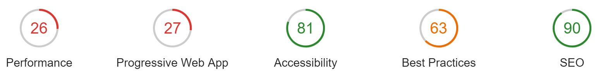
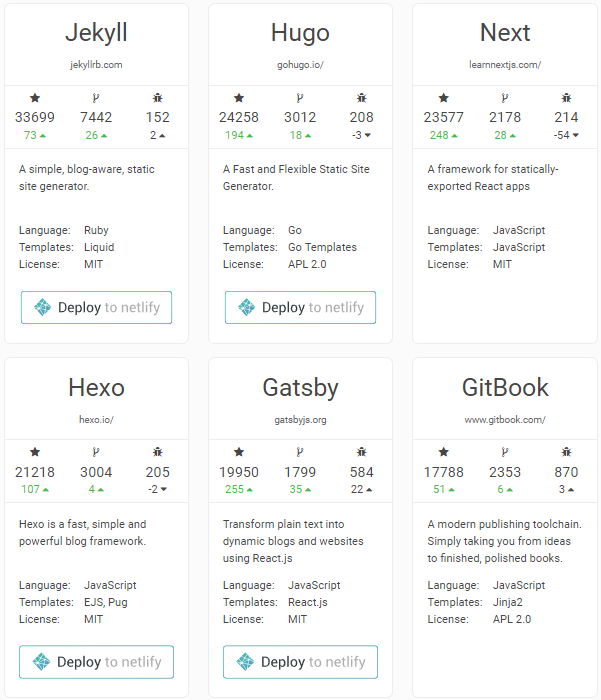
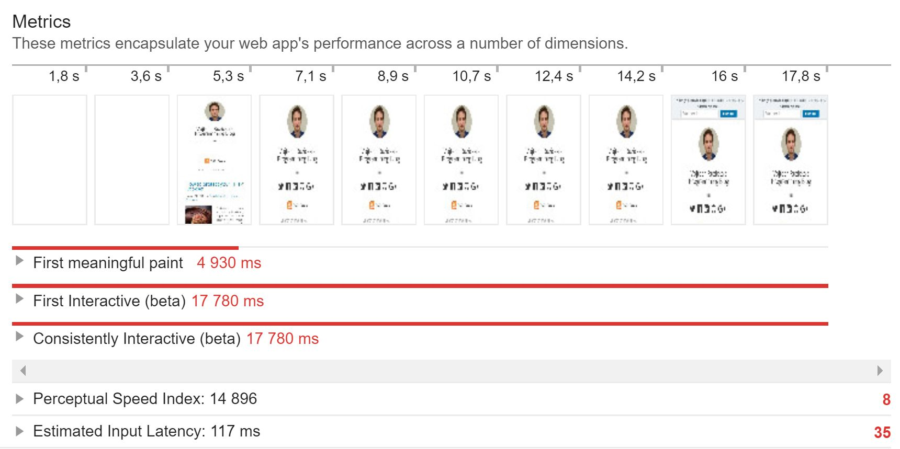
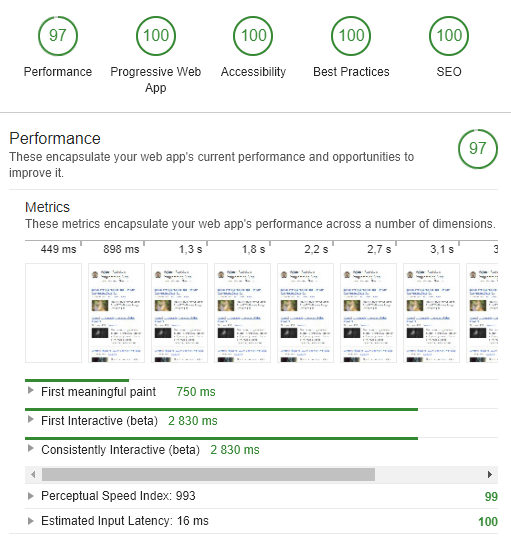

How and Why I migrated from WordPress to static JAM Stack site built with Gatsby JS.

## Before

When I started my blog back in 2016, I wanted to focus as much as possible on creating content rather than
creating the blog infrastructure. Of course there the siren's call to build everything from scratch or spend weeks
researching all the possible platforms — which would, no doubt, be a lot of fun — but I resisted as I wanted to start writing as soon as possible.
I had wanted to start my blog for a few years already so I wanted to reduce the barrier of entry as much as possible.
I knew the most critical part is to build a habit of writing regularly and then I can polish my blog tech stack later.

So WordPress was the obvious choice for me because it is widespread, with a lot of resources and plugins available. And it worked well. More or less. There were issues though. Most notable one was performance. WordPress is sluggish. Especially once you add some plugins.
The results of a [Lighthouse audit](https://www.vojtechruzicka.com/chrome-audit-lighthouse/) were disappointing:

Especially the performance. With such long page load times, many users just leave before the page fully loads. Especially when on mobile and low-quality connections. Another issue is security. With a significant part of web powered by WordPress, it is a target of automated attacks all the time. That means constant fear of losing your precious blog. And it's internal database storing all the content was pretty much a black box for me. And of course, there's cost involved. As I didn't want to manage my installation, keep it updated and in good shape, I paid for hosted solution. Last but not least, Wordpress is built with PHP, which I am not familiar with and it is something I am not eager to learn. That means that any customizations or tweaks are out of the question for me.

Long story short, I decided to get rid of WordPress and replace it with a much more lightweight solution. There was a brief moment where I considered using Medium instead, but I decided I value control of my own content more. After listening to a very inspiring lightning talk by [Ladislav Prskavec](https://twitter.com/abtris/) about JAM Stack, I decided its time to give it a try.

## JAM Stack

JAM is an acronym for **J**avascript **A**PI **M**arkup. What does it mean though? It is not a framework or a specific technology. It is more of an architectural approach. A modern way web content is built, managed and distributed.

Back in the day, the web was just static HTML pages, maybe with some CSS and Javascript on the top. Perfect for static content. However, usually, you need your data to be more dynamic. Instead of static HTML sitting on the server served directly, HTML pages were built on-the-fly when a client requested them. The data dynamically provided from a database. While this is very flexible, it comes at a cost. It's slow. Way slower than just a static site. The application server executes code on demand, needs to contact a database, usually on a different machine, build the page and send it back. The scalability is hard and expensive. When the traffic rises, its more complicated to scale the solution. We're talking load balancing, session replication, distributed caching not to mention difficult RDS scalability. And it's vulnerable. With so many moving parts, the attack surface is extensive. Ranging from Cross-Site-Scripting, SQL Injection to exploiting [security vulnerabilities in your libraries](https://www.vojtechruzicka.com/snyk-detecting-dependencies-with-known-vulnerabilities/).

When you just have static HTML, CSS and Javascript files, it's much harder to compromise your site unless someone gains complete access to your server. Since the content does not change, it is easy to cache. Instead of having just one central server or just a few of them in an expensive and complicated solution, you can use Content Delivery Network to distribute your site. This way you'll have your availability covered and CDN redistributing your files across the globe. Users from New York will be served as fast as users from Tokyo. And if your traffic skyrockets, it is still not a problem. Scalability is easy and cheap if you don't have to manage synchronization of state.

One of the key parts of JAM Stack Architecture is switching to static. That means, using a Static Site Generator to build your site into plain old HTML, CSS, and JS, which does not change and can be served over CDN. If you need to make a change, you just rebuild the whole site. It is fast since most of the site remains the same. Moreover, the deploy takes very little time as it means only copying a bunch of files.

The source content files are usually not HTML, but some templating or markup language (that's M in JAM). For example, you can write all the content in Markdown or AsciiDoc and convert it to HTML at the build time. That's simpler than writing directly in HTML and more secure because of XSS. And even a non-technical person can learn it quickly.

One important part to realize is that static does not mean limited interactivity and static data. The key part is that HTML and JS files served by the server are static. They're not changing. However, you still have JavaScript on the client. You can do everything you do in JS. That means you can fetch any data you need through an API call (usually REST or GraphQL) once your static page is loaded. The key difference is that the HTML with dynamic data is not constructed on the server, but rather on the client. Of course, in many cases, your site is really static and no API calls are necessary.

Another key part is that everything is in Git, no database, no App server with configuration, just your code which is built by a static site generator. And everything builds and deploys quickly. That allows you to automate the build and deployment workflow easily. When you make changes in the master branch, it automatically builds the site with your Static Site Generator and just replaces the old static files. That's it. That means easy continuous deployment. And there are services for this.

## GatsbyJS

Alright, JAM Stack is a way to go, no doubt about that. Which of the static site generator to use though? A good place to start is a site called [StaticGen](https://www.staticgen.com/), which contains a nice list of many Static Site Generators. You can filter by language and templates used. And sort by popularity. That's a good way to determine what generators are currently widely used, which is important because it determines community size, resources, and plugins available. Currently, there are 214 generators and the number is constantly growing. So which one should I choose?

There are many factors to consider. Maturity is important as it means a big community, lot of resources, plugins and stable bug-free product. On the other hand, it is often a trade-off between maturity and new features and technologies. Then, of course, there is the language used. If you need to customize the generator and tinker with it, you'll want to use one written in a language you're familiar with. After briefly checking top 5 generators, I declined Jekyll and Hugo as Go and Ruby were not languages I am proficient with. From the remaining generators, Gatsby immediately caught my attention because of its features and modern technologies.

### Modern technologies

Gatsby is built with a lot of interesting technologies. If you are a front-end developer, you'll probably be familiar with most of these, so adoption should be quick. If not, it gives you chance to learn a lot of interesting stuff. Gatsby is powered by React. You'll be able to nicely structure your project to components and use all the existing React components there not specifically developed for Gatsby. For styling, you can attach plain old CSS stylesheet, but Gatsby offers many more choices like SASS, Glamor, Styled Components, Stylus, LESS or Styled JSX. Gatsby is built on top of Webpack. And it can generate offline-ready Progressive Web App and uses GraphQL for querying data.

### Data sources and GraphQL

One of the disadvantages of WordPress is that is tightly couples creation and management of content and serving of the content. While for many users WP may be a nice way to create and manage their content, it is far from efficient for serving it compared to static sites. In contrast, this is one of the areas where Gatsby really shines.

From your React components and templates, you access data (such as blog posts, site title and other metadata) using GraphQL. Unlike other Static Site Generators, the data is not limited to Markdown or some templating language. Gatsby supports many sources. It can handle files in formats such as Markdown, YAML, CSV or XML. What's awesome is that it can connect to sources like Medium or WordPress and load data from there! And because of Gatsby's extensibility and plugin system, it is easy to add more sources. What's great is that from the perspective of your templates it is just a GraphQL query. That means it is easy to switch data sources while your components and templates remain intact. For example, when migrating from WordPress, you can keep your articles in WP, keep creating and updating them there and just use Gatsby to transform your WP site to static one. Then, later you can convert to markdown if you feel like it.

What's really powerful is using GraphQL as the query language. Because when querying structured data, you define what fields are you interested in, you can define order or limit the number of the results. But everything is defined on the side of the client executing the query. You can change your queries and data obtained without modifying the data source. It also means you can query the same source in different ways depending on context.

### Performance

One of the Gatsby's greatest advantages is performance. I mean - performance on top of what you get by switching to a static site generator. Since Gatsby uses Webpack, it allows code splitting by route. That means when accessing a page on your site, the client will download only code and resources necessary for the current sub-page and not the whole bundle. When navigating to another route, it will just fetch what's new. Gatsby also sticks to the Progressive Web App standard. That means your site can behave as a native-like app on mobile and work with a poor connection or even offline. What's more, Gatsby utilizes the [PRPL Pattern](https://developers.google.com/web/fundamentals/performance/prpl-pattern/). That means first push critical resources over HTTP/2 to the client, which is faster than waiting for the browser to download HTML first, parse it and then request additional stylesheets, scripts and resources linked in the HTML. Gatsby first renders static HTML version of the initial route to minimize time-to-interactive. Then in the background, it loads the bundle and initializes a Single Page App. It then starts to pre-fetch resources for the routes linked to the initial page so additional navigation within your site is blazing fast and without reload.

Gatsby also works great with images, which are usually a big hit to site's performance. Based on the screen size and resolution of the client device, it will serve appropriate image size. It supports WebP and can convert your jpegs to progressive jpegs. While the images are loading, it will reserve the space required by the image, so the content of the page is not 'hopping' after image loads. It also replaces the image with a blurred version or monochromatic SVG until it loads - similar to what Medium uses.

## Pitfalls

I think Gatsby is great. I had a lot of fun using it so far and I've learned much in the process. It offers you freedom and flexibility. However, it is not as mature as some of the competitors. This is improving quickly as it is under rapid development. Still, I did encounter some bugs complicating my development. On the other hand, the community was really helpful and supportive. Some of the features, which I would consider standard were not yet available or sufficient such as tags and categories support, pagination or Open Graph metadata. I would also like to see AsciiDoc support instead of just plain Markdown. One of the biggest problems was probably the lack of visual themes. For a long time, there was not any official themes directory. In Feb 2018 [Gatsby Manor was launched](/blog/2018-02-09-announcing-gatsby-manor-themes-for-gatsbyjs/) and now it contains just SIX themes, which are all only ports of [HTML5 UP themes](https://html5up.net/). However, with the current development rate, I am sure more and more plugins will be available out of the box shortly.

## Results

Overall I am really happy with Gatsby and the migration from WordPress. I no longer fear my WordPress will get compromised. Everything is now on GitHub and under version control. It's much more transparent. No longer need of database backups and rollbacks are now easy in case of something goes wrong. Not to mention the possibility of developing new features safely in branches and deploying and testing them separately from the 'production' environment. And no more fees for hosted WordPress. And writing in markdown is also more convenient for me as I don't focus on HTML or visuals when writing but rather on the content.

My blog is now deployed on Netlify CDN, which means the user will be served fast no matter what their geographic location is. The performance gain of switching to static is huge. That means not only fewer visitors leaving the blog because of the slow loading times, but also better page ranking on Google as it favors faster sites. It also favors sites served over HTTPS, which my site now supports thanks to Netlify's [one click setup](https://www.netlify.com/docs/ssl/) and [Let's Encrypt](https://letsencrypt.org/). Now let's go back to the Lighthouse audit score and compare new Gatsby site to my good old WordPress.

### Before

### After

Quite a difference, right? Long story short - Gatsby is great. You should give it a try, especially if you are a front-end developer. And keep watching its development as I am sure we can look forward to even more awesomeness in the future. If Gatsby is not your cup of the, you should still consider switching to a static site generator as the advantages are too good to ignore. To learn more about Gatsby, check out [this curated list](/docs/awesome-gatsby/) of Gatsby-related resources.

_This article was originally published on [Vojtech Ruzicka's Blog](https://www.vojtechruzicka.com/)._
