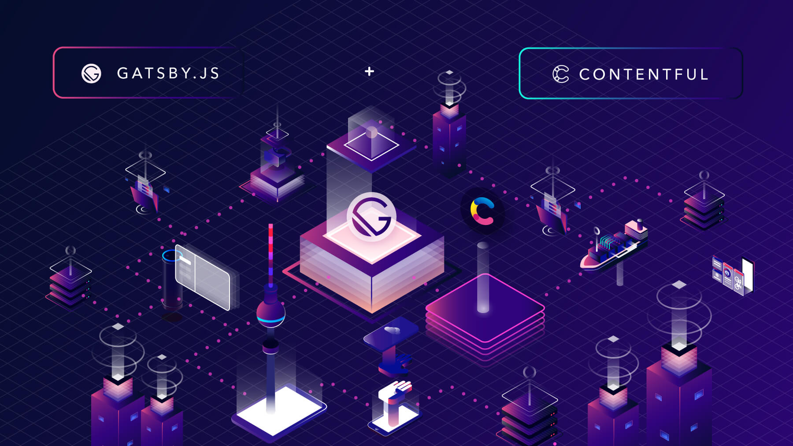
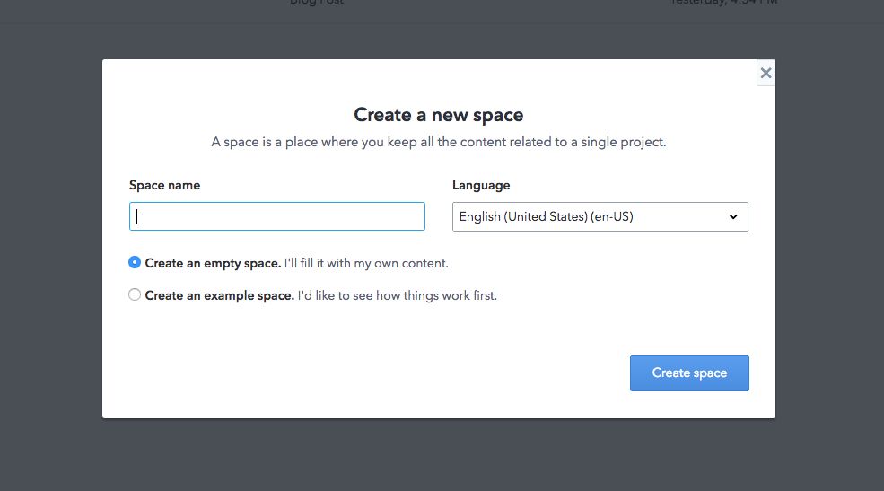
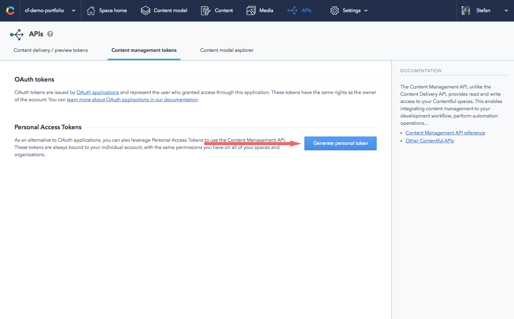
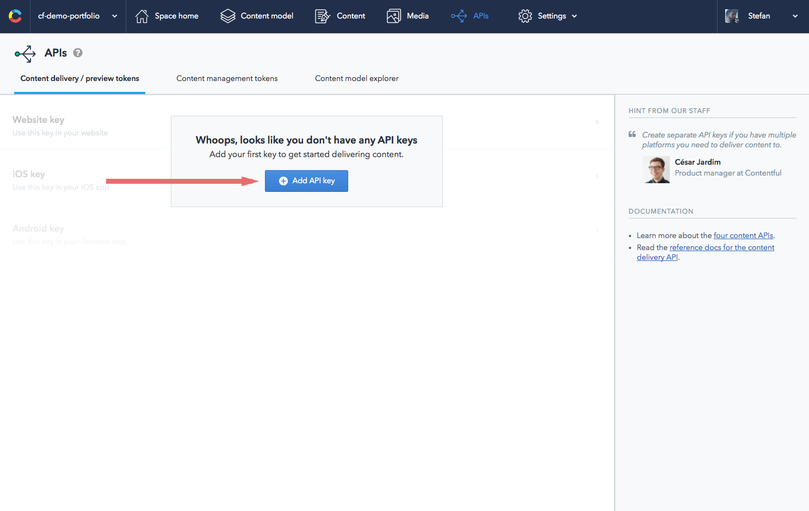

_This blog post was originally posted on the [Contentful Docs](https://www.contentful.com/r/knowledgebase/gatsbyjs-and-contentful-in-five-minutes/)_

Working with React and having an emphasis on speedy performance, GatsbyJS is a promising static site generator that allows you to connect your projects to a variety of APIs and data sources; including Contentful’s content infrastructure.

This piece will walk you through getting your GatsbyJS website up and running with Contentful. Contentful makes it easy for you to focus on developing beautiful, well-performing websites while we deliver the content - this makes us a great companion to the full-fledged static content authoring experience offered by GatsbyJS.

Here’s an overview of what’s involved:

- Create a free Contentful account
- Clone a sample repo
- Create a space on Contentful to store content
- Generate your Content Management and Content Delivery API access tokens
- Import data into your space
- Tweak your configuration file
- Preview a production build
- Publish and go live

###Getting started

This guide assumes that you have [GatsbyJS installed](/docs/) and, optionally, a [Github account](https://github.com/join). You will also need a free Contentful account - [creating one](https://www.contentful.com/sign-up/) only takes a moment.

Start by using this with the Gatsby CLI:

~~~bash
gatsby new contentful-starter https://github.com/contentful-userland/gatsby-contentful-starter
~~~

Alternatively, you can also clone a sample repo from Github:

~~~bash
git clone git@github.com:contentful-userland/gatsby-contentful-starter.git
~~~

And go into the directory and install the required dependencies with:

~~~bash
npm install
~~~

###Create a new space to store content

[A Space within Contentful](https://www.contentful.com/r/knowledgebase/spaces-and-organizations/) serves as a storage area for content that will be used in your website and can be configured to serve specific purposes. Content is described and stored using a data model which we call content types; these are entirely configurable.

Create a new empty space by opening the sidebar menu and adding a Space. Give the space an apt name and click "Create" to go ahead with making it.

###Generate access tokens

Before getting to the exciting part of setting up your website, you first need to generate three access tokens to get your Contentful-powered website up and running by fetching data from the API.

- [Content Management API](https://www.contentful.com/developers/docs/references/content-management-api/)
- [Content Delivery API](https://www.contentful.com/developers/docs/references/content-delivery-api/)
- [Content Preview API](https://www.contentful.com/developers/docs/references/content-preview-api/)

Head over to your Space Settings dropdown menu and navigate to the APIs section. From there, navigate to the tab for the API token you would like to generate.

The Content Management API is used for write access to your space, so keep the generated token safe and private. Hit "Generate Personal Token", give it a name and click “Generate”. Copy the token value and keep it safe and private - this is the only time you’ll be able to view it in your dashboard.

The Content Delivery API provides read-only access to your data and is one of the ways we deliver content to your website. Content is served via our Content Delivery Network (CDN). Click "Add API key" in the Content Delivery/Preview tab area. Grab the Space ID and personal Content Delivery API access token - you’ll need this in a bit.

The Content Preview API works much like the Content Delivery API, except it shows content internally for you to preview and hence does not use the CDN to serve content; since viewing is only limited to you, the previewing user. Creating an API key is the same here as you did with Content Delivery.

###Content model and configuration

Start setting things up with the npm run setup command, which first prompts you for the ID of the empty Space you just created along with the API access tokens for Content Management, Content Delivery, and Content Preview.

After that, it writes the credentials you provided into a file named .contentful.json into lines of code that look like so:

~~~json
{  
   "development":{  
      "host":"preview.contentful.com",
      "spaceId":"...",
      "accessToken":"..."
   },
   "production":{  
      "spaceId":"...",
      "accessToken":"..."
   }
}
~~~

Using the credentials in the .contentful.json file, [content can now be imported](https://www.contentful.com/developers/docs/tutorials/general/import-and-export/) into your space to being displayed on your website via our API.

###It’s ready, let’s publish

Time to check out your new website - preview changes in a local environment by running your project using the npm run dev command. This uses the [Contentful Preview API](https://www.contentful.com/developers/docs/references/content-preview-api/) to show unpublished content as if they were already published - perfect for a development or staging environment.

If you like what you see, use the npm run build command to start a static production build of your near-ready website and put it on a static host of your choice. After that, the npm run deploy command allows you to publish what you have on the production build onto GitHub pages.

###Deployment

Your static files can then be deployed on a variety of platforms of your choice, like [BitBalloon](https://www.bitballoon.com/) and [GitHub Pages](https://pages.github.com/). Take your pick. Contentful gives you infrastructure for the content in your stack, that matches your modular and agile way of working with platform independence and by serving as a layer in your stack.

Contentful ensures your website and its users can access your content quickly and reliably. Your content is just an API call away.

###Summary

###Summary

That’s a quick overview of how to get your website up and running from scratch using Contentful and GatsbyJS.

Contentful's platform offers speed, flexibility, and ease of integration with your code, supporting any stack you use with SDKs for common languages like [Javascript](https://www.contentful.com/developers/docs/javascript/sdks/), [Python](https://www.contentful.com/developers/docs/python/sdks/), and [PHP](https://www.contentful.com/developers/docs/php/sdks/). Unlike a CMS, Contentful provides you with separation between content and presentation, allowing you to focus on developing your website and leave content delivery to Contentful. 

If you're curious to learn more about Contentful, you can check out the Contentful [Developer Center](https://www.contentful.com/developers/docs/) to learn more on how the technology works, or head over to the [Guides and tutorials](https://www.contentful.com/guides/) section. 
