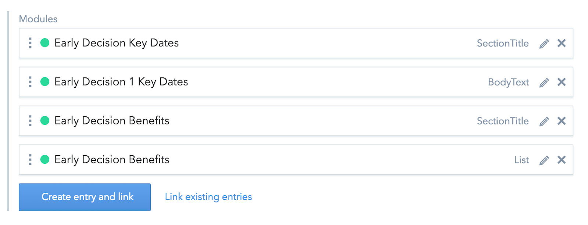
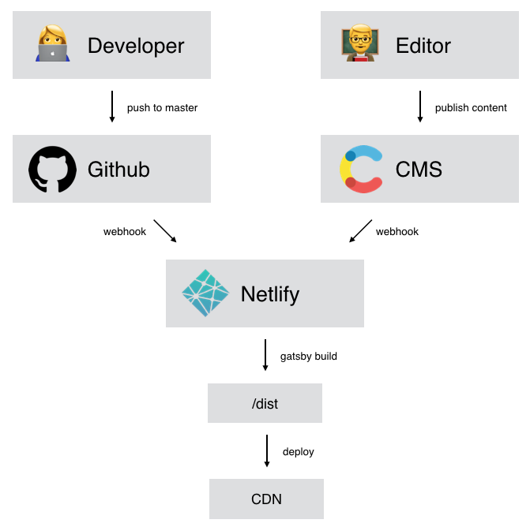
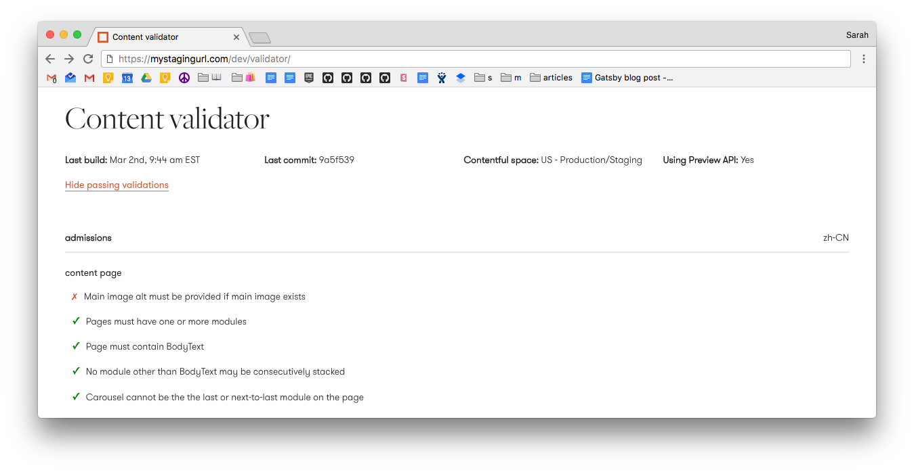
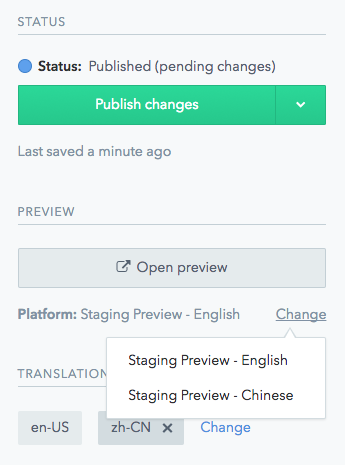
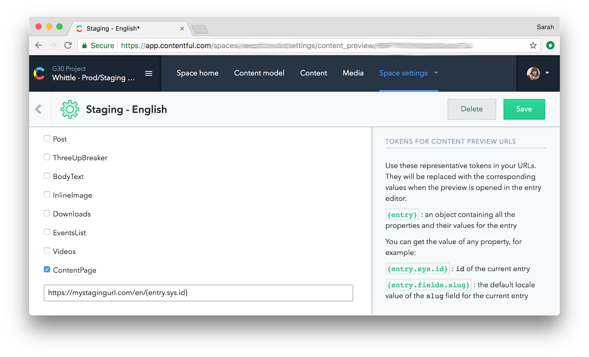
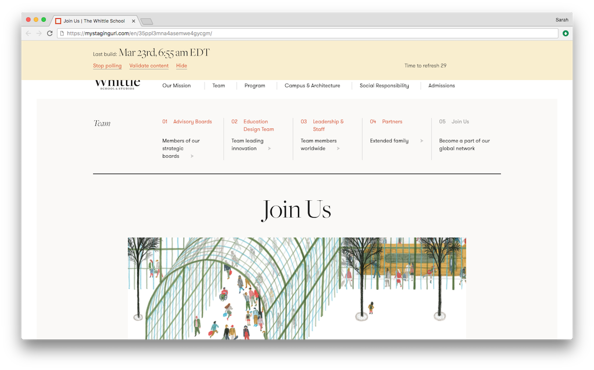
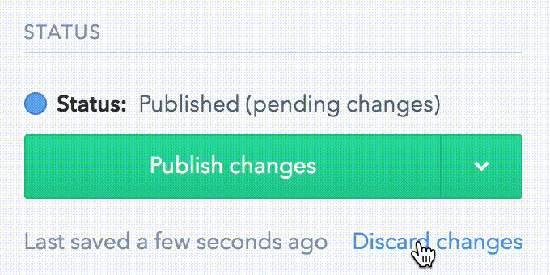
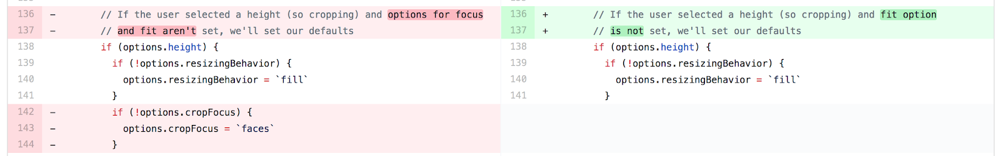

As a developer, it’s always exciting to try something new. When working with a technology for the first time, I usually ask myself two questions: What can this do for me now, and what will it bring to my future projects?

Most recently, I had the opportunity to lead the first Gatsby project at Work & Co. [Work & Co](https://work.co) is a digital product agency. Our goal is to design and develop engaging user experiences, ranging from websites to mobile applications to e-commerce platforms to chatbots.

Our project was to build a new website for [Whittle School & Studios](https://www.whittleschool.org/en). Whittle is an innovative educator that will soon open campuses in the United States and China.

<video controls="controls" autoplay="true" loop="true">
  <source type="video/mp4" src="./whittle.mp4"></source>
  <p>Your browser does not support the video element.</p>
</video>

We had a blast building the site, and learned a lot about Gatsby in the process. This post will take you through the different parts of our journey:

* [Choosing a stack](#choosing-a-stack)
* [Creating a Gatsby workflow](#creating-a-gatsby-workflow)
* [Contributing to Gatsby](#contributing-to-gatsby)

## Choosing a stack

### Requirements

We started the project with two key requirements:

#### 1. CMS-powered content

As a content-heavy site, the project would need a CMS. Our choice here was [Contentful](https://www.contentful.com/), a tool we’d used successfully on a few other products. We set up three Contentful spaces — for development, QA, and production/staging — with scripts to copy models and content between spaces as needed.

#### 2. Static site generation

We also knew that the site would eventually need to launch in both the US and China. This came with a bunch of unknowns on the China side of things: Could we rely on the same build system and CDN for all locales, or would China require a unique setup to account for server performance discrepancies and possible API restrictions?

We didn’t know, and we weren’t going to know for some time, because most of these decisions were going to be made by an external vendor. Not wanting to back ourselves into a corner, we decided to use a static site generator. No matter what devops we wound up with, we could bank on compiling static files and putting them _somewhere_.

All of this begged the question: “What’s a good static site generator that works with Contentful?”

### Enter Gatsby

I’d already heard a bit about Gatsby, and as I looked into it further, I noticed a few things that got me really excited:

#### Old friends

Gatsby is built on React, something our team already knows and likes. We use React (or React Native) for most of our projects at Work & Co because we love the declarative syntax, lifecycle hooks, and modular architecture. In addition to React, Gatsby is compatible with several modern CSS strategies, including our favorite: CSS Modules.

#### Prefetched pages ⚡️

When we decided to use a static site generator, we assumed we’d be building a classic _static site_, with each route change requesting brand new HTML from the server. For a small, simple site, we thought this was good enough, but Gatsby gave us one better: pre-fetching, out of the box. This meant that our site would feel like a single page app while still benefiting from the flexibility and improved performance of a static site.

#### Contentful support

Gatsby’s [`using-contentful`](https://github.com/gatsbyjs/gatsby/tree/master/examples/using-contentful) sample project made it very easy to get started with the [`gatsby-source-contentful`](https://github.com/gatsbyjs/gatsby/tree/master/packages/gatsby-source-contentful) plugin. The code demonstrated how to generate dynamic URLs and support multiple Contentful locales, which was exactly what we wanted to do!

#### GraphQL

Getting to play with GraphQL was a definite plus (I’d been jealous of coworkers using it on other projects!), and the built-in GraphiQL query constructor helped us all get used to the syntax. GraphQL was a natural fit for traversing Contentful relationships, and Gatsby’s implementation allowed us take advantage of the Contentful image API to automatically crop our assets.

### Putting it all together

As I mentioned, Gatsby’s [`using-contentful`](https://github.com/gatsbyjs/gatsby/tree/master/examples/using-contentful) sample project already took us several steps in the right direction; the only outstanding question was how to support a more complex data structure.

My last project involving CMS integration was [Aldo](https://www.aldoshoes.com), a Work & Co designed and developed e-commerce and content site that launched in 2017. Here, we used a modular CMS strategy, where CMS-driven pages were basically stacks of modules that editors could mix and match.

I planned to use a similar technique for this project; we would have one core content model, a `ContentPage`, and then other models like `BodyText` and `SectionTitle` that could be stacked as children. A `ContentPage` would link to `BodyText` and `SectionTitle` via a `modules` field and have some other non-modular fields as well, like `slug` and `headline`.

Here’s a `modules` field on a `ContentPage` currently in use on production:



Figuring out how to set this up in GraphQL took some trial and error, but we settled on using [inline fragments](http://graphql.org/learn/queries/#inline-fragments).

The GraphQL looks like this:

```
ContentfulContentPage {
  headline
  slug
  modules {
    __typename
    ... on ContentfulBodyText {
      # fields specific to BodyText
    }
    ... on ContentfulSectionTitle {
      # fields specific to SectionTitle
    }
  }
}
```

After wiring up this new architecture, integrating new modules became a straightforward task.

#### Schema

We ran into one schematic limitation working with Gatsby that’s helpful to be aware of at the onset of your project:

[GraphQL](https://github.com/graphql/graphql-js) requires all queried fields to be defined in a schema, and Gatsby generates this schema from your site’s existing data. This means, for example, that if you don’t have a `Carousel` content model on your site right now, but you have a GraphQL query checking for it, the site will fail to build.

The are some really promising discussions on the topic on Github, including an [RFC to refactor Gatsby’s schema generation](https://github.com/gatsbyjs/gatsby/issues/4261), but in the meantime, most users are getting around this issue by creating placeholder content on Contentful (or whatever their data source is) to guarantee a fully built-up schema.

This got the job done in our case, and we augmented the approach by creating a `DummyContentIndex` model on Contentful linking to all placeholder content. (In retrospect, I wish I had picked the a more PC name, like ‘PlaceholderContentIndex` 😉.) Using this approach, we could inform our Contentful scripts to make sure placeholder content was copied to the production environment during deploys, so that new models would not break the build.

### Netlify

While we were getting familiar with our Gatsby/Contentful setup, we also needed to figure out how to build and deploy our work. We found several articles advocating for a Gatsby-Contentful-[Netlify](https://www.netlify.com/) stack, and learned it could support a workflow like this one:



Unlike a single page app, which would fetch data from Contentful on the fly, our static site must rebuild anytime an editor publishes new or updated content. At the same time, we need to rebuild whenever code is updated on Github. With Netlify (and Contentful’s webhooks), I was able to set all of this up in about five minutes.

Although our China setup was still a bit of a mystery, we moved forward with dev, QA, and staging environments on Netlify, and wound up using it for US production as well.

Netlify exceeded our expectations; it solved our immediate workflow needs, and also automatically created builds for all remote branches and PRs. This is especially helpful at a company like ours where we often want to share WIP links with our design team to get feedback on our implementation.

Gatsby’s [`gatsby-plugin-netlify`](https://github.com/gatsbyjs/gatsby/tree/master/packages/gatsby-plugin-netlify) also helped us out here with its [redirect support](https://github.com/gatsbyjs/gatsby/tree/master/packages/gatsby-plugin-netlify#redirects); any redirects we wrote using Gatsby’s `createRedirect` action were automatically deployed to Netlify’s `_redirects` file so they would function the same way during local development as they did on Netlify.

## Creating a Gatsby workflow

### Dev pages

Building off of Gatsby’s Contentful example, we were able to easily support dynamic urls and one level of nesting, so a page with the slug `my-page` whose parent had the slug `my-parent` could have the path `/my-parent/my-page`.

This worked so well that at first I was sure we wouldn’t even need to create any pages with static urls, but these wound up coming in handy for development and testing. We settled on a structure like this:

```
|-pages/
  |-dev/
    |-article-components.js
    |-home-components.js
    |-validator.js
```

We used our static pages for three purposes:

#### 1. Pre-integration QA

We dropped our stateless components into paths like `/dev/article-components` so our QA team could make a first pass on our UI implementation. Later, other team members would integrate these components into Contentful, where they could be tested against real data.



#### 2. Contentful validation

Contentful’s built-in validations could only take us so far, and sometimes we needed to enforce rules (or give recommendations) outside the scope of what Contentful could do. For example, when stacking modules on a page, we consider it a minor validation error for the page to end in a carousel (they look kind of lonely).

To enforce such validations, we set up a static validator page that runs a report on all of our Contentful articles.

#### 3. Communicating site status

That same validation page also served as a site status page, containing the time and Github hash of the last build. The build time was particularly important. Since builds happen quite frequently (whenever content is updated), it’s helpful for the team to be able to easily see the time of the last build for a given environment. (We also had Netlify integrated to Slack, but this contained notifications about every branch and was a bit noisy for a less tech-savvy audience.)

Capturing this information was easy and only took a few additional lines in our `createPages` hook. Netlify exposes a lot of interesting [environment variables](https://www.netlify.com/docs/continuous-deployment/#build-environment-variables) (including some I hope to play with more on a future project, like `WEBHOOK_TITLE`, which can help you deduce the origin of the current build). In order to display these variables on the front end, we needed to rename them to begin with `GATSBY_`:

```
exports.createPages = () => {
  ['COMMIT_REF', ‘BRANCH’]].forEach((variableName) => {
    // only variables beginning with GATSBY_ are available client-side
    process.env[`GATSBY_${variableName}`] = process.env[variableName];
  });
};
```

After that, we just added one more variable to store the current time:

```
process.env.GATSBY_BUILD_TIME = Date.now();
```

#### Covering our tracks

We filtered out our dev pages in production by adding a simple `onCreatePage` hook to our `gatsby-node` file:

```
exports.onCreatePage = ({ page, boundActionCreators }) => {
  if (process.env.GATSBY_ENV === ENV.PRODUCTION) {
    const { deletePage } = boundActionCreators;
    if (/^\/dev\//.test(page.path)) deletePage(page);
  }
};
```

### Staging

A lot of our modules include many different properties coming together to form an intricate design, so it’s important to offer editors a chance to preview their changes before they’re published on production.

#### Contentful Preview API

We use Contentful’s Preview API, which `gatsby-source-contentful` [supports](https://github.com/gatsbyjs/gatsby/tree/master/packages/gatsby-source-contentful#using-preview-api), for this purpose. To set this up, we also needed to add a new webhook just for our `staging` branch on Netlify and wire this up on Contentful.

#### Generating preview links

Contentful’s [Content Preview](https://www.contentful.com/r/knowledgebase/setup-content-preview/) feature allows developers to expose preview links in the sidebar, so editors can easily move between editing an entry and previewing its content on a staging environment.

Here’s how preview links look in action:



The Content Preview dashboard lets developers create these links and determine where each of them will lead.



Here, we’re configuring Contentful to expose a preview link for every `ContentPage` containing its Contentful ID in the path, so an entry with the ID `123` would have the URL `mystagingurl.com/en/123`. To support Chinese, we wired up an additional preview link in the format `mystagingurl.com/cn/123`.

**Note:** Contentful lets you generate preview links for as many model types as you like, but in our case, we only needed to generate preview URLs for our `ContentPage` model. Since all other models are displayed inside of `ContentPage`s, we determined that viewing a `BodyText` module all on its own would have no value.

#### Building staging URLs

Backing up a second, let’s review why we selected the preview URLs `mystagingurl.com/en/123` and `mystagingurl.com/cn/123`. Our staging environment — like all of our environments — already has all of the pages deployed at their actual paths (eg `/en/my-parent/my-parent`), so why can’t we just point editors there?

Here’s why: Contentful’s Content Preview dashboard doesn’t give you that kind of flexibility. To get around this, we opted to build special paths just for the staging environment. Here’s how we set it up in `gatsby-node.js`:

```
// Always create a page at the regular path
createPage({
  component: contentPageTemplate,
  context,
  path: `${language}/${slugs.join('/')}/`,
});

// On staging, recreate the page with a path corresponding to its ID
if (process.env.GATSBY_ENV === ENV.STAGING) {
  createPage({
    component: contentPageTemplate,
    context,
    path: `${language}/${id}/`,
  });
}
```

#### Build times

So now, we have Contentful’s preview links wired up to display the current entry in the staging environment, with data provided by the preview API. This is great, except that if an editor makes a change and immediately clicks on “Open preview” on Contentful, they’ll see old data — our static site is still building!



To solve this, we added a small overlay to all staging environment pages including the time of the last build, plus some code to automatically refresh the page every 30 seconds. When the page refreshes to reveal an updated build time, editors can click “Stop polling” to disable this functionality, and “Hide” to minimize the overlay.

#### Final thoughts

Our staging setup wasn’t perfect: Contentful’s Preview API felt a little clunky, and its “Discard Changes” button didn’t always work, with the “pending changes” status sometimes persisting... forever.



For editors, it wasn’t always clear what was live and what wasn’t. On future projects, I hope to experiment with a similar approach using separate Contentful spaces, like we had for our dev and QA environments.

## Contributing to Gatsby

Going into this project, I had one open source contribution to my name: an update to [poltergeist](https://github.com/teampoltergeist/poltergeist)’s key modifiers circa 2015. Sure, I felt a little guilty for using so many open source libraries without giving back to the community, but I also worried I didn’t have the time or — more importantly — the confidence to get more involved.

Something clicked with Gatsby, though; it was young enough that I could see concrete areas for improvement, but established enough to have the tools and structure in place to facilitate contributions. Kyle and the rest of the community were also great resources, providing quick feedback and helpful ideas for improvements.

### Starting small



If you’re nervous about contributing to a library, do what I did: make a really small change, and write a really long explanation about it :). [My first Gatsby PR](https://github.com/gatsbyjs/gatsby/pull/2917) removed three lines of code that I determined were overriding Contentful’s default image cropping. It was a low-pressure change that nevertheless helped me feel like part of the community.

### Reading the documentation

We developers often take pride in how far we’re able to get _without_ reading the documentation — at least I know I do — but, as I came to make subsequent PRs to Gatsby, I found the [contributor guidelines](https://github.com/gatsbyjs/gatsby/blob/master/CONTRIBUTING.md) to be incredibly helpful.

In particular, the documentation will show you how to use your local Gatsby clone and [gatsby-dev-cli](https://github.com/gatsbyjs/gatsby/tree/master/packages/gatsby-dev-cli) to:

* Watch for your local changes to Gatsby packages
* Recompile packages on-the-fly
* Copy these packages into your project’s `node_modules` folder to test as you go

If you’ve ever used `yarn link` to modify a dependency locally, this provides a similar experience.

### Branching off

As I said, I was impressed by the Gatsby team’s quick turnaround time with PR approvals, but even so, when doing client work on a tight deadline, it can be stressful waiting for your changes to be merged. For ultimate peace of mind, you should be able to move forward using your forked work even if — in the worst case scenario — your PR is never approved.

Of course, this is something developers do all the time. They push their fork to git and link to it in their project’s `package.json`:

```
“dependencies”: {
  "some-library": "git+ssh://git@github.com:workco/some-library.git#cool-feature"
}
```

Gatsby, however, uses a monorepo architecture, so pushing up a fork with a change to a specific package is not such a trivial manner; npm and yarn just don’t support it. (If you feel like being depressed, check out the npm thread about [supporting github paths to monorepo packages](https://github.com/npm/npm/issues/2974).)

Our workaround was to create a new repo for the package in question and push the build directly to Github. Here’s how it would work if you were making an update to, say, `gatsby-source-contentful`:

* Go to your local fork of Gatsby, on the branch with your changes, and run `yarn watch` to compile a built version of your modified package.
* Copy that package to a new directory `cp -a packages/gatsby-source-contentful path-to-my-repo`
* Push the contents of this directory to Github and link it in your `package.json` as usual.

## Following up

Overall, our work with Gatsby was an exciting venture into a young, promising library, and I look forward to using it again on future Work & Co projects. I’m by no means an expert on Gatsby, Contentful, or Netlify — my goal is to share experiences others could draw insights from — so if you have any feedback or questions related to our approach, I’d love to hear from you [by email](mailto:mogin@work.co).
