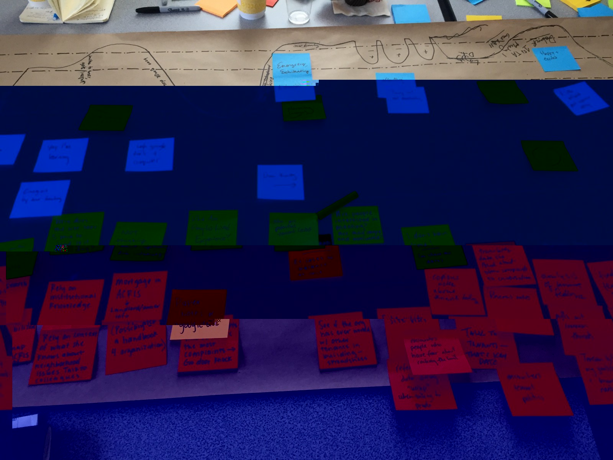
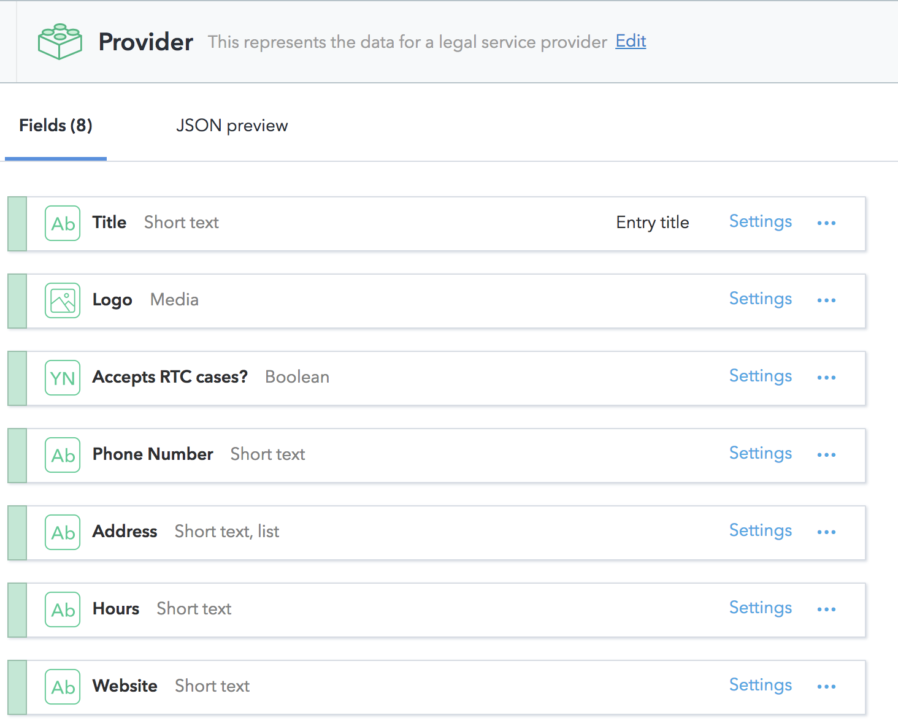
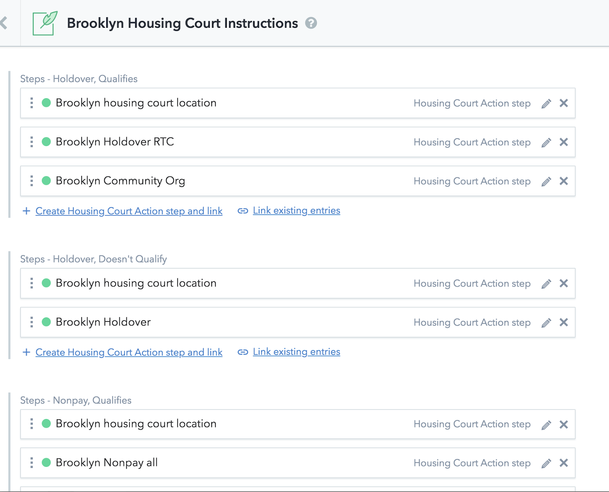
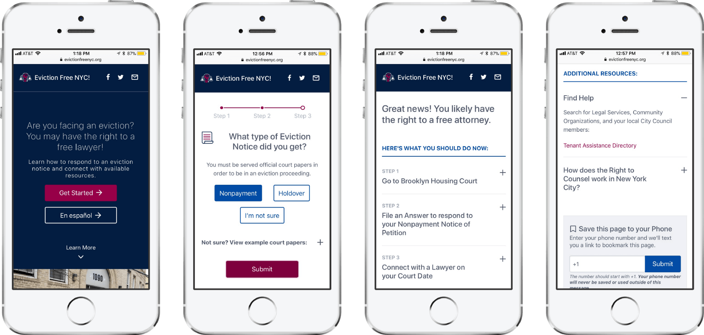

On March 29th, we launched [Eviction Free NYC](http://www.evictionfreenyc.org/) with the [Right to Counsel Coalition](https://www.righttocounselnyc.org/) as part of a campaign to educate tenants living in affordable housing on their legal rights and how to navigate the daunting process of receiving an eviction notice.

In order to build this new resource we applied a [human-centered design process](https://medium.com/@JustFixNYC/co-designing-eviction-free-nyc-b54570c69153) followed by specialized technical scoping in order to determine what was best for our users and build something for this unique context. **That process led us to using GatsbyJS, Contentful, and Netlify!** Below, we've written up how we mapped design to dev, approached different stakeholders, and utilized Gatsby's great flexibility & plugin library.

#### **Mapping Design Considerations to Technical Scoping**

*Journey mapping for a tenant organizing process!*

We started this process with a pretty strong sense of our average user’s
technical capacity and degree of comfort in using a website or app. For the past
3 years, we’ve been collecting user insights from the [JustFix.nyc Tenant
Web-App](https://www.justfix.nyc/) and other resources. As you might imagine,
the majority of our users are coming from mobile devices (**over 95% of
low-income Americans now have a device that connects to the Internet**) and
usually do not have a very fast connection to the Internet. We learned from
user-testing in Housing Court that there is usually little-to-no cell
reception in the building. We also knew that internationalization (i18n) and
language localization would be a launch requirement. Previous analytics from the
Tenant Web-App also informed us to account for older browsers such as Internet
Explorer 11, given that many older users and nonprofit employees still use it.

For coalition members, the site needed to be incredibly adaptable and easily
managed from a [Content Management
System](https://en.wikipedia.org/wiki/Content_management_system), or CMS. The
RTC policy and coverage areas change on an almost daily basis, and thus required
a content modelling system that would prevent the site from quickly becoming
outdated. We also wanted to utilize this system to make it easy for new
languages to be added and maintained with as little technical knowledge as
possible.

#### **Our solution: GatsbyJS**

We knew that we would build the site in [React](https://reactjs.org/).
Developers can build websites quickly and reliably through its modular
architecture and extensive system of third-party components. React’s simple
component-based philosophy creates code and structure that just *makes sense*,
allowing other developers to more easily contribute to the project as well.
It’s also unobtrusive enough that it can be applied to both large and small web
development projects.

From there, we looked for different scaffolds that would help us get
up-and-running quickly. While we’re big fans of
[create-react-app](https://github.com/facebook/create-react-app) and have used
it on other projects, due to an aggressive project timeline, we needed something
that provided a more “out-of-the-box” solution. We wound up building the site in
GatsbyJS, which is a **React-based static site generator**. GatsbyJS is the
perfect fit for a number of reasons:

1.  [Static sites](https://en.wikipedia.org/wiki/Static_web_page) load content much
more quickly than dynamic web applications, which require multiple
back-and-forth calls to a server in order to display the final composited view
to the user. They are more easily adaptable for low connectivity / offline
functionality for this reason. This allows us to provide a faster and more
reliable experience for tenants utilizing the service.
1.  GatsbyJS ships with an incredible amount of pre-handled optimization features,
from prefetching resources to progressive image loading to inlining code blocks
so they don’t need to be fetched via
[AJAX](https://en.wikipedia.org/wiki/Ajax_(programming)). There was no way we
could have achieved this level of optimization on our own in this timeframe.
1.  A growing plugin library that allows for easy integrations that utilize Gatsby’s
GraphQL data query system. With these we could easily use things like
[gatsby-source-contentful](https://www.gatsbyjs.org/packages/gatsby-source-contentful/?=conten)
and [gatsby-plugin-i18n](https://github.com/angeloocana/gatsby-plugin-i18n).
1.  A growing community of developers sharing resources and best practices. Credit
is due to [mccrodp](https://github.com/mccrodp) for setting up
[gatsby-starter-contentful-i18n](https://github.com/mccrodp/gatsby-starter-contentful-i18n),
a boilerplate that synced Contentful and i18n features together and allowed us
to hit the ground running.

#### **Using Contentful**

[Contentful](https://www.contentful.com/) is a “headless” [Content Management
System](https://en.wikipedia.org/wiki/Content_management_system), or CMS.
Traditional CMS platforms, like Wordpress or Drupal, allow authors and editors
to easily create websites and publish content such as text articles, image, or
video embeds. A headless CMS takes those publishing features (and the easy admin
tools that come with them) and additionally gives you total flexibility as to
how the website itself is constructed.

In previous projects where we used Contentful, content was loaded dynamically
(via AJAX) when a user visits the site. GatsbyJS instead pulls content from
Contentful *as the site compiles* (pre-deploy), not when the user visits it.
This change creates significantly less server requests after page load and
further speeds up the site’s final load time.

With Contentful, you define *Content Models* in tandem with coding individual
pages in order to construct the structure of the site and its content. For
Eviction Free NYC, some sample *Content Models* are **Providers**, **Housing
Court Action Steps**, and meta-level page models, such as **LandingPage**.

*An example of the Provider content model*

As GatsbyJS compiles the site (either in dev or building for production), it
will pull content from Contentful and make it available via GraphQL. A file’s
GraphQL `pageQuery` will then populate your React component’s `props` with the
corresponding data, creating an incredibly simple pipeline from content → code.
As an example, here’s the provider portion of a sample `pageQuery`:

    providers {
      title
      acceptsRtcCases
      phoneNumber
      website
      hours
      intakeInstructions
      address
      logo {
        resolutions(width: 100, height: 100) {
          aspectRatio
          width
          height
          src
          srcSet
        }
      }
    }

#### **Challenge: Hyper-personalized result pages in a static site**

When a tenant goes to Eviction Free NYC, they answer a simple questionnaire that
determines a results page. It's tailored to their borough’s housing court
(including information about room numbers and different parts) and factors in
their eligibility for legal representation as well as different types of
eviction proceedings. **This level of personalization is difficult to achieve in
a static site and manage in a CMS.** We wound up finding a solution that gave us
flexibility and reuse of content while preserving the static page nature of
GatsbyJS.

The four variables for generating these pages were language, housing court, case
type, and eligibility. A quick calculation gave us the basic number of result
pages:

> **2 languages x 5 different housing courts x 3 different case types x (y/n)
> eligibility = 60 static results pages**!

This doesn’t include additional pages we built afterwards to account for NYCHA
tenants and other situations. Here’s an example of what this looks like in
Contentful:

There are 6 potential pathways that a user could be taken (seen above as
Holdover, Qualifies; Holdover, Doesn’t Qualify, etc) per housing court. These
were represented as *arrays of references* to Housing Court Action Steps, which
are in turn represented in Contentful as editable Markdown snippets. This system
allows for steps to be reused (see “Brooklyn Housing Court location” above) and for
third-party content, such as Google Maps, to be embedded in the steps. To
reorder a step or change a part of the process for a specific court or case
type, you can simply drag-n-drop things in Contentful!

From there, we had to teach GatsbyJS how to properly render each page based on
pathway. We did this by implementing the `createPages` function in the [Gatsby
Node API](https://www.gatsbyjs.org/docs/node-apis/). For each Housing Court Page
(also per language!), Gatsby creates 6 different pages based on the pathways.
While our solution had to account for some [limitations in
GraphQL](https://github.com/facebook/graphql/issues/414), everything wound up
working as needed.

Feel free to [explore the source
code](https://github.com/JustFixNYC/eviction-free-nyc) to get a better sense of
how all this works!

#### **Wrapping everything up: using Netlify**

When it came time to deploy, we were very excited to try out a new hosting
platform called [Netlify](https://www.netlify.com/) that we’d been hearing a lot
about. It has a great free tier and is perfect for hosting static sites. We
simply linked Netlify to a branch in the Eviction Free NYC GitHub repo and it
compiles and deploys the site with each push. It simplifies HTTPS certificate
generation and even includes a system for deploying AWS Lambda functions, which
we used to ship a small Twilio integration for the site's “Save to Phone”
feature. *(note: we’re actually still using the original
*[Serverless](https://serverless.com/)* solution, but this code is in the repo
as a to-do)*

The best feature of Netlify is its ability to utilize build hooks. This allows
us to trigger a new site build when someone edits or adds content from
Contentful. Contentful’s [webhook](https://en.wikipedia.org/wiki/Webhook)
functionality will fire an event when content is edited or published. Once you
link the two together, Netlify will receive the event, rebuild the site, and
deploy everything. Done!

*Mobile comps for Eviction Free NYC*

#### In Conclusion

The technical process for building the site went by incredibly fast — this all
came together in a little over a month! Despite the frenzied speed, we created a
valuable new service that also acts as a launching pad for future feature
development and refinement. **It’s already been used by over 1,000 people in the
past few weeks!** We’re really excited for this site to grow and develop as
tenants take advantage of this historic new right.

**Footnote: Our code for [evictionfreenyc.org](http://www.evictionfreenyc.org/) is
open source! [Click
here](https://github.com/JustFixNYC/eviction-free-nyc) to view the code on
github.**
