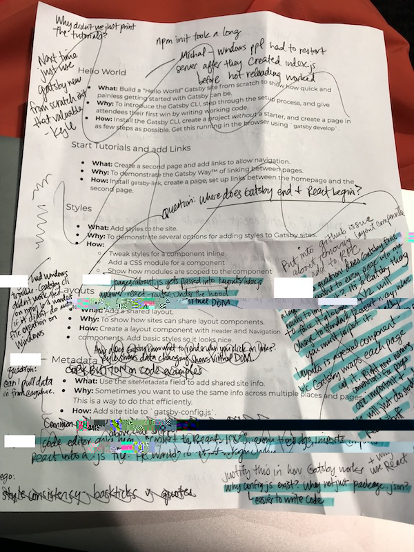
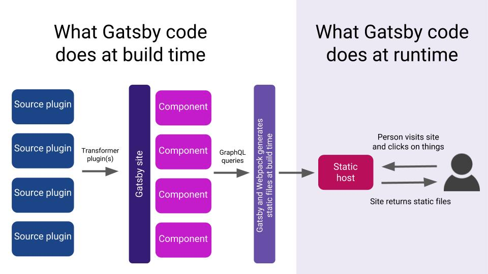

In April and May, we hosted 2-day Gatsby workshops in both San Francisco and NYC and want to share what we learned and resources you can use to host your own Gatsby workshops. A big thank you to all the developers who came to these workshops, and another big thank you to Ryan Florence for organizing the workshop logistics; check out his company's website at [workshop.me](https://workshop.me/). Ryan has been an awesome supporter of Gatsby and a longtime fan, so yes, the workshop.me site is built on Gatsby :).

We will keep improving these workshops and hope you'll help us do that! Share your ideas and report how these workshops go for you in the [Open source repo](https://github.com/gatsbyjs/gatsby) through issues and PRs (if you ran into problems with the workshops and/or have ideas of how to improve them) or [Twitter](https://twitter.com/gatsbyjs) if you want to share an upcoming workshops you're running.

# What we learned in the first few workshops

Here is a photo of how many notes I took during our first workshop in San Francisco (I crossed out notes as I converted them to issues in GitHub):

And that's just one page of notes (there were many more). The biggest takeaways were:

- People wanted to know how Gatsby works, so we drew this diagram and nearly everyone said it was helpful:

- This diagram helped them understand why adding extra plugins to their Gatsby sites doesn’t slow them down (because plugins do their work at build time, not at runtime)
- People wanted to know how Gatsby works with React and GraphQL, and we’re still working on diagrams to illustrate those concepts
- If React and GraphQL are new to people, they seem to be the most difficult parts of learning to use Gatsby

# New tutorials!

People are interested in tutorials that go beyond the basic [Tutorial](/tutorial/), so we created three new tutorials:

- [WordPress Source Plugin Tutorial](/tutorial/wordpress-source-plugin-tutorial/)
- [Adding Images to a WordPress Site](/tutorial/wordpress-image-tutorial/)
- [Creating a Source Plugin](/docs/creating-a-source-plugin/)

## Why you might want to host a workshop

Here are some advantages that we experienced in the workshops; if these appeal to you, you could consider hosting your own workshop at your work, a meetup, or any other setting that makes sense!

- _Dedicated time and place to learn:_ it’s easier to set aside time to learn something new when you are in a room with other people doing the same thing
- _Quicker problem-solving:_ you can usually get answers to your questions and solve problems faster than you could otherwise
- _Customized content:_ the workshop host can customize the workshop for the group’s needs ahead of time by sending out a survey, and the workshop can shift focus depending on real-time needs and questions of the group and individuals

We'd love to hear how it goes and hope that you'll use the resources below.

# Where to find workshop resources

Please use the following links to find workshop materials in the Gatsby open source repo:

- Survey questions to send out [before](https://docs.google.com/a/gatsbyjs.com/forms/d/1S6diwCjR36VSJod7DGL0ZpESx3KdaNGiB4Szl4hOpg0/edit?usp=sharing) and [after](https://docs.google.com/a/gatsbyjs.com/forms/d/1iKok_QJHSav51_668QneqwxOFOMw_WNDPnX0PdBfUVA/edit?usp=sharing) workshops
- [Introductory slide deck for Day 1](https://docs.google.com/presentation/d/1fQNLvf1C8kj4rY-hVVY5zCsxy0z03gGkiqc-wiHHYhI/edit?usp=sharing), [Introductory slide deck for Day 2](https://docs.google.com/presentation/d/1w_0CGX2DNUDAIDT0MCaCPNqA_0HgamutaECP8kZ3yyI/edit?usp=sharing)
- [Agenda for workshop attendees](https://docs.google.com/document/d/1gn5dk5RkuOXgZatd-Ow4XGqKY1NWZVCaUhyOwrRP0JE/edit?usp=sharing)
- [Step-by-step guide for the workshop host](https://docs.google.com/document/d/1epeLO_7xkbd-WvPDCEZZ8f2GV5uMLHHM_UIhpZxqRbo/edit?usp=sharing)

We hope these workshop materials help you share Gatsby at work, meetups, and wherever else it makes sense. Let us know how it goes and how you customize or modify these workshops!

# How you can contribute

If you'd like to contribute to making workshops and tutorials more awesome, here are a few of the many issues we created in the [Documentation Project](https://github.com/gatsbyjs/gatsby/projects/3) as a result of what we learned in the workshops; contributions welcome! (Note: we used the main [tutorials](/tutorial/) in the workshops, so edits and improvements to the tutorials also improve the workshop)

- _Good first issue_: [Emphasize file names](https://github.com/gatsbyjs/gatsby/issues/5608) with (bold, italics, headers, or some other way) when people copy and paste code, because it’s easy to miss _where_ you’re supposed to paste it with the current format
- _Good first issue_: Make it clear in tutorial part 0 and workshops that all instructions are built assuming that you have installed [VS Code and Prettier](https://github.com/gatsbyjs/gatsby/issues/5610) because those work well with React
- [Add a copy button to code examples](https://github.com/gatsbyjs/gatsby/issues/5030) because people often missed backticks if their screen resolution didn’t make the ticks very visible

We loved hosting workshops and plan to keep developing the resources as we learn. We’re so grateful for the workshop attendees and their feedback.

And just as a reminder: we will keep improving these workshops and hope you'll help us do that! Share your ideas and report how these workshops go for you in the [Open source repo](https://github.com/gatsbyjs/gatsby) through issues and PRs (if you ran into problems with the workshops and/or have ideas of how to improve them) or [Twitter](https://twitter.com/gatsbyjs) if you want to share an upcoming workshops you're running.
