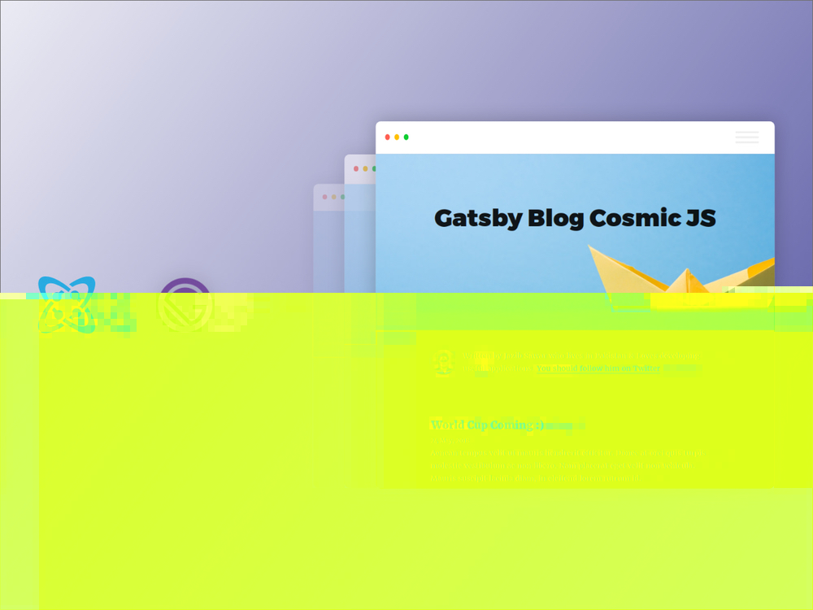
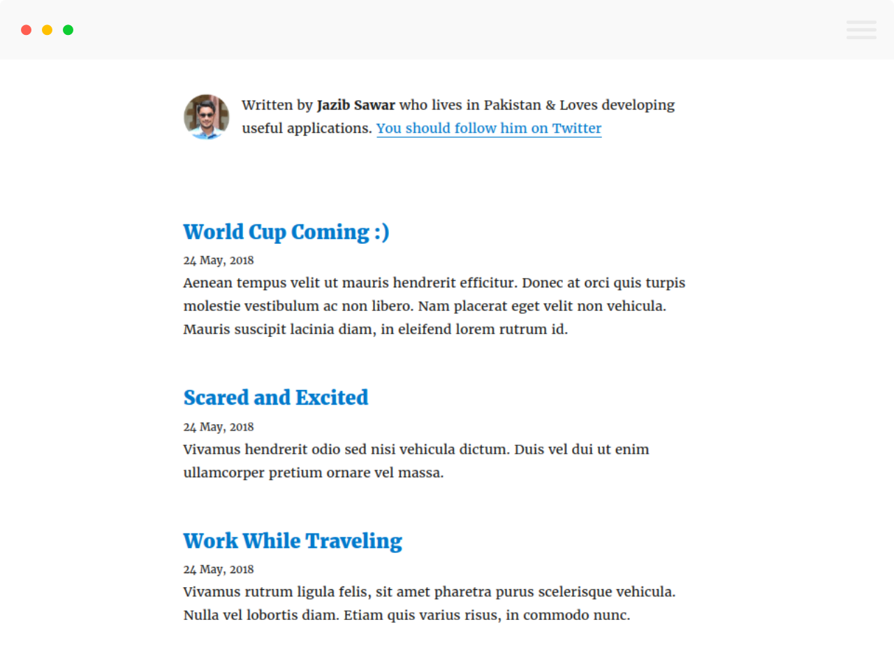
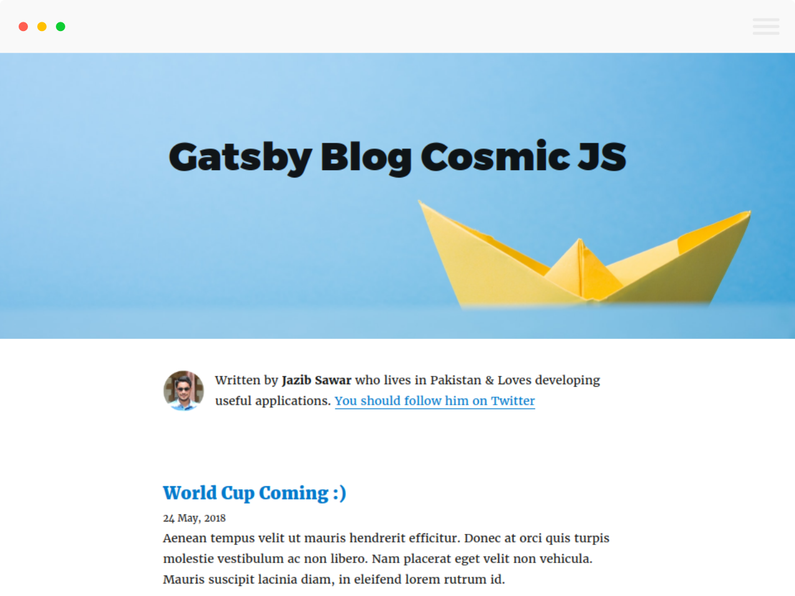

> _This article originally appears on [the Cosmic JS website](https://cosmicjs.com/articles/build-a-gatsby-blog-using-the-cosmic-js-source-plugin-jhzwvr45)_.

In this tutorial, I'm going to show you how to create a simple but blazing fast blog using React, Gatsby, and [Cosmic JS](https://cosmicjs.com).

## TL;DR

[Download the GitHub repo.](https://github.com/cosmicjs/gatsby-blog-cosmicjs)

[Check out the demo.](https://cosmicjs.com/apps/gatsby-blog)

[Check out the Cosmic JS Source Plugin for Gatsby.](https://github.com/cosmicjs/gatsby-source-cosmicjs)

## Prerequisites

This tutorial requires Node.js and npm. Make sure you already have them installed.

## Blog Development

In order to start working on the blog, we first have to set up the environment.

### Install Gatsby and Set Up Your Site

First, install the Gatsby CLI:

```bash
npm install --global gatsby-cli
```

Create a new site based on the Gatsby Cosmic JS starter:

```bash
gatsby new gatsby-blog-cosmicjs
```

Enter in your project's folder:

```bash
cd gatsby-blog-cosmicjs
```

Start the server:

```bash
npm run develop
```

At this point, you can access your Gatsby website by visiting `http://localhost:8000`.

## Install the Cosmic JS Source Plugin

In a static website, data can be consumed from multiple different sources, for example Markdown files, HTML files, and/or an eternal API (WordPress, Cosmic JS, etc).

To make consuming data simpler, Gatsby implements a data layer powered by GraphQL. Very exciting stuff!

To connect this data layer with different data providers, you need to integrate a source plugin. Fortunately, there are many source plugins available for common data sources, and [an API available to create your own](/docs/creating-a-source-plugin/) if necessary.

In our case, we are using [Cosmic JS](https://cosmicjs.com). We need a source plugin to connect data from Cosmic JS to our Gatsby site. Good news: there's already a [source plugin for Cosmic JS](https://github.com/cosmicjs/gatsby-source-cosmicjs)!

Install the source plugin with the following command:

```bash
npm install --save gatsby-source-cosmicjs
```

We're going to use a couple other plugins later, so let's install them here:

```bash
npm install --save gatsby-plugin-offline gatsby-source-filesystem
```

These plugins need some configuration, so let's replace the content of `gatsby-config.js` with:

```javascript
module.exports = {
  plugins: [
    `gatsby-plugin-offline`,
    `gatsby-plugin-react-helmet`,
    {
      resolve: `gatsby-source-filesystem`,
      options: {
        path: `${__dirname}/src/pages`,
        name: "pages",
      },
    },
    {
      resolve: "gatsby-source-cosmicjs",
      options: {
        bucketSlug: "gatsby-blog-cosmic-js", // Your CosmicJS bucket slug
        objectTypes: ["posts", "settings"], // List of the object types you want to be able to request from Gatsby.
        apiAccess: {
          read_key: "",
        },
      },
    },
  ],
}
```

### A couple of notes on this config:

1.  Notice `bucketSlug` is set to `gatsby-blog-cosmic-js`. This is a demo Bucket that includes pre-populated content, so when you [download the GitHub repo](https://github.com/cosmicjs/gatsby-blog-cosmicjs) and start the app, it will display demo content right out of the box. You can also import this demo content into your own Cosmic JS Bucket by going to `Your Cosmic JS Bucket Dashboard > Settings > Apps`, then find and install the Gatsby Blog.
2.  The API read key is optional and can be set after you login to Cosmic JS at:
    `Your Cosmic JS Bucket Dashboard > Settings > Basic Settings`

Now restart the server to apply the updates.

## Posts List & Settings

First, we want to display the list of posts on the homepage. To do so, add the following content to `src/pages/index.js`:

```javascript
import React from "react"
import { Link } from "gatsby"
import get from "lodash/get"
import { Helmet } from "react-helmet"

import Bio from "../components/bio"
import { rhythm } from "../utils/typography"

class BlogIndex extends React.Component {
  render() {
    const siteTitle = get(
      this,
      "props.data.cosmicjsSettings.metadata.site_title"
    )
    const posts = get(this, "props.data.allCosmicjsPosts.edges")
    const author = get(this, "props.data.cosmicjsSettings.metadata")

    return (
      <div>
        <Helmet title={siteTitle} />
        <Bio settings={author} />
        {posts.map(({ node }) => {
          const title = get(node, "title") || node.slug
          return (
            <div key={node.slug}>
              <h3
                style={{
                  marginBottom: rhythm(1 / 4),
                }}
              >
                <Link style={{ boxShadow: "none" }} to={`posts/${node.slug}`}>
                  {title}
                </Link>
              </h3>
              <small>{node.created}</small>
              <p
                dangerouslySetInnerHTML={{ __html: node.metadata.description }}
              />
            </div>
          )
        })}
      </div>
    )
  }
}

export default BlogIndex

export const pageQuery = graphql`
  query IndexQuery {
    allCosmicjsPosts(sort: { fields: [created], order: DESC }, limit: 1000) {
      edges {
        node {
          metadata {
            description
          }
          slug
          title
          created(formatString: "DD MMMM, YYYY")
        }
      }
    }
    cosmicjsSettings(slug: { eq: "general" }) {
      metadata {
        site_title
        author_name
        author_bio
        author_avatar {
          imgix_url
        }
      }
    }
  }
`
```

### Explanation:

At the end of `index.js` file, we exported `pageQuery`. These are GraphQL queries which are used to fetch important information about settings and list of posts.

Then, we pass the `{ data }` destructured object as parameter of `IndexPage` and loop on its `allCosmicjsPosts` & `cosmicjsSettings` object to display the data.



## Single Post Layout

Till now we have integrated Cosmic JS source plugin with Gatsby and it's looking like a blog. Now we will work on adding a details page for individual blog posts.

Create the template at `src/templates/blog-post.js`:

```javascript
import React from "react"
import { Helmet } from "react-helmet"
import { Link } from "gatsby"
import get from "lodash/get"

import Bio from "../components/bio"
import { rhythm, scale } from "../utils/typography"
import { relative } from "path"

class BlogPostTemplate extends React.Component {
  render() {
    const post = this.props.data.cosmicjsPosts
    const siteTitle = get(
      this.props,
      "data.cosmicjsSettings.metadata.site_title"
    )
    const author = get(this, "props.data.cosmicjsSettings.metadata")
    const { previous, next } = this.props.pathContext

    return (
      <div>
        <style>
          {`
          .post-content {
            text-align: justify;
          }
          .post-hero {
            width: calc(100% + ${rhythm(8)});
            margin-left: ${rhythm(-4)};
            height: ${rhythm(18)};
          }
          @media (max-width: ${rhythm(32)}) {
            .post-hero {
              width: calc(100% + ${rhythm((3 / 4) * 2)});
              margin-left: ${rhythm(-3 / 4)};
              height: ${rhythm(13)};
            }
          }
        `}
        </style>
        <Helmet title={`${post.title} | ${siteTitle}`} />
        <div
          style={{
            marginTop: rhythm(1.4),
          }}
        >
          <Link to="/">← Back to Posts</Link>
        </div>
        <h1
          style={{
            marginTop: rhythm(1),
          }}
        >
          {post.title}
        </h1>
        <p
          style={{
            ...scale(-1 / 5),
            display: "block",
            marginBottom: rhythm(0.6),
            marginTop: rhythm(-0.6),
          }}
        >
          {post.created}
        </p>
        <div
          className="post-hero"
          style={{
            backgroundColor: "#007ACC",
            backgroundImage: `url("${post.metadata.hero.imgix_url}?w=2000")`,
            backgroundSize: "cover",
            backgroundPosition: "center",
            marginBottom: rhythm(0.6),
            position: "relative",
          }}
        />
        <div
          className="post-content"
          dangerouslySetInnerHTML={{ __html: post.content }}
        />
        <hr
          style={{
            marginBottom: rhythm(1),
          }}
        />
        <Bio settings={author} />

        <ul
          style={{
            display: "flex",
            flexWrap: "wrap",
            justifyContent: "space-between",
            listStyle: "none",
            padding: 0,
          }}
        >
          {previous && (
            <li>
              <Link to={previous.slug} rel="prev">
                ← {previous.title}
              </Link>
            </li>
          )}

          {next && (
            <li>
              <Link to={next.slug} rel="next">
                {next.title} →
              </Link>
            </li>
          )}
        </ul>
      </div>
    )
  }
}

export default BlogPostTemplate

export const pageQuery = graphql`
  query BlogPostBySlug($slug: String!) {
    cosmicjsPosts(slug: { eq: $slug }) {
      id
      content
      title
      created(formatString: "MMMM DD, YYYY")
      metadata {
        hero {
          imgix_url
        }
      }
    }
    cosmicjsSettings(slug: { eq: "general" }) {
      metadata {
        site_title
        author_name
        author_bio
        author_avatar {
          imgix_url
        }
      }
    }
  }
`
```

That looks fine, but at this point, Gatsby does not know when this template should be displayed. Each post needs a specific URL. So, we are going to inform Gatsby about the new URLs we need using the [`createPages` API](/docs/node-apis/#createPages).

Path: `gatsby-node.js`

```javascript
const path = require("path")

exports.createPages = async ({ graphql, actions, reporter }) => {
  const { createPage } = actions
  const indexPage = path.resolve("./src/pages/index.js")
  createPage({
    path: `posts`,
    component: indexPage,
  })

  const blogPost = path.resolve("./src/templates/blog-post.js")

  const result = await graphql(
    `
      {
        allCosmicjsPosts(
          sort: { fields: [created], order: DESC }
          limit: 1000
        ) {
          edges {
            node {
              slug
              title
            }
          }
        }
      }
    `
  )

  if (result.errors) {
    reporter.panicOnBuild(`Error while running GraphQL query.`)
    return
  }

  // Create blog posts pages.
  const posts = result.data.allCosmicjsPosts.edges

  posts.forEach((post, index) => {
    const next = index === posts.length - 1 ? null : posts[index + 1].node
    const previous = index === 0 ? null : posts[index - 1].node

    createPage({
      path: `posts/${post.node.slug}`,
      component: blogPost,
      context: {
        slug: post.node.slug,
        previous,
        next,
      },
    })
  })
}
```

Restart the Gatsby server, then visit the detail page by clicking on URLs displayed on the homepage.


### Extra Stuff!

In addition to the code covered in this tutorial, we also implemented `src/components/bio.js` to display author information & `src/layouts/index.js` to [create a generic layout](/tutorial/part-three/#our-first-layout-component) for the blog.

The source code for this tutorial is available [on GitHub](https://github.com/cosmicjs/gatsby-blog-cosmicjs). To see it live, clone the repository, and run (`cd gatsby-blog-cosmicjs && npm i && npm run develop`) or check out the [demo on Netlify](https://gatsby-blog-cosmicjs.netlify.com/).

The static website generated by Gatsby can easily be published on services like Netlify, S3/CloudFront, GitHub Pages, GitLab Pages, Heroku, etc.



### Conclusion

Congrats! You’ve successfully built a super fast and easy-to-maintain blog! Feel free to continue this project to discover both Gatsby and Cosmic JS advantages.
