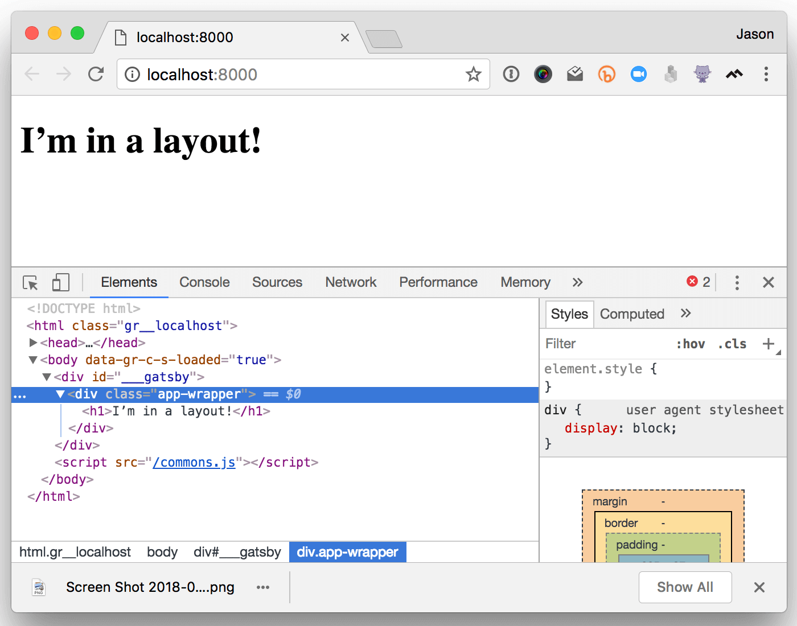

So the Gatsby V2 beta is out, and Gatsby's [layout components are going away](https://github.com/gatsbyjs/rfcs/blob/master/text/0002-remove-special-layout-components.md). What does this mean for your projects?

This article will dive into the Gatsby V2's approach to layouts, talk about what changed and why, and walk through the migration process to get your existing projects updated to V2.

If you still need the v1 layout behavior, checkout [gatsby-plugin-layout](/packages/gatsby-plugin-layout/).

## What changed?

In Gatsby V1, layouts were a special kind of component that automagically wrapped generated page components. They were stored in `src/layouts/`, and received a prop called `children` that needed to be executed as a function.

### How it works in Gatsby V1

A simple layout would live at `src/layouts/index.js` and might contain the following code:

```jsx
import React from "react"

export default ({ children }) => <div className="app-wrapper">{children()}</div>
```

Our app also might have a home page at `src/pages/index.js` that looks like this:

```jsx
import React from "react"

export default () => <h1>I’m in a layout?</h1>
```

Once we start the app, we’ll see the following in the browser console:


Like magic, our page is wrapped with the `.app-wrapper` container.

If you'd like to try out this app, check out the [`v1-layout` branch of the demo repo](https://github.com/jlengstorf/life-after-layouts/tree/v1-layout).

### How it works in Gatsby V2

In V2, layouts are no longer automatically applied to our pages (more on _why_ this decision was made in the next section).

This ultimately boils down to two breaking changes and one recommendation:

1.  **BREAKING CHANGE:** Components at `src/layouts/` are no longer automagically wrapped around page components.
2.  **BREAKING CHANGE:** The `children` prop in our layout components is no longer a function (unless you explicitly provide a function).
3.  We now recommend moving your layout components alongside the rest of your components (e.g. into `src/components/`).

If we upgrade our simplified app by running `yarn add gatsby react react-dom` (see [the V1 => V2 migration guide](/docs/migrating-from-v1-to-v2/) for more information on why we need to install React here), we need to upgrade our layout by moving `src/layouts/index.js` to `src/components/layout.js` and changing `children` from a function to a regular prop:

```jsx
import React from "react"

export default ({ children }) => <div className="app-wrapper">{children}</div>
```

Next, in `src/pages/index.js` we need to explicitly include the `Layout` component and wrap our page in it:

```jsx
import React from "react"
import Layout from "../components/layout"

export default () => (
  <Layout>
    <h1>I’m in a layout!</h1>
  </Layout>
)
```

Once we've made these changes, we can run `yarn develop` and see the updated layout in our browser:



Check out the [`v2-layout` branch of the demo repo](https://github.com/jlengstorf/life-after-layouts) to see this in action, or see [the diff](https://github.com/jlengstorf/life-after-layouts/compare/v1-layout...v2-layout) for details on exactly what changed.

## Why change the layouts?

Looking at the difference in code, it might be tempting to think, "Doesn't that just create _more work_ for developers who want to use layouts?"

In short, the decision to remove layouts was part of an effort to reduce unnecessary complexity and mystery issues in Gatsby projects.

### What was the unnecessary complexity?

Because layouts in V1 were applied under the hood, it made it _really hard_ to pass data between the layout and the pages it wrapped.

In short, layouts in V1 broke React's compositional model, and that made things unnecessarily hard to implement. By going back to the standard React way of importing components and using them directly, we're able to easily pass data between the layout and pages without any confusing, complicated, or otherwise unwieldy workarounds.

### What are mystery issues?

In V1, if something breaks on your page, you'd likely go to the page, look through the code, and try to spot the bug. But what if the bug is in the magic layout component? That component isn't referenced anywhere on the page, and if you don't _already know_ that Gatsby V1 wraps pages with layouts, it's pretty difficult to figure out what's going on.

Because Gatsby is doing things in the background, out of sight of the developers building the site, we're creating a mystery: where the hell did this bug come from if all the code I can see doesn't have the bug?

By removing the magic and making layouts an explicit dependency in V2, that same bug would be much easier to spot because there's a clear link between our page code and the layout.

### Why is this better?

Our goal at Gatsby is to make building great apps more fun and less frustrating — and _very few things_ are more frustrating than mystery bugs.

This change reduces the number of mysteries in your Gatsby projects, and makes debugging a little simpler.

## What else is changing?

Removing layouts isn't the only improvement coming in Gatsby V2. We're really excited to introduce a lot of new and exciting features, such as:

- Much faster hot reloading, which enables Ludicrous Mode

https://twitter.com/gatsbyjs/status/974507205121617920

- We can now add GraphQL queries to any component in our app (not just page components) using [`StaticQuery`](/docs/static-query/)
- Upgraded to the latest versions of React, Babel, Webpack, and other libraries Gatsby depends on
- Better support for CSS inlining and splitting, which will boost performance

For a full list of what's new, check out our [V2 migration guide](/docs/migrating-from-v1-to-v2/) and [_What’s New in Gatsby V2?_](/blog/2018-06-16-announcing-gatsby-v2-beta-launch/).

## What's next?

- You can get started using Gatsby V2 right now by installing our V2 default starter:

  ```
  gatsby new my-gatsby-v2-site https://github.com/gatsbyjs/gatsby-starter-default
  ```

  Huge thanks to [Yuki Takemoto](https://github.com/mottox2) for upgrading the starter to V2!

- You can also [see the V2 roadmap](https://github.com/gatsbyjs/gatsby/projects/2), help us squash any V2 bugs by opening [issues](https://github.com/gatsbyjs/gatsby/issues) or sending [pull requests](https://github.com/gatsbyjs/gatsby/pulls), or [follow along with our progress on Twitter](https://twitter.com/gatsbyjs).

We can't wait to see what you build with this new and improved version of Gatsby!
