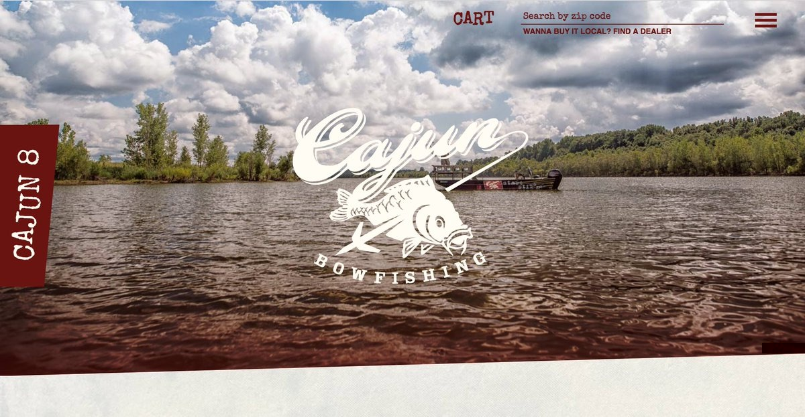
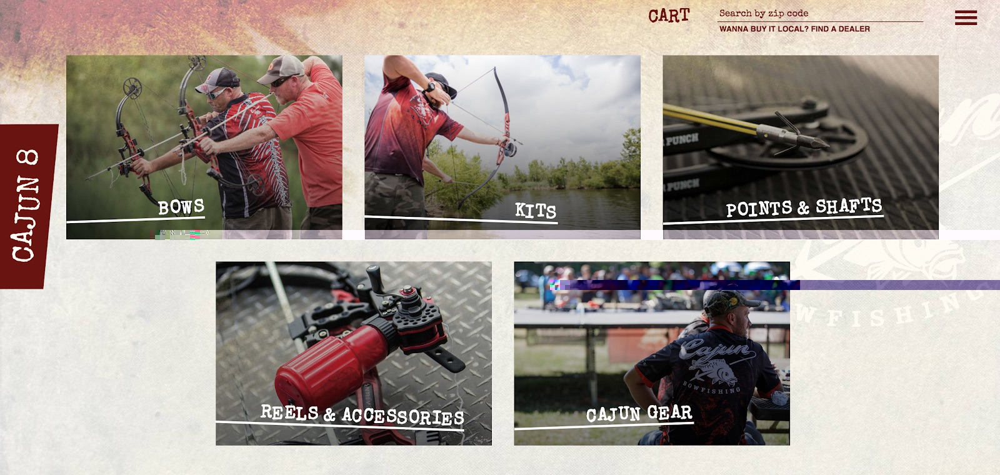
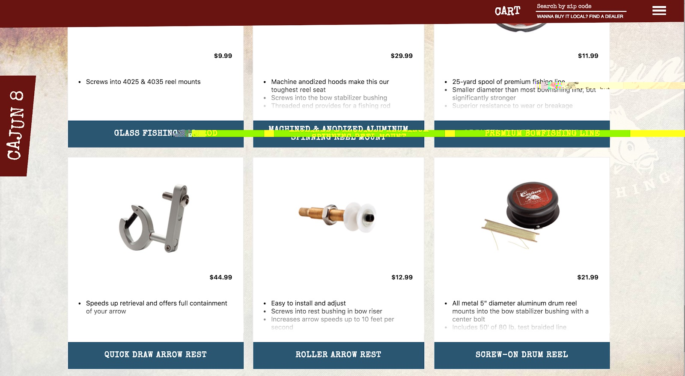

[Escalade Sports](https://www.escaladesports.com/) is a sports equipment company with a portfolio of 40 brands across a wide variety of sports—from Goalrilla basketball hoops to Bear Archery bows to Onix pickleball paddles.

Headquartered in Evansville, Indiana, USA, Escalade sells its equipment direct-to-consumers online, as well as through a network of local and regional distributors and specialty stores.

Escalade recently started migrating its sites to Gatsby. They first chose to migrate one of their e-commerce brands, [cajunbowfishing.com](https://cajunbowfishing.com/) and recently relaunched it on Gatsby. Next they’ll be migrating the Escalade Sports homepage and then other brand sites.

## Making the decision to migrate to Gatsby

When lead developer Kennedy Rose took responsibility for Escalade’s web stack, the first challenges he confronted were stability issues.

“When I started, all of our sites were on Drupal,” said Rose. “The problem was that it wasn’t stable. The sites all shared a core, and when the core went down, everything went down.”

Successful marketing efforts created traffic spikes — but the technology stack couldn’t keep up with demand.

“Whenever we had a trade show, our sites would just go down,” Rose said, “We had to put a load balancer in front of multiple servers in order to keep it up. It just wasn’t working—and when that happens after a trade show, you’re just not getting your ROI.”

As a long-time React fan, Rose turned first to a Node/Express stack to handle the stability issues, and then Next.js. Ultimately he moved away from the idea due to the complexity of handling the kinds of data he was dealing with.

“We had to create custom modules during the build, then dump data into JSON, then import the JSON from these files, then pull it into the component using getInitialProps,” Rose explained. “There isn’t really a plugin ecosystem [in Next.js] - if you wanted to modify webpack in any way, you want to manually reach into configuration files.”

Data loading is a big deal to Rose because of the way Escalade is structured. As a portfolio of brands, each brand is a department with wide latitude to run itself almost independently. That meant each brand has its own requirements and own APIs for its product catalog, that might or might not be formatted in similar ways.

## Benefits they’ve found using Gatsby

Then Rose found Gatsby. Gatsby’s plugin system solved his data problems—he was able to encapsulate data fetching into Gatsby plugins that ran at build time. It also prevented data bloat—he often didn’t need the full JSON data being returned by APIs, and with GraphQL he could query only what he needed.

And as Escalade started to use Gatsby, Rose found other benefits.

“Working with Gatsby, if someone does know React, there’s really not a whole lot more they need to learn,” says Rose. “We were able to get contractors on board much easier than with previous projects.”

Working with another developer, a photographer, and a graphic designer, he found that projects progressed quicker because prototype code was suddenly reusable.

“Almost all the code we used in prototyping went into production,” says Rose. “Especially back in the Drupal days, that was just not going to happen.

Another unexpected benefit was the cost reduction of hosting static content, instead of running PHP servers. After migrating to Gatsby, Rose moved the cajunbowfishing.com website hosting over to [Netlify](https://www.netlify.com).

“Our bill went from $5,000 a month to $5,” he says.

The most challenging piece of the move, Rose said, was helping others understand what the new technology stack looks like.

The Cajun Bowfishing store is a hybrid application, pulling in some data at build time using Gatsby plugins (Salsify, Markdown, custom pricing & stock APIs). Other data is queried live from the client—a shopping cart API and a dealer API for a map-based store locator.

The trickiest part, Rose said, was communicating what the new stack looks like. “There’s a misconception about these technologies,” he says. “People would ask, ‘If we move away from Drupal does that mean that we don’t have a CMS anymore?’”

What others took time to realize is that with a Gatsby site, all of the complexity Rose used to have to manage just went away.

“Not having these systems,” Rose says, “is actually a benefit.”
