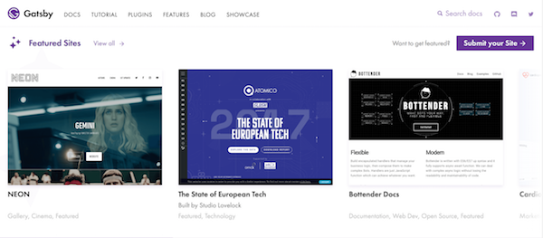

 
We recently finished the first phase of the [Site Showcase](https://next.gatsbyjs.org/showcase/), which is a searchable, filterable library of sites built with Gatsby!

This is all possible because Cassie (@ThatOtherPerson) and Shawn (@sw-yx) put in a huge effort to get this developed, and Flo (@fk) did an amazing job on design. Many thanks to other people who contributed, including @gillkyle, @LeKoArts, @davidluhr, @daydream05, @m-allanson, @pieh, @calcsam and more (these are all GitHub names).

## Submitting your site

If you’d like to submit a site to the showcase, please follow the [instructions in this document](https://github.com/gatsbyjs/gatsby/blob/master/docs/docs/site-showcase-submissions.md).
 
## Why build a site showcase?

We built the showcase to make it easier for you to find the source code for open source Gatsby sites and easier to show off what Gatsby can do to potential clients / coworkers.

### Source code

Sometimes, examples are worth 1000 words. That's why we added a GitHub icon next to sites with open source code.

### Showing off what Gatsby can do

The site showcase can help you pitch Gatsby to clients and coworkers as the best option for their next project. As they search the site showcase, it will provide a vision of what developers can accomplish with Gatsby.

## UX research process

Here’s where we discussed and built the site showcase if you'd like to go through the discussion that led to this project:
* [Site Showcase Issue](https://github.com/gatsbyjs/gatsby/issues/4392)
* [Site Showcase WIP PR](https://github.com/gatsbyjs/gatsby/pull/5524)

### Empathy map

Here’s a summary of what I learned from over 80 interviews with Gatsby users. This "empathy map" describes what kinds of pain points we're trying to solve with the site showcase.

 
### User Flow

The empathy map reflects how it took most people a lot of time browsing through the Awesome Gatsby list to find example sites and how many people share their sites through Twitter and there isn’t enough time or room for everyone to get retweeted by the @Gatsbyjs account.

With the empathy map and the interviews as our guide, we created a list of jobs to be done and imagined the typical flow a user would take through the site showcase. We did this to make sure we planned both a sensible information architecture and the necessary functionality to meet user’s main needs.

 
### Defining the MVP

We thought the following features were important to include:

Users should be able to:
- [x] See screenshots of sites built with Gatsby (Landing page)
- [x] See source code (Site detail page)
- [x] Share sites by copying the URL
- [x] Filter by category
- [x] Search sites
- [x] Submit their own site to the showcase through yaml file (Shannon writes the instructions)
- [x] See featured sites
 
## Ways you can help

### Next steps for the site showcase

* If you created a site with Gatsby or know someone who did and would like it to appear in the site showcase, [follow these instructions to add it](https://github.com/gatsbyjs/gatsby/blob/master/docs/docs/site-showcase-submissions.md).
* If you see a site with no description and you know who built it, kindly remind them to update it!
* If you’d like to help us automate the process of contacting site creators, we're [looking for help with issue #5928](https://github.com/gatsbyjs/gatsby/issues/5928) to do just that
* Help solve [issue #5929
](https://github.com/gatsbyjs/gatsby/issues/5929): Site showcase: screenshots are not rendering non-roman characters

 
### Future iterations

Here's what's next in [Issue #5927](https://github.com/gatsbyjs/gatsby/issues/5927). Feel free to tackle any part of this project and contribute to it or discuss new possibilities!
 
#### Phase 2
Users ought to be able to:
- [ ] Sort by date added (won't matter until ppl start submitting sites)
- [ ] click on a category name from the modal to filter by that category
- [ ] Share sites with a social media / URL copy button in a modal
- [ ] visit a personal page for creators of sites (see all sites they have submitted)
 
#### Phase 3
It'd be awesome if users could:
- [ ] For non-developers, have a CTA where they can hire someone to build them a Gatsby site / ask for demo, etc. (could be on upper menu, in which case it would not belong to site showcase)
- [ ] See case studies related to sites
- [ ] See a list of the site's dependencies
- [ ] Sort by date updated for sites with open source code
- [ ] See the performance of each site in action (GIFs, performance metrics, data on traffic improvement after the site switched to Gatsby,etc.)
- [ ] See a list of all sites that use a particular plugin (this would be a change to the plugin library, probably)
- [ ] Sign up to get notifications or updates when new sites are added (or just sign up for the newsletter?)
- [ ] Be guided to the tutorials if they want to build sites like the ones they are seeing
 
## Sneak peak into the next UX project

Our next UX project is finishing up the starter showcase, which will look similar to the site showcase and also have a major functional difference: filter by dependency. Please contribute to these issues to help out!
* [Starter Showcase Issue](https://github.com/gatsbyjs/gatsby/issues/5334)
* [Starter Showcase WIP PR](https://github.com/gatsbyjs/gatsby/pull/5831)
Again, many thanks to all the community members who have contributed to this research and to making Gatsby awesome. Stay tuned for updates on the site showcase and future Gatsby UX research projects!
* [Contact me](https://twitter.com/shannonb_ux/status/938551014956732418) here if you have feedback that differs from or provides deeper insight into one of the pain points this article mentions.
* Follow us on [Twitter](https://twitter.com/gatsbyjs).

