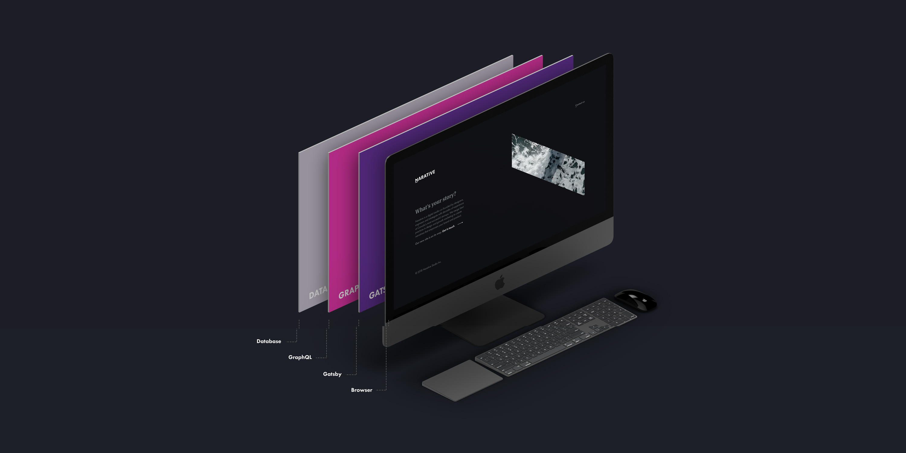
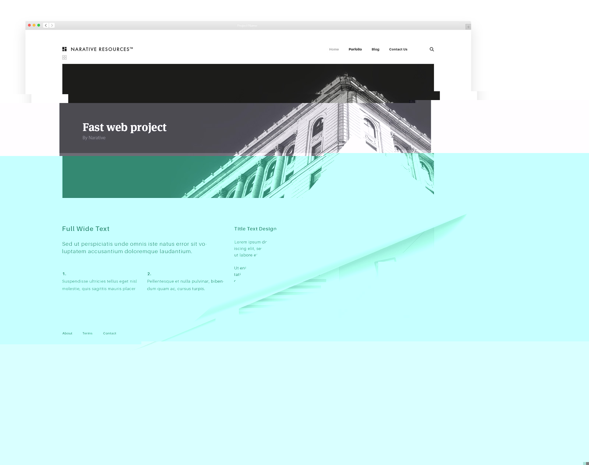

To understand why we love Gatsby you have to understand what we do at Narative. Narative is a venture studio that focuses on developing the best brands and products in the world. Our team works on everything from page based websites to complex web apps. The core of our engineering team works in the React ecosystem and has experience from some of the best startups in Canada. Narative wildly outgrew our expectations, growing from 2 to 6 people in only a 5 month time span. We're proud to announce that, in these 5 months alone, we've exceeded our 7 figure revenue target. The accomplishments we've reached so quickly would not be possible without Gatsby at the core of our technical infrastructure.

Traditionally, building page based websites, such as marketing websites, landing pages, or blogs, would require a vastly different skillset from building interactive web apps. There are popular tools such as WordPress or Drupal that are written in their own flavour of PHP or static site generators such as Jekyll, Hugo, and Middleman that leverage templating to build static websites. _The problem we've found with these tools is that there is very little overlap between web app development and page based development_. Within the last couple years, React has taken over web app development and popularized an intuitive API for building user interfaces. React has also created an astonishing community of developers that are focused on creating amazing tools to accelerate and improve UI development.

Part of our mission at Narative is to provide technical excellence through an engineering team that is proud and cohesive. To help accomplish this, we need a team that can share its knowledge, tools, and skills amongst itself and with the community around it.

# The beauty of Gatsby

Gatsby allows our team to use the powerful React API when creating page based websites with almost no drawbacks. _All the principles and techniques we've learned from using React for the last few years can be leveraged with Gatsby_. This has enabled us to create a team that is extremely dynamic and cohesive without the worry of creating silos or losing knowledge across teams. _Our team is able to learn once, write everywhere_. With an engineering team that's familiar with React and Gatsby we're able to tackle more problems faster, which is highly beneficial to our partners and the services we offer.

One concern we had when adopting Gatsby is that page based websites are not the same as web apps. Even though we're using similar tools to build them there are different principles that drive each type of development. Luckily, our team doesn't have to worry about that problem, because the team behind Gatsby is focused on delivering the perfect experience to end users for us. The Gatsby team has baked in all the necessary features to make our websites fast and up to standard.

# Gatsby's fast, really fast

Gatsby handles a lot of the complexity of delivering a fast website for you. There are new performance standards built into it; we don't have to worry about code splitting, service workers / progress web app capabilities, server side rendering, asset optimization, and basic security.

Great performance out-of-the-box is a huge win. Our team does not have to focus on these optimizations anymore. Instead, we focus on telling the story and building the values of our partners into our websites and web apps.

# Developing with Gatsby is fast, really fast

Gatsby does not only allow us to deliver fast websites, it has also sped up our development time. The developer experience is another focus of the team behind Gatsby - and it shows. Features such as live reload are ready to go at when you start a new project. There's no need to setup a custom Webpack configuration as the basics are completed for you. Building your website and deploying is also carefully thought out by Gatsby and often requires running a single command and using one of the many integrations for hosting. Furthermore, the documentation is comprehensive and has plenty of content from introductory guides to complex use cases. This has been amazing for training and on boarding new members of our team, especially if they're already familiar with React.

# Separation between view and data layers

Many popular CMS tools are tightly coupled to their source of data. Gatsby offers a clear separation between the data and view layer building on top of the [headless CMS](/docs/headless-cms/) principles. The advantage for Narative is that we can develop without CMS lock-in such as WordPress. If our team decides to go with a new view layer the migration would be less painful than migrating all the data as well. Often times flexibility in software means more complexity to manage but in this case the flexibility is in the right spots where it reduces complexity.

We pass this flexibility on to our partners. They are able to manage their data while _our team is able to deliver an excellent product on top of their existing infrastructure. This has made our solutions to revamping legacy projects even stronger than before_.

# Plugins and integrations

Tools such as WordPress have a strong appeal because of the maturity and vast plugin ecosystem build around it. Gatsby has a well architected plugin-system that has already met our needs at Narative. The plugins are modern, plentiful, and easy to create if needed.

Beyond all the plugins, Gatsby provides integrations into today's popular tools. Integrations such as Contentful are a perfect match for Gatsby because of the separation between data and view layers. Every major hurdle we thought we'd have to solve has already been taken care of by the Gatsby team and their custom integrations.

# Conclusion

Narative strives for technical excellence for all its products, which can be achieved with React, Gatsby, and GraphQL for us. We've landed on a solution that allows our team to stay cohesive and flexible. Thanks to the popularization of React and the principles behind it _Narative has been able to build page based websites and web apps with the same expertise. In the past, it was hard to share knowledge and tools between page based websites and web apps but now there's very little difference_.

Gatsby streamlines our process with an excellent developer experience and all the features you could ask for in 2018. The heavy lifting of delivering a technically sound website with performance that users will love has slowly shifted towards frameworks such as Gatsby, which has freed up our team to focus on even better experiences and products.

To conclude, Gatsby may not be the perfect solution for your project, but for our needs it's perfect. By building with Gatsby, we've extended our team to an amazing group of people that are working hard to improve page based websites. We're excited to see where Gatsby takes us next.

# Narative

[Narative](https://narative.co) is a digital studio co-founded by designers, engineers and strategists with decades of experience at Canada's most successful startups. We merge best practices in design, engineering, and growth marketing to create narratives that empower your brand and product.
