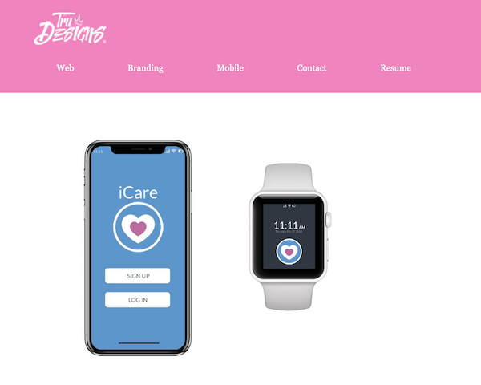

## Graphic Design Students at the Art Institute

Recently, Gatsby fan Phil Howley starting teaching Gatsby in an Emerging Technologies class at the Art Institute (AI) in North Hollywood. I got to interview him.

In his 10 years of teaching over 50 web development/design classes at (AI), he’s observed that graphic design students tend to come to class less as the class gets more focused on coding.

However, in his current class _nobody has dropped out_. And every single one of his students turned in the MVP and at least one extra credit feature for their final portfolio project, which has never happened when he previously taught this class. The reason? He taught them to create their portfolios using Gatsby.

## Here are some of the student’s final sites:

[Melany Dierks](http://mywetpaintstudio.com/) ([source](https://github.com/reguv760/mmd-site2))

[Khabarovsk](http://myceevee.netlify.com/) ([source](https://github.com/msergushova/myceevee))

[TruDesigns](https://trudesignsongatsby.netlify.com/) ([source](https://github.com/trudesigns/newStuff))

After our initial phone conversation, Phil responded to a series of interview questions via email.

## Interview

### How did you hear about Gatsby?

I work for Iron Cove Solutions and the CEO, Patrick Monahan, wanted a new site. He was tired of WordPress and how slow it was, having to update the plugins and the core WP. In addition, the theme wasn’t fun. He also had a separate part of the site built with custom PHP. Overall, the site was slow, the SEO was bad, and all changes took forever.

Patrick wanted me to find a better, more modern solution and that’s where I stumbled upon Gatsby. Once I showed him how fast one of the demo sites was, he gave me the green light. I dug in and here is the URL for [Iron Cove’s new “Gatsby” website](https://ironcovesolutions.com). Props to [HTML5 Up](https://html5up.net/) for coding the [Gatsby starter](https://github.com/ChangoMan/gatsby-starter-forty) that I used.

The speed is lightning fast. We removed WordPress entirely from the equation and replaced it with the more user-friendly, less of a headache [Contentful](https://www.contentful.com/).

He also liked the cost-effectiveness of Godaddy but when things broke, it was a huge time suck to repair. We swapped Godaddy with [Netlify](https://netlify.com) and used Netlify to automatically run production builds from our GitHub repo. We wired Contentful to Netlify using a hook and to GatsbyJS using API keys and now Iron Cove’s site was fast and super simple to update. A win-win all around.

Patrick loved Gatsby so much he created a new product line where he is actively looking to help companies build sites using GatsbyJS and all the other tools he used on his current site.

### What do you teach?

This term I teach Emerging Technologies at AI, which is a class that gives me the freedom to teach something cutting edge. This is my favorite class to teach as I get to teach something I am currently using/learning.

Since I just built a site using GatsbyJS, I decided this was the perfect topic to cover in the class. A year ago, I was thinking of teaching Jekyll (jekyllrb.com) because it was so cool and fast, but it was not well received, and the students hated the process and typing Markdown. So, I scrapped it and just introduced them to Node.

Structure of the class:

1. _Taught them React._ They loved `create-react-app` and how it magically created a server and gave them hot code push powers.
2. _Taught them NextJS._ They liked how routing was removed from the equation and they could just drop stuff into the pages directory and they would magically work.
3. _Taught them Gatsby._ Learning NextJS wasn’t as smooth as I would have liked but once we jumped to learn GatsbyJS, some interesting things happened. A light when on. They were excited.

<Pullquote>
  Once we jumped to learn GatsbyJS, some interesting things happened. A light
  when on. They were excited.
</Pullquote>

### What do your students like about Gatsby?

Here’s a list of what they love about Gatsby:

- _Hot reloading_ gives them instant visual feedback like they get in Illustrator and Photoshop
- _Coding in React_ is fun. By fun, they mean it's easy to add modules, don’t have to build everything from scratch, and they already knew enough about creating React components from Phil’s teaching to jump into Gatsby

- _Docs:_ While not perfect, the Gatsby tutorial and documentation. was “approachable”
- _Speed_: They never heard of static site generators or the JAMstack, but the speed immediately impressed them
- _Built off previous knowledge:_ They were able to use the routing knowledge they gleaned from NextJS
- _Uses simple commands:_ They work locally and type `$ npm run develop`. A server opens up and they see and can edit their site in real time. Easy peasy. They want to build for production they use `$ gatsby build && gatsby serve`. Simple!
- _Netlify:_ When I showed them Netlify and how they could quickly (and freely) push their site to GitHub and hook it up to Netlify so that it would automatically build it and make their site live! They were blown away.
- _Fast to build:_ They were able to create their final projects in 3 weeks

### Anything they didn’t like?

One thing they wanted more of:

- they wanted more sample sites built with Gatsby.

They suggest that a link be added to the home page of Gatsby pointing to it and all sites with Git repos should be searchable first.

> _NOTE_: His students are in luck! The [Starter Showcase](/starters/?sort=stars) (see [PR 6113](https://github.com/gatsbyjs/gatsby/pull/6113)) and [Site Showcase](/showcase/) ([see relevant issues here](https://github.com/gatsbyjs/gatsby/issues?utf8=%E2%9C%93&q=is%3Aissue+is%3Aopen+site+showcase)) are nearly done.

### What do you like about teaching with Gatsby?

It wasn’t just Gatsby but the whole collaborative team of Gatsby, Git, GitHub, and Netlify that broke through to every student this term. It was amazing to witness this as a teacher. I also tried to show them blogs and Markdown but that wasn’t super smooth and none of the students added that part to their final project.

In my next class with Gatsby, I plan on introducing Contentful and GraphCMS to show them CAAS sites.

### Phil's final thoughts:

This technological experiment was a huge success.

My students:

- had fun in this class
- applied what they learned
- felt comfortable enough walking over and helping each other
- had lots of smiles on the last day
- all turned in a final project (this doesn’t always happen)

One of the students hadn’t coded HTML or CSS in a couple years and just came back to school. Even that student jumped on board and created a working website.

One student dug into the documentation and figured out how to get lightbox working.

One of the students who fell behind found out I was teaching Gatsby next term and he asked if he could sit in on my class and audit because he thought learning Gatsby was important and he wanted to have more time to get better with it.

I thoroughly enjoyed this term and plan on teaching Gatsby next term again for my advanced web class.
