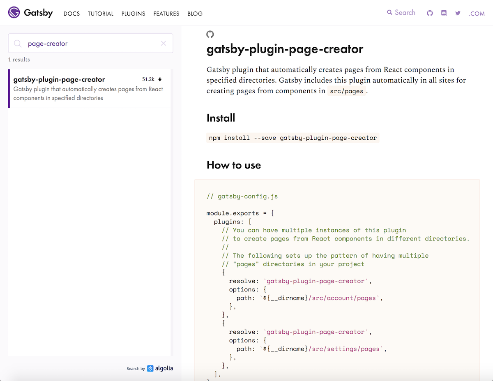
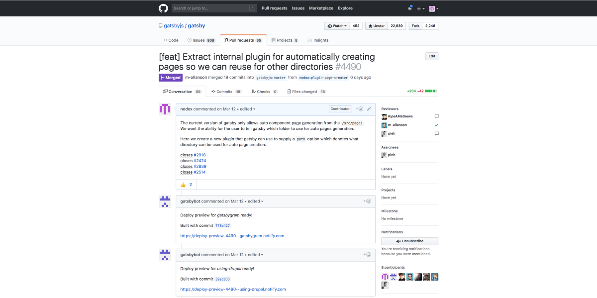
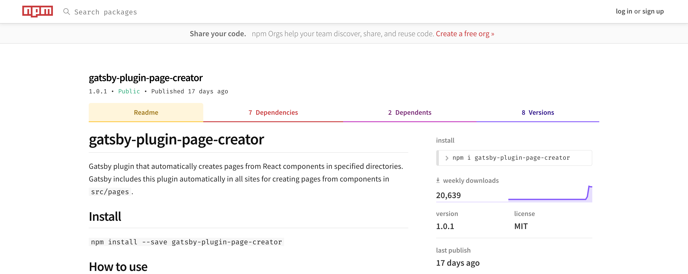

In this article we will talk about a new plugin that lets you auto create
pages from components in any folder within your Gatsby project! We will chat about the
problem that sparked the creation of this plugin. Afterwards, we'll talk about how you can
use this plugin to auto create pages without having to place your components in the **src/pages** directory.

# The problem with static values

Here's how it all got started. The goal with [Gatsby Manor](https://gatsbymanor.com) (a separate project, unaffiliated with the Gatsby core team)
is to create professional designed Gatsby starters
to give your site a clean, modern look the moment you create a new project.
While creating our newest starter
[gatsby-starter-eventually](https://github.com/gatsbymanor/gatsby-starter-eventually),
I wanted to organize the directory structure of the project to better fit my
workflow.

Gatsby core automatically turns React components in **src/pages** into pages.
Prior to this plugin, that functionality was only available to Gatsby core
as an internal plugin. There was no way to have a different folder
automatically create pages from components because the default **src/pages**
path was hardcoded. The side effect of this behavior
is that you have a hard time creating folder structures that best fit your needs.
If you wanted all your JavaScript to live in a single folder, you would
lose the ability to automatically create pages.

# The community asks for a solution

After searching the repo issues for a solution, I found other people
having the same problem and asking for a solution. A user in
[#2424](https://github.com/gatsbyjs/gatsby/issues/2424) wanted to move their
components into a render folder. Another wanted to keep their Gatsby code
near non-Gatsby related code but under a different directory name.

One [issue](https://github.com/gatsbyjs/gatsby/issues/2514) raised how
uncommon this pattern might be when handing a project over to other
clients that are less technical. Each issue focused on a valid concern, with
many community members in support of a better convention. With this data,
I set out to determine a solution for this problem.

# The great pull request

With the help of Kyle Mathews, he directed me to the location of the
internal plugin responsible for the hardcoded behavior. To support the desired
functionality, we would have to extract the internal plugin so
any project could download the plugin from npm.

The next step would be to add a path option that takes a directory path string
to denote the directory of components we want to use for
automatic page creation. With a development plan in place, I started
coding a solution. After a few days of coding, I opened a pull request to
add a `gatsby-plugin-page-creator` to the Gatsby Plugin
Library. After a few weeks of code reviews the
[pull request](https://github.com/gatsbyjs/gatsby/pull/4490) was merged!

# How you can use this plugin

You can find
[`gatsby-plugin-page-creator`](https://www.gatsbyjs.org/packages/gatsby-plugin-page-creator/?=page-creator)
in the plugin library. Use `yarn add gatsby-plugin-page-creator` to add this
into your project. In `gatsby-config.js`, use a JSON object to use the
plugin, making sure to add the required path option with your desired directory
path.

If you need to designate another location for auto page creation, add another entry of the
plugin with a different path. You can have unlimited directories responsible for
auto page creation. The result is you can keep your project well organized without
having to give up on the most powerful out-of-the-box feature.

# Community reception

This plugin has by far been the most impactful open source contribution I have made
to date. As of writing, the newly published Gatsby plugin has been
[downloaded more than 50k+ times](https://npm-stat.com/charts.html?package=gatsby-plugin-page-creator&from=2018-06-01&to=2018-07-18)
in less than a month!

I am happy this plugin is being used by so many developers. What brings me even more joy is that this small contribution will help the Gatsby community continue to deliver an amazing open source tool.

# Gatsby Manor

[Gatsby Manor](https://gatsbymanor.com) builds professional design
Gatsby starters. We make starters to meet your project needs, with new starters
added monthly. Can't find a starter you like? Message us and we'll
build a starter project for you.
