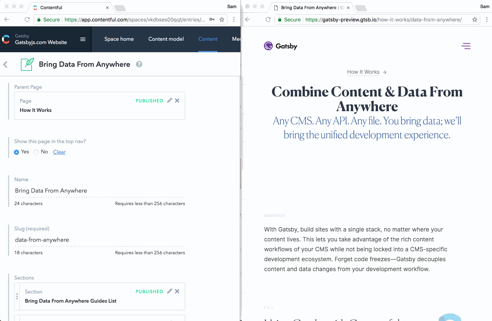

Today we’re excited to announce a hosted preview service for teams using Gatsby, with Contentful as an initial integration. 

Over the last few months, we’ve been hearing growing excitement from the community as more and more developers try out Gatsby and get hooked to the ability to easily create compelling, performant experiences. 

With modern Javascript, React’s component model, and Progressive Web App techniques out-of-the-box, Gatsby provides a compelling alternative to a traditional CMS development environment, while allowing content teams to access their CMS’s mature content workflows.

In our conversations with website development teams at agencies and enterprises that have adopted Gatsby, among the enthusiasm, we’ve heard a recurrent concern among the enthusiasm. 

In a traditional CMS setup, content creators and editors are able to preview their changes out of the box before they go live, whereas that’s difficult with Gatsby—it requires teams setting up their own preview infrastructure, a tedious, difficult task. 

That’s a problem because as content teams are creators. And creators, as Bret Victor put it, “need an immediate connection to what they're making.” 

When a copywriter edits a headline in their CMS, they shouldn’t have to _imagine_ what their change looks like in context. They should see it—immediately. 

That’s why today, we’re excited to launch a hosted preview service for teams using Gatsby with Contentful. 

With hosted preview, once teams connect their Github repositories, we’ll provide a live URL where content creators can see their changes in context—how the new header on the paragraph plays with the graphic to the left or the footer below—before they hit publish and their changes go live. 

While we continue development on this feature, we’re releasing it initially in an invite-only alpha. To apply to use the service, fill out this form and we’ll be in touch. There will be no charge for the service while it’s in alpha.

Over the next few months, we’ll be adding features like support for other content management systems like Drupal and Wordpress, as well as moving Hosted Preview into general availability.

Before you go, take a look at a GIF of the Preview feature in action on our own [gatsbyjs.com](gatsbyjs.com) website:

