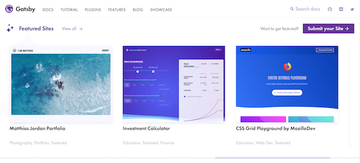
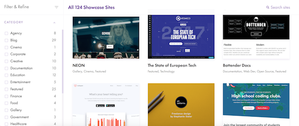
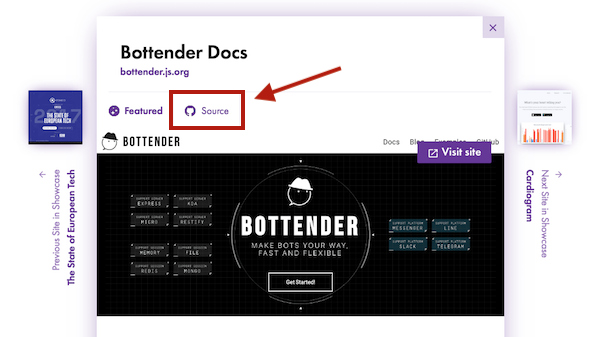
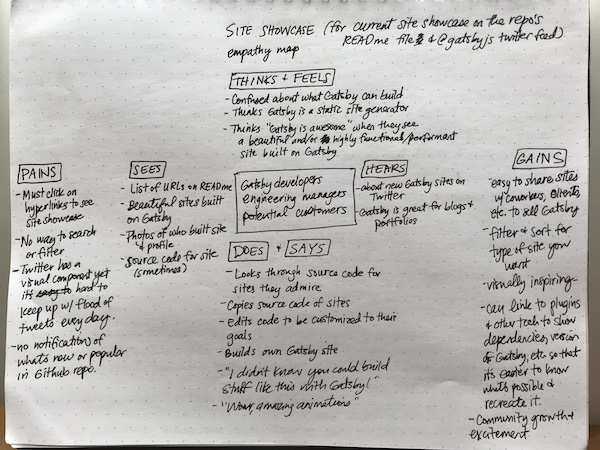
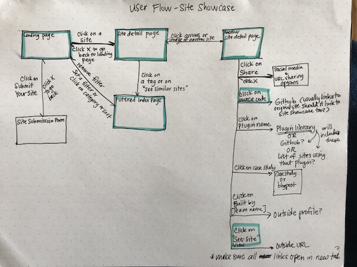

We recently finished the first phase of the [Site Showcase](/showcase/), which is a searchable, filterable library of sites built with Gatsby!

We're starting the second phase soon and would love your help! For a list of tasks that need to be done, see [Issue #5927](https://github.com/gatsbyjs/gatsby/issues/5927).

The Site Showcase was developed by Cassie Beckley ([@ThatOtherPerson](https://github.com/ThatOtherPerson)), Shawn Wang ([@sw-yx](https://github.com/sw-yx)), and Kurt Kemple ([@kkemple](https://github.com/kkemple)) and Flo ([@fk](https://github.com/fk)) did an _incredible_ job on design. Many thanks to other people who contributed, including Kyle Gill ([@gillkyle](https://github.com/gillkyle)), LekoArts ([@LeKoArts](https://github.com/LeKoArts)), David Luhr ([@davidluhr](https://github.com/davidluhr)), Vince P. ([@daydream05](https://github.com/daydream05)), Mike Allanson ([@m-allanson](https://github.com/m-allanson)), Michal Piechowiak ([@pieh](https://github.com/pieh)), Sam Bhagwat ([@calcsam](https://github.com/calcsam)) and more.

## Submitting your site

If you've built a site with Gatsby and would like it to appear in the Site Showcase, please [submit your site](https://www.gatsbyjs.org/contributing/site-showcase-submissions/).

## Why build a site showcase?

We built the showcase to make it easier for you to (1) find the source code for open source Gatsby sites and (2) show off Gatsby to clients, coworkers, friends & family.

### Source code

Sometimes, an example is worth 1000 words. That's why we added a GitHub icon next to sites with open source code (not all sites will have this icon).

### Showing off what Gatsby can do

The Site Showcase can help you pitch Gatsby to clients and coworkers as the best option for their next project because it shows what developers can accomplish with Gatsby.

## UX research process

Many of you contributed to the discussion and development of the site showcase. Here are the initial issue and PR if you'd like to go through the discussion that led to this project:

- [Site Showcase Issue](https://github.com/gatsbyjs/gatsby/issues/4392)
- [Site Showcase WIP PR](https://github.com/gatsbyjs/gatsby/pull/5524)

### Empathy map

Here’s a summary of what I learned from over 80 interviews with Gatsby users. This "empathy map" describes what kinds of pain points we're trying to solve with the site showcase.

### User Flow

The empathy map reflects the following pain points:

- the Awesome Gatsby list of sites (used to be part of the README in the open source repo) was growing long and was not searchable or filterable
- the Awesome Gatsby list also had no visual indication of what the sites looked like
- there isn’t enough time or room for everyone's awesome sites to get retweeted by the @Gatsbyjs account

With the empathy map and the interviews as our guide, we created a list of jobs to be done and imagined the typical flow a user would take through the site showcase. We did this to make sure we planned both a sensible information architecture and the necessary functionality to meet user’s main needs.

### Defining the MVP

Based on the process described above, we thought the following features were important to include:

Users should be able to:

- [x] See screenshots of sites built with Gatsby (Landing page)
- [x] See source code (Site detail page)
- [x] Share sites by copying the URL
- [x] Filter by category
- [x] Search sites
- [x] Submit their own site to the showcase through yaml file (Shannon writes the instructions)
- [x] See featured sites

## Ways you can help

### Future iterations

Here's what's next in [Issue #5927](https://github.com/gatsbyjs/gatsby/issues/5927). Feel free to tackle any part of this project and contribute to it or discuss new possibilities!

## Sneak peek into the next UX project

Our next UX project is finishing up the starter showcase, which will look similar to the site showcase and also have a major functional difference: filter by dependency. Please contribute to these issues to help out!

- [Starter Showcase Issue](https://github.com/gatsbyjs/gatsby/issues/5334)
- [Starter Showcase WIP PR](https://github.com/gatsbyjs/gatsby/pull/5831)
  Again, many thanks to all the community members who have contributed to this research and to making Gatsby awesome. Stay tuned for updates on the site showcase and future Gatsby UX research projects!
- [Contact me](https://twitter.com/shannonb_ux/status/938551014956732418) here if you have feedback that differs from or provides deeper insight into one of the pain points this article mentions.
- Follow us on [Twitter](https://twitter.com/gatsbyjs).
