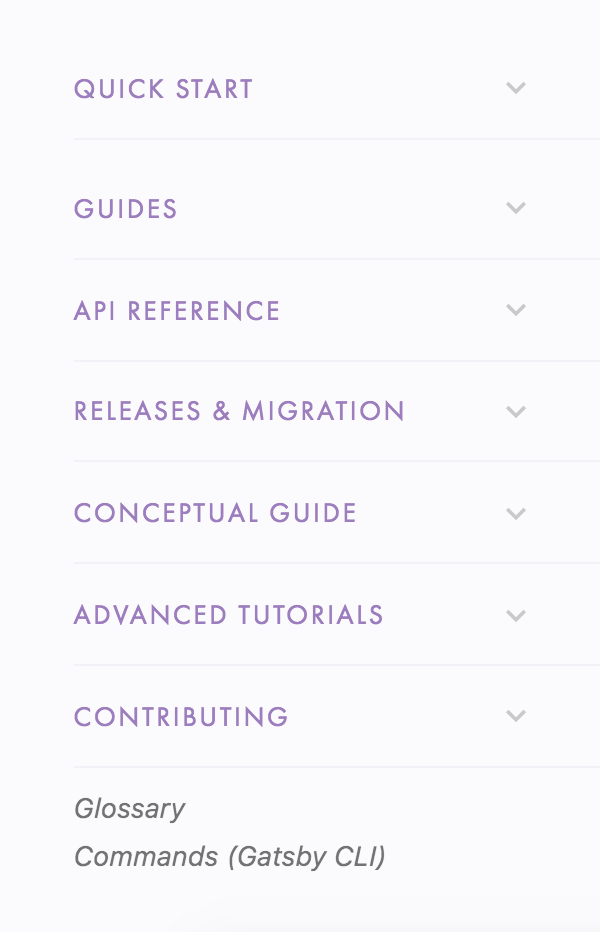
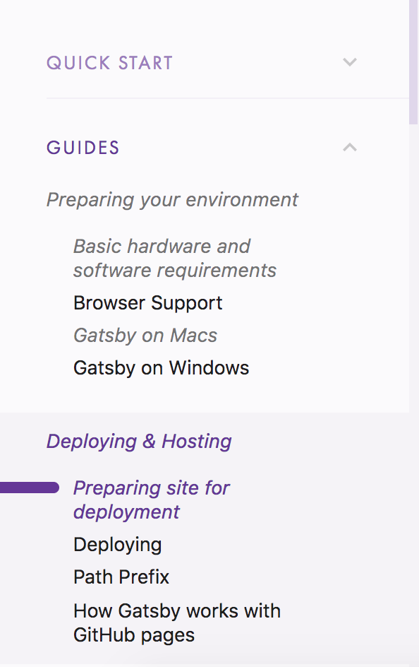
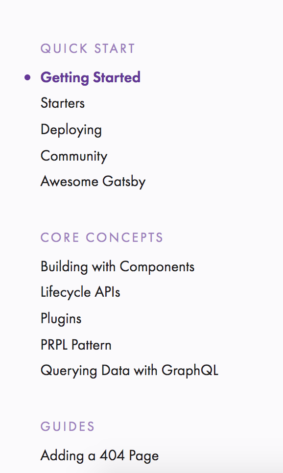

We've been working on a new design for the docs sidebar. You can see it live on at [www.gatsbyjs.org/docs/](/docs/)!

And here's the previous design (still living at www.gatsbyjs.org for now)

This all started when, one day (just kidding, it was every day), we realized that the Gatsby docs sidebar was getting too long.

Although making room for new docs was an obvious need, the solution was not obvious. It took concerted community effort to choose a new organizational structure and design to make docs easier to find.

Here's the design process.

## Pronovix criteria for great docs

We wanted to make sure that the site provides necessary information to developers at each of these stages (thank you, Pronovix, for the excellent articles on this, like [Eliminating API Friction Along Downstream Developer Journey](https://pronovix.com/blog/eliminating-api-friction-along-downstream-developer-journey-1) and [What is the MVP for a Developer Portal?](https://pronovix.com/blog/what-mvp-developer-portal))

1. Discover/Research - what is this site? how can this portal help me to solve my specific task?
2. Evaluate - can I trust this organization’s commitment to its project?
3. Get Started - where do I begin?
4. Develop/Troubleshoot - do I know everything to make this work? How do I get X done with Gatsby? How do I use Gatsby with [insert other tech or CMS]? Where do I go when I have a problem with Gatsby?
5. Celebrate - will they care about my work?
6. Maintain - how hard will it be to keep this running?

## Investigating other "excellent docs showcase" structures

Here is a list of what we liked and didn’t like in docs with similar goals to ours. We looked at NextJS, ReactJS, Expo, Ghost, Drupal, WordPress, Joomla, Silver Stripe, Netlify, and Apollo.

### The goods:

- Accordion menus make design clean
- Flat menus mean nothing is hidden
- Fast action when you click buttons
- Task focused titles and headers
- Explanation of why to use the software and when not to use it
- Lots of organized "how does this work" content
- List of “lessons”
- Different organizational structures for different services

### The bads:

- Not enough categories
- Cluttered landing pages
- Conflicting menus on the same page
- Not enough “how to get a task done” docs
- Accordion menus make things hard to find at a glance because you can only look at one bucket at a time
- Open menus are often unorganized

As you can see, accordion menus and flat menus both have desirable pros and undesirable cons. We decided to adopt an accordion menu that will eventually be fully expandable with a toggle “open/closed” button as well as allowing you to open as many or as few buckets as you want, as opposed to one at a time. Hopefully you’ll have the best of both worlds this way!

## RFC Process

Because redesigning the information architecture of the .org site would affect the whole community and would take more than a day or two to accomplish, I wrote a [Docs redesign RFC](https://github.com/gatsbyjs/rfcs/pull/5) and got excellent feedback from many community members.

## Card sort

Many of you (36 in fact!) took the card sort to give data on how Gatsby users currently categorize existing docs. The card sort data helped inform the new structure of the docs sidebar. You can read the [card sort blogpost](/blog/2018-06-26-card-sort-results/), which has more detail about the card sort results.

## Usability testing

One thing that happened (and this shouldn't surprise me) is that Gatsby community members are enthusiastic and willing to help. I included an invitation at the end of the card sort that invited card sort participants to sign up for a usability test, thinking "oh, no one will sign up for this." Then, about 15 people signed up, and I only need about 5-7 for solid data ([reference here](https://www.invisionapp.com/blog/ux-usability-research-testing/)).

So, I did three different usability tests with about 5 people each and got some really valuable insights. Thank you to all these people for taking the time to meet with me for usability tests!

Thank you Martyn Hoyer, Eka, Benjamin Modayil, Nicky Meuleman, Jonathan Prozzi, Kelly Lawrence, Chris Wiseman, Simon Koelewijn, Cameron Steele, Bogdan Lazar, Shannon Smith, Hugo Marques, Ria Carmin, Abhishek Vishwakarma, Peter Wiebe, and Korey Boone.

Common obstacle no.1:

- Information embedded in the tutorial doesn't _also_ exist in the guides, like "how to create links between pages."

Possible solutions:

- The tutorials won't have a monopoly on any information; it will also exist in the guides. This is already taken care of by stub articles that indicate what information we need to pull over from the tutorial, like [Creating slugs for pages](/docs/creating-slugs-for-pages/) and [Linking between pages](/docs/linking-between-pages/)

Common obstacle no.2

- People expect to find more information in Getting Started and the README file than currently exist. They are looking to evaluate how easy Gatsby is to use through a set of basic tasks.

Possible solutions:

- Add a [Recipes doc](https://github.com/gatsbyjs/gatsby/issues/6572) to both the Getting Started and README file with a list of how to do basic tasks very quickly.
- [Revise README](https://github.com/gatsbyjs/gatsby/issues/6569).

Common obstacle no.3
We have about 60 stub articles now that are topics people care about and we need people to write them!

Solution:
Want to volunteer to write one? Check out all the stub articles (titles in _italics_ on the left hand sidebar).

## Next steps

### Need 5 testers for new structure!

Want to sign up for a 45 minute usability test of the new structure? (It will likely take 20-30 minutes, and I blocked out 45 minutes in case you have questions and more commentary. I'll close the sign-up link once I get 5 people who sign up.

- [Sign up here](https://calendly.com/shannon-soper/new-ia-usability-test/07-30-2018)

### Issues to be resolved

> Try installing the free [Zenhub extension](https://www.zenhub.com/extension) for Firefox or Chrome to view these issues accurately

Help resolve issues in these projects!

- [Docs IA redesign MVP](https://github.com/gatsbyjs/gatsby/issues/6899). Once the issues in the MVP are resolved, we'll move on to phase 2 and phase 3.
- [Docs IA redesign phase 2](https://github.com/gatsbyjs/gatsby/issues/6900)
- [Docs IA redesign phase 3](https://github.com/gatsbyjs/gatsby/issues/6901)
