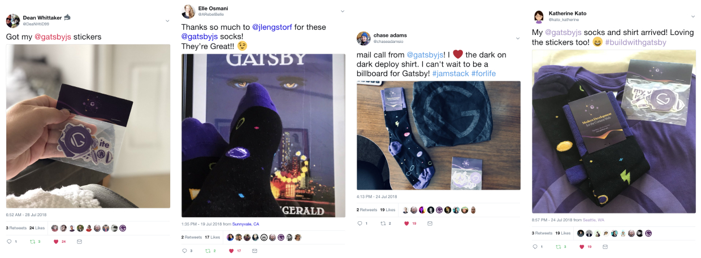

Today, we’re _so excited_ to announce the launch of the [Gatsby Swag Store][store]! If you’ve been following along [on Twitter][twitter], you may have seen the news a little while back.

https://twitter.com/marisamorby/status/1019256499799912449

We’ve spent the last couple weeks working the kinks out, and we couldn’t be happier with the response we’ve seen.

<figure>
  
  <figcaption>
    Tweets from{" "}
    <a href="https://twitter.com/DeaNHtiD99/status/1023204484183416832">Dean</a>,{" "}
    <a href="https://twitter.com/ARebelBelle/status/1020044426712735744">
      Elle
    </a>,{" "}
    <a href="https://twitter.com/chaseadamsio/status/1021896138503245824">
      Chase
    </a>
    , and <a href="https://twitter.com/kato_katherine/status/1021967765400211456">
      Katherine
    </a> showing off their new Gatsby swag.
  </figcaption>
</figure>

## Free swag for all contributors 💪💜

We’re extremely excited about the launch of the store because it means contributors are now able to get stickers, socks, and/or t-shirts for free — a little token of our appreciation for putting the time in to make the open source community even better. You’re all amazing, and we 💜 you for it.

Going forward, all contributors to the [Gatsby organization on GitHub][org] will automatically qualify for free Gatsby swag. **And when we say _all_ contributors, we mean it: even if you contributed to Gatsby before the store was launched, you’re qualified for free swag!**

https://twitter.com/lekoarts_de/status/1023823370620727296

For more details and instructions on how to claim your free swag, see [the “swag for contributors” section of the docs][swag].

Here’s the short version:

1.  Head to the [swag store][store]
2.  Log in with your GitHub account at the top right of the page
3.  Request a discount code with your name and email
4.  Use that discount code at checkout to get one free item from the swag store!

> **NOTE:** The way this works is by checking that your GitHub account has at least one merged PR in the [Gatsby organization][org]. However, **contributing code is _not_ the only way to contribute to open source!** Check out [the “how to contribute” docs][contribute] for more examples of contributions that qualify for free swag. Email us at <mailto:team@gatsbyjs.com> if you’re a non-code contributor and want your free swag.

## Shipping is free on all orders globally

We know how much it sucks when things aren’t available in your country, so — for now, at least — Gatsby Inc. is footing the bill for shipping, no matter where you are in the world. It is our sincere hope that we can keep this up, but we can’t guarantee it’s sustainable. (_Hint: this means you should probably order sooner rather than later, just in case._)

## Post your swag photos on Twitter!

We love seeing how great the community looks in purple, so please post your Gatsby swag photos with the hashtag [#buildwithgatsby](https://twitter.com/search?q=%23buildwithgatsby).

https://twitter.com/amanhimself/status/1023124667446509570

## How the store works

All of the source code for the swag store [has been open sourced][swag-source]. The frontend is a [Gatsby v2][v2] site (naturally) using [Shopify][shopify] (and their [JS Buy SDK][js-buy-sdk]) to display products and manage carts, [Auth0][auth0] to handle authentication, and a [custom Express API][swag-api] to manage discount code requests.

We also use [Peril][peril] to [automatically invite contributors][invite] to the Gatsby organization on GitHub and post details about claiming swag. Here’s an example (and some kind words from Gatsby contributor [Payton Burdette](https://twitter.com/beardedpayton)) showing what the automated response looks like:

https://twitter.com/beardedpayton/status/1020339698332512256

## What’s next?

We have a lot of ideas for the Gatsby store — from [new swag ideas](https://github.com/gatsbyjs/store.gatsbyjs.org/issues?q=is%3Aissue+is%3Aopen+label%3A%22Swag+Ideas%22+sort%3Aupdated-desc) to adding more rewards for contributors who go above and beyond — but we’d love to hear more from you! Please [tweet at us][twitter] or open issues on [the store repo][swag-source] with ideas.

For now, that’s it! We’ll leave you with our favorite genre of tweet: “dogs wearing Gatsby swag”.

https://twitter.com/ryanwiemer/status/1022267081998266368

Thanks for being part of the open source community! 💪💜

[twitter]: https://twitter.com/gatsbyjs
[org]: https://github.com/gatsbyjs
[store]: https://store.gatsbyjs.org/
[swag]: /contributing/contributor-swag/
[swag-source]: https://github.com/gatsbyjs/store.gatsbyjs.org
[swag-api]: https://github.com/gatsbyjs/api.gatsbyjs.org
[v2]: /blog/2018-06-16-announcing-gatsby-v2-beta-launch/
[shopify]: https://www.shopify.com/
[js-buy-sdk]: https://shopify.github.io/js-buy-sdk/
[auth0]: https://auth0.com/
[invite]: https://github.com/gatsbyjs/peril-gatsbyjs/blob/master/rules/invite-collaborator.ts
[peril]: https://github.com/danger/peril
[contribute]: /contributing/how-to-contribute/
