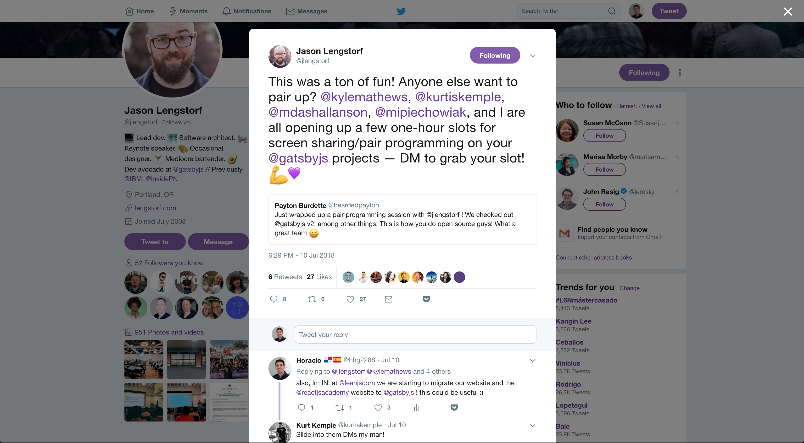

I love pair programming. This is one of the practices we do in our trainings at [ReactJS Academy](https://reactjs.academy?utm_source=social&utm_medium=medium&utm_campaign=horacio-gatsby-post&utm_term=reactjs-academy), and we do it regularly at [LeanJS](https://leanjs.com?utm_source=social&utm_medium=medium&utm_campaign=horacio-gatsby-post&utm_term=leanjs).

A couple of weeks ago, we were planning to rebuild our websites using Gatsby, and then I saw this:

I didn’t have to think about that twice--I booked it! It was funny because the week before this tweet I was talking to [Alex](https://twitter.com/alex_lobera) and [Richard](https://twitter.com/ric9176) about a similar idea I had with ReactJS Academy. We want to do something similar to pair programming with developers who want to learn React (if you are interested please send me a DM!).

My experience with Gatsby prior to this pair programming session was low, and my concern as a designer was how to create animations and page transitions with it. I thought maybe it was different from what I did in the past, and that’s why I wanted to ask. It turns out that after we talked a little bit about it, and Jason not only answered my questions, but also helped me make my first contribution to Gatsby! 🎉

Here are my thoughts and experience with this. I hope this help you to do it and start contributing to projects as amazing as this one!

### How did you feel before, during, and after pair programming?

Before, I was a little worried, to be honest :). Now, I feel more confident contributing to the project. Actually, I just made my second contribution to it today!

Also, usually when I’ve done pair programming, one person “drives” (types and programs) and the other one helps and makes sure there’s no typos or errors. In this pair programming, we both drove during the whole session and we were both really involved in it. I enjoyed this and enjoyed how we improvised throughout the process.

### What was the most surprising thing about pair programming?

The most surprising thing to me was Jason’s willingness to spend time with a complete stranger to help me with my questions. I’m grateful that he spent this time with me. Thanks man!!!

Jason patiently explained the parts I didn’t understand about Gatsby and he also walked me through the project perfectly.

### On a scale of 1–10, how likely are you to recommend it to a friend? (1–10 scale)

10!. No doubt. And higher than 10 if you have never done pair programming. Just take a simple task and go! It’s not about the code you will write, but the experience of developing with an expert. It’s just amazing :)

Again, thanks Jason Lengstorf for the time! and thanks Gatsby for this amazing project!! 🎉
