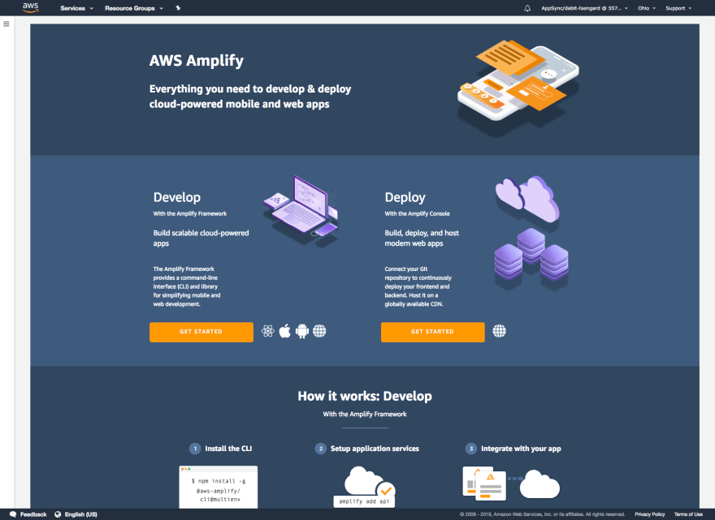
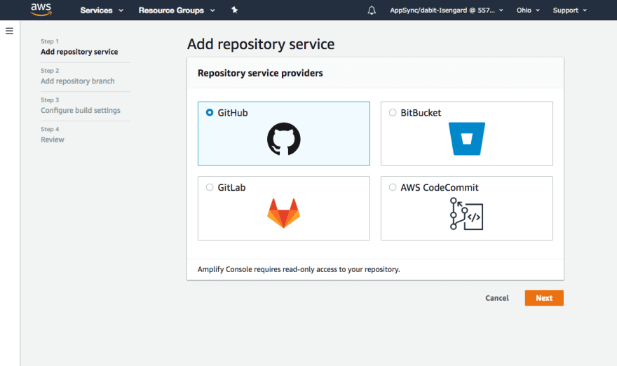
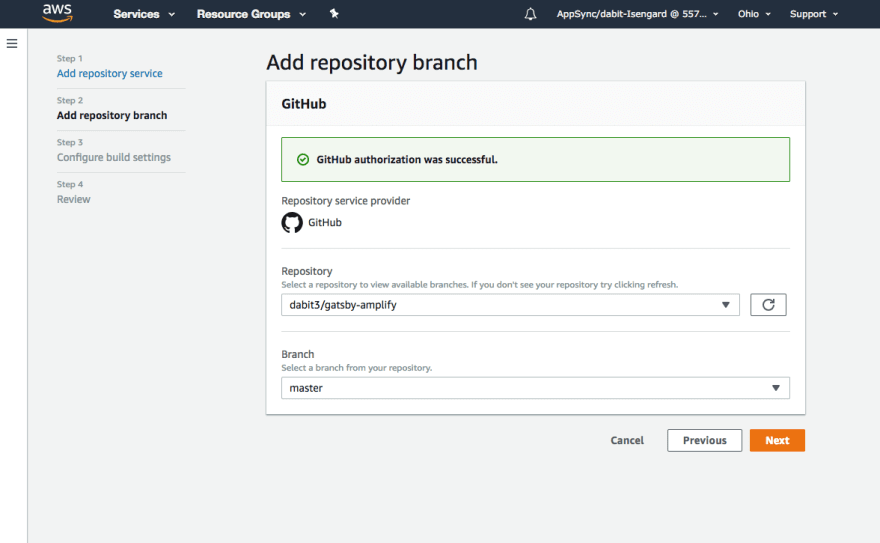
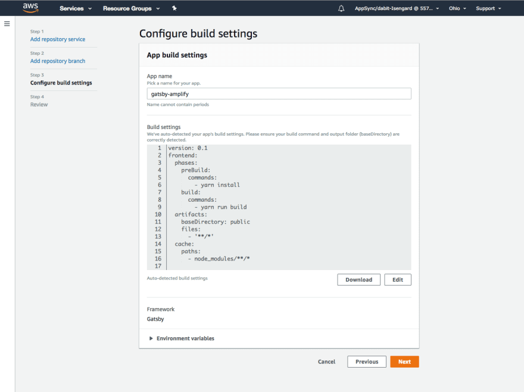
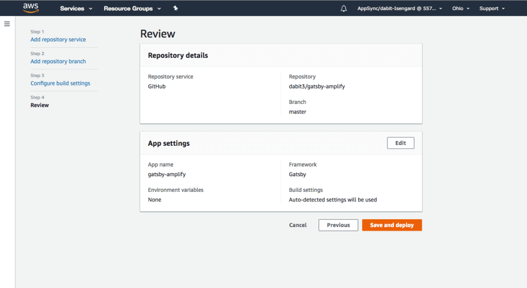
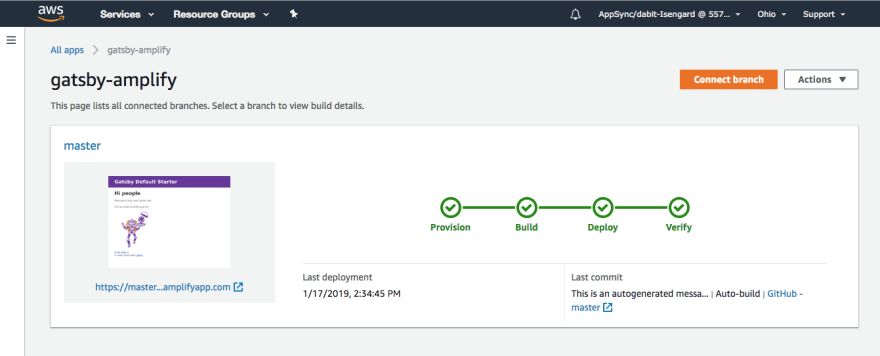
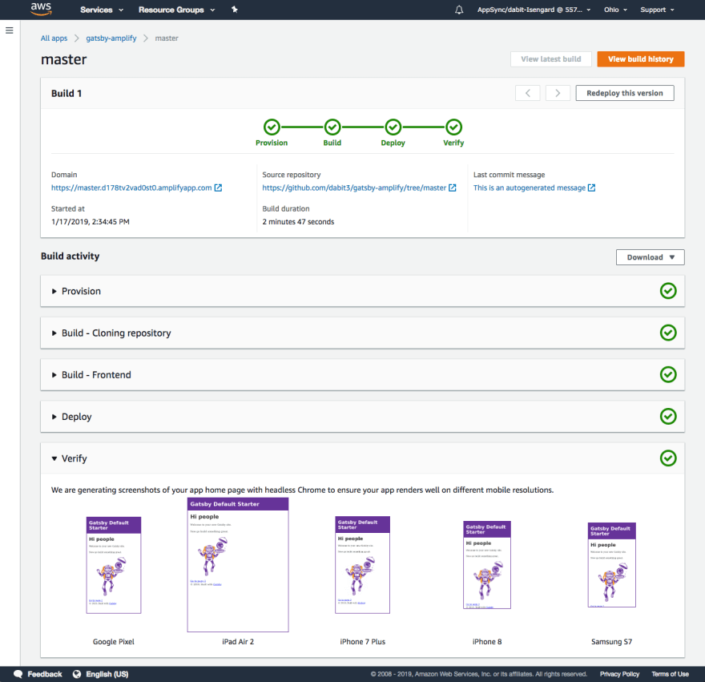
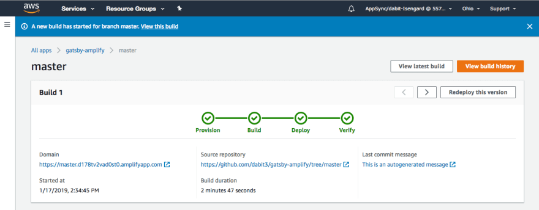
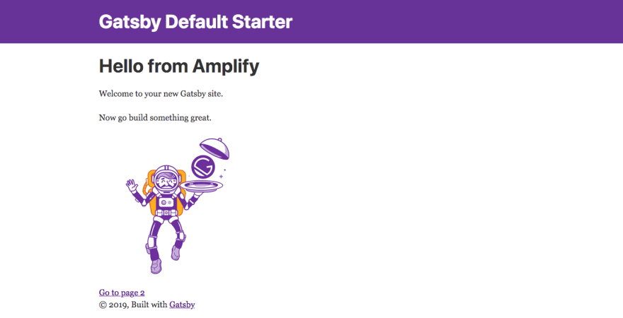

In this post, we'll walk through how to host & publish your next Gatsby site to AWS using [AWS Amplify](https://aws-amplify.github.io/).

AWS Amplify is a combination of client library, CLI toolchain, UI components & CI / CD hosting platform. Amplify allows developers to get up & running with full-stack cloud-powered applications with features like authentication, GraphQL, storage, REST APIs, analytics, Lambda functions, hosting & more.

Using the Amplify console, you can now easily deploy your application to AWS with built in CI / CD & atomic deployments.

## Getting Started - Gatsby

First, we'll want to create a new Gatsby project. If you don't already have Gatsby installed, install it:

```shell
npm install --global gatsby-cli
```

Next, we'll create a new Gatsby site:

```shell
gatsby new my-gatsby-site
```

Finally, change into the new site directory:

```shell
cd my-gatsby-site
```

## Getting Started - AWS Amplify

Now that we have our Gatsby site up & running, let's add hosting & make the site live on AWS.

To do so, create a new GitHub repo & push the project to the repo.

```shell
git init

git remote add origin git@github.com:<username>/<projectname>.git

git add .

git commit -m 'initial commit'

git push origin master
```

Now that the GitHub project has been created we can log into the [Amplify Console](https://console.aws.amazon.com/amplify/home).

From here, under Deploy we can click GET STARTED:



Next, we'll choose GitHub as our repository & click **Next**.



Then connect the mater branch of the new repo we just created & click **Next**:



In this view, we can review the default build settings & click **Next** to continue:



Finally, we can review the deployment & click **Save & Deploy** when we're ready to deploy our app:



Once the deployment is successful, you should see this:



To view details of the deployment, click on the name of the branch (in our case, **master**).

In this view, you can see details about the deployment including a link to view the app & screenshots of the app on different devices.



## Kicking off a new build

Now that our app is deployed, let's take it one step further. The Amplify Console will automatically watch your master branch & kick off a new build whenever new code is merged. Let's test this out.

Open `src/pages/index.js` & replace the following line:

```jsx
<h1>Hi people</h1>
```

with this:

```jsx
<h1>Hello from Amplify</h1>
```

Save the file & push the changes to your master branch:

```shell
git add .

git commit -m 'updated heading'

git push origin master
```

Now, when we go back into the Amplify console we'll see that a new build has been started:



When the build is completed & we launch the app, we should now see our new heading:



## Next Steps

Now that you've gotten the hang of working with the Amplify Console, what are some next steps?

If you're interested in adding authentication to your Gatsby app, check out [this](https://github.com/dabit3/gatsby-auth-starter-aws-amplify) Gatsby Auth Starter I published.

If you're interested in adding new features to your Gatsby app (like authentication or a GraphQL API), check out the [Amplify CLI & Amplify Client libraries](https://aws-amplify.github.io/).

You may also be interested in working with multiple environments or teams. If so, check out [the documentation](https://aws-amplify.github.io/docs/cli/multienv?sdk=js) on how to get up & running with teams or have a look at [this post](https://read.acloud.guru/multiple-serverless-environments-with-aws-amplify-344759e1be08) that I wrote.
