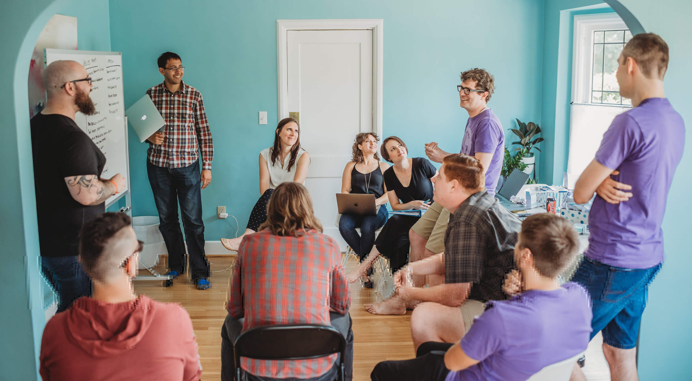
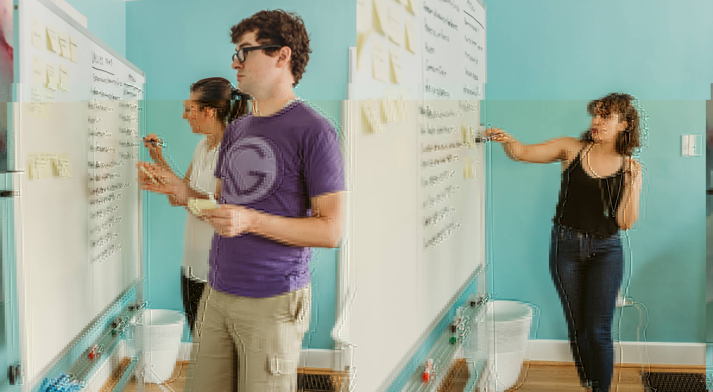
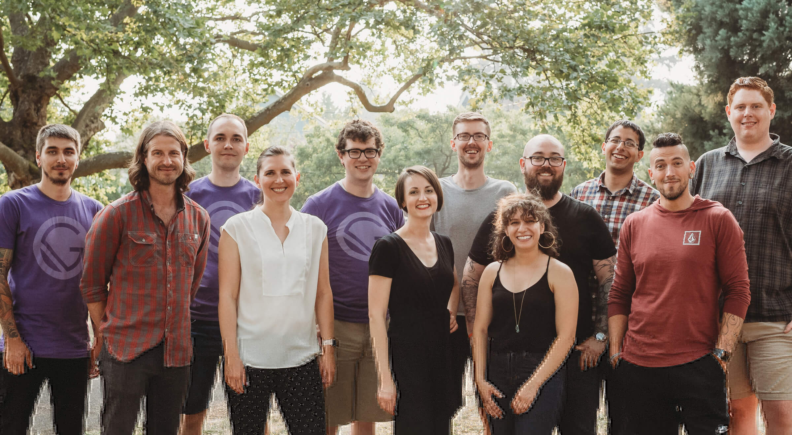

Most of the Gatsby [Inkteam](https://www.gatsbyjs.com/about/) was together in Portland last week for our latest team onsite, which we lovingly refer to as “Gatsby Gatherings”. The team assembles every few months to discuss pressing needs, our company’s direction, and our roadmap.

This was our third Gathering, and it marked the first time when we weren’t in the midst of a major push (our first Gathering was centered around understanding how the Inkteam would actually function; the second around [officially launching the company](/blog/2018-05-24-launching-new-gatsby-company/)).

But this time, with [the v2 release candidate launching last Tuesday](https://github.com/gatsbyjs/gatsby/blob/master/packages/gatsby/CHANGELOG.md#200-rc0-2018-08-21) and [Gatsby Preview in alpha](/blog/2018-07-17-announcing-gatsby-preview/), we had a chance to step back from immediate needs and start looking at the bigger picture: **what does Gatsby Inc. stand for? What are our goals and values?**

This has been a _huge_ `TODO` on our list since the very beginning, so we spent a full day thinking through this, writing down our ideas, and discussing what kind of company we want to be.

So last week, given the opportunity to spend in-person time together and talk about it, we tackled the existential questions behind Gatsby Inc.

In this post, we’ll break down the process we followed, what we came up with, and how these decisions will impact Gatsby moving forward.

## The process of defining company values

Gatsby is a distributed team, which means that on most days we only interact with contributors and team members through Slack and GitHub messages. And with team members everywhere from San Francisco to Chiang Mai, getting the whole team on extended video calls to discuss philosophical questions is extremely difficult.

<figure>
  
  <figcaption>
    The Inkteam in Portland, Oregon for a Gatsby Gathering. Photo:
    <a href="https://www.houseofschaab.photography/">Danielle Schaab</a>
  </figcaption>
</figure>

We took full advantage of being in the same room with each other to dig into these more nuanced discussions, which started a couple months ago when [Shannon](https://twitter.com/shannonb_ux) asked, “Do we have any company values?”

### Step 1: Anonymously collect ideas

[Sam](https://twitter.com/calcsam) led the effort by creating a Google Form to collect anonymous feedback on what Gatsby’s mission and values should be. We sent this form around to everyone and allowed a couple weeks for everyone to get their ideas in.

### Step 2: Condense anonymous ideas into themes

Once we had all the anonymous ideas collected, Sam condensed them into common themes.

### Step 3: Discuss the themes in person

While we were all together, Sam went through the themes with all of us and we wrote them out on a whiteboard. This helped all of us get back into the context of what we’d written down before, and what the team collectively values.

<figure>
  
  <figcaption>
    Kurt writing down really good ideas on a sticky note. Photo:
    <a href="https://www.houseofschaab.photography/">Danielle Schaab</a>
  </figcaption>
</figure>

### Step 4: Capture additional ideas on sticky notes

Once we all had context, we distributed sticky notes and markers, then set a timer for 15 minutes to allow everyone to add any additional ideas, values, or themes that weren’t covered in the original document.

### Step 5: Group similar ideas and identify the core values

With everyone’s ideas on the board, we started grouping. [Marisa](https://twitter.com/marisamorby) and I looked for common threads in the ideas on the whiteboard and started to condense them down into a set of core values.

<figure>
  
  <figcaption>
    Kyle, Linda, and Marisa adding and grouping ideas on the whiteboard. Photo:
    <a href="https://www.houseofschaab.photography/">Danielle Schaab</a>
  </figcaption>
</figure>

As we wrote these out, we discussed them with the whole team to make sure we weren’t oversimplifying or losing the message behind anyone’s ideas.

At the end of the exercise, we’d extracted 8 shared core values, all of which the team is fully aligned on and deeply committed to.

<blockquote class="twitter-tweet" data-lang="en">
  

    What we&#39;re doing at{" "}
    <a href="https://twitter.com/gatsbyjs?ref_src=twsrc%5Etfw">@gatsbyjs</a>{" "}
    this week: writing down what kind of company we want to be.{" "}
    <a href="https://t.co/N0SRaJXILS">pic.twitter.com/N0SRaJXILS</a>
  

  &mdash; Jason Lengstorf (@jlengstorf){" "}
  <a href="https://twitter.com/jlengstorf/status/1032319257298628608?ref_src=twsrc%5Etfw">
    August 22, 2018
  </a>
</blockquote>

## What we learned — Gatsby’s core values

With our themes identified, we needed to polish our notes up into clear company values. Here’s what we settled on.

### Do the right thing when no one is looking

Companies live or die by the trust they build. Gatsby is an open source product, and that means we need to earn and maintain trust from our internal team, our larger community of contributors (and the open source community at large), as well as from our clients and customers.

To earn that trust, we need to be deeply committed to always doing the right thing _for the sake of doing the right thing_.

**Our integrity — both professional and personal — is the foundation for everything else.**

### Work in the open

Open source is at the core of Gatsby’s success, and one of the central tenets of open source is that things are done in the open and without smoke, mirrors, pomp, circumstance, cloaks, or daggers.

Gatsby’s competitive advantage is the strength of its community and ecosystem, and we’re convinced that the right path forward is to continue working in the open, sharing our plans, ideas, struggles, and successes as transparently as possible.

To put it plainly: **unless it’s a critical competitive advantage, we’ll put it in public.**

### Set and manage clear expectations

Setting and meeting expectations is the backbone of successful business (and people). It’s how we show respect, act professionally, and maintain healthy relationships.

**If we say we’re going to do something, we’ll do it.** If we’re going to miss a deadline, we’ll tell you _before_ it passes. We’ll show up to meetings on time — and if we’re going to be late, we’ll email or text to let you know.

Behind all bad feelings — anger, disappointment, frustration, and beyond — there’s almost always a violated expectation. Gatsby is all about creating great experiences and good feelings, and managing expectations is how we make sure we live up to our goals.

### Go slow to go fast

All projects are planned. The question is whether they're planned upfront, or halfway through.

We understand the value of moving quickly and shipping things regularly. We also understand the value in first thinking things through to make sure we’re moving in the right direction and shipping the right things.

**By taking the time up front to think through our goals and plan appropriately, we will avoid costly mistakes and slowdowns, keep the team and community on the same page, and ultimately move _much faster_** than if we were charging ahead without thinking things through.

### Always prioritize developer experience and user experience

Whenever we make decisions, we will put the experience of the developers using Gatsby and the people who will use the sites generated by Gatsby first. Even if it means extra work to add helpful error messages. Even if it means refactoring a confusing API to be more user friendly.

**Gatsby has built its reputation on being a pleasure to work with, and we’re dedicated to keeping that true.**

### Embrace growth

**Healthy things grow, and growing things change.** Gatsby is a fast-growing, cutting edge technology startup, and that means things are in near-constant flux. This means that we’re regularly up against circumstances that are rapidly evolving.

In order to survive and grow, we need to embrace growth as a healthy, vital process. This means making pragmatic decisions early, delegating when necessary, asking for help when it’s time, and recognizing how we’ve always done things isn’t necessarily what works _today_. (And what works today may very well stop working tomorrow.)

These changes aren’t a sign that we’re failing, or that things are wrong. It’s a sign that the company is thriving.

### Experiment with cool ideas

Gatsby began as an experiment with bleeding edge technology. As a product, Gatsby has always aimed to be at the forefront of technological advances.

While we need to stick to our roadmap and make steady progress toward our company goals, **we will maintain a state of excitement about new technology and foster a culture of experimentation, play, and wonder.** We’re excited about reaching our goals and love to tinker. People are constantly creating incredible things, and it’s critical both to our success as a company _and_ to our happiness as geeks that we take time to play with these incredible new technologies.

### You belong here

Open source doesn’t have the best reputation for being friendly and welcoming, and that makes us sad. **Everyone belongs in open source, and Gatsby is dedicated to making you feel welcome.**

We will never judge, condescend, or exclude anyone. Instead, we will go above and beyond to support the community, through [pair programming](https://gatsby.dev/pairing), offering [free swag for contributors](https://gatsby.dev/swag), giving control to the community by [auto-inviting all contributors to the Gatsby GitHub org](https://github.com/gatsbyjs/gatsby/pull/7699#issuecomment-416665803), an open and inclusive [code of conduct](/contributing/code-of-conduct/), and other means that empower and embrace the incredible community that makes Gatsby possible.

<blockquote class="twitter-tweet" data-lang="en">
  

    Huge shoutout to{" "}
    <a href="https://twitter.com/gatsbyjs?ref_src=twsrc%5Etfw">@gatsbyjs</a>.
    Not only have hey been the perfect open source project for Lambda School
    students to contribute to, but the whole community goes above and beyond in
    helping students understand the OSS ecosystem generally
  

  &mdash; Austen Allred (@AustenAllred){" "}
  <a href="https://twitter.com/AustenAllred/status/1038084753008652289?ref_src=twsrc%5Etfw">
    September 7, 2018
  </a>
</blockquote>

We’re so happy you’re here. 💪💜

## How our company values will affect us going forward

As a stand-alone list, these values are a great list of aspirational ideas, but they won’t mean much if we don’t put them into practice.

To ensure we live and work according to these values, we’re using our values as a key factor in our decision making process. As we put together our roadmap, define our internal workflow processes, or even plan a tweet or GitHub response, we’ll be asking if the thing we’re about to do is lined up with our values.

Are we acting like the company we want to be? Like the _people_ we want to be?

<figure>
  
  <figcaption>
    The Gatsby Inkteam (not pictured: Florian Kissling). Photo:{" "}
    <a href="https://www.houseofschaab.photography/">Danielle Schaab</a>
  </figcaption>
</figure>

It’s too early for any definitive results, but so far we’ve heard these values come up in meetings and discussions to keep things headed in the right direction. And — speaking personally — it feels _really dang good_ to be on a team that saw the importance of doing the upfront work to write these values down. I’m very proud to be part of the Gatsby Inkteam, and extremely grateful to be part of such an incredible open source community.

Come [say hi on Twitter](https://twitter.com/jlengstorf) and [dive into our open issues](https://github.com/gatsbyjs/gatsby/issues#boards?filterLogic=any).

Y’all are the best. 💜
