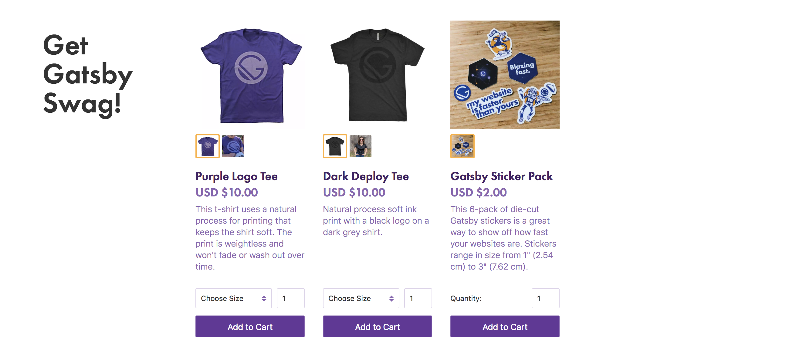

We're incredibly pleased to announce the 2nd major release of Gatsby!

Gatsby is a blazing fast modern website and app generator. Thousands of developers use Gatsby to create amazing blogs, apps, marketing and ecommerce sites, documentation, and more!

- Facebook uses Gatsby to power the [React docs and blog!](https://reactjs.org/)
- Nike built their [“Just Do It” campaign site](https://justdoit.nike.com/) with Gatsby to tell the stories of athletes with incredible dreams
- [Airbnb shows off their engineering and data science projects](https://airbnb.io/) on their site built with Gatsby

V2.0.0 is the result of months of hard work by the Gatsby core team and 315 contributors. Thank you!

This release focuses on performance and developer experience. Highlights include:

- Reduced build times by up to 75%
- Shrunk JavaScript client runtime by 31%
- Upgraded Gatsby's core dependencies to their latest versions: webpack 4, Babel 7, React 16.5

[Sign up for our v2 webinar to learn more about the new features in Gatsby v2](https://www.gatsbyjs.com/v2-launch-webinar).

## People using Gatsby

These are some of the fine organizations that trust Gatsby.

See 100s of other sites built with Gatsby in our [new site showcase](/showcase/).

## Rapidly growing ecosystem

We’ve grown a lot in the last year since the Gatsby v1 release.

- We’ve reached 1100 contributors (up from 198)
- Now merging ~90 PRs / week (up from ~50)
- Gatsby was downloaded 4+ million times
- 457 Gatsby plugins have now been published to npm
- 550,000 people visited our website
- 15,500 people starred our GitHub Repo going from 10k to 25.5k stars
- [Several core Gatsby contributors started a company](/blog/2018-05-24-launching-new-gatsby-company/). We raised \$3.7 million to support Gatsby OSS and create cloud tools to help teams build and deploy amazing Gatsby sites

## What’s new in v2

### Faster site builds

We focused heavily on improving build speeds for v2 and are very pleased to see large build speed improvements across many parts of the build pipeline.

Most sites should see large speed increases, up to 75% reduction.

Improvements include:

- [Reduced memory usage while server rendering pages](https://github.com/gatsbyjs/gatsby/pull/4912#issuecomment-381407967)
- webpack 4 includes many speedups to JavaScript and CSS bundling
- React 16 improved SSR performance by 3-4x
- [My "hulksmash" PR includes many small fixes to refactor slow algorithms](https://github.com/gatsbyjs/gatsby/pull/6226)
- [Use all available cores when server rendering pages](https://github.com/gatsbyjs/gatsby/pull/6417)

There's still more to be done to improve build performance! Our goal is to help Gatsby scale to sites of any size. More on this in the coming months.

### Shrunk JavaScript client runtime by 31%

We shrunk the core JavaScript shipped with every Gatsby site by 31%! Less JavaScript means faster sites!

Gatsby v1's core JavaScript was 78.5kb and **v2 is 53.9kb** (both gzipped sizes).

The reductions are largely due to the hard work by libraries we rely on.

The React team decreased their code size by 30% from React 15 to 16 (49.8kb to 34.8kb gzipped)

We switched routers from react-router to @reach/router which brought a ~70% smaller bundle (18.4kb to 6kb gzipped).

### React 16

We upgraded from React 15 to 16. React 16 was a huge release for the React ecosystem with support for fragments, error boundaries, portals, support for custom DOM attributes, improved server-side rendering, and reduced file size.

[Read the React 16 release blog post](https://reactjs.org/blog/2017/09/26/react-v16.0.html).

### webpack 4

We're proud to use webpack for processing and bundling Gatsby site JavaScript, CSS, and assets.

webpack 4 was a huge release bringing with it:

- Dramatic improvements to build times
- New code splitting algorithm
- New first-class support for lazy-loading CSS chunks.

Read more about the webpack 4 release:

- [webpack 4 release blog post](https://medium.com/webpack/webpack-4-released-today-6cdb994702d4)
- [Code Splitting optimizations](https://medium.com/webpack/webpack-4-code-splitting-chunk-graph-and-the-splitchunks-optimization-be739a861366)
- [mini-css-extract-plugin](https://github.com/webpack-contrib/mini-css-extract-plugin)

### Babel 7

Babel helps ensure the JavaScript you write works across different browsers (including older versions of Internet Explorer).

The upgrade brings:

- [Improved build speed](https://babeljs.io/blog/2018/08/27/7.0.0#speed)
- [Experimental support for automatic polyfilling](https://babeljs.io/blog/2018/08/27/7.0.0#automatic-polyfilling-experimental) [See also our docs for this feature](/docs/browser-support/#polyfills)
- Support for more syntax e.g. TypeScript and JSX Fragments

[Read the Babel 7 release blog post](https://babeljs.io/blog/2018/08/27/7.0.0).

### Improved accessibility with @reach/router

We switched routers from [react-router](https://reacttraining.com/react-router/core/guides/philosophy) to [@reach/router](https://reach.tech/router).

@reach/router makes sure your Gatsby sites work for people using screen readers.

It's written by the same author of react-router, Ryan Florence, so migrating is straightforward.

### GraphQL stitching

We've added experimental support for GraphQL stitching.

More and more services offer native GraphQL APIs and GraphQL stitching lets you use their API directly in your Gatsby site without having to wrap the API with a source plugin.

- [Read the RFC](https://github.com/gatsbyjs/rfcs/blob/master/text/0004-native-graphql-source.md)
- [Try out the plugin gatsby-source-graphql](https://github.com/gatsbyjs/gatsby/blob/master/packages/gatsby-source-graphql/README.md)

### Ludicrous Mode (aka faster data hot reloading)

We spent some time optimizing Gatsby's data processing layer to make Markdown editing even nicer!

https://twitter.com/gatsbyjs/status/974507205121617920

### Remove special layout component

In Gatsby v1, there was a special "layout" component. While sometimes useful, it often proved confusing to people used to React as it breaks the normal component composition model.

Because of this, we decided to remove it. We added [`gatsby-plugin-layout`](/packages/gatsby-plugin-layout/) to restore the behavior for those sites the standalone layout component benefits.

- [Read the RFC](https://github.com/gatsbyjs/rfcs/blob/master/text/0002-remove-special-layout-components.md)
- [Read the migration instructions](/docs/migrating-from-v1-to-v2/#remove-or-refactor-layout-components)
- [Read Jason Lengstorf's post "Life after Layouts"](/blog/2018-06-08-life-after-layouts/)

### Query for data in components with `<StaticQuery />`

A very frequent feature request has been "how can I query for data in my components?"

As part of removing layout components, we added support querying for data anywhere with a special component called `<StaticQuery />`.

- [Read the RFC](https://github.com/gatsbyjs/rfcs/blob/master/text/0002-remove-special-layout-components.md#detailed-design)
- [Read its documentation page](/docs/static-query/)

### Improvements to gatsby-plugin-offline

[`gatsby-plugin-offline`](/packages/gatsby-plugin-offline/) adds drop-in service worker and offline support!

[Kurt Kemple](https://github.com/kkemple) and [David Bailey](https://github.com/davidbailey00) have put a lot of time into bug fixes and feature improvements to handle more edge cases.

### Tracing

[Anthony Marcar](https://github.com/Moocar) added tracing support to Gatsby!

Tracing helps you to find which plugins or parts of the build are taking the longest and is very useful for debugging build slowdowns.

[Read the documentation page on tracing](/docs/performance-tracing/)

## Gatsby swag!

By very popular demand, we're now selling stickers, socks, and t-shirts on our very own Gatsby eCommerce store (powered by Gatsby of course) at [store.gatsbyjs.org](https://store.gatsbyjs.org/)

[Read the launch blog post.](/blog/2018-08-09-swag-store/)

Best of all, contributors get free swag! Sign in with GitHub and claim your free swag.

## Growing the community

The Gatsby community has been growing very rapidly. We're seeing ~90 new PRs per week and it's really exciting to see new contributors tackle different parts of the project to add documentation, new features, bug fixes, and refactor dusty corners of the codebase.

We're investing heavily in scaling the velocity of the OSS project including:

- Hiring more maintainers
- Helping grow more maintainers through [pair programming](/contributing/pair-programming/) & maintainer chat rooms & email list
- Writing more automated tests to reduce manual PR testing
- Automating common checks and workflows
- Rewarding contributors with free swag
- Building maintainer dashboards to help direct our attention to the most important issues and PRs

## Information Architecture revamp

Alongside v2, we've been working on a large docs initiative to revamp the information architecture of our docs. We invest heavily in writing documentation, as we know that great features don't matter if people can't use them. If you click to the [docs section](/docs/), you can see the new sidebar and Information Architecture.

[Read Shannon Soper's writeup about the research behind the new IA](/blog/2018-07-31-docs-redesign/)

## Upgrading

- Have an existing v1 Gatsby site? [Follow our migration guide to upgrade it to v2](/docs/migrating-from-v1-to-v2/).

## v2 Webinar

[Sign up for our v2 webinar to learn more about the new features in Gatsby v2](https://www.gatsbyjs.com/v2-launch-webinar).

## Acknowledgments

This release was not possible without everyone who helped contribute! Thanks to everyone who filed bugs, opened PRs, responded to issues, wrote documentation, tested betas, and more!

Special thanks to:

- [Michal Piechowiak](https://github.com/pieh)
- [Mike Allanson](https://github.com/m-allanson)
- [Jason Quense](https://github.com/jquense)
- [Kurt Kemple](https://github.com/kkemple)
- [Anthony Marcar](https://github.com/Moocar)
- [Shannon Soper](https://github.com/shannonbux)
- [Flo Kissling](https://github.com/fk)
- [Jason Stallings](https://github.com/octalmage)
- [Porfírio Ribeiro](https://github.com/porfirioribeiro)
- [Yang Bo](https://github.com/youngboy)
- [Liviu Costea](https://github.com/lcostea)
- [Alexander Nanberg](https://github.com/alexandernanberg)
- [Neo Nie](https://github.com/nihgwu)
- [Pistachio Harzal](https://github.com/pistachiology)
