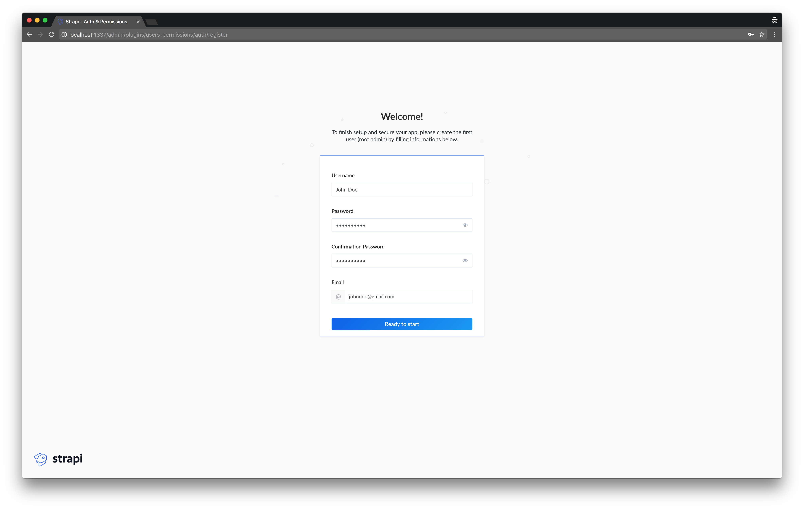
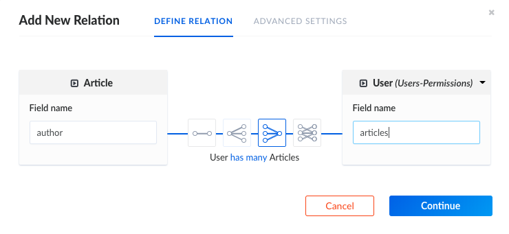
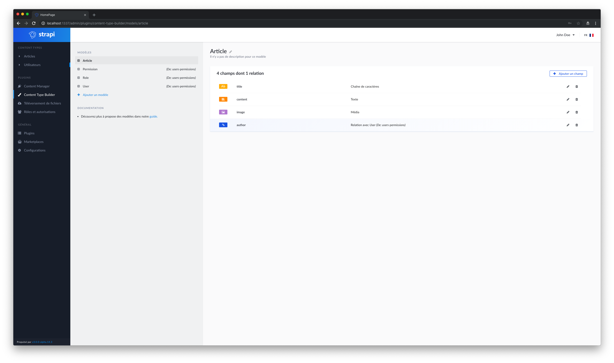
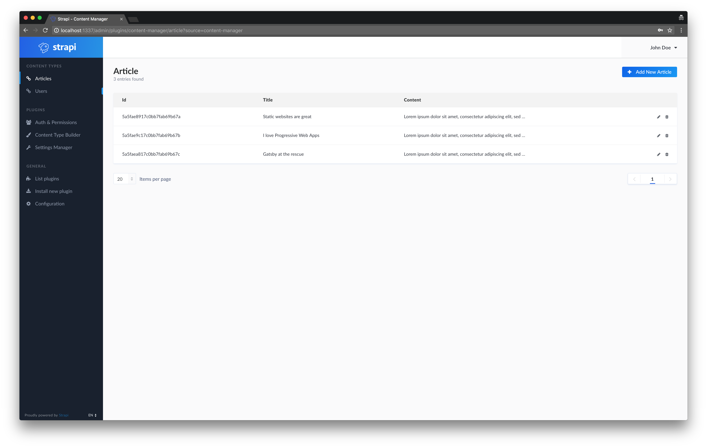
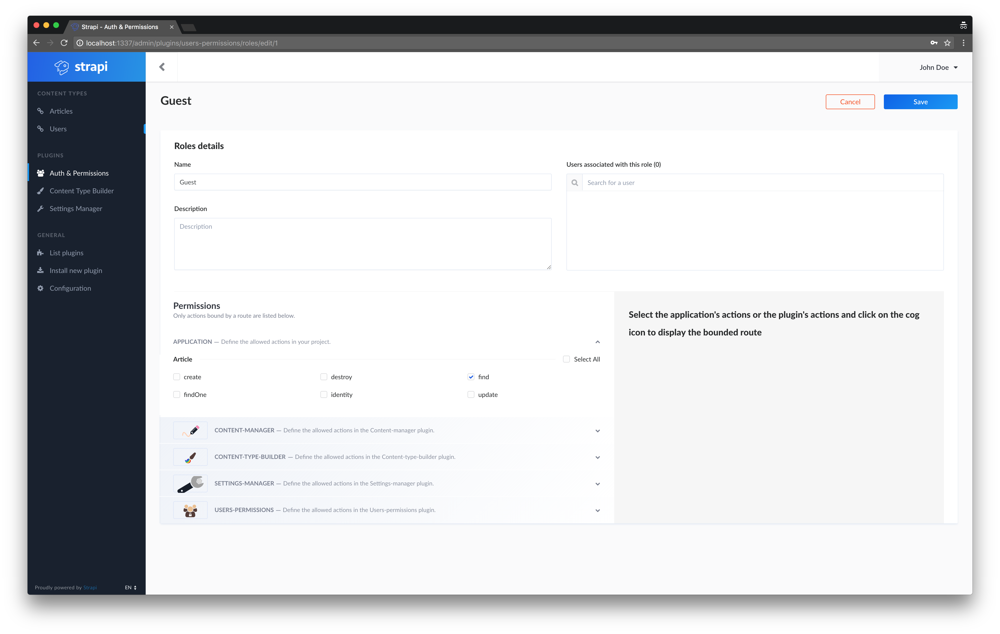
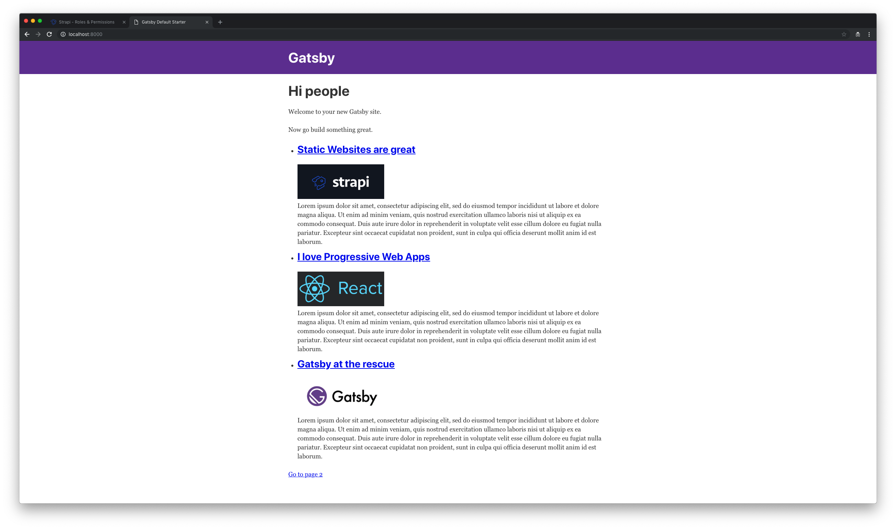
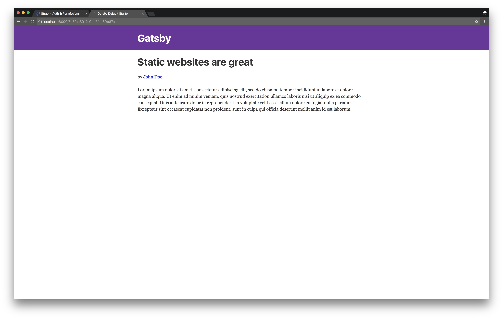
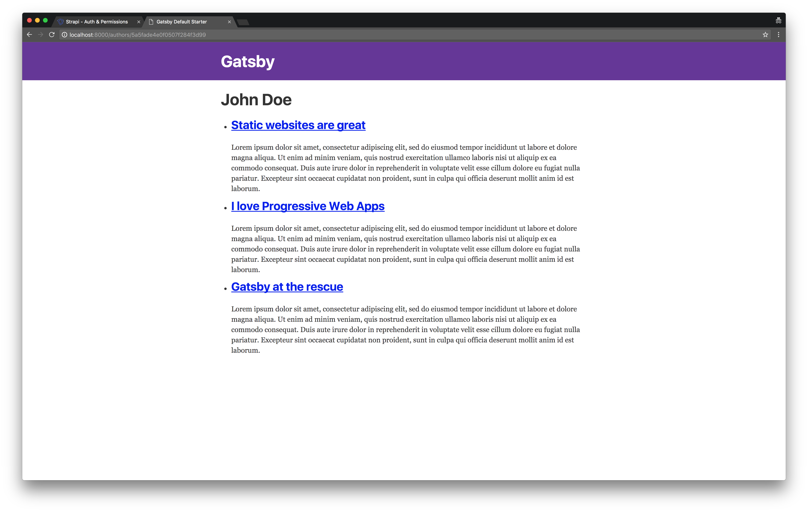

(Article updated on 20 March 2019. This updates the tutorial code examples. We added videos with additional explanations to each section.)


A static website contains Web pages with fixed content. Technically, it is a simple list of HTML files, which displays the same information to every visitor. Unlike dynamic websites, they do not require any backend programming or database. Publishing a static website is easy: the files are uploaded on a simple Web server or storage provider. The two main advantages of static websites are security and speed: there is no database so it can not be hacked and there is no need to render a page for each request, which makes Web browsing faster.

To make their creation easier, numerous open-source static websites generators are available: [Jekyll](https://jekyllrb.com/), [Hugo](https://gohugo.io/), [Hexo](https://hexo.io/), etc. Most of the time, the content is managed through static (ideally Markdown) files or a Content API. Then, the generator requests the content, injects it in templates defined by the developer and generates a bunch of HTML files.

Progressive Web Apps (PWA) are web applications, highly based on JavaScript, and are [reliable, fast and engaging](https://developers.google.com/web/progressive-web-apps/). Since they make web browsing much faster and offer a better user experience, PWA have become the default way to build Web interfaces. Thus, many amazing frontend frameworks appeared over the last couple years: Angular, React and more recently, Vue.

> Gatsby: when static websites meet Progressive Web Apps

Both static websites and PWAs have strong advantages which make us crave for a way to use them together in the same project! Luckily, we have tools that bridge the gap between them and the one we recently heard of is definitely Gatsby. So, we decided to give you a complete example of how to get started with Gatsby. A static website needs a source of content: in this example we will deliver it using an API built with Strapi.

## What is Gatsby?

[Gatsby](/) is a _blazing-fast **website framework** for React_. It allows developers to build React based websites within minutes. Whether you want to develop a blog or a corporate website, Gatsby will fill your needs.


Because it is based on React, the website pages are never reloaded which makes the generated website super fast. A large set of plugins is available allowing developers to save time coding. For example, plugins exist to get data from any source (Markdown files, CMS, etc.). Gatsby is strongly based on the ["node" interface](/docs/node-interface/), which is the center of Gatsby's data system.

Created by [Kyle Mathews](https://twitter.com/kylemathews), the project was officially [released in July 2017](/blog/gatsby-v1/). (As of February 2019, [Gatsby is in Gatsby v2](https://github.com/gatsbyjs/gatsby/blob/master/README.md) and is now [used by many companies and for hundreds of websites](/showcase/).

## What is Strapi?

[Strapi](https://strapi.io) is an _open source **Headless CMS Frontend Developers Love**_. It's more than a [Node.js Framework and more than a Headless CMS](https://strapi.io/overview), it saves weeks of API development time, and allows easy long-term content management through a beautiful administration panel _anyone can use_.


Thanks to its extensible plugin system, it provides a large set of built-in features: Admin Panel, Authentication & Permissions management, Content Management, API Generator, etc.

Unlike other CMSs, **Strapi is 100% open-source**, which means:

- **Strapi is completely free**.
- You can **host it on your own servers**, so you own the data.
- It is entirely **customisable and extensible**, thanks to the plugin system.

## Learn Gatsby with Strapi Headless CMS Video Tutorial Series

Please follow along watching the videos below and reading the text. You can watch just the videos or read just the text, but you will get the most from this tutorial by watching and reading both. The videos are designed to be used together with this article.

**_The videos follow the exact sequence of this article. The videos contain additional information and additional configuration details for a few sections. However, for intermediate to advanced users this article will be sufficient to get oriented and started building Strapi powered Gatsby projects._**

### Index of Tutorial

1. [Introduction](#1-introduction)
2. [Installation](#2-installation)
3. [Content Types](#3-content-types)
4. [Roles and Permissions](#4-roles-and-permissions)
5. [Setting up Gatsby](#5-setting-up-gatsby)
6. [Create the Index page view](#6-create-our-index-page)
7. [Create the Article page view](#7-create-the-article-page-view)
8. [Gatsby Images & the Article page view](#8-gatsby-images-and-author-page)

Note: Final tutorial and code is available at [the GitHub repo for the Strapi and Gatsby tutorial](https://github.com/strapi/strapi-examples/tree/master/gatsby-strapi-tutorial). In this repo, you can download and/or copy/paste the [example content](https://github.com/strapi/strapi-examples/tree/master/gatsby-strapi-tutorial/content-for-tutorial).

Note: Within the content below we provide links that open a running _localhost_ project. For either Strapi or Gatsby. These will not work if your server(s) have not been started.

### 1. Introduction

This video series will take you step by step through creating a blog in Gatsby and teach you how to connect it to the open sourced [headless CMS](/docs/headless-cms/) - Strapi.

https://youtu.be/It4PRFJJaF0

_Important links from Video:_

- [Strapi Official Website](https://strapi.io/)
- [Gatsby JS Official Website](/)
- [Gatsby JS Starters](/starters/?v=2)
- [Gatsby JS Default Starter Demo](https://gatsby-starter-default-demo.netlify.com/)

### 2. Installation

https://youtu.be/4QnDgxtWqOI

_Important links from Video:_

- [Node 10 Installation](https://nodejs.org/en/)
- [Strapi Installation Documentation](https://strapi.io/documentation/3.x.x/getting-started/quick-start.html)

#### Strapi CMS Setup

To make the magic happen, let's create a Strapi headless CMS and add some content.

#### Create a Strapi project

##### Install Strapi

_Requirements: please make sure [Node 10](https://nodejs.org/en/download/) (or higher) is installed and running on your machine._

Install Strapi using npm:

```bash
npm i strapi@alpha -g
```

_Note: Strapi v3 is still an alpha version, but it will be fine for this tutorial._

##### Generate a Strapi project

Create a directory named `tutorial`:

```bash
mkdir tutorial
```

Navigate into `tutorial`and then, using a single command, set-up and start your project inside your `tutorial` folder:

```bash
cd tutorial
strapi new cms --quickstart
```

Using the `--quickstart` flag creates a full Strapi project and automatically starts the server and opens up a tab in your browser.

(If you leave off `--quickstart`. Strapi allows you to configure the project according to your needs, Strapi will ask you some questions about your preferences. In this case, reply to each of them or press enter to keep the default values. If you choose a different database than _SQLite_, you will need to separately install that database onto your system.)

Additional information can be found in the [Official Strapi documentation](https://strapi.io/documentation/3.x.x/getting-started/quick-start.html).

#### Create your first User

Add your first user from the registration page: `http://localhost:1337/admin/plugins/users-permissions/auth/register`. This will be the **_root admin user_**.



#### Restarting Strapi

After installation, and initial use, you will often close your project and work on other things, reboot your computer, etc. Therefore, you will need to restart Strapi and your project.

Enter inside your project folder, on the command line, (in this case `tutorial/`, :

```bash
cd cms
```

From `cms/`, launch the Strapi server:

```bash
strapi start
```

Starting here, you should be able to visit the admin panel of your project: `http://localhost:1337/admin`. You will now be directed to a login screen. Login using your **_admin root user_** or other user you have already created.

### 3. Content Types

https://youtu.be/cPEkpfik6X4

_Important links from Video:_

- [Sample Content for Demo](https://github.com/strapi/strapi-heroku-cms-demo/tree/master/content-for-tutorial)

#### Create a Content Type

Strapi CMS projects are based on a data structure called Content Types (equivalent to models in frameworks and Content Types in WordPress).

Create a Content Type:`http://localhost:1337/admin/plugins/content-type-builder/` named `article` with four fields:

- `title` (type `string`)
- `content` (type `text`)
- `image` (type `media`)
- `author` (type `relation`, many articles to one user)





After creating your fields, as above, save your new content type and wait for Strapi to restart.

#### Insert some entries

Add some articles in the database. To do so, follow these instructions:

1.  Visit the articles list page: `http://localhost:1337/admin/plugins/content-manager/article`.
2.  Click on `Add New Article`.
3.  Insert values, link to an author and submit the form.
4.  Create two other articles.

Note: You can download the sample content from the video [here](https://github.com/strapi/strapi-examples/tree/master/gatsby-strapi-tutorial/content-for-tutorial).



### 4. Roles and Permissions

https://youtu.be/1jev6QRwcSo

#### Allow access to Article

For security reasons, API access `http://localhost:1337/articles` is, by default, restricted. To allow access, visit the Auth and Permissions section for Public role at `http://localhost:1337/admin/plugins/users-permissions/roles`, click on `Public`, select the `Article - find` action and save. At this point, you should be able to request the list of articles with `http://localhost:1337/articles`.



#### Static website development

Great job, our API is ready! We can start developing the static website.

### 5. Setting up Gatsby

https://youtu.be/SnrEEW1uTlU

_Important links from Video:_

- [Official Gatsby Documentation](/docs/)
- [Gatsby PWA support](/packages/gatsby-plugin-offline/)

#### Install Gatsby

First, install Gatsby CLI:

```bash
npm install --global gatsby-cli
```

#### Generate a Gatsby project

In the folder `tutorial` that you previously created, generate your brand new blog:

```bash
gatsby new blog
```

#### Start in development mode

Enter in your project's folder:

```bash
cd blog
```

Start the server:

```bash
gatsby develop
```

At this point, you should already be able to get access to your Gatsby website at this address: `http://localhost:8000`.

#### Install the Strapi source plugin

When you manage a static website, your data can come from different sources: Markdown files, CSV files, a WordPress website (using the JSON REST API plugin), etc.

Gatsby understands this pretty well. So its creators decided to build a specific and independent layer: the data layer. This entire system is strongly powered by [GraphQL](http://graphql.org).

To connect Gatsby to a new source of data, you have to [develop a new source plugin](/docs/creating-a-source-plugin/). Fortunately, [several source plugins already exist](/docs/plugins), so one of them should fill your needs.

In this example, we are using Strapi. Obviously, we are going to need a source plugin for Strapi APIs. Good news: [we built it for you](https://github.com/strapi/gatsby-source-strapi)!

Let's install it:

```bash
npm install --save gatsby-source-strapi
```

This plugin needs to be configured. Replace the content of `gatsby-config.js` with:

```js:title=/blog/gatsby-config.js
module.exports = {
  siteMetadata: {
    title: "My super blog",
    description: "Gatsby blog with Strapi",
    author: "Strapi team",
  },
  plugins: [
    "gatsby-plugin-react-helmet",
    {
      resolve: `gatsby-source-filesystem`,
      options: {
        name: `images`,
        path: `${__dirname}/src/images`,
      },
    },
    {
      resolve: "gatsby-source-strapi",
      options: {
        apiURL: "http://localhost:1337",
        contentTypes: [
          // List of the Content Types you want to be able to request from Gatsby.
          "article",
          "user",
        ],
        queryLimit: 1000,
      },
    },
    "gatsby-transformer-sharp",
    "gatsby-plugin-sharp",
    {
      resolve: `gatsby-plugin-manifest`,
      options: {
        name: "gatsby-starter-default",
        short_name: "starter",
        start_url: "/",
        background_color: "#663399",
        theme_color: "#663399",
        display: "minimal-ui",
        icon: "src/images/gatsby-icon.png", // This path is relative to the root of the site.
      },
    },
    "gatsby-plugin-offline",
  ],
}
```

#### Allow access to User

Remember, when we created the content type we created a relation between User and Articles.

Like `Article`,`User`, link `http://localhost:1337/articles` is likewise, by default, restricted. But Gatsby needs access, so to allow access, visit the Auth and Permissions section for Public role at `http://localhost:1337/admin/plugins/users-permissions/roles`, click on `Public`, select the `User - find` action and save. After saving; Gatsby will have access to all the necessary content types managed by Strapi (for this tutorial).

Restart Strapi from the command line, inside the `cms` folder - first by `Ctrl`+ `C` to stop the server; and then typing `strapi start`, to restart it.

Next, restart the server to ensure Gatsby registers these updates.

### 6. Create our Index Page

https://youtu.be/UaFgCubwRD8

_Important links from Video:_

- The graphQL interface from your local host: `http://localhost:8000/___graphql`

#### Articles list

First, we want to display the list of articles. To do so, add the following content in the existing home page file:

```jsx:title=/blog/src/pages/index.js
import React from "react"
import { Link, graphql } from "gatsby"
import Layout from "../components/layout"

const IndexPage = ({ data }) => (
  <Layout>
    <h1>Hi people</h1>
    <p>Welcome to your new Gatsby site.</p>
    <p>Now go build something great.</p>
    <ul>
      {data.allStrapiArticle.edges.map(document => (
        <li key={document.node.id}>
          <h2>
            <Link to={`/${document.node.id}`}>{document.node.title}</Link>
          </h2>
          <p>{document.node.content}</p>
        </li>
      ))}
    </ul>
    <Link to="/page-2/">Go to page 2</Link>
  </Layout>
)

export default IndexPage

export const pageQuery = graphql`
  query IndexQuery {
    allStrapiArticle {
      edges {
        node {
          id
          title
          content
        }
      }
    }
  }
`
```

##### What are we doing here?

At the end of the file, we export `pageQuery`, a GraphQL query which requests the entire list of articles. As you can see, we require only the `id`, `title` and `content` fields, thanks to the precise GraphQL query language.

Then, we pass the `{ data }` destructured object as parameter of `IndexPage` and loop on its `allStrapiArticle` object to display the data.


##### Tip: generate your GraphQL query in seconds!

Gatsby includes a useful GraphiQL interface. It makes GraphQL queries development way easier and intuitive. Take look at it on `http://localhost:8000/___graphql` and try to create some queries.

##### Adding images

To add images, we will need to import `Img` from package `gatsby-image` installed by default. Replace the content of `blog/src/pages/index.js` with the following :

```jsx:title=/blog/src/pages/index.js
import React from "react"
import { Link, graphql } from "gatsby"
import Img from "gatsby-image"
import Layout from "../components/layout"

const IndexPage = ({ data }) => (
  <Layout>
    <h1>Hi people</h1>
    <p>Welcome to your new Gatsby site.</p>
    <p>Now go build something great.</p>
    <ul>
      {data.allStrapiArticle.edges.map(document => (
        <li key={document.node.id}>
          <h2>
            <Link to={`/${document.node.id}`}>{document.node.title}</Link>
          </h2>
          
          <p>{document.node.content}</p>
        </li>
      ))}
    </ul>
    <Link to="/page-2/">Go to page 2</Link>
  </Layout>
)

export default IndexPage

export const pageQuery = graphql`
  query IndexQuery {
    allStrapiArticle {
      edges {
        node {
          id
          image {
            childImageSharp {
              fixed(width: 200, height: 125) {
                ...GatsbyImageSharpFixed
              }
            }
          }
          title
          content
        }
      }
    }
  }
`
```



### 7. Create the Article page view

https://youtu.be/FTzwb49tBvw

_Important links from Video:_

- [Gatsby Project Structure](/docs/gatsby-project-structure/#gatsby-project-structure)

#### Article view

Our website now starts looking like a blog which is a good thing. However, an important part is still missing: the article’s details page.

Let's create the template, containing a specific GraphQL request and defining the content displayed:

In order to do this, first create a folder called `templates` in your `src` directory. Then within `templates` create a file called `article.js`.

```jsx:title=/blog/src/templates/article.js
import React from "react"
import { Link, graphql } from "gatsby"
import Img from "gatsby-image"
import Layout from "../components/layout"

const ArticleTemplate = ({ data }) => (
  <Layout>
    <h1>{data.strapiArticle.title}</h1>
    <p>
      by{" "}
      <Link to={`/authors/User_${data.strapiArticle.author.id}`}>
        {data.strapiArticle.author.username}
      </Link>
    </p>
    
    <p>{data.strapiArticle.content}</p>
  </Layout>
)

export default ArticleTemplate

export const query = graphql`
  query ArticleTemplate($id: String!) {
    strapiArticle(id: { eq: $id }) {
      title
      content
      image {
        childImageSharp {
          fixed(width: 200, height: 125) {
            ...GatsbyImageSharpFixed
          }
        }
      }
      author {
        id
        username
      }
    }
  }
`
```

That looks fine, but at this point, Gatsby does not know when this template should be displayed. Each article needs a specific URL. So, we are going to inform Gatsby about the new URLs we need thanks to the [`createPage` function](/docs/creating-and-modifying-pages).

First, we are going to code a new function called `makeRequest` to execute the GraphQL request. Then, we export a function named `createPages` in which we get the list of articles and create a page for each of them. Here is the result:

```jsx:title=/blog/gatsby-node.js
const path = require(`path`)

const makeRequest = (graphql, request) =>
  new Promise((resolve, reject) => {
    // Query for nodes to use in creating pages.
    resolve(
      graphql(request).then(result => {
        if (result.errors) {
          reject(result.errors)
        }

        return result
      })
    )
  })

// Implement the Gatsby API “createPages”. This is called once the
// data layer is bootstrapped to let plugins create pages from data.
exports.createPages = ({ boundActionCreators, graphql }) => {
  const { createPage } = boundActionCreators

  const getArticles = makeRequest(
    graphql,
    `
    {
      allStrapiArticle {
        edges {
          node {
            id
          }
        }
      }
    }
    `
  ).then(result => {
    // Create pages for each article.
    result.data.allStrapiArticle.edges.forEach(({ node }) => {
      createPage({
        path: `/${node.id}`,
        component: path.resolve(`src/templates/article.js`),
        context: {
          id: node.id,
        },
      })
    })
  })

  // Query for articles nodes to use in creating pages.
  return getArticles
}
```

Restart the Gatsby server.

From now on, you should be able to visit the detail page by clicking on URLs displayed on the homepage.



### 8. Gatsby Images and author page

https://youtu.be/mPyJrjD3oU0

_Important links from Video:_

- [Gatsby Image Plugin](/packages/gatsby-image/)
- [Gatsby Image Demo](https://using-gatsby-image.gatsbyjs.org/)
- [Gatsby Code examples for Image Plugin](https://github.com/gatsbyjs/gatsby/tree/master/examples/using-gatsby-image/src/pages)

#### Author view

Articles are written by authors. They deserve a dedicated page.

The processes for creating author views and article pages are very similar. First, create a new file in our `templates` folder called, `author.js`. Add the code below to this file.

```jsx:title=/blog/src/templates/author.js
import React from "react"
import { Link, graphql } from "gatsby"
import Layout from "../components/layout"

const UserTemplate = ({ data }) => (
  <Layout>
    <h1>{data.strapiUser.username}</h1>
    <ul>
      {data.strapiUser.articles.map(article => (
        <li key={article.id}>
          <h2>
            <Link to={`/Article_${article.id}`}>{article.title}</Link>
          </h2>
          <p>{article.content}</p>
        </li>
      ))}
    </ul>
  </Layout>
)

export default UserTemplate

export const query = graphql`
  query UserTemplate($id: String!) {
    strapiUser(id: { eq: $id }) {
      id
      username
      articles {
        id
        title
        content
      }
    }
  }
`
```

Second, we update the `gatsby-node.js` file to create the URLs (with the below code):

```js:title=/blog/gatsby-node.js
/**
 * Implement Gatsby's Node APIs in this file.
 *
 * See: https://www.gatsbyjs.org/docs/node-apis/
 */

// You can delete this file if you're not using it

const path = require(`path`)

const makeRequest = (graphql, request) =>
  new Promise((resolve, reject) => {
    // Query for article nodes to use in creating pages.
    resolve(
      graphql(request).then(result => {
        if (result.errors) {
          reject(result.errors)
        }

        return result
      })
    )
  })

// Implement the Gatsby API “createPages”. This is called once the
// data layer is bootstrapped to let plugins create pages from data.
exports.createPages = ({ boundActionCreators, graphql }) => {
  const { createPage } = boundActionCreators

  const getArticles = makeRequest(
    graphql,
    `
    {
      allStrapiArticle {
        edges {
          node {
            id
          }
        }
      }
    }
    `
  ).then(result => {
    // Create pages for each article.
    result.data.allStrapiArticle.edges.forEach(({ node }) => {
      createPage({
        path: `/${node.id}`,
        component: path.resolve(`src/templates/article.js`),
        context: {
          id: node.id,
        },
      })
    })
  })

  const getAuthors = makeRequest(
    graphql,
    `
    {
      allStrapiUser {
        edges {
          node {
            id
          }
        }
      }
    }
    `
  ).then(result => {
    // Create pages for each user.
    result.data.allStrapiUser.edges.forEach(({ node }) => {
      createPage({
        path: `/authors/${node.id}`,
        component: path.resolve(`src/templates/author.js`),
        context: {
          id: node.id,
        },
      })
    })
  })

  // Queries for articles and authors nodes to use in creating pages.
  return Promise.all([getArticles, getAuthors])
}
```

Finally, restart the server and visit the author page from the article view's links.



## Conclusion

Congrats! You’ve successfully built a super fast and easy-to-maintain blog!

Since the content is managed by Strapi, the authors can write articles through a nice UI and developers only have to rebuild the Gatsby blog in order to update the content.

**_Where to go next?_**

Feel free to continue this project to discover both Gatsby and Strapi advantages. Here are some features you can add: list of authors, article's categories, and comment system with the Strapi API or Disqus. You can also create other types of websites (e-commerce shop, corporate website, etc.).

When your project is achieved, you will probably want to deploy it. The static website generated by Gatsby can [easily be published on storage providers](/docs/deploying-and-hosting/): Netlify, S3/Cloudfront, GitHub Pages, GitLab Pages, Heroku, etc. The Strapi API is a headless CMS, so it can be hosted on Heroku or any Linux instance that has Node.js installed.

The [code source of this tutorial is available on GitHub](https://github.com/strapi/strapi-examples/tree/master/gatsby-strapi-tutorial). To see it live, clone the repository, run `npm run setup`, start the Strapi server (`cd cms && strapi start`) and the Gatsby server (`cd blog && gatsby develop`).

We hope you enjoyed this tutorial. Feel free to comment on it, share it, and let us know how you create sites built with React and how you manage their content.
