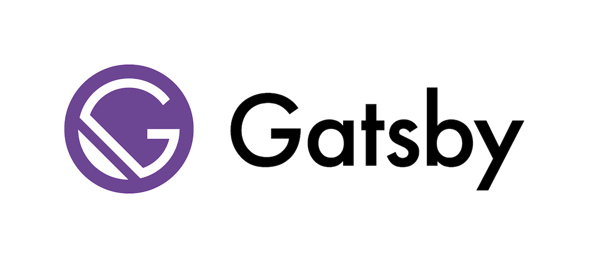
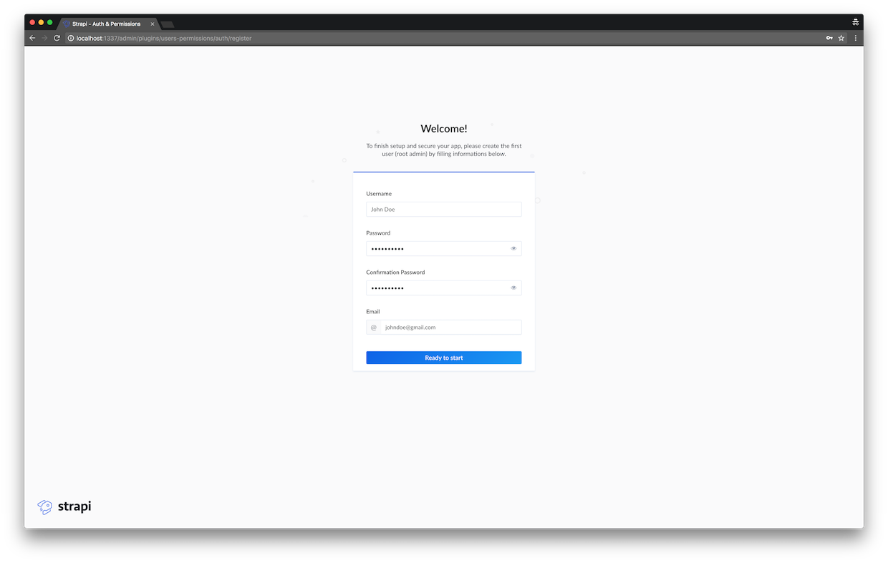
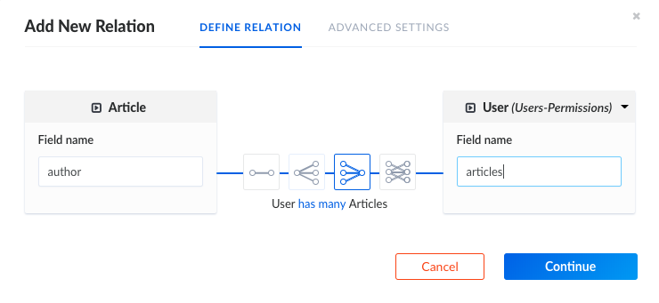
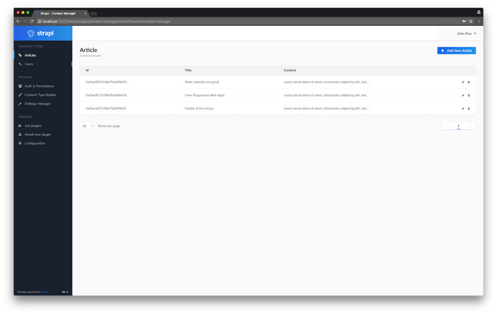
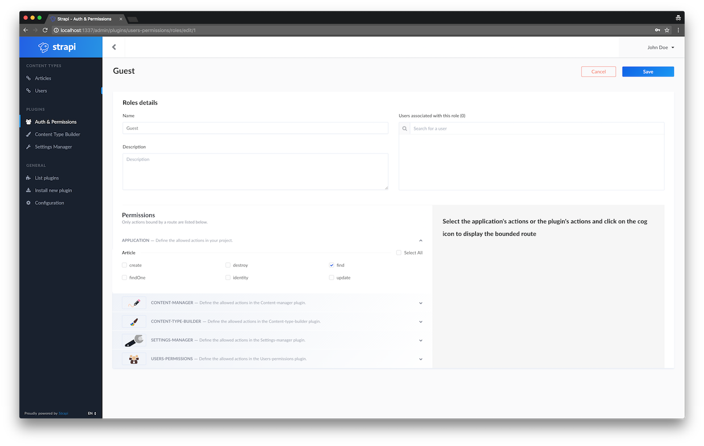
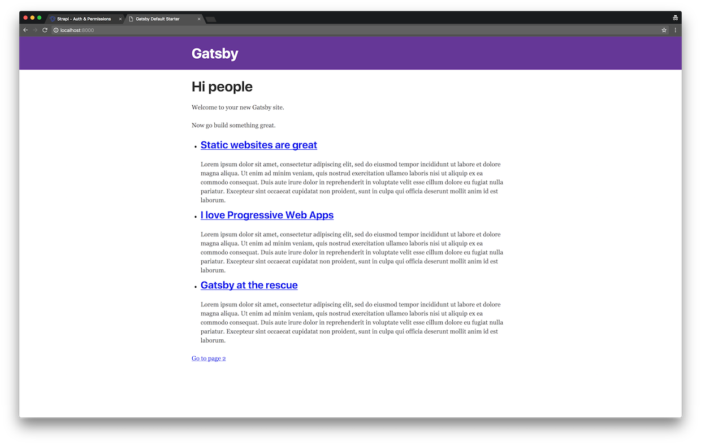
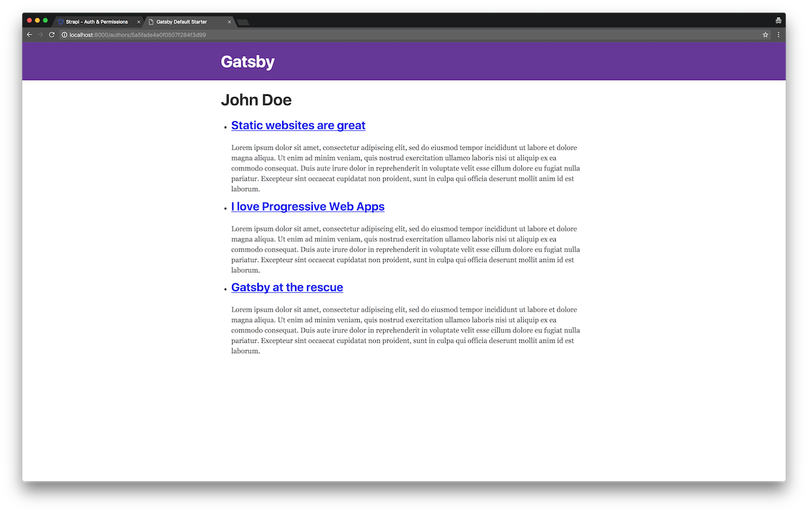

## Introduction

A static website contains Web pages with fixed content. Technically, it is a simple list of HTML files, which displays the same information to every visitor. Unlike dynamic websites, they do not require any back-end programming or databases. Publishing a static website is easy: the files are uploaded on a simple Web server or storage provider. The two main advantages of static websites are security and speed: there is no database so it can not be hacked and there is no need to render a page for each request, which makes Web browsing faster.

To make their creation easier, numerous open-source static websites generators are available: [Jekyll](https://jekyllrb.com/), [Hugo](https://gohugo.io/), [Hexo](https://hexo.io/), etc. Most of the time, the content is managed through static (ideally Markdown) files or a Content API. Then, the generator requests the content, injects it in templates defined by the developer and generates a bunch of HTML files.

Progressive Web Apps (PWA) are web applications, highly based on JavaScript, and are [reliable, fast and engaging](https://developers.google.com/web/progressive-web-apps/). Since they make web browsing much faster and offer a better user experience, PWA have become the default way to build Web interfaces. Thus, many amazing front-end frameworks appeared over the last couple years: Angular, Vue and more recently, React.

> Gatsby: when static websites meet Progressive Web Apps

Static websites and PWA both have strong advantages which make us crave for a way to use them both in the same project! Luckily, we have tools that bridge the gap between them and the one we recently heard of is definitely Gatsby. So, we decided to give you a complete example of how to get started with Gatsby. A static website needs a source of content: in this example we will deliver it using an API built with Strapi.

### What is Gatsby?

[Gatsby](https://www.gatsbyjs.org) is a _blazing-fast **website framework** for React_. It allows developers to build React-based websites within minutes. Whether you want to develop a blog or a corporate website, Gatsby will fill your needs.

[](https://www.gatsbyjs.org)

Because it is based on React, the website pages are never reloaded which makes the generated website super fast. A large set of plugins is available to let developers save time and get data from any source (Markdown files, CMS, etc.). Gatsby is strongly based on the ["node" interface](https://www.gatsbyjs.org/docs/node-interface/), which is the center of Gatsby's data system.

Created by [Kyle Mathews](https://twitter.com/kylemathews), the project has been officially [released in July 2017](https://www.gatsbyjs.org/blog/gatsby-v1/) and is already [used by tens of companies](https://github.com/gatsbyjs/gatsby#showcase).

### What is Strapi?

[Strapi](https://strapi.io) is the \*most advanced **Node.js API Content Management Framework\***. Halfway between a [Node.js framework and a headless CMS](https://strapi.io/overview), it saves weeks of API development time.

[](https://strapi.io)

Thanks to its extensible plugin system, it provides a large set of built-in features: Admin Panel, Authentication & Permissions management, Content Management, API Generator, etc.

Unlike others CMSs, **Strapi is 100% open-source**, which means:

* **Strapi is completely free**.
* You can **host it on your own servers**, so you own the data.
* It is entirely **customisable and extensible**, thanks to the plugin system.

## API Setup

To make the magic happen, let's create a Strapi API and add some content.

### Create a Strapi project

#### Install Strapi

_Requirements: please make sure [Node 8](https://nodejs.org/en/download/) (or higher) and [MongoDB](https://docs.mongodb.com/manual/installation/) are installed and running on your machine._

Install Strapi using npm:

```bash
$ npm i strapi@alpha -g
```

_Note: Strapi v3 is still an alpha version, but it will be fine for this tutorial._

#### Generate a Strapi project

Create a directory named `gatsby-strapi-tutorial`:

```bash
$ mkdir gatsby-strapi-tutorial
```

Scaffold your API inside it through a single command line:

```bash
$ cd gatsby-strapi-tutorial
$ strapi new api
```

#### Start the server

Enter inside your project's folder:

```bash
$ cd api
```

Launch the Node.js server:

```bash
$ strapi start
```

Starting now, you should be able to visit the admin panel of your project: http://localhost:1337/admin.

#### Create your first User

Add your first user from the [registration page](http://localhost:1337/admin/plugins/users-permissions/auth/register).



#### Create a Content Type

Strapi APIs are based on a data structure called Content Types (equivalent of models in frameworks and Content Types in Wordpress).

[Create a Content Type](http://localhost:1337/admin/plugins/content-type-builder/) named `article` with three fields: `title` (type `string`), `content` (type `text`) and `author` (type `relation`, many article to one user).




#### Insert some entries

Add some articles in the database. To do so, follow these instructions:

1. Visit the [articles list page](http://localhost:1337/admin/plugins/content-type-builder/models/article).
2. Click on `Add New Article`.
3. Insert values, link to an author and submit the form.
4. Create two other articles.



#### Allow access

For security reasons, [API access](http://localhost:1337/article) is, by default, restricted. To allow access, visit the [Auth and Permissions section for Guest role](http://localhost:1337/admin/plugins/users-permissions/roles/edit/1), select the `Article - find` action and save. At this point, you should be able to [request the list of articles](http://localhost:1337/article).

The [author API access](http://localhost:1337/article) is also restricted. Authorize anonymous access by selecting the `find` (in "Users & Permissions" section) action and saving the form.



## Static website development

Great job, our API is ready! We can start developing the static website.

### Install Gatsby

First, install Gatsby CLI:

```bash
$ npm install --global gatsby-cli
```

### Generate a Gatsby project

In the folder `gatsby-strapi-tutorial` that you previously created, generate your brand new blog:

```bash
$ gatsby new blog
```

### Start in development mode

Enter in your project's folder:

```bash
$ cd blog
```

Start the server:

```bash
$ gatsby develop
```

At this point, you should already be able to get access to your Gatsby website at this address: http://localhost:8000.

### Install the Strapi source plugin

When you manage a static website, your data can come from different sources: Markdown files, CSV files, a WordPress website (using the JSON REST API plugin), etc.

Gatsby understands this pretty well. So its creators decided to build a specific and independent layer: the data layer. This entire system is strongly powered by [GraphQL](http://graphql.org).

To connect Gatsby to a new source of data, you have to [develop a new source plugin](https://www.gatsbyjs.org/docs/create-source-plugin). Fortunately, [several source plugins already exist](https://www.gatsbyjs.org/docs/plugins), so on of them should fill your needs.

In this example, we are using Strapi. Obviously, we are going to need a source plugin for Strapi APIs. Good news: [we built it for you](https://github.com/strapi/gatsby-source-strapi)!

Let's install it:

```bash
$ npm install --save gatsby-source-strapi
```

This plugin need some configurations. Replace the content of `gatsby-config.js` with:

_Path: `gatsby-config.js`_

```jsx
module.exports = {
  siteMetadata: {
    title: `Gatsby Default Starter`,
  },
  plugins: [
    `gatsby-plugin-react-helmet`,
    {
      resolve: `gatsby-source-strapi`,
      options: {
        apiURL: `http://localhost:1337`,
        contentTypes: [
          // List of the Content Types you want to be able to request from Gatsby.
          `article`,
          `user`,
        ],
      },
    },
  ],
};
```

Then, restart the server to let Gatsby consider these updates.

### Articles list

First, we want to display the list of articles. To do so, add the following content in the existing home page file:

_Path: `src/pages/index.js`_

```jsx
import React from "react";
import { Link } from "gatsby";

const IndexPage = ({ data }) => (
  <div>
    <h1>Hi people</h1>
    <p>Welcome to your new Gatsby site.</p>
    <p>Now go build something great.</p>
    <ul>
      {data.allStrapiArticle.edges.map(document => (
        <li key={document.node.id}>
          <h2>
            <Link to={`/${document.node.id}`}>{document.node.title}</Link>
          </h2>
          <p>{document.node.content}</p>
        </li>
      ))}
    </ul>
    <Link to="/page-2/">Go to page 2</Link>
  </div>
);

export default IndexPage;

export const pageQuery = graphql`
  query IndexQuery {
    allStrapiArticle {
      edges {
        node {
          id
          title
          content
        }
      }
    }
  }
`;
```

#### What are we doing here?

At the end of the file, we export `pageQuery`, a GraphQL query which requests the entire list of articles. As you can see, we require only the `id`, `title` and `content` fields, thanks to the precise GraphQL query language.

Then, we pass the `{ data }` destructured object as parameter of `IndexPage` and loop on its `allStrapiArticles` object to display the data.



#### Tip: generate your GraphQL query in seconds!

Gatsby includes a useful GraphiQL interface. It makes GraphQL queries development way easier and intuitive. [Take look at it](http://localhost:8000/___graphql) and try to create some queries.

### Article view

Our website now starts looking like a blog which is a good thing. However, an important part is still missing: the article’s details page.

Let's create the template, containing a specific GraphQL request and defining the content displayed:

_Path: `src/templates/article.js`_

```jsx
import React from "react";
import { Link } from "gatsby";

const ArticleTemplate = ({ data }) => (
  <div>
    <h1>{data.strapiArticle.title}</h1>
    <p>
      by{" "}
      <Link to={`/authors/${data.strapiArticle.author.id}`}>
        {data.strapiArticle.author.username}
      </Link>
    </p>
    <p>{data.strapiArticle.content}</p>
  </div>
);

export default ArticleTemplate;

export const query = graphql`
  query ArticleTemplate($id: String!) {
    strapiArticle(id: { eq: $id }) {
      title
      content
      author {
        id
        username
      }
    }
  }
`;
```

That looks fine, but at this point, Gatsby does not know when this template should be displayed. Each article needs a specific URL. So, we are going to inform Gatsby about the new URLs we need thanks to the [`createPage` function](https://www.gatsbyjs.org/docs/creating-and-modifying-pages).

First, we are going to code a new function called `makeRequest` to execute the GraphQL request. Then, we export a function named `createPages` in which we get the list of articles and create a page for each of them. Here is the result:

_Path: `gatsby-node.js`_

```jsx
const path = require(`path`);

const makeRequest = (graphql, request) =>
  new Promise((resolve, reject) => {
    // Query for nodes to use in creating pages.
    resolve(
      graphql(request).then(result => {
        if (result.errors) {
          reject(result.errors);
        }

        return result;
      })
    );
  });

// Implement the Gatsby API “createPages”. This is called once the
// data layer is bootstrapped to let plugins create pages from data.
exports.createPages = ({ boundActionCreators, graphql }) => {
  const { createPage } = boundActionCreators;

  const getArticles = makeRequest(
    graphql,
    `
    {
      allStrapiArticle {
        edges {
          node {
            id
          }
        }
      }
    }
    `
  ).then(result => {
    // Create pages for each article.
    result.data.allStrapiArticle.edges.forEach(({ node }) => {
      createPage({
        path: `/${node.id}`,
        component: path.resolve(`src/templates/article.js`),
        context: {
          id: node.id,
        },
      });
    });
  });

  // Query for articles nodes to use in creating pages.
  return getArticles;
};
```

Restart the Gatsby server.

From now on, you should be able to visit the detail page by clicking on URLs displayed on the homepage.


### Author view

Articles are written by authors. They deserve a dedicated page.

The processes for creating author views and article pages are very similar. First, we create the template:

_Path: `src/templates/user.js`_

```jsx
import React from "react";
import { Link } from "gatsby";

const UserTemplate = ({ data }) => (
  <div>
    <h1>{data.strapiUser.username}</h1>
    <ul>
      {data.strapiUser.articles.map(article => (
        <li key={article.id}>
          <h2>
            <Link to={`/${article.id}`}>{article.title}</Link>
          </h2>
          <p>{article.content}</p>
        </li>
      ))}
    </ul>
  </div>
);

export default UserTemplate;

export const query = graphql`
  query UserTemplate($id: String!) {
    strapiUser(id: { eq: $id }) {
      id
      username
      articles {
        id
        title
        content
      }
    }
  }
`;
```

Second, we update the `gatsby-node.js` file to create the URLs:

_Path: `gatsby-node.js`_

```jsx
const path = require(`path`);

const makeRequest = (graphql, request) =>
  new Promise((resolve, reject) => {
    // Query for article nodes to use in creating pages.
    resolve(
      graphql(request).then(result => {
        if (result.errors) {
          reject(result.errors);
        }

        return result;
      })
    );
  });

// Implement the Gatsby API “createPages”. This is called once the
// data layer is bootstrapped to let plugins create pages from data.
exports.createPages = ({ boundActionCreators, graphql }) => {
  const { createPage } = boundActionCreators;

  const getArticles = makeRequest(
    graphql,
    `
    {
      allStrapiArticle {
        edges {
          node {
            id
          }
        }
      }
    }
    `
  ).then(result => {
    // Create pages for each article.
    result.data.allStrapiArticle.edges.forEach(({ node }) => {
      createPage({
        path: `/${node.id}`,
        component: path.resolve(`src/templates/article.js`),
        context: {
          id: node.id,
        },
      });
    });
  });

  const getAuthors = makeRequest(
    graphql,
    `
    {
      allStrapiUser {
        edges {
          node {
            id
          }
        }
      }
    }
    `
  ).then(result => {
    // Create pages for each user.
    result.data.allStrapiUser.edges.forEach(({ node }) => {
      createPage({
        path: `/authors/${node.id}`,
        component: path.resolve(`src/templates/user.js`),
        context: {
          id: node.id,
        },
      });
    });
  });

  // Queries for articles and authors nodes to use in creating pages.
  return Promise.all([getArticles, getAuthors]);
};
```

Finally, restart the server and visit the author page from the article view's links.



## Conclusion

Congrats! You’ve successfully built a super fast and easy-to-maintain blog!

Since the content is managed by Strapi, the authors can write article through a nice UI and developers only have to rebuilt the Gatsby blog in order to update the content.

**_Where to go next?_**

Feel free to continue this project to discover both Gatsby and Strapi advantages. Here are some features you can add: list of authors, article's categories, and comment system with the Strapi API or Disqus. You can also create other kind of websites (e-commerce shop, corporate website, etc.).

When your project is achieved, you will probably want to deploy it. The static website generated by Gatsby can [easily be published on storage providers](https://www.gatsbyjs.org/docs/deploy-gatsby/): Netlify, S3/Cloudfront, GitHub pages, GitLab pages, Heroku, etc. The Strapi API is nothing else than a simple Node.js API, so it can be hosted on Heroku or any Linux instance that has Node.js installed.

The [code source of this tutorial is available on GitHub](https://github.com/strapi/strapi-examples/tree/master/gatsby-strapi-tutorial). To see it live, clone the repository, run `npm run setup`, start the Strapi server (`cd api && strapi start`) and the Gatsby server (`cd blog && npm run develop`).

We hope you enjoyed this tutorial. Feel free to comment on it, share it, and let us know how you create sites built with React and manage their content.
