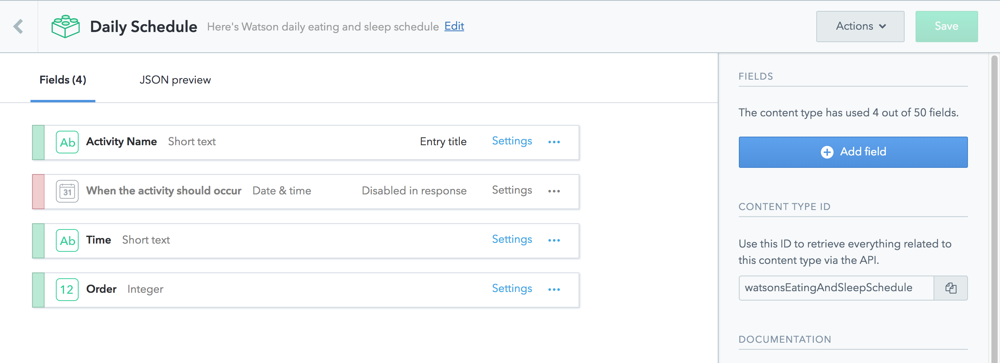
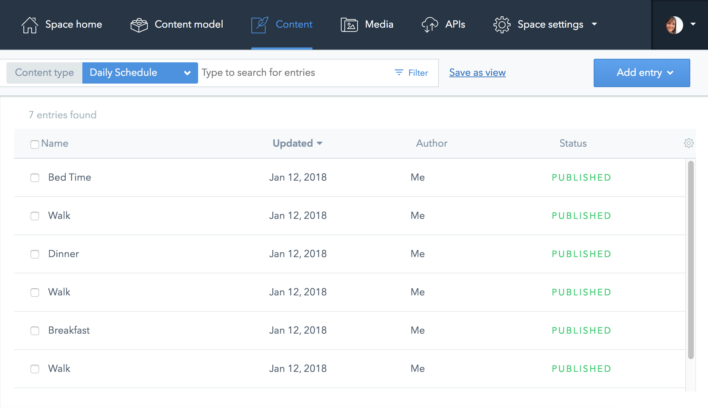
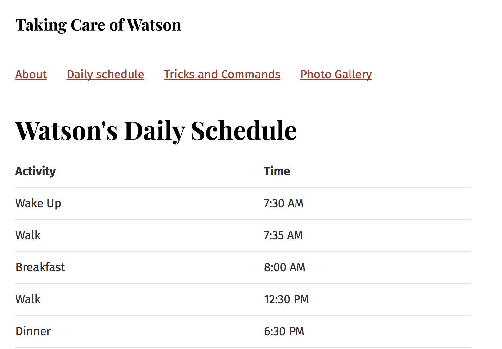

A poster of _Starry Night_ by Vincent Van Gogh followed me to each new dorm room in college until it ripped beyond repair. I loved that poster.

My poster of _Starry Night_ often led to debates with my sister (a professional artist) about the merits and demerits of reprinting great works of art.

As much as I revere the original, I also love that printing technology can put _Starry Night_ on tote bags, coffee mugs, posters, t-shirts, and more. Technology has made great art accessible to a wide range of people (without advanced printers and computers, original paintings can only be shared with people through painstaking replication via the original medium: oil painting on a canvas).


For the same reason that I love seeing _Starry Night_ on a poster, I loved building a website with React and Contentful; together, they allow images and text to easily appear in various formats across multiple platforms.

It’s much faster and easier to resize and reuse the content you already have when you don’t have to painstakingly re-create for mobile, for web, etc. You basically just print it, again, and again, and again, in small and large and medium formats, in websites, mobile apps, multiple languages. Just...push a button on a printer to make copies. Easy, right?

Well, easy if you already know React, at least. I wanted to make little site about my dog, Watson, yet didn’t know how to code.

Sometimes a friend or family member babysits him, and it's time-consuming to either write instructions or update and print new guides for babysitters since he learns new commands every day. A website seemed like a better way to manage this.

Here’s the site I built for my dog's babysitters after learning the basics of Contentful and React: http://watson.surge.sh/. Following are instructions on how you can also build a site with Contentful and React with tips I learned while building my site.


## What is React? Why choose it?


React is a JavaScript library for building user interfaces. React helps developers and designers create composable UI components that painlessly adapt to data changes.

## What is Contentful? Why choose it?


Contentful is a headless Content Management System (CMS) that lets you organize your content into what could be called “modules,” or little bits of data that can be rearranged to appear nicely on mobile devices, tablets, computers, virtual reality devices (this is my own joke, but...maybe someday?) and more.

Actually, the way Contentful handles bits of content means that you can push content out when new technology develops without having to redesign, rewrite, or rethink all of it for a new format.

## Pulling data in and pushing data out

If you have a JSON file with content in it, you could pull it into Contentful using [contentful-import](https://github.com/contentful/contentful-import), which I found out by chatting with a nice person in the Contentful chat window. Since I was creating new content, I didn’t need this and just created content straight in Contentful. For the first minute or so, I couldn’t figure out what a “content model” could or should look like. Luckily, the free trial offers a sample project that I opened and after looking around it for a couple minutes, I was good to go.






If you do create content directly in Contentful, make sure to name your fields in a way you can remember when you create GraphQL queries. If you use GraphiQL, it can suggest fields to you, but this will only help if the field names are clear and memorable.

As far as pushing data out to my site goes, I didn't know which API or token I needed. I wondered why there were four APIs and two management tokens. The Contentful documentation on this was fairly fragmented, so I just installed the gatsby-source-contentful plugin and then put the example Space ID and Example token into my gatsby-config.js file. I think this was the right thing to do, because it worked.

Gatsby-config.js file:

```jsx
module.exports = {
  siteMetadata: {
    title: `Taking Care of Watson`,
  },
  plugins: [
    `gatsby-plugin-glamor`,
    {
      resolve: `gatsby-plugin-typography`,
      options: {
        pathToConfigModule: `src/utils/typography`,
      },
    },
    //Here's where I include the gatsby-source-contentful plugin.
    // And also I added the spaceID and accessToken I got from my Contentful account.
    {
      resolve: `gatsby-source-contentful`,
      options: {
        spaceId: `g0b694a663ft`,
        accessToken: `cc94019b03af3894ec87eded57fffd67c6785f1c6fb6b2c3e67ded27682b0c02`,
      },
    },
    `gatsby-transformer-sharp`,
    `gatsby-plugin-sharp`,
  ],
};
```

## Creating pages and GraphQL queries

Once Contentful and Gatsby were getting along well together, I created pages and added a few other style-oriented plugins (Glamor and Typography) when I realized I wanted those. Then, I used GraphiQL to create queries that could pull my Contentful content into my site.

After creating queries for each type of content I wanted (daily schedule, list of tricks & commands Watson knows, and a photo gallery), I saved each query in its corresponding page to see if anything broke. There were a few instances in which GraphiQL hadn’t let me know I had errors in the little ways I tried to sort data.

Here’s an instance of a GraphiQL query that worked in there but not in the actual code. It needs to read `(sort: {field: [order]})` with the square brackets around the word "order" because there are multiple fields I can sort by; I had forgotten the brackets and GraphiQL said it would work, but then it didn't work. Here's the correct format:

```graphql
{
  allContentfulWatsonsEatingAndSleepSchedule(sort: { fields: [order] }) {
    edges {
      node {
        activityName
        time
      }
    }
  }
}
```

## Making data look nice on the site

Once I got my GraphQL queries working, I called a couple friends for help rendering the data to each page on my site. They called this “printing,” a word that I enjoyed because it reminded me of the Vincent Van Gogh poster I had.

Here is one of the first pages I rendered into a table format:



Here are more examples of pages I created. This is the photo gallery page:

```jsx
import React from "react";

export default ({ data }) => {
  console.log(data);
  // The next line is where the code drills deeper into the data structure to finally get to photos.
  // In order to create the correct order here, follow the structure of the GraphQL query.
  const photos = data.allContentfulPhotoGallery.edges[0].node.photos;
  console.log(photos);

  return (
    <div>
      <h1>Photo Gallery</h1>
      // The next line is where I’m map the photos data into React components.
      {photos.map(photo => (
        <div>
          <br />
          <br />
          // The next line is where the code drills into the data structure //
          to print a specific thing to the site. // In this case, I’m printing
          each photo to the site by using its URL. // I got this structure from
          the GraphQL query.
          
          <h3>{photo.title}</h3>
        </div>
      ))}
    </div>
  );
};

export const query = graphql`
query PhotoQuery {
// starting here is where I copied and pasted the query I created in GraphiQL.
    allContentfulPhotoGallery { 
        edges { 
            node { 
                photos { 
                    title 
                    description 
                    file { 
                        url } 
                        } 
                    } 
                } 
            } 
        }`;
```

## More complex pages

The list of Tricks & Commands presented a complex challenge because not all entries on Contentful included the same content. For example, we got errors if we tried to query for a photo since some entires had photos and some did not.

Because each entry was inconsistent, my friends helped me figure out a way to use JS to make sure we only requested a photo to be printed IF the photo existed. And if a particular entry didn't have a photo, the computer could forgive it (just this once). Here is the code from that page:

```jsx
import React from "react";

export default ({ data }) => {
  const tricks = data.allContentfulTricksCommands.edges;
  console.log(tricks);
  console.log(data);

  return (
    <div>
      <h1>Tricks and Commands</h1>
      {tricks.map(trick => (
        <div>
          <br />
          <h2>{trick.node.commandPhrase}</h2>
          // This next bit of code was a little tricky. // Definitely needed
          help figuring out how to render HTML. // I ended up using
          gatsby-transformer-remark plugin and this `dangerouslySetInnerHTML`.
          <div
            dangerouslySetInnerHTML={{
              __html: trick.node.commandDescription.childMarkdownRemark.html,
            }}
          />
          {trick.node.exampleOfTheCommandInAction && (
            
          )}
          {trick.node.exampleOfTheCommandInAction && (
            <p>{trick.node.exampleOfTheCommandInAction[0].description}</p>
          )}
        </div>
      ))}
    </div>
  );
};

export const query = graphql`
  query CommandsQuery {
    allContentfulTricksCommands {
      edges {
        node {
          commandPhrase
          commandDescription {
            childMarkdownRemark {
              html
            }
          }
          exampleOfTheCommandInAction {
            file {
              url
              fileName
              contentType
            }
            description
          }
        }
      }
    }
  }
`;
```

## Final thoughts

It was awesome to get this all working because it’s clear how fast it would be to add more content without having to write any fresh code. Amazing. For example, if I teach my dog 10 new dog tricks tomorrow, I could add these tricks to Contentful, restart the dev server, and have an up-to-date site. Done.

This workflow would be exponentially beneficial to bigger teams of editors and developers since it reduces the amount of legwork necessary to implement content changes. Does this mean that using React + Contentful means you’re working yourself out of a job? Not likely; it probably just means you’ll get to focus on improving old stuff and building new stuff instead of maintaining (yawn and ouch) old stuff.

My next step is to learn React better so I can do some fancy designs. I’d also like to see Contentful clarify their API docs and to see GraphiQL quit lying to me about how to sort things.

Also, I’m still trying to figure out why sometimes field names aren’t updating in GraphiQL when they are changed in Contentful (restarting the dev server didn’t fix that).

Now, for the most important question: who wants to babysit my dog? Alexa? Siri? Maybe someday. :)
