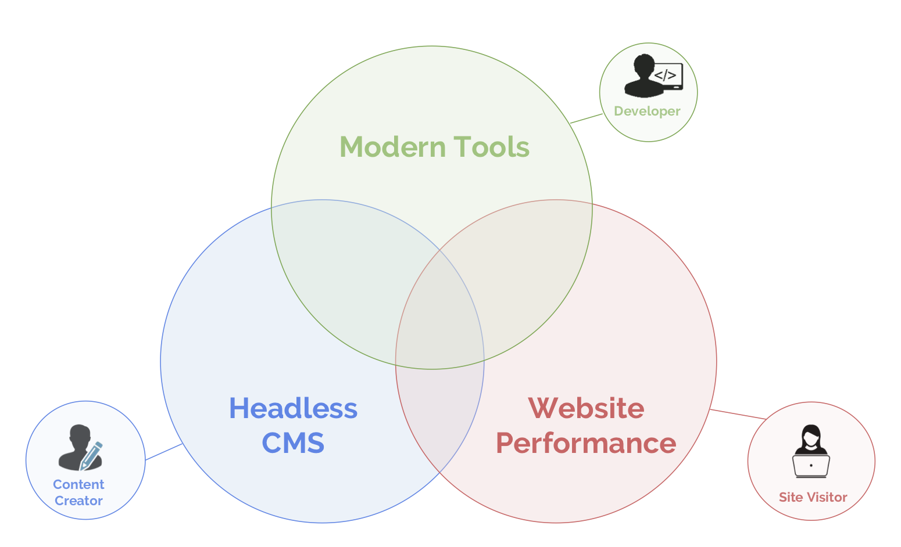

The CMS was born to make content sites _possible_. Now, it’s being reimagined to make them _incredible_.

In the early 2000s, publishing on the web was difficult. The CMS emerged as a single application to store content, build sites, and deliver them to users.

Over time, the feature landscape broadened -- key areas like search, analytics, payments, personalization, and e-commerce emerged. In each category, specialized tools improved rapidly, while the quality of monolithic enterprise CMS applications like Adobe Experience Manager and Sitecore has stayed roughly the same.

## Modularizing the CMS

Today, a website team running an e-commerce site can store product inventory in [Shopify](https://www.shopify.com/), product listings in [Salsify](https://www.salsify.com/) and reviews in [Bazaarvoice](https://www.bazaarvoice.com/). A team running a paywalled content site can create stories in [WordPress](https://wordpress.org/), store video in [JWPlayer](https://www.jwplayer.com/), user data in [Auth0](https://auth0.com/), and subscription data in [Recurly](https://recurly.com/).

When website teams want to add search, they can turn to [Algolia](https://www.algolia.com/); for payments, [Stripe](http://stripe.com); for analytics, [Segment](https://segment.com/); for A/B testing, [Optimizely](https://www.optimizely.com/); for personalization, [Evergage](https://www.evergage.com/).

Teams are adopting these services because each is tailored to a specific use-case; the generic enterprise CMS alternative is often optimized for none.

<figure>
  
  <figcaption>The modularization of the CMS</figcaption>
</figure>

## Emergence of the Content Mesh

This is the first post in a series, Journey to the Content Mesh, intended to explain the emergence of a "content mesh" -- the infrastructure layer for a decoupled website. The content mesh stitches together content systems in a modern development environment while optimizing website delivery for performance.

The previous generation of enterprise CMS offered an often-generic content editing experience glued to out-of-date development and deployment environments. The emerging strategy for content management selects best-of-breed solutions, tailored to specific use-cases like e-commerce or blogging; it provides a modern framework for rapid iteration and it generates lightning fast websites out of the box.

The content mesh empowers developers while preserving content creators’ workflows. It gives you access to best-of-breed services _without_ the pain of manual integration.

## Three Areas of Rapid Innovation

Change is being spurred by the confluence of three revolutions in how we create and consume content:

- _Content management._ Monolithic CMS applications are being replaced by modular, specialized content systems.

- _Development techniques._ Modern UI frameworks like React are becoming essential to rich user experiences.

- _Performance._ As mobile surpasses 50% of internet traffic, high-performance is becoming a must-have, not a nice-to-have.

<figure>
  
  <figcaption>Three areas of rapid innovation</figcaption>
</figure>

These technological changes have made modern web technology both _essential_ for creating fresh, novel, and engaging digital experiences, and _more accessible_ for the enterprise.

Each change primarily affects a different stakeholder --- marketing, development/IT, and the end user, respectively.

The key challenge is that without a content mesh, integrating these systems together is a lot of work. Forrester titled one of their [report sections](https://www.tangomodem.com/wp-content/uploads/2017/09/the-rise-of-the-headless-cms.pdf): "Warning: Headless Content Management Is For Do-It-Yourself Shops." But _with_ a content mesh, all of these systems can be brought together in a unified, low-cost, low-defect whole.

In other words, the content mesh makes developers, content creators, and users _all_ happy.

## Integrating Modern Technologies Without the DIY Work

As this series continues, we’ll explore the rise of this "content mesh" -- that allows enterprises to adopt these new technologies without needing to DIY themselves.

In Part 2, [The Unbundling of the CMS](/blog/2018-10-10-unbundling-of-the-cms), we’ll explore the rise of headless CMSs and best-of-breed website content and functionality systems.

In Part 3, [The Rise of Modern Web Development](/blog/2018-10-11-rise-of-modern-web-development), we’ll detail the maturing of the JavaScript ecosystem, the emergence of stable UI libraries like React for creating rich web technologies, and how they help website teams at scale build high-quality sites.

In Part 4, [Why Mobile Performance is Crucial](/blog/2018-10-16-why-mobile-performance-is-crucial), we’ll discuss the ROI of site speed, explore two modern, complementary trends for improving web performance and how website teams can get the best of both out of the box.

In our conclusion, [Creating Compelling Experiences](/blog/2018-10-18-creating-compelling-content-experiences), we’ll discuss a step-by-step approach for choosing a content architecture, modern development environment, a performance strategy -- and most importantly, choosing a "content mesh" that makes all the other choices easy. We’ll also explore how one clear option -- Gatsby -- emerges as the most feature-complete of any content mesh alternatives.

## The Modern Website Landscape

<figure>
  
  <figcaption>The modern website landscape</figcaption>
</figure>
