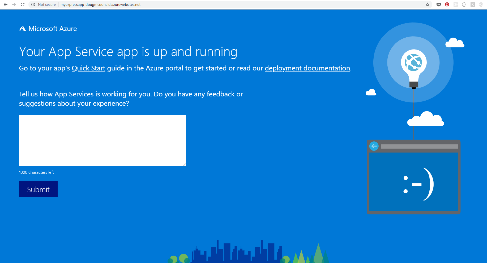

In this post we will walk through the process of deploying a Gatsby blog to Microsoft Azure from a local Git repository.

## Prerequisites

To complete this tutorial you will need the following tools:

- Node - To run the rest of the tools
- Git - To handle our local source control
- Gatsby CLI - To create your blazingly fast blog!
- Azure CLI - To deploy your blog to Azure

### Prerequisites Installation

Install Node from the [Node website](https://nodejs.org/en/) and check it's installed by checking the version from your terminal.

```bash
$ node -v
$ v10.9.0
```

Install Git in whatever way works for you, on windows use [Git for windows](https://git-scm.com/download/win) then check the version from your terminal.

```bash
$ git --version
$ git version 2.18.0.windows.1
```

Next, we can install the important part! [Gatsby](https://gatsbyjs.org/) from your terminal, run:

```bash
$ npm install --global gatsby-cli
+ gatsby-cli@2.4.2
updated 1 package in 4.868s
```

Finally, we can install the [Azure CLI](https://docs.microsoft.com/en-us/cli/azure/install-azure-cli?view=azure-cli-latest) which will allow us to create resources in azure.

> If you don't have an Azure account, [sign up today](https://azure.microsoft.com/en-us/free/) for a free 30 day account with $200 in Azure credits.

Once you've downloaded the Azure CLI, run the login command and authenticate to make sure it's working OK before carrying on.

```bash
$ az login
```

> Note: This will launch a web browser to login.

## Creating your blog

Next you will create the blog from the handy [Gatsby Starter Blog](https://github.com/gatsbyjs/gatsby-starter-blog).

> If you already have a site you want to deploy, skip forwards to [Deploy your website](#)

From your terminal run

```bash
$ gatsby new azure-blog https://github.com/gatsbyjs/gatsby-starter-blog

info Creating new site from git: https://github.com/gatsbyjs/gatsby-starter-blog.git
Cloning into 'azure-blog'...
remote: Enumerating objects: 1, done.
remote: Counting objects: 100% (1/1), done.
remote: Total 1139 (delta 0), reused 0 (delta 0), pack-reused 1138
Receiving objects: 100% (1139/1139), 2.14 MiB | 2.95 MiB/s, done.
Resolving deltas: 100% (636/636), done.
success Created starter directory layout
info Installing packages...
...
```

You can now view your website by running

```bash
$ cd azure-blog
$ gatsby develop
```

You should now see your blog in the flesh!


## Setting up Azure

The Azure CLI lets you interact with Azure from the command line, these tasks can also be performed from the [Azure Web Portal](https://azure.microsoft.com/en-gb/features/azure-portal/) if you are more comfortable.

You will do the following:

- Create a `Resource Group` to contain your `App Service`
- Create an `App Service Plan` to contain your `Web App`
- Create the `Web App` to contain your blog

### Create the resource group

A resource group is basically a container for Azure resource. Run the following command to create a resource group called `blogResourceGroup` and set an appropriate [location](https://azure.microsoft.com/en-gb/global-infrastructure/geographies/)

```bash
$ az group create --name blogResourceGroup --location ukwest
```

You can then set it as the default to avoid needing to type it in each time.

```bash
$ az configure --defaults group=blogResourceGroup location=ukwest
```

### Create the App Service Plan

An `App Service Plan` defines the physical resources available to our Web App, for this tutorial we will use the free plan in Azure (`--sku F1`), but you can scale this up if you need more advanced features.

```bash
$ az appservice plan create --name blogAppService --sku F1
```

### Create the Web App

Now you can create your Web App.

```bash
$ az webapp create --name gatsbyAzureBlog-dougmcdonald --plan blogAppService
```

> Note: This must have a globally unique name as it will automatically be given a URL in the format http://unique-name.azurewebsites.net.

### Run the website

You can now run the website with following command

```bash
$ az webapp browse --name gatsbyAzureBlog-dougmcdonald
```

You should see a website like this



## Deploy your website

To deploy our website we can create a Git repository and add a `remote` which allows the changes to push and deploy to Azure.

### Creating a Git repository

Next, we need to create a git repository in the same folder as your blog, navigate to your blog folder and run

```bash
$ git init
```

We can now `commit` your blog files through git by running

```bash
$ git add -A
$ git commit -m "Initial commit"
```

### Setup a remote

To configure your website to be deployed from our local git repository we must add a `remote`. First we need to set our credentials in the `Azure CLI`.

```bash
$ az webapp deployment user set --user-name <username> --password <password>
```

### Set up the deployment

Now you can set the deployment source within Azure, in our case `local-git`, the following command will setup the deployment and return an endpoint which we can set as our `remote`.

```bash
$ az webapp deployment source config-local-git --name gatsbyAzureBlog-dougmcdonald
{
  "url": "https://dougajmcdonald@gatsbyazureblog-dougmcdonald.scm.azurewebsites.net/gatsbyAzureBlog-dougmcdonald.git"
}
```

We can now add the `remote` to Git using the url which the Azure CLI just returned. Here we've called the remote `azure`

```bash
$ git remote add azure https://dougajmcdonald@gatsbyazureblog-dougmcdonald.scm.azurewebsites.net/gatsbyAzureBlog-dougmcdonald.git
```

## Perform the deployment

Finally, the moment you've been waiting for! You can push your local git changes to the `azure` remote to perform the deployment.

```bash
$ git push azure master
```
