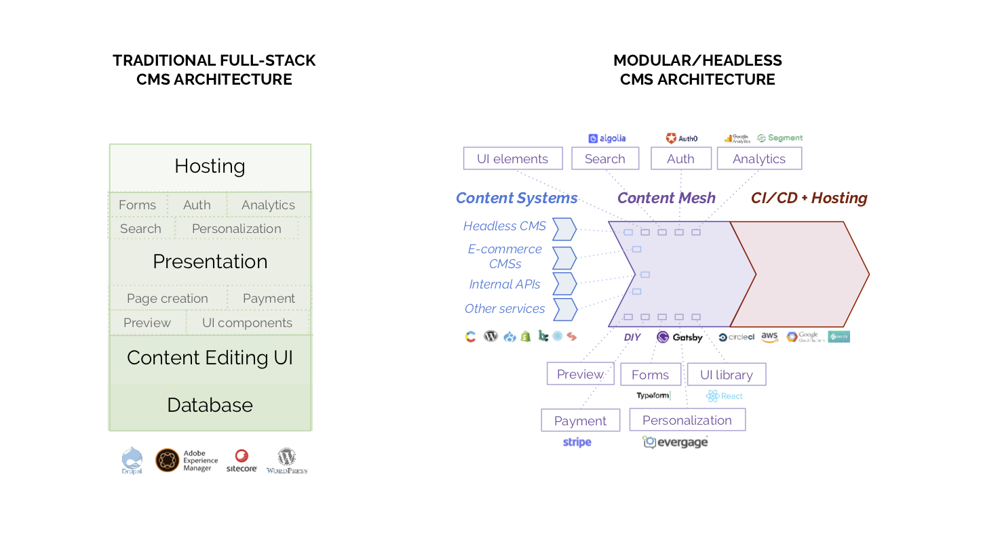
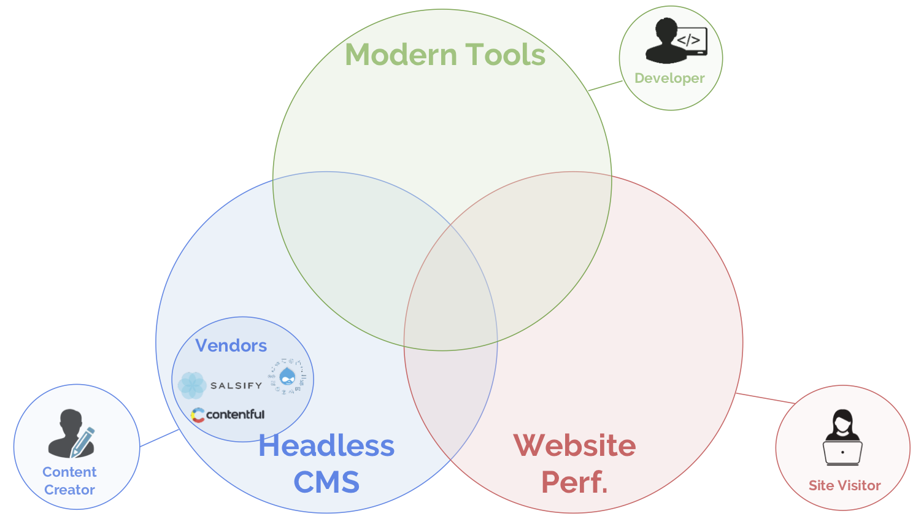

_This is Part 2 of a series. You may want to read Part 1:_ [Delivering Modern Website Experiences: The Journey to a Content Mesh](/blog/2018-10-04-journey-to-the-content-mesh).

Web users’ expectations follow a simple law: they always increase over time.

Creating compelling web content experiences has become _crucial_ in the battlefield for customer loyalty. But you can’t get _fresh_, _novel_, and _engaging_, without up-to-date content and development architectures.

Today, enterprise CPG, clothing, and consumer durables companies face dual threats from Amazon and hip DNVBs like Dollar Shave Club and Bonobos. Enterprise travel companies face off with Kayak and Expedia. News organizations have taken heavy losses from upstart content sites and Facebook/Google. And so on.

But creating compelling experiences is challenging:

- Marketers need content systems that model the website domain well to craft compelling messages.

- Development teams need UI frameworks that allow easy design customization to keep the site look and feel fresh.

- Business owners need high-quality add-ons like search, analytics, forms and payment to demonstrate value and justify continued investment. In addition, they need their sites to be _fast_.

## Generic vs best-of-breed

When compared with purpose-built CMSs like Shopify for e-commerce or Wordpress for blogging, enterprise CMS applications like Sitecore, Evoq or Adobe Experience Manager (AEM) provide generic content modules.

The enterprise CMS core development experiences are based in C#, ASP.NET, and J2EE -- languages and frameworks a decade out of date for frontend development. Add-ons are expensive and are difficult-to-use compared to pure-play alternatives.

Best-of-breed products have emerged to provide top-notch alternatives in each of these areas, but have been difficult to integrate.

One popular, paywalled, news site that currently stores all content and data in Drupal 7 is migrating to a microservices setup. They’ll handle stories in [Wordpress](https://wordpress.org/), store video in [JWPlayer](https://www.jwplayer.com/), and user data in [Auth0](https://auth0.com/). They’re doing development in React and using [Segment](https://segment.com) for analytics, [Stripe](http://stripe.com) for payments and [Recurly](https://recurly.com/) for subscriptions.

Another digital consumer brand moved from using Sitecore as a content and development platform to using [Contentful](https://www.contentful.com/) as a [headless CMS](/docs/headless-cms/), [Yotpo](https://www.yotpo.com/) for user-generated content -- primarily reviews, while development transitioned to React to provide a modern look and feel.

<figure>
  
  <figcaption>
   The modularization of the CMS
  </figcaption>
</figure>

## Integrating modular services

This API-driven approach to website tooling is perhaps better described as "modular" or “microservices” than “headless”.

With these solutions available, customers can pick vendors _à la carte_. The core value proposition of one-stop solutions like Sitecore or AEM has diminished as they do not provide the best solution for any given need.

Enterprises who have purchased these CMS solutions are left asking themselves one of the oldest questions in corporate IT: should they stick with their single-vendor application suite, with inferior but integrated modules? Or, unlock a way to integrate the best-of-breed solutions?

<figure>
  
  <figcaption>
   The [headless CMS](/docs/headless-cms/) landscape
  </figcaption>
</figure>

## Making integration feasible via a content mesh

Over the next three posts, we’ll discuss the rise of a content mesh that makes integration _feasible_ for most digital agencies and enterprise customers.

The next post, [The Rise of Modern Web Development](/blog/2018-10-11-rise-of-modern-web-development), discusses the development side -- how frameworks that increase development speed and reduce bugs have become ubiquitous.

After that, [Why Mobile Performance is Crucial](/blog/2018-10-16-why-mobile-performance-is-crucial) discusses the rise of e-commerce on smartphones, why the average site haven't been getting any faster on mobile, and existing technology that can make sites fast _by default_.

Finally, in our conclusion, Creating Compelling Experiences, we’ll discuss a step-by-step approach for choosing a content architecture, modern development environment, a performance strategy -- and most importantly, choosing an "content mesh" that makes all the other choices easy.
