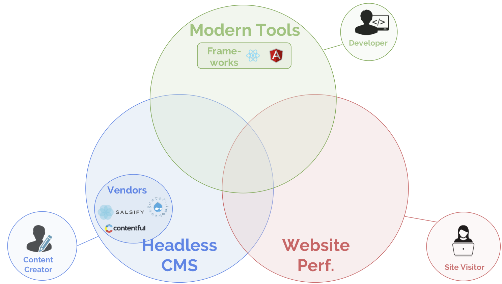

_This is Part 3 of a series. Part 1 is_ [The Journey to a Content Mesh](/blog/2018-10-04-journey-to-the-content-mesh) _and Part 2 is_ [Unbundling of the CMS](/blog/2018-10-10-unbundling-of-the-cms).

Developing for the web is _hard_. With millions of properties on the Internet, website developers have to create experiences that are compelling enough to engage audiences when new destinations are only a few keystrokes away.

And while creating rich user experiences is never an easy task, walled-garden CMS development environments introduce additional challenges. Teams are forced to work around them, but ultimately deliver less rich experiences at higher cost.

## Traditional CMS development presents challenges

Some challenges of traditional CMS development environments include:

- **Walled-garden development.** Work on projects across CMS systems often requires reimplementing basic functionality like carousels or banners. Development can be blocked due to CMS access restrictions or code freezes. Upgrade paths can be challenging when CMSs don’t support component UI versioning.

- **Maintaining local environments**. Setting up a local app server and database and keeping it up to date with team members’ changes is time-consuming, especially when switching between projects or returning after a gap in development.

- **Project organization.** Reliably installing and managing third-party dependencies, including cross-compatibility and handling bugs in upstream, is challenging. Vanilla JavaScript offers no standard project organization or code bundling patterns.

- **A difficult target environment.** Cross-browser API incompatibilities, global DOM application state, and imperative DOM APIs make it easy to inadvertently introduce bugs.

## The rise of modern frameworks

Luckily, we know how to fix these problems. Over the last five years, two modern web frameworks, React and Angular, have taken the web world by storm.

<DateChart
  title="React and Angular interest as % of JavaScript"
  series-data='[{ "name": "React", "data": [{ "value": "0.012987013", "date": "2012/08"}, { "value": "0.01369863", "date": "2012/09"}, { "value": "0.013333333", "date": "2012/10"}, { "value": "0.014285714", "date": "2012/11"}, { "value": "0.015625", "date": "2012/12"}, { "value": "0.013513514", "date": "2013/01"}, { "value": "0.012987013", "date": "2013/02"}, { "value": "0.012658228", "date": "2013/03"}, { "value": "0.012820513", "date": "2013/04"}, { "value": "0.012987013", "date": "2013/05"}, { "value": "0.012987013", "date": "2013/06"}, { "value": "0.013157895", "date": "2013/07"}, { "value": "0.012658228", "date": "2013/08"}, { "value": "0.012987013", "date": "2013/09"}, { "value": "0.011764706", "date": "2013/10"}, { "value": "0.012658228", "date": "2013/11"}, { "value": "0.01369863", "date": "2013/12"}, { "value": "0.012820513", "date": "2014/01"}, { "value": "0.011904762", "date": "2014/02"}, { "value": "0.011764706", "date": "2014/03"}, { "value": "0.011494253", "date": "2014/04"}, { "value": "0.011904762", "date": "2014/05"}, { "value": "0.011627907", "date": "2014/06"}, { "value": "0.02247191", "date": "2014/07"}, { "value": "0.023255814", "date": "2014/08"}, { "value": "0.023809524", "date": "2014/09"}, { "value": "0.022988506", "date": "2014/10"}, { "value": "0.0375", "date": "2014/11"}, { "value": "0.039473684", "date": "2014/12"}, { "value": "0.037037037", "date": "2015/01"}, { "value": "0.056818182", "date": "2015/02"}, { "value": "0.056818182", "date": "2015/03"}, { "value": "0.054347826", "date": "2015/04"}, { "value": "0.056179775", "date": "2015/05"}, { "value": "0.0625", "date": "2015/06"}, { "value": "0.07", "date": "2015/07"}, { "value": "0.076923077", "date": "2015/08"}, { "value": "0.075268817", "date": "2015/09"}, { "value": "0.085106383", "date": "2015/10"}, { "value": "0.093023256", "date": "2015/11"}, { "value": "0.095238095", "date": "2015/12"}, { "value": "0.116883117", "date": "2016/01"}, { "value": "0.129411765", "date": "2016/02"}, { "value": "0.134831461", "date": "2016/03"}, { "value": "0.137931034", "date": "2016/04"}, { "value": "0.141176471", "date": "2016/05"}, { "value": "0.131868132", "date": "2016/06"}, { "value": "0.155844156", "date": "2016/07"}, { "value": "0.148148148", "date": "2016/08"}, { "value": "0.15", "date": "2016/09"}, { "value": "0.168674699", "date": "2016/10"}, { "value": "0.168674699", "date": "2016/11"}, { "value": "0.172839506", "date": "2016/12"}, { "value": "0.188235294", "date": "2017/01"}, { "value": "0.189473684", "date": "2017/02"}, { "value": "0.191919192", "date": "2017/03"}, { "value": "0.210526316", "date": "2017/04"}, { "value": "0.22826087", "date": "2017/05"}, { "value": "0.242105263", "date": "2017/06"}, { "value": "0.258823529", "date": "2017/07"}, { "value": "0.25", "date": "2017/08"}, { "value": "0.23255814", "date": "2017/09"}, { "value": "0.252747253", "date": "2017/10"}, { "value": "0.244186047", "date": "2017/11"}, { "value": "0.253333333", "date": "2017/12"}, { "value": "0.265060241", "date": "2018/01"}, { "value": "0.272727273", "date": "2018/02"}, { "value": "0.275862069", "date": "2018/03"}, { "value": "0.285714286", "date": "2018/04"}, { "value": "0.280898876", "date": "2018/05"}, { "value": "0.333333333", "date": "2018/06"}, { "value": "0.369047619", "date": "2018/07"} ]}, { "name": "Angular", "data": [{ "value": "0.012987013", "date": "2012/08"}, { "value": "0.01369863", "date": "2012/09"}, { "value": "0.026666667", "date": "2012/10"}, { "value": "0.028571429", "date": "2012/11"}, { "value": "0.03125", "date": "2012/12"}, { "value": "0.027027027", "date": "2013/01"}, { "value": "0.038961039", "date": "2013/02"}, { "value": "0.050632911", "date": "2013/03"}, { "value": "0.051282051", "date": "2013/04"}, { "value": "0.064935065", "date": "2013/05"}, { "value": "0.077922078", "date": "2013/06"}, { "value": "0.078947368", "date": "2013/07"}, { "value": "0.088607595", "date": "2013/08"}, { "value": "0.103896104", "date": "2013/09"}, { "value": "0.105882353", "date": "2013/10"}, { "value": "0.113924051", "date": "2013/11"}, { "value": "0.109589041", "date": "2013/12"}, { "value": "0.128205128", "date": "2014/01"}, { "value": "0.142857143", "date": "2014/02"}, { "value": "0.152941176", "date": "2014/03"}, { "value": "0.16091954", "date": "2014/04"}, { "value": "0.178571429", "date": "2014/05"}, { "value": "0.197674419", "date": "2014/06"}, { "value": "0.191011236", "date": "2014/07"}, { "value": "0.209302326", "date": "2014/08"}, { "value": "0.226190476", "date": "2014/09"}, { "value": "0.229885057", "date": "2014/10"}, { "value": "0.225", "date": "2014/11"}, { "value": "0.236842105", "date": "2014/12"}, { "value": "0.234567901", "date": "2015/01"}, { "value": "0.238636364", "date": "2015/02"}, { "value": "0.25", "date": "2015/03"}, { "value": "0.25", "date": "2015/04"}, { "value": "0.247191011", "date": "2015/05"}, { "value": "0.260416667", "date": "2015/06"}, { "value": "0.27", "date": "2015/07"}, { "value": "0.274725275", "date": "2015/08"}, { "value": "0.268817204", "date": "2015/09"}, { "value": "0.255319149", "date": "2015/10"}, { "value": "0.255813953", "date": "2015/11"}, { "value": "0.261904762", "date": "2015/12"}, { "value": "0.25974026", "date": "2016/01"}, { "value": "0.270588235", "date": "2016/02"}, { "value": "0.269662921", "date": "2016/03"}, { "value": "0.275862069", "date": "2016/04"}, { "value": "0.282352941", "date": "2016/05"}, { "value": "0.274725275", "date": "2016/06"}, { "value": "0.285714286", "date": "2016/07"}, { "value": "0.283950617", "date": "2016/08"}, { "value": "0.275", "date": "2016/09"}, { "value": "0.265060241", "date": "2016/10"}, { "value": "0.253012048", "date": "2016/11"}, { "value": "0.24691358", "date": "2016/12"}, { "value": "0.258823529", "date": "2017/01"}, { "value": "0.263157895", "date": "2017/02"}, { "value": "0.252525253", "date": "2017/03"}, { "value": "0.252631579", "date": "2017/04"}, { "value": "0.260869565", "date": "2017/05"}, { "value": "0.273684211", "date": "2017/06"}, { "value": "0.270588235", "date": "2017/07"}, { "value": "0.27173913", "date": "2017/08"}, { "value": "0.255813953", "date": "2017/09"}, { "value": "0.252747253", "date": "2017/10"}, { "value": "0.255813953", "date": "2017/11"}, { "value": "0.24", "date": "2017/12"}, { "value": "0.253012048", "date": "2018/01"}, { "value": "0.25", "date": "2018/02"}, { "value": "0.252873563", "date": "2018/03"}, { "value": "0.241758242", "date": "2018/04"}, { "value": "0.258426966", "date": "2018/05"}, { "value": "0.264367816", "date": "2018/06"}, { "value": "0.273809524", "date": "2018/07"}]}]'
/>

_Source_: [Google Trends](https://trends.google.com/trends/explore?date=2012-01-01%202018-08-31&geo=US&q=%2Fm%2F012l1vxv,%2Fm%2F0j45p7w,%2Fm%2F02p97)

## Modern frameworks offer stability and faster development

Modern frameworks offer built-in performance and testing patterns/tools, encourage componentized/modular code, enable code reuse across teams, enable monolithic apps to be broken into smaller, more maintainable services, and offer a rich ecosystem to allow developers to quickly solve common problems instead of wasting cycles reinventing wheels.

Their _ubiquity_ adds stability to the landscape; React and Angular have become universal. With ubiquity comes an ecosystem of high-quality components -- tables, forms, date-pickers, whole design systems -- that are open-source and available for plugging into any site.

Modern frameworks also represent a core _technology advance_ over previous solutions that make it much easier to create visually rich, low-defect frontends:

- **Reusable UIs.** Key UI elements, such as headers, dropdowns, typeaheads, buttons, tables and so forth may be reused across the application, without copy-pasta.

- **Local application state.** Previous methods of modifying web page display relied on global state. When code at any place can modify state everywhere, the result at scale is spaghetti code. In React/Angular’s component model, components cannot modify outside state without being granted explicit permission.

- **A declarative virtual DOM.** Instead of imperatively changing specific page elements’ state in reaction to specific user actions, developers can specify desired UI state as a "view" on application state, making code more readable and less buggy.

React and Angular, along with mature ES2015+ JavaScript, and stable dependency/bundling solutions like npm and webpack, are blowing away conceptions of JS as an unserious language. They are in production of leading Fortune 500 companies, including Facebook, Twitter, Microsoft, Autodesk, Airbnb, and McDonalds.

## Modern frameworks enable compelling content experiences

While React and Angular were originally created as web _app_ solutions, with the rise of the headless CMS, usage of React and Angular on _websites_ has skyrocketed, growing 5-10X since early 2017.

<DateChart
  title="React and Angular usage among top 10k sites"
  y-axis-label="% of top 10k sites"
  series-data='[{ "name": "React", "data": [{ "date": "2017/01", "value": "0.0170"}, { "date": "2017/04", "value": "0.0223"}, { "date": "2017/06", "value": "0.0251"}, { "date": "2017/08", "value": "0.0283"}, { "date": "2018/01", "value": "0.0538"}, { "date": "2018/08", "value": "0.0738"}] },{ "name": "Angular", "data": [{ "date": "2017/06", "value": "0.0001"}, { "date": "2017/08", "value": "0.0007"}, { "date": "2018/01", "value": "0.0018"}, { "date": "2018/08", "value": "0.0184"}] }]'
/>

_Source_: [React](https://trends.builtwith.com/javascript/React), [Angular](https://trends.builtwith.com/framework/Angular) (builtwith.com)

Headless & decoupled setups allow a modern frontend to be placed over a 2000s-era [ASP.NET](http://www.dnnsoftware.com/)/[J2EE](https://www.adobe.com/marketing/experience-manager.html)/[C#](https://www.sitecore.com/)/[PHP](https://wordpress.com/) CMS and present a fresh user experience — without sacrificing the powerful content management workflows that established these CMS platforms as industry leaders in the first place.

And the evidence? Increasingly, award-winning websites such as the leading "corporate" website winners of the 2018 Webby awards, are powered by modern frontend JavaScript frameworks.

<figure>
  
  <figcaption>
    <a href="https://bmw.com">bmw.com</a> -- Angular //{" "}
    <a href="https://architecturaldigest.com">AD (Conde Nast)</a> -- React //{" "}
    <a href="https://spotify.me">Spotify.me</a> -- Vue
  </figcaption>
</figure>

Modern web development frameworks like React and Angular are the latest step transforming the content web from its original simple, document-based model to a complex, rich web experience and app platform -- and it’s happening _fast_.

<figure>
  
  <figcaption>The rise of modern frameworks</figcaption>
</figure>

In the next blog post, [Why Mobile Performance is Crucial](/blog/2018-10-16-why-mobile-performance-is-crucial), we’ll move on to the final piece of the changing content landscape puzzle.

We'll discuss how growing smartphone usage both in the US and globally has made mobile performance crucial -- as well as suddenly easier to optimize in the [headless CMS](/docs/headless-cms/) world. We’ll also explore two modern, complementary trends for improving web performance and how website teams can get the best of both out of the box.
