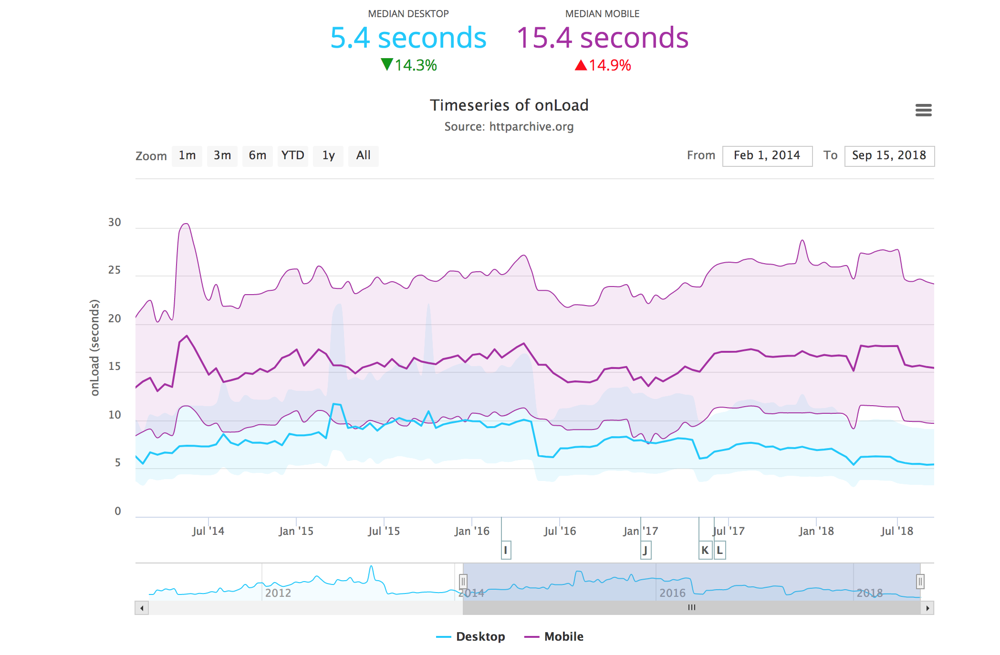
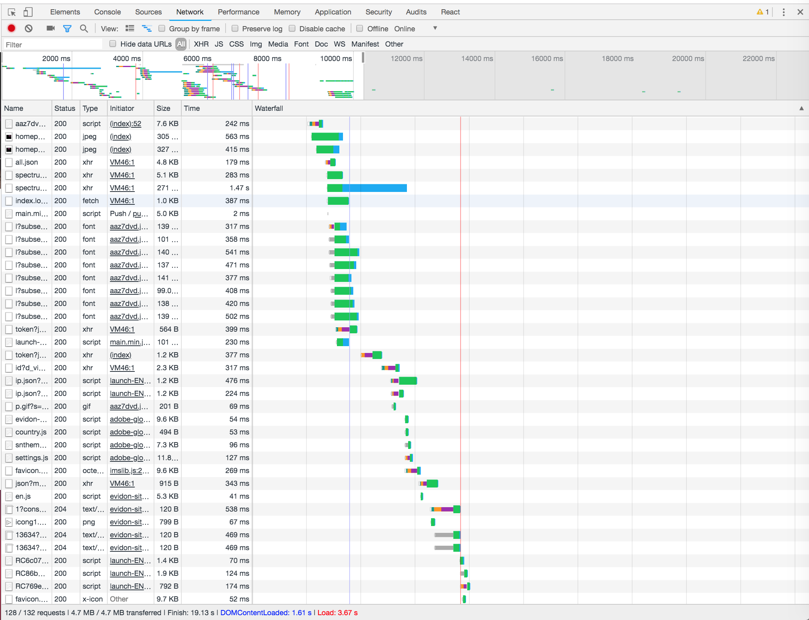
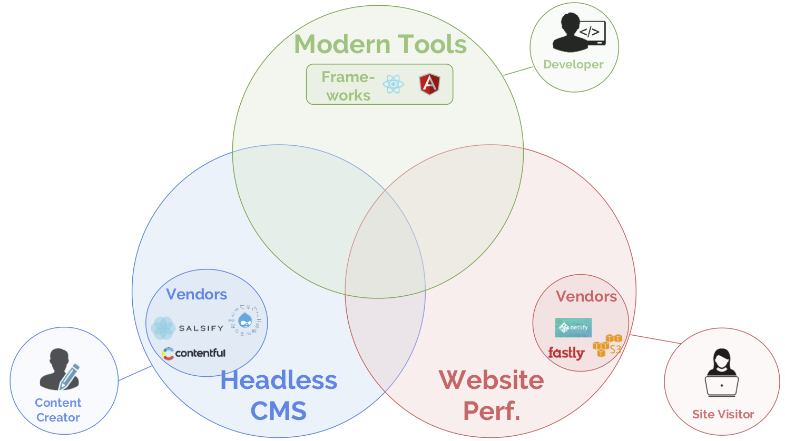

import DateChart from "@components/chart"

_This is Part 4 of a series. Part 1 is_ [The Journey to a Content Mesh](/blog/2018-10-04-journey-to-the-content-mesh)_; Part 2 is_ [Unbundling of the CMS](/blog/2018-10-10-unbundling-of-the-cms)_; Part 3 is_ [The Rise of Modern Web Development](/blog/2018-10-11-rise-of-modern-web-development).

Mobile traffic now makes up over half of all site visits, and more than half of mobile site visits are abandoned if a page takes [over 3 seconds to load](https://www.thinkwithgoogle.com/data-gallery/detail/mobile-site-abandonment-three-second-load/).

With the Fortune 500 spending millions of marketing dollars on marketing initiatives aimed at driving traffic to their site, the business impact of bouncing visitors is clear -- [every 100ms of latency costs 1% of sales.](https://www.digitalrealty.com/blog/the-cost-of-latency/)

Unfortunately, in practice, great performance is surprisingly hard to achieve -- average page load times _haven’t improved_ over several years of increasing connection speed.

Why is that? Increased site complexity often distributes bottlenecks across multiple code points and teams of stakeholders. While performance checklists exist, they’ve ballooned to 40+ items -- making them costly and time-consuming for teams to implement.

As Gatsby's co-founder Kyle Mathews likes to say (paraphrasing Tolstoy):

<Pullquote>
  All fast websites are alike, but all slow websites are slow in different ways.
</Pullquote>

Ultimately, we’ll argue, performance must be solved _at the framework level_ -- that is, in the content mesh.

## The rise of smartphone usage

Between 2014 and 2017, mobile usage (including tablets) rose from 20% of site visits to 50% of site visits.

<DateChart
  title="Mobile visits as % of total site traffic"
  y-axis-label="% of total site traffic"
  series-data='[{ "name": "Global", "data": [{ "date": "2011/01", "value": "0.043" }, { "date": "2011/02", "value": "0.0445" }, { "date": "2011/03", "value": "0.047" }, { "date": "2011/04", "value": "0.0521" }, { "date": "2011/05", "value": "0.0575" }, { "date": "2011/06", "value": "0.0653" }, { "date": "2011/07", "value": "0.0702" }, { "date": "2011/08", "value": "0.0712" }, { "date": "2011/09", "value": "0.0674" }, { "date": "2011/10", "value": "0.0655" }, { "date": "2011/11", "value": "0.0695" }, { "date": "2011/12", "value": "0.0804" }, { "date": "2012/01", "value": "0.0849" }, { "date": "2012/02", "value": "0.0853" }, { "date": "2012/03", "value": "0.0899" }, { "date": "2012/04", "value": "0.0958" }, { "date": "2012/05", "value": "0.1011" }, { "date": "2012/06", "value": "0.104" }, { "date": "2012/07", "value": "0.1109" }, { "date": "2012/08", "value": "0.143" }, { "date": "2012/09", "value": "0.1467" }, { "date": "2012/10", "value": "0.1498" }, { "date": "2012/11", "value": "0.1588" }, { "date": "2012/12", "value": "0.1758" }, { "date": "2013/01", "value": "0.1759" }, { "date": "2013/02", "value": "0.1814" }, { "date": "2013/03", "value": "0.1831" }, { "date": "2013/04", "value": "0.1758" }, { "date": "2013/05", "value": "0.1831" }, { "date": "2013/06", "value": "0.1999" }, { "date": "2013/07", "value": "0.2134" }, { "date": "2013/08", "value": "0.2192" }, { "date": "2013/09", "value": "0.2161" }, { "date": "2013/10", "value": "0.2332" }, { "date": "2013/11", "value": "0.2386" }, { "date": "2013/12", "value": "0.2745" }, { "date": "2014/01", "value": "0.2805" }, { "date": "2014/02", "value": "0.2901" }, { "date": "2014/03", "value": "0.2977" }, { "date": "2014/04", "value": "0.2939" }, { "date": "2014/05", "value": "0.3145" }, { "date": "2014/06", "value": "0.3306" }, { "date": "2014/07", "value": "0.3417" }, { "date": "2014/08", "value": "0.3535" }, { "date": "2014/09", "value": "0.3616" }, { "date": "2014/10", "value": "0.3723" }, { "date": "2014/11", "value": "0.3808" }, { "date": "2014/12", "value": "0.3832" }, { "date": "2015/01", "value": "0.3761" }, { "date": "2015/02", "value": "0.3738" }, { "date": "2015/03", "value": "0.3775" }, { "date": "2015/04", "value": "0.3729" }, { "date": "2015/05", "value": "0.3851" }, { "date": "2015/06", "value": "0.3989" }, { "date": "2015/07", "value": "0.43" }, { "date": "2015/08", "value": "0.4478" }, { "date": "2015/09", "value": "0.4409" }, { "date": "2015/10", "value": "0.4415" }, { "date": "2015/11", "value": "0.4279" }, { "date": "2015/12", "value": "0.4375" }, { "date": "2016/01", "value": "0.4414" }, { "date": "2016/02", "value": "0.4418" }, { "date": "2016/03", "value": "0.458" }, { "date": "2016/04", "value": "0.4646" }, { "date": "2016/05", "value": "0.4854" }, { "date": "2016/06", "value": "0.4677" }, { "date": "2016/07", "value": "0.499" }, { "date": "2016/08", "value": "0.4939" }, { "date": "2016/09", "value": "0.4972" }, { "date": "2016/10", "value": "0.5126" }, { "date": "2016/11", "value": "0.5307" }, { "date": "2016/12", "value": "0.5521" }, { "date": "2017/01", "value": "0.504" }, { "date": "2017/02", "value": "0.5027" }, { "date": "2017/03", "value": "0.4924" }, { "date": "2017/04", "value": "0.4805" }, { "date": "2017/05", "value": "0.483" }, { "date": "2017/06", "value": "0.4697" }, { "date": "2017/07", "value": "0.4601" }, { "date": "2017/08", "value": "0.4737" }, { "date": "2017/09", "value": "0.4771" }, { "date": "2017/10", "value": "0.4913" }, { "date": "2017/11", "value": "0.4998" }, { "date": "2017/12", "value": "0.4752" }, { "date": "2018/01", "value": "0.4808" }, { "date": "2018/02", "value": "0.4818" }, { "date": "2018/03", "value": "0.4845" }, { "date": "2018/04", "value": "0.488" }, { "date": "2018/05", "value": "0.4799" }, { "date": "2018/06", "value": "0.4748" }, { "date": "2018/07", "value": "0.4705" }, { "date": "2018/08", "value": "0.4734" }]}, { "name": "US", "data": [{ "date": "2011/01", "value": "0.0643"}, { "date": "2011/02", "value": "0.0632"}, { "date": "2011/03", "value": "0.0625"}, { "date": "2011/04", "value": "0.0694"}, { "date": "2011/05", "value": "0.0824"}, { "date": "2011/06", "value": "0.0808"}, { "date": "2011/07", "value": "0.0836"}, { "date": "2011/08", "value": "0.0775"}, { "date": "2011/09", "value": "0.0718"}, { "date": "2011/10", "value": "0.0705"}, { "date": "2011/11", "value": "0.0703"}, { "date": "2011/12", "value": "0.0796"}, { "date": "2012/01", "value": "0.0859"}, { "date": "2012/02", "value": "0.0872"}, { "date": "2012/03", "value": "0.086"}, { "date": "2012/04", "value": "0.0856"}, { "date": "2012/05", "value": "0.0911"}, { "date": "2012/06", "value": "0.0927"}, { "date": "2012/07", "value": "0.1007"}, { "date": "2012/08", "value": "0.1461"}, { "date": "2012/09", "value": "0.1512"}, { "date": "2012/10", "value": "0.1574"}, { "date": "2012/11", "value": "0.1676"}, { "date": "2012/12", "value": "0.184"}, { "date": "2013/01", "value": "0.1918"}, { "date": "2013/02", "value": "0.2007"}, { "date": "2013/03", "value": "0.2019"}, { "date": "2013/04", "value": "0.1658"}, { "date": "2013/05", "value": "0.1701"}, { "date": "2013/06", "value": "0.1988"}, { "date": "2013/07", "value": "0.2166"}, { "date": "2013/08", "value": "0.2082"}, { "date": "2013/09", "value": "0.1965"}, { "date": "2013/10", "value": "0.1993"}, { "date": "2013/11", "value": "0.2199"}, { "date": "2013/12", "value": "0.2731"}, { "date": "2014/01", "value": "0.2942"}, { "date": "2014/02", "value": "0.3047"}, { "date": "2014/03", "value": "0.3012"}, { "date": "2014/04", "value": "0.2869"}, { "date": "2014/05", "value": "0.2912"}, { "date": "2014/06", "value": "0.32"}, { "date": "2014/07", "value": "0.3109"}, { "date": "2014/08", "value": "0.3422"}, { "date": "2014/09", "value": "0.3492"}, { "date": "2014/10", "value": "0.3588"}, { "date": "2014/11", "value": "0.3534"}, { "date": "2014/12", "value": "0.3367"}, { "date": "2015/01", "value": "0.3665"}, { "date": "2015/02", "value": "0.3701"}, { "date": "2015/03", "value": "0.3591"}, { "date": "2015/04", "value": "0.317"}, { "date": "2015/05", "value": "0.3103"}, { "date": "2015/06", "value": "0.3303"}, { "date": "2015/07", "value": "0.3849"}, { "date": "2015/08", "value": "0.3894"}, { "date": "2015/09", "value": "0.3655"}, { "date": "2015/10", "value": "0.3536"}, { "date": "2015/11", "value": "0.3536"}, { "date": "2015/12", "value": "0.3513"}, { "date": "2016/01", "value": "0.3471"}, { "date": "2016/02", "value": "0.3606"}, { "date": "2016/03", "value": "0.3597"}, { "date": "2016/04", "value": "0.3583"}, { "date": "2016/05", "value": "0.3782"}, { "date": "2016/06", "value": "0.39"}, { "date": "2016/07", "value": "0.4308"}, { "date": "2016/08", "value": "0.4082"}, { "date": "2016/09", "value": "0.4023"}, { "date": "2016/10", "value": "0.4203"}, { "date": "2016/11", "value": "0.4485"}, { "date": "2016/12", "value": "0.461"}, { "date": "2017/01", "value": "0.458"}, { "date": "2017/02", "value": "0.4666"}, { "date": "2017/03", "value": "0.4887"}, { "date": "2017/04", "value": "0.4816"}, { "date": "2017/05", "value": "0.4772"}, { "date": "2017/06", "value": "0.5157"}, { "date": "2017/07", "value": "0.5368"}, { "date": "2017/08", "value": "0.5269"}, { "date": "2017/09", "value": "0.4952"}, { "date": "2017/10", "value": "0.4676"}, { "date": "2017/11", "value": "0.4731"}, { "date": "2017/12", "value": "0.4864"}, { "date": "2018/01", "value": "0.469"}, { "date": "2018/02", "value": "0.4726"}, { "date": "2018/03", "value": "0.4943"}, { "date": "2018/04", "value": "0.4876"}, { "date": "2018/05", "value": "0.4942"}, { "date": "2018/06", "value": "0.5086"}, { "date": "2018/07", "value": "0.5237"}, { "date": "2018/08", "value": "0.504"}]}]'
/>

Source: [StatCounter](http://gs.statcounter.com/platform-market-share/desktop-mobile-tablet/worldwide/2011)

When smartphones were first created, the first key challenge of website teams was to offer a responsive version of their site that worked on mobile devices _at all._

As mobile has grown to half of internet traffic, the key challenge has shifted to performance.

## Faster connections haven’t translated to faster sites

While average phone connection speed, as well as processing power, has increased over the last several years, sites haven’t gotten faster. In fact, load times **have increased**.

Data from the HTTPArchive shows how long it's taken for the average page on the Internet to completely load all content (including images, script files, CSS files, etc.):

<figure>
  
  <figcaption>Web performance over time</figcaption>
</figure>

Source: [HTTPArchive](https://httparchive.org/reports/loading-speed?start=2014_02_01&end=latest&view=list#ol)

Why is that?

Connection speeds for mobile device have increased, while Moore's Law has made devices faster. However, these speed dividends have been eaten up by two things.

First, **[heavier page weights](https://www.keycdn.com/support/the-growth-of-web-page-size/)**.

This has generally driven by increased page complexity driven by increased user expectations.

Second, the **growing complexity of websites**. Non-critical images, CSS, JS libraries, and 3rd party tracking software will often unintentionally end up on the critical path to page load:

- A marketing analyst drops a `<script>` tag from a hot new vendor inside a Google Tag Manager container. This triggers a blocking network call to a pixel provider on page loads. Time To Interactive (TTI) now averages 800ms longer.

- After a team whiteboarding session, the lead designer for a popular lifestyle magazine decides to switch to a custom default site font. On Friday afternoon, a developer scans the JIRA ticket, thinks "this should be easy" and implements a two-line code change. The site now takes 20% longer to load.

- The business unit of an e-commerce store needs additional inventory management tools, so they purchase a popular plugin in their CMS ecosystem that offers this functionality. What they don’t know is that this plugin adds additional database calls every time a user loads a product page, delaying overall page loads by 500ms.

With website performance rarely tracked, almost never systematically, and with no performance "owner", it's easy to see how load times can balloon.

Like factory floors before the advent of [just-in-time manufacturing](https://en.wikipedia.org/wiki/Just-in-time_manufacturing), website page loading paths are clogged with work being done prematurely, creating resource contention and increasing cycle time.

## Growing attention to the crisis of mobile performance

In the last 2-3 years, there’s been growing attention to the crisis of mobile performance from a number of different corners:

- As e-commerce grows globally, enterprises are increasingly targeting users on smartphones, often outside the fast-connection First World.

- In January 2018, Google announced that [it would use mobile page speed](https://webmasters.googleblog.com/2018/01/using-page-speed-in-mobile-search.html) as a ranking for mobile SEO. In July 2018, those changes took effect.

- Movements such as [Progressive Web Apps](https://developers.google.com/web/progressive-web-apps/) and the [JAMstack](https://jamstack.org/) have brought attention to site performance as a first-order goal.

_Performant_ is the new _responsive_.

For digital agencies and enterprises, the challenge becomes: how to achieve performance, while delivering websites on time and within project budgets?

## How performance optimization works

There are two _types_ of performance optimizations.

Teams can optimize the _payload_ -- what they’re serving users. Or they can optimize _delivery_ -- how it gets to the client.

**Payload optimization**

_Payload optimizations_ involve items like reducing image and JS weight, deferring below-the-fold image calls, and inlining critical CSS.

When the amount of content and number of requests sent over the wire are minimized, users can interact with your site more quickly.

**Delivery optimization**

_Delivery optimizations_ involve serving files from a content delivery network (CDN) -- whether you’re compiling to files or caching -- rather than letting each request hit your app server and database.

CDNs are globally available, so they’ll be closer to your customer than your systems, which reduces [round-trip time](https://en.wikipedia.org/wiki/Round-trip_delay_time) (RTT). Serving files means that users get content immediately without requests waiting in queues or requiring database queries.

**You may need to do both**

Payload optimization and delivery optimization are complementary approaches. That’s both good news -- you _can_ do both -- and bad news -- you often _need_ to do both.

For example, if you use a CDN to serve 3MB JavaScript bundles, your site is still going to be slow, especially on medium- and low-end mobile devices.

<figure>
  
  <figcaption>
    Part of a network request waterfall chart for a typical enterprise website (
    <a href="https://www.adobe.com">adobe.com</a>). The full waterfall chart is
    three times longer.
  </figcaption>
</figure>

Performance is an _emergent characteristic_ of a system. It requires getting a lot little things right and is easy to mess up. That's _why_ fast websites are similar, but slow websites are slow in different ways.

## Optimizing performance is difficult and expensive

The challenge for digital agencies and enterprises is that both payload and delivery optimizations can require significant developer time to implement.

**Delivery optimization**

For delivery optimization, one approach is to use a JAMStack solution like Hugo or Gatsby, which compile your site to static files that can be served from a global CDN, rather than scaling app servers and databases. This approach, when used for initial site construction, requires little developer time in return for large performance gains.

Caching a traditional CMS website is another possibility -- though this often creates bugs (what if an item goes out of stock?), as well as confusion around the content go-live process.

**Payload optimization**

But if delivery optimization is _hard_, payload optimization can be _near impossible_ to deliver within time and budget for many agencies and enterprises.

Comprehensive checklists [weigh in at around 40 items](https://www.smashingmagazine.com/2019/01/front-end-performance-checklist-2019-pdf-pages/), including points like route-based code splitting, HTTP/2 asset serving, background prefetching, lazy-loading non-critical assets, service workers, dead code elimination, and server-side rendering. Each of these points is technically feasible but quite rare.

Among the many implementation challenges are:

- **Time and budget**. Performance optimization happens at the end of projects, which means that even in the rare case time is allocated, it can be dropped in the rush to fix bugs and make up for inevitable schedule slippage.

- **Skill mismatches**. Performance optimization is not in the skillset of many frontend developers. Simple changes by non-performance-oriented developers can easily undo days or weeks of dedicated performance work without dedicated training or stringent code review.

- **Lack of executive visibility**. Regular site performance reporting is rare, and difficult to track over time.

- **Lack of developer visibility**. While systems like Bugsnag can tie errors to specific lines of code, performance visibility is much higher level, even with detailed tools like Google Lighthouse. For non-experts, it’s difficult to pinpoint performance regressions to specific code commits.

## Performance should be solved at the framework level

Web performance is critical for retaining and engaging users, especially on mobile. If [every 100ms of latency costs 1% of sales](https://www.digitalrealty.com/blog/the-cost-of-latency/), reducing average page load times from 5 seconds to 1-2 seconds could generate 30-40% more sales.

But just because performance is the _right_ thing doesn’t make it the _easy_ thing. Implementing performance optimizations on a _per-site basis_ is often _difficult_ and _costly_.

To overcome these obstacles, high-performing website teams should look to a content mesh that bakes in performance on a _framework_ level.

One example is Gatsby, which includes [both delivery optimization and payload optimization out of the box](/features/#legend).

In the next and final post in this series, [Creating Compelling Experiences](/blog/2018-10-18-creating-compelling-content-experiences), we’ll explain how to implement a content mesh and get all the benefits of best-of-breed content systems, modern development frameworks, and high-performing websites.

<figure>
  
  <figcaption>Achieving modern website performance</figcaption>
</figure>
