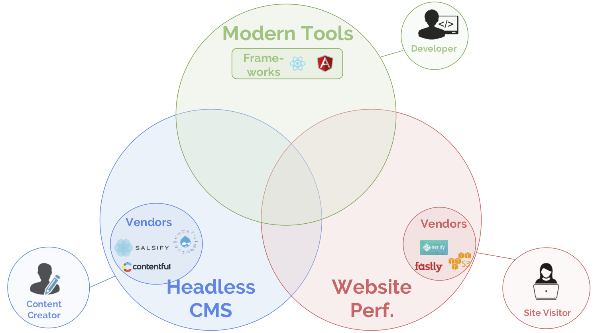
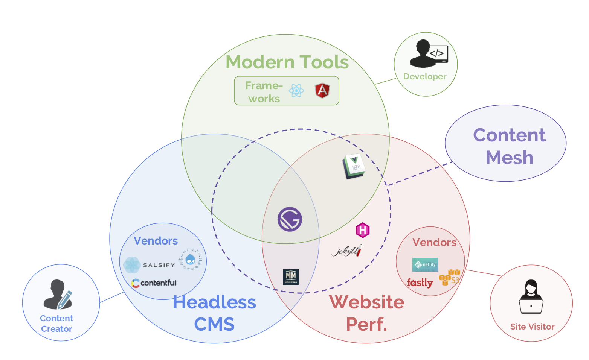

_This is Part 5, the conclusion of a series. Part 1 is_ [The Journey to a Content Mesh](/blog/2018-10-04-journey-to-the-content-mesh)_; Part 2 is_ [Unbundling of the CMS](/blog/2018-10-10-unbundling-of-the-cms)_; Part 3 is_ [The Rise of Modern Web Development](/blog/2018-10-11-rise-of-modern-web-development); _Part 4 is_ [Why Mobile Performance is Crucial](/blog/2018-10-16-why-mobile-performance-is-crucial).

In the last three sections, we’ve described the different facets of how to create modern, compelling content experiences. We’ve covered trends in [content management](/blog/2018-10-10-unbundling-of-the-cms), [web development](/blog/2018-10-11-rise-of-modern-web-development), and [website performance](/blog/2018-10-16-why-mobile-performance-is-crucial).

While these trends target different stakeholders, they’re deeply interrelated. That’s because to adopt a new architecture in one area, you often need to adopt new technologies in the other two.

With users after user writing headlines like "[Gatsby + Contentful + Netlify (and Algolia)](/blog/2017-12-06-gatsby-plus-contentful-plus-netlify/)" -- grouping a React-based website framework, a headless CMS, a static host + CDN, and a search provider -- it’s clear these these technologies are meant to be used together.

Website teams moving to this space have to plan four steps -- one for each category, plus integration.

<figure>
  
  <figcaption>
    Three facets of modern website projects
  </figcaption>
</figure>

## Moving to the content mesh

### First, choose content systems.

In a modular CMS system, website teams can [use preferred workflows to choose your content systems](/blog/2018-10-10-unbundling-of-the-cms).

This allows content teams to replace their heavyweight CMS monolith with their choice of:

- A spreadsheet and text files (for extremely simple sites).
- Specialized systems tailored to their use case, such as Shopify + Salsify + Bazaarvoice for an e-commerce site.
- A headless cloud CMS with rich content modelling capabilities, such as Contentful.

### Second, pick a UI development library

[React and Angular are both excellent, ubiquitous, modern choices](/blog/2018-10-11-rise-of-modern-web-development), with rich community ecosystems to address website-specific concerns like:

- SEO
- Routing
- Accessibility
- i18n

### Third, choose a performance strategy

There are two main approaches to performance -- [payload optimization and delivery optimization](/blog/2018-10-16-why-mobile-performance-is-crucial#how-performance-optimization-works).

Payload optimization involves performance-enhancing development practices. Delivery optimization means compiling websites to static files that can be served from a global CDN, rather than running servers and databases.

Often, to ensure a fast site, you'll need both.

To do delivery optimization, you'll need to pick a JAMStack site generator like Hugo or Gatsby.

To do payload optimization, your team will need to implement a [long performance checklist](https://www.smashingmagazine.com/2019/01/front-end-performance-checklist-2019-pdf-pages/), or pick a framework such as Gatsby that [performs payload optimization](/features/#legend) out of the box.

### Fourth, choose your content mesh

To truly engage users, you need a modern website -- a modular CMS architecture, modern development framework, and cutting-edge performance.

The challenge for website teams is: how to achieve this without a lot of costly, time-intensive custom integration work?

The answer: choose a content mesh. A content mesh:

- pulls in data from your [headless CMS](/docs/headless-cms/) systems

- enables you to develop in your preferred UI library while providing website tooling

- automatically makes your site fast out of the box

<figure>
  
  <figcaption>
   The Content Mesh integrates <b>headless</b> content systems, modern development tools, and website performance
  </figcaption>
</figure>

## Content Mesh Alternatives

Website teams searching for a content mesh can consider:

- utilizing vendor integrations
- assorted JAMStack solutions
- Gatsby

While some solutions have _part_ of the puzzle, only Gatsby comes with out-of-the-box CMS integrations, a modern development framework, and cutting-edge performance.

**Content vendor integrations**

One option for website teams is to use existing vendor integrations to glue CMS systems together.

For example, a team could build a site with Shopify, using their Liquid Template engine, pull in product listing data from Salsify, and reviews from Bazaarvoice.

While this can solve the CMS integration problem, it locks the website in an idiosyncratic development environment without helping solve website performance.

**Assorted JAMStack solutions**

Another option is the JAMstack space, with a proliferation of tools that make sites fast. These tools tend to _either_ support modern development frameworks _or_ connect to content systems, but not both.

For example, VuePress and Nuxt.js allow teams to build sites in Vue, but don't offer connections with any enterprise content systems -- they require content to be stored as markdown files within the code repository.

Middleman allows connections to third-party data sources, though currently only DatoCMS and Contentful are supported.

**Gatsby**

Gatsby is the only content mesh option that creates fast websites, supports modern development frameworks, _and_ connects to enterprise content systems. Gatsby features:

- **Integrations with 120+ backends**, including 15+ enterprise content systems like WordPress, Drupal, Contentful, Contentstack, Salsify and Shopify, as well as the ability to add additional sources.

- **A React development environment**, along with key plugins that provide key website features like SEO, routing, accessibility, and i18n.

- **Lightning-fast out-of-the-box performance**, including both payload and delivery optimizations.

## Conclusion

Yesterday, publishing on the web was difficult. The CMS emerged as a single application to store content and build sites.

Today, the CMS is being reimagined.

With maturity comes growing functionality and complexity; a shift from monolithic to modular architectures.

Today, there's a multitude of vendors, frameworks, and approaches for content modelling, authentication, search, analytics, payments, development environment, performance, and so on.

The key question becomes: how to bring these pieces into a unified whole?

Yesterday, our challenge was _creating a digital experience_.

Today, our challenge is _making that experience incredible_.
