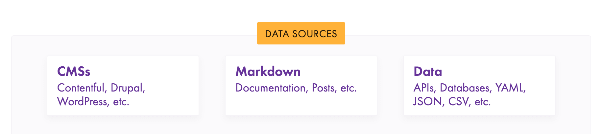
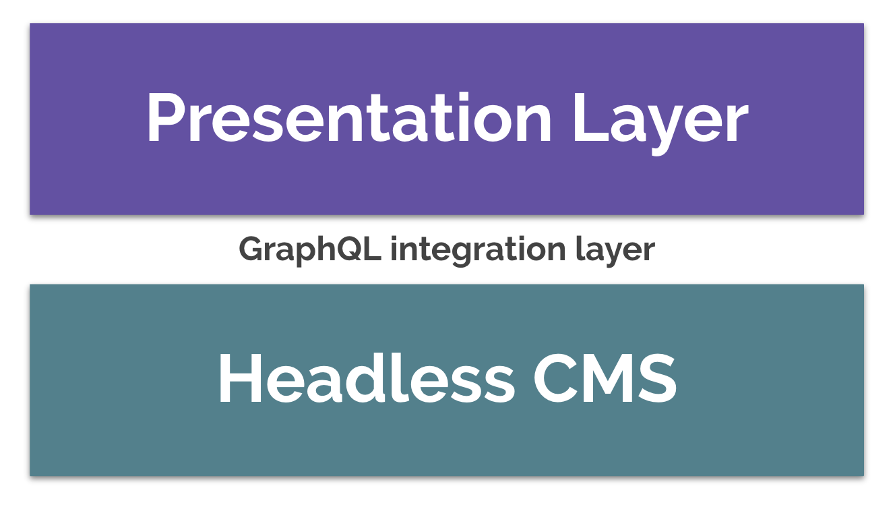

When creating web experiences, an inevitable question is, "how do I get my data from point A (the source) to point B (the component)?". This can end up being a deceptively complex question.

Gatsby’s rich data plugin ecosystem lets you build sites with the data you want — from one or many sources. You can pull data from headless CMSs, SaaS services, APIs, databases, your file system & more directly into your components.

<figure>
  
  <figcaption>Your data could come from anywhere</figcaption>
</figure>

Most examples in the Gatsby docs and on the web at large focus on leveraging source plugins to manage your data in Gatsby sites. And rightly so! Gatsby's GraphQL data layer is powerful and extremely effective; it solves the "integration problem" of decoupled CMSs -- it's the glue between presentation layer and wherever your data is sourced from.

<figure>
  
  <figcaption>
    Gatsby's GraphQL integration layer is the glue between presentation layer
    and where your data lives
  </figcaption>
</figure>

> _[Source plugins](/docs/creating-a-source-plugin/)_ “source” data from remote or local locations into Gatsby nodes, which are then queryable within your Gatsby site using GraphQL. _[Gatsby nodes](/docs/node-interface/)_ are the center of Gatsby’s data handling layer.

We're calling this the **"content mesh"** — the infrastructure layer for a decoupled website. ([Sam Bhagwat](https://twitter.com/calcsam) introduced and explored this concept in his recent five-part series, [The Journey to a Content Mesh](/blog/2018-10-04-journey-to-the-content-mesh)).

**However, you don't _need_ to use source plugins (or create Gatsby nodes) to pull data into a Gatsby site!** In this post we'll explore how to use Gatsby without GraphQL (using "unstructured data"), and some of the pros and cons of doing so.

> _Note_: For our purposes here, "unstructured data" means data "handled outside of Gatsby's data layer" i.e. using the data directly, and not transforming the data into Gatsby nodes.

## An example of creating pages using unstructured data from a remote API

We'll take a look at a (very serious) example of how this works. In the example, we'll:

1. Load data from the [PokéAPI’s](https://pokeapi.co/) REST endpoints
2. Create pages (and nested pages) from this data

That's it!

### The tldr; (in tweet form)

https://twitter.com/jlengstorf/status/1050855455759593472

### Breaking down the example

> Note: This walkthrough assumes you have working knowledge of Gatsby fundamentals. If you're not (yet!) familiar with Gatsby, you may want to take a look at our [Quick Start doc](/docs/) first.

#### 1. Use Gatsby's `createPages` API.

`createPages` is a [Gatsby Node API](/docs/node-apis/#createPages). It hooks into a certain point in [Gatsby's bootstrap sequence](/docs/gatsby-lifecycle-apis/#bootstrap-sequence).

By [exporting `createPages`](https://github.com/jlengstorf/gatsby-with-unstructured-data/blob/0a91d87b9d4d24a0e6b04b33cc271e054b7467b6/gatsby-node.js#L21) from our example Gatsby site's `gatsby-node.js` file, we're saying, "at this point in the bootstrapping sequence, run this code".

```javascript:title=gatsby-node.js
// highlight-next-line
exports.createPages = () => {
  // Run this code
} // highlight-line
```

#### 2. [Fetch the data](https://github.com/jlengstorf/gatsby-with-unstructured-data/blob/0a91d87b9d4d24a0e6b04b33cc271e054b7467b6/gatsby-node.js#L22) from the PokéAPI.

```javascript:title=gatsby-node.js
exports.createPages = async () => {
  const allPokemon = await getPokemonData(["pikachu", "charizard", "squirtle"]) // highlight-line
}
```

_Note: [`getPokemonData`](https://github.com/jlengstorf/gatsby-with-unstructured-data/blob/0a91d87b9d4d24a0e6b04b33cc271e054b7467b6/gatsby-node.js#L5) is an async function which fetches the relevant desired data for all of our Pokémon._

#### 3. Grab the `createPage` action

When you hook into a Gatsby API (like `createPages` from step one), you are passed a collection of actions. In this example, we're extracting the [`createPage` action](https://github.com/jlengstorf/gatsby-with-unstructured-data/blob/0a91d87b9d4d24a0e6b04b33cc271e054b7467b6/gatsby-node.js#L21) using ES6 object destructuring:

```javascript:title=gatsby-node.js
// highlight-next-line
exports.createPages = async ({ actions: { createPage } }) => {
  const allPokemon = await getPokemonData(["pikachu", "charizard", "squirtle"])
}
```

#### 4. Create a page that [lists all Pokémon](https://github.com/jlengstorf/gatsby-with-unstructured-data/blob/0a91d87b9d4d24a0e6b04b33cc271e054b7467b6/gatsby-node.js#L25).

```javascript:title=gatsby-node.js
exports.createPages = async ({ actions: { createPage } }) => {
  const allPokemon = await getPokemonData(["pikachu", "charizard", "squirtle"])

  // highlight-start
  // Create a page that lists all Pokémon.
  createPage({
    path: `/`,
    component: require.resolve("./src/templates/all-pokemon.js"),
    context: { allPokemon },
  })
  // highlight-end
}
```

The [`createPage` action](/docs/actions/#createPage) is passed an object containing:

- `path`: This is the relative url you'd like your new page will be available at.
- `component`: This is the absolute path to the React component you've defined for this page.
- `context`: Context data for this page. Available either as props to the component (`this.props.pageContext`) or as `graphql` arguments.

In our example, we're accessing the context as [props to the component](https://github.com/jlengstorf/gatsby-with-unstructured-data/blob/0a91d87b9d4d24a0e6b04b33cc271e054b7467b6/src/templates/all-pokemon.js#L4). This allows us to completely circumvent Gatsby’s data layer; it’s just props.

```jsx:title=src/templates/all-pokemon.js
export default function AllPokemon({ pageContext: { allPokemon } }) (// highlight-line
    {...}
        {allPokemon.map(pokemon => ( // highlight-line
            <li
                key={pokemon.id}  {/* highlight-line */}
                style={{
                    textAlign: 'center',
                    listStyle: 'none',
                    display: 'inline-block'
                }}
            >
             {/* highlight-start */}
                <Link to={`/pokemon/${pokemon.name}`}>
                    
                    <p>{pokemon.name}</p>
              {/* highlight-end */}
                </Link>
            </li>
        ))}
    {...}
);
```

#### 5. Create a page [for each Pokémon](https://github.com/jlengstorf/gatsby-with-unstructured-data/blob/0a91d87b9d4d24a0e6b04b33cc271e054b7467b6/gatsby-node.js#L32).

```javascript:title=gatsby-node.js
exports.createPages = async ({ actions: { createPage } }) => {
  const allPokemon = await getPokemonData(["pikachu", "charizard", "squirtle"])

  // Create a page that lists all Pokémon.
  createPage({
    path: `/`,
    component: require.resolve("./src/templates/all-pokemon.js"),
    context: { allPokemon },
  })

  // highlight-start
  // Create a page for each Pokémon.
  allPokemon.forEach(pokemon => {
    createPage({
      path: `/pokemon/${pokemon.name}/`,
      component: require.resolve("./src/templates/pokemon.js"),
      context: { pokemon },
    })
  })
  // highlight-end
}
```

#### 6. Create a page [for each ability of each Pokémon](https://github.com/jlengstorf/gatsby-with-unstructured-data/blob/0a91d87b9d4d24a0e6b04b33cc271e054b7467b6/gatsby-node.js#L40).

```javascript:title=gatsby-node.js
exports.createPages = async ({ actions: { createPage } }) => {
  const allPokemon = await getPokemonData(["pikachu", "charizard", "squirtle"])

  // Create a page that lists all Pokémon.
  createPage({
    path: `/`,
    component: require.resolve("./src/templates/all-pokemon.js"),
    context: { allPokemon },
  })

  // Create a page for each Pokémon.
  allPokemon.forEach(pokemon => {
    createPage({
      path: `/pokemon/${pokemon.name}/`,
      component: require.resolve("./src/templates/pokemon.js"),
      context: { pokemon },
    })

    // highlight-start
    // Create a page for each ability of the current Pokémon.
    pokemon.abilities.forEach(ability => {
      createPage({
        path: `/pokemon/${pokemon.name}/ability/${ability.name}/`,
        component: require.resolve("./src/templates/ability.js"),
        context: { pokemon, ability },
      })
    })
    // highlight-end
  })
}
```

For each type of page, we are invoking the `createPage` action, and supplying it with our desired path, React component, and data (as `context`).

> View the full source code of this example at Jason Lengstorf's ["gatsby-with-unstructured-data" repo](https://github.com/jlengstorf/gatsby-with-unstructured-data). Also check out the ["using-gatsby-data-layer" branch](https://github.com/jlengstorf/gatsby-with-unstructured-data/tree/using-gatsby-data-layer) of that repo, to compare a refactor that uses Gatsby's data layer in the same example.

## The pros of using unstructured data

- When prototyping, or when new to Gatsby, this approach may feel more familiar, comfortable, and faster
- There’s no intermediate step: you fetch some data, then build pages with it

## The tradeoffs of foregoing Gatsby's data layer

Using Gatsby's data layer provides the following benefits:

- Enables you to declaratively specify what data a page component needs, alongside the page component
- Eliminates frontend data boilerplate — no need to worry about requesting & waiting for data. Just ask for the data you need with a GraphQL query and it’ll show up when you need it
- Pushes frontend complexity into queries — many data transformations can be done at build-time within your GraphQL queries (e.g. Markdown -> HTML, images -> responsive images, etc)
- It’s the perfect data querying language for the often complex/nested data dependencies of modern applications
- Improves performance by removing data bloat — GraphQL enables you to select only the data you need, not whatever an API returns
- Enables you to take advantage of hot reloading when developing; For example, in this post's example "Pokémon" site, if you wanted to add a "see other pokémon" section to the pokémon detail view, you would need to change your `gatsby-node.js` to pass all pokémon to the page, and restart the dev server. In contrast, when using queries, you can add a query and it will hot reload.

> Learn more about [GraphQL in Gatsby](/docs/graphql-concepts/).

Working outside of the data layer also means foregoing the optimizations provided by transformer plugins, like:

- [`gatsby-image`](https://github.com/gatsbyjs/gatsby/tree/master/packages/gatsby-image) (speedy optimized images),
- [`gatsby-transformer-sharp`](https://github.com/gatsbyjs/gatsby/tree/master/packages/gatsby-transformer-sharp) (provides queryable fields for processing your images in a variety of ways including resizing, cropping, and creating responsive images),
- ... the whole Gatsby ecosystem of official and community-created [transformer plugins](/plugins/?=transformer).

Another difficulty added when working with unstructured data is that your data fetching code becomes increasingly hairy when you source directly from multiple locations.

## Links potentially of interest

- GitHub issue: ["Choosing not to use the GraphQL feature of Gatsby – a bad idea?"](https://github.com/gatsbyjs/gatsby/issues/4994)
- Kyle Mathews' reasoning for [going with GraphQL](https://github.com/gatsbyjs/gatsby/issues/4994#issuecomment-382110077).
- The issue [introducing 1.0 GraphQL data layer](https://github.com/gatsbyjs/gatsby/issues/420).
- Gatsby docs on [using Gatsby without GraphQL](/docs/using-gatsby-without-graphql)

## Thanks

- Thank you to [Tanner Linsley](https://github.com/tannerlinsley) of [`react-static`](https://github.com/nozzle/react-static), who helped us realize that directly querying APIs and passing them into pages is a great way to build smaller sites, and came up with the term "unstructured data".
