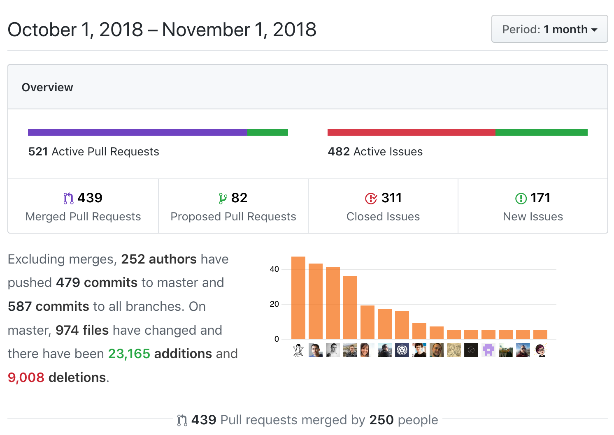

Just like that, Gatsby Hacktoberfest is over! Or, "Hacktoverfest"? 😂 (Thanks for the pun, [@m-allanson](https://github.com/m-allanson)). We had a great time Hacktoberfesting with y'all and wanted to share a bit of our planning process and lessons learned in review!

## Planning for Hacktoberfest

Honestly, it snuck up on us a bit. We realized October had arrived and immediately started planning. We kicked it off with a Hacktoberfest Issue Writing Party (which we actually [livestreamed](https://www.youtube.com/watch?v=CzQB2kRiHdg&t=2270s)).

We defined and started tackling our overall goals for Hacktoberfest:

1. To provide a range of issues with a clearly defined scope, with minimal context needed outside of the issue description.
2. To make contributing to Gatsby as welcoming, friendly, and accessible as we can -- especially to first-time contributors.

We created a [master issue](https://github.com/gatsbyjs/gatsby/issues/8719) to be our Hacktoberfest "landing page", and thought of four general issue areas: OSS, Docs, Gatsby Store, and Ecosystem. Within that, our areas of greatest focus and attention were OSS and Docs.

Most of the [OSS issues](https://github.com/gatsbyjs/gatsby/issues/8725) were existing issues that we identified as good candidates to surface to Hacktoberfest contributors.

Most of the [Docs issues](https://github.com/gatsbyjs/gatsby/issues/7928) stemmed from an existing "content migration" effort, which aimed to repurpose valuable content already existing in the Gatsby blog, various plugin and starter READMEs, and other external resources, and pull it into the Gatsby docs.

## Things that went well

### 439 pull requests merged

Thanks to everyone's contributions, throughout October we merged 439 pull requests from 250 different authors into the Gatsby repo!

<figure>
  
  <figcaption>An awesome community response for Hacktoberfest!</figcaption>
</figure>

### Over 170 new first-time contributors!

Of the 250 different authors who contributed to this month, over 170 were first-time contributors to the Gatsby repo!

https://twitter.com/gatsbyjs/status/1056235954824871936

(We celebrated a bit early).

### Closing out the content migration effort

We were able to close out almost the entire [content migration effort](https://github.com/gatsbyjs/gatsby/issues/8103)! This was an absolutely amazing effort by the community, the value of which cannot be overstated.

## Things to learn from

### We were overwhelmed

We’re a small team, and we weren’t fully prepared to handle the overwhelmingly enthusiastic response from the community. Many issues, particularly docs issues, were claimed within minutes of opening them. It slowed our response time, which was frustrating -- both for contributors, and for us.

#### ➡️ We created codeowner teams

To split our time more efficiently, we [created codeowner teams](/blog/2018-10-12-uptick-docs-contributions-hacktoberfest/#with-great-contributions-comes-great-responsibility) to automatically notify Gatsby team members when certain areas of review are required:

- Core - Code owners for core functionality of Gatsby.
- Docs - Maintainers who have special expertise in docs.
- Ecosystem - Code owners for the Gatsby ecosystem.
- Website - Maintainers who keep gatsbyjs.org healthy.

#### ➡️ We're hiring another Open Source Maintainer!

We knew this was an area of need that will continue to grow (which is great!) This role will focus on helping us improve Gatsby core, the Gatsby ecosystem, and support the community 🎉 Check out the [full job spec](https://www.gatsbyjs.com/careers/open-source-maintainer/) for more details.

### We experienced an influx of minor, peripheral PRs

Especially toward the end of the month, we experienced a noticeable influx of minor, peripheral PRs. Once many issues were claimed and closed out in the first half of the month, especially the more accessible issues, we noticed a marked uptick in these PRs. We believe this was a confluence of two factors:

1. Contributors were strongly motivated to participate in Hacktoberfest
2. We did not have enough unclaimed issues available that were accessible to first-time contributors.

#### ➡️ Create more accessible Hacktoberfest issues

Next year, we could focus on curating a backlog of accessible Hacktoberfest issues that get released in waves through the month.

#### ➡️ Start planning earlier!

This year was a bit of an experiment. We have a lot of great lessons learned to put into play next year!

## Wrap-up

We had a great time and learned a lot from this year's Hacktoberfest! Thanks to everyone who participated!

Check out other posts from this year's Gatsby Hacktoberfest:

- [Hacktoberfest kickoff](/blog/2018-10-09-hacktoberfest-kickoff/)
- [Uptick in docs contributions for Gatsby Hacktoberfest](/blog/2018-10-12-uptick-docs-contributions-hacktoberfest/)
