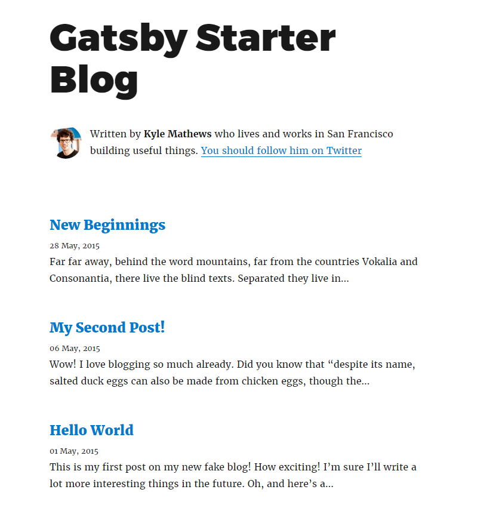
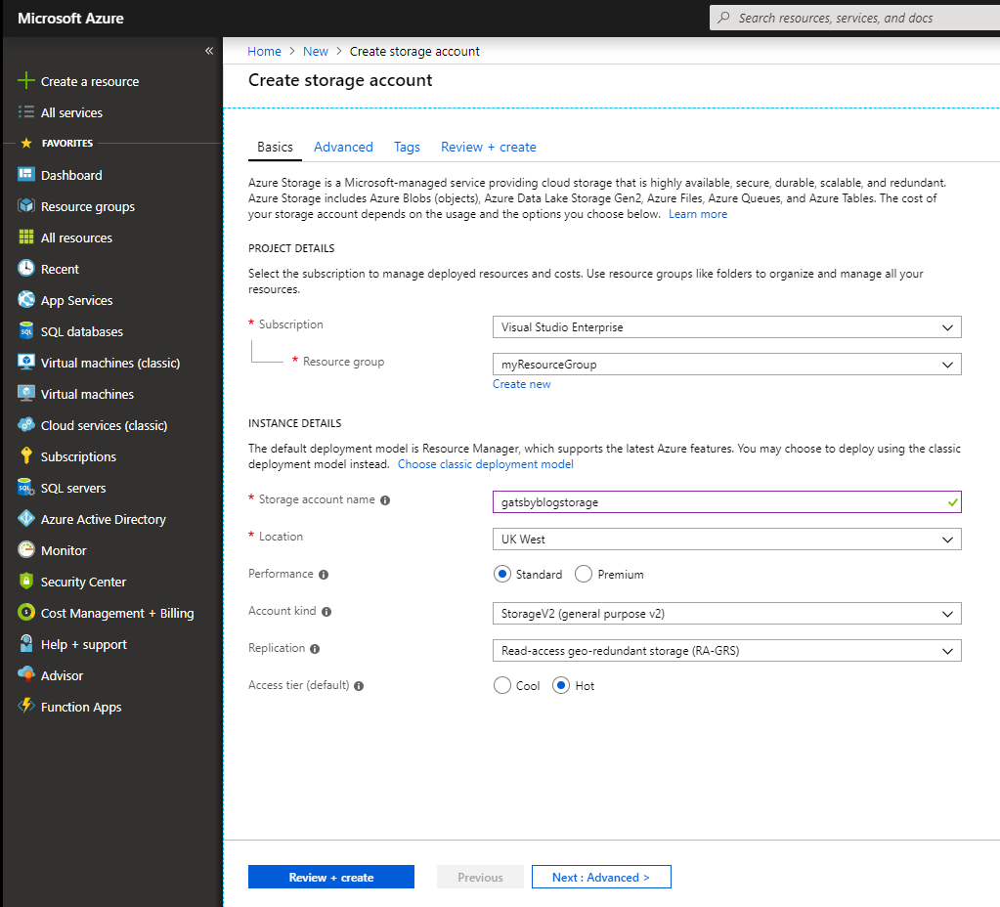
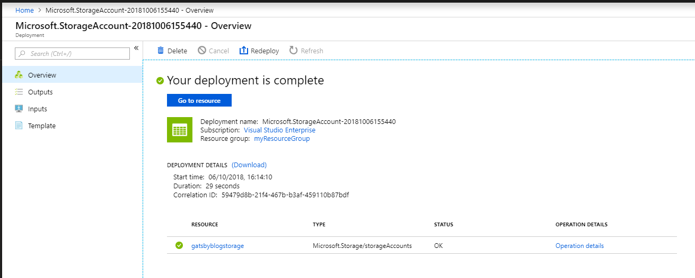
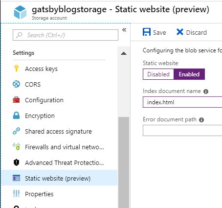
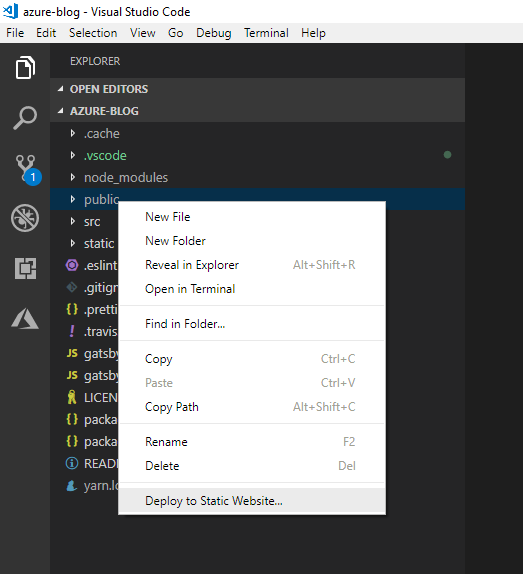
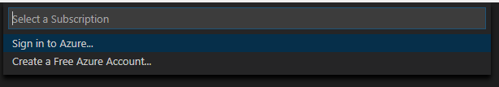
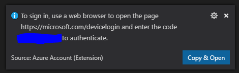
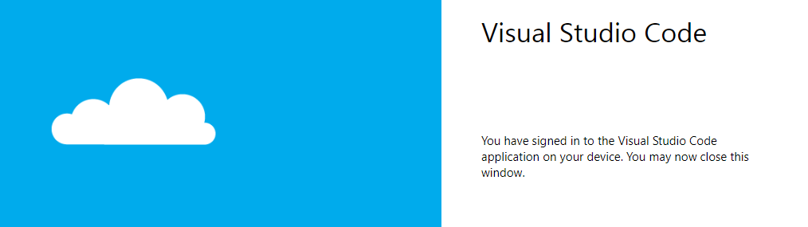
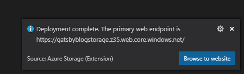

In this post we will walk through the process of deploying a Gatsby blog to Microsoft Azure Storage using VS Code.

## Prerequisites

To complete this tutorial you will need the following tools:

- Node - To run the rest of the tools
- Gatsby CLI - To create your blazingly fast blog!
- VS Code - as a code editor

### Prerequisites Installation

Install Node from the [Node website](https://nodejs.org/en/) and check it's installed by checking the version from your terminal.

```bash
$ node -v
$ v10.9.0
```

Install VS Code from the [VS Code website](https://code.visualstudio.com/).

Next, we can install the important part! [Gatsby](https://gatsbyjs.org/) from your terminal, run:

```bash
$ npm install --global gatsby-cli
+ gatsby-cli@2.4.2
updated 1 package in 4.868s
```

## Creating your blog

Next you will create the blog from the handy [Gatsby Starter Blog](https://github.com/gatsbyjs/gatsby-starter-blog).

> If you already have a site you want to deploy, skip forwards to [Setting up Azure](#setting-up-azure)

From your terminal run

```bash
$ gatsby new azure-blog https://github.com/gatsbyjs/gatsby-starter-blog

info Creating new site from git: https://github.com/gatsbyjs/gatsby-starter-blog.git
Cloning into 'azure-blog'...
remote: Enumerating objects: 1, done.
remote: Counting objects: 100% (1/1), done.
remote: Total 1139 (delta 0), reused 0 (delta 0), pack-reused 1138
Receiving objects: 100% (1139/1139), 2.14 MiB | 2.95 MiB/s, done.
Resolving deltas: 100% (636/636), done.
success Created starter directory layout
info Installing packages...
...
```

You can now view your website by running

```bash
$ cd azure-blog
$ gatsby develop
```

You should now see your blog in the flesh!



## Setting up Azure

Microsoft Azure is a cloud hosting provider which offers a wide range of tools and services. Today you are going to use Azure Storage to host our static Gatsby blog.

> If you don't have an Azure account, [sign up today](https://azure.microsoft.com/en-us/free/) for a free 30 day account with $200 in Azure credits.

> Note: You will need to verify your identity with a credit card, but will not be charged unless you begin to use paid service and exceed the free allowance. The cost per GB for storage is in the region of £0.04 so it should last a while.

As part of this tutorial you will:

- Create an `Azure Storage Account` for our blog
- Install the `Azure Storage` VS Code extension
- Create a production build of your blog
- Deploy your blog to Azure

### Create the Azure Storage Account

Login to the [Azure Web Portal](https://azure.microsoft.com/en-gb/features/azure-portal/) and select `+ Create a Resource`, find and select `Storage Account` in the list.

Fill in the form by selecting your subscription, creating a new resource group if you don't have one and giving your storage account a name and region. Your form should look something like this.



Click on `review + create` then `create`, after a few seconds, your account will be created.

Next, click on `Go to resource`



### Setup your account for static site usage

Find the `Static Website (preview)` link in the left hand panel and select it.

Change the option to `enabled`, set a default document name of `index.html` and hit `Save`.



> Note down the `Primary Endpoint` that azure gives you, that will be the web address that our blog will be deployed, it will be in the format (https://<the-name-of-your-storage>.<the-zone>.web.core.windows.net/)

### Create a production Gatsby build

You are now ready to produce a production build of your blog. Make sure you're in the blog folder and then run.

```bash
$ gatsby build
success open and validate gatsby-config — 0.010 s
success load plugins — 0.352 s
success onPreInit — 2.785 s
success delete html and css files from previous builds — 0.041 s
success initialize cache — 0.009 s
success copy gatsby files — 0.139 s
success onPreBootstrap — 0.016 s
success source and transform nodes — 0.147 s
success building schema — 0.521 s
success createPages — 0.072 s
success createPagesStatefully — 0.037 s
...
```

This will output a production build of your blog into the `public` folder.

## Install the Azure Storage extension

The easiest way to deploy your blog to your storage account is to use the `Azure Storage Extension` within VS Code.

[Install the Azure Storage Extension - Extensions Gallery](https://marketplace.visualstudio.com/items?itemName=ms-azuretools.vscode-azurestorage)

> Alternatively, select the extension option from VS Code and search for `Azure Storage`.

## Deploy your blog

Now you can finally deploy your blog!

Right click on the `public` folder in VS code and select `Deploy to Static Website...`.



If you haven't logged in before, this will show you a prompt in VS Code where you will need to select `Sign in to Azure`.



You will see a dialog in the bottom right, asking you to load a webpage and enter a device code. Click on `Copy & open` and enter the code provided.



The webpage should show you are trying to link your Azure device to VS Code, click `Continue` and login to Azure if you weren't already.

If everything worked correctly you should see a page confirming you signed in.



You can now return to VS Code and select your subscription and then your storage account.

Selecting the storage account will begin the deployment.

> If you have previously deployed you will see a dialog asking if you want to delete your files and redeploy.

In a few seconds, you will see a message in the bottom right of VS Code confirming that your blog has been deployed!



Congratulations! You've successfully completed the tutorial and deployed your Gatsby blog to Azure!
