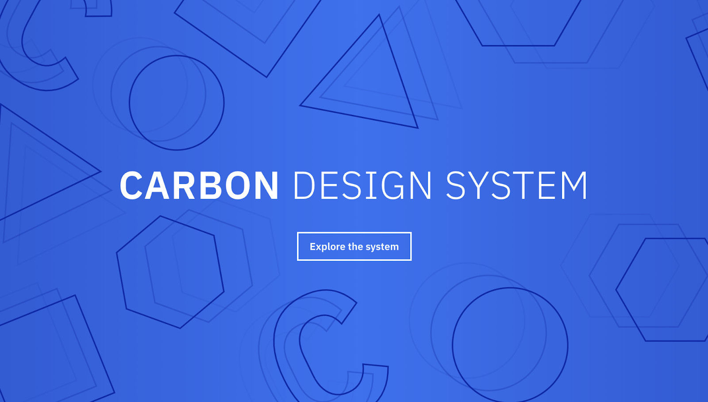
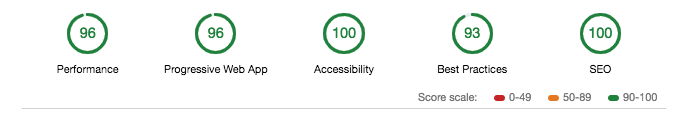

[][carbon]

## Big Company. Big Website.

When IBM, one of the biggest companies in the world, went looking for a solution to help them manage a vast website, they found Gatsby. Carbon Design System is the open source library for all IBM software products. That’s _all_ IBM software - which means the Carbon Design System website has hundreds of pages and more than a dozen developers, designers, and non-technical content contributors. IBM is one of the biggest companies in the world. And that was the problem - so much content led to a site that was difficult to optimize for performance. They needed to launch a refreshed website dedicated to product design requirements for all IBM-related product launches that worked as smart, fast, and reliably as IBM.

## When Your Website Performance Score is a Seven...

The problem with being one of the biggest businesses in the world is the incredible amount of content that must be housed. Carbon Design System is IBM’s own in-house director of internal content controls, features, standards, templates, and really everything related to marketing and web-based content. But to find what you were looking for, you had to sort through a lot of information, layered on pages and pages (literally hundreds of pages) of content. With a [Lighthouse][lighthouse] website performance score of only 7 out of 100, up was the only way to go.

The original site was a home-grown static site based on Markdown and React that was complicated to update. Add to that many, many hands and minds working on it constantly - some with technical experience and some without. The large volume of content and content creators made it difficult to accomplish the main business objective for the website, which was to make it easy for anyone to contribute content, regardless of their level of technical ability.

The main goals for the new site were simple:

- A faster and easier site that anyone could update - even if they didn’t know how to code
- Good documentation - if anyone leaves the project, all the documentation is there, which eliminates the need to search around for how it was created

## Easy onboarding with Gatsby

Alison Joseph, Front-End Developer at IBM, took over this project from a coworker who had already done great work choosing the framework for the website rebuild. Taking on a new project mid-stream can be daunting but Alison found the Gatsby documentation was top notch and better than any other open source docs she’s seen.

Alison was the only developer able to focus full-time on the Gatsby project and it took about six months before the new site launched in October 2018. She’s quick to point out if they had gone the custom, in-house route, the project would have easily taken twice as long and required more than one developer.

<Pullquote>
Gatsby just works. With the old system, I had to fight with something for a few days to troubleshoot issues. With Gatsby, you install and it just works. It’s stress-free.
</Pullquote>

With non-technical content writers and designers needing the ability to add content quickly to the site, the “second to none onboarding” made it easy for everyone, regardless of skill level, to be successful. The Gatsby documentation made it easy to onboard new developers and the process was simple enough for any of the content creators to understand. This achieved one of the most important goals for the website: the documentation and process was there for the next person so they wouldn’t struggle.

<Pullquote>
A home-grown system goes down when the people who created it leave. Gatsby doesn’t allow for that - it grows with whoever is at the controls then seamlessly passes on to the next person.
</Pullquote>

## A New Era

The new Carbon Design System website launched October 3, 2018, and is referenced by designers and developers as an open source project as well as internally at IBM. With a seamless design feel, most users didn’t “see” any changes, but they sure felt them with the lightning fast page load times. Alison pointed out their new Lighthouse performance score went from 7 to 96 (that’s a 89 point jump!) with PWA, Accessibility, Best Practices, and SEO scores in the high 90s - 100.

<figure>
  
  <figcaption>
    Lighthouse Performance Scores with Gatsby
  </figcaption>
</figure>

<Pullquote>
We’re copying Gatsby as a best practice. Whenever we’re working out how to engage our community, we look to Gatsby as the shining example and ask ourselves, What does Gatsby do?
</Pullquote>

## Final Thoughts

IBM is the original tech company. Reaching for Gatsby shows they are still on the leading edge of technology and finding the newest and best routes for their people and clients. As the only developer on the Carbon team able to focus solely on the website rebuild, Alison used Gatsby to completely transform the vast mesh of content to provide an experience that literally any user can access, use, update and transform - leaving it even better for the next person. How can Gatsby do the same for you?

[carbon]: https://www.carbondesignsystem.com/
[lighthouse]: https://developers.google.com/web/tools/lighthouse/
