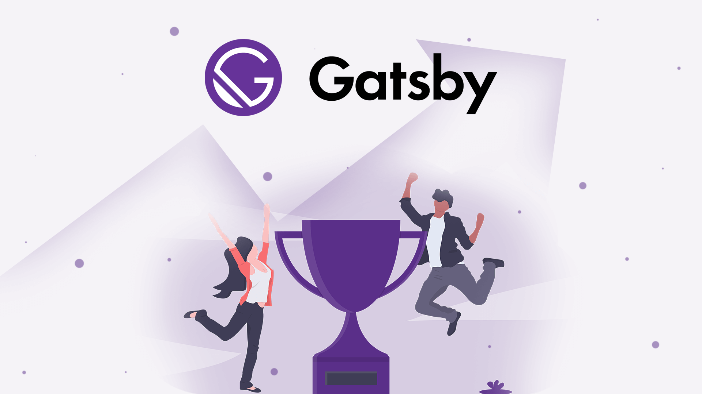
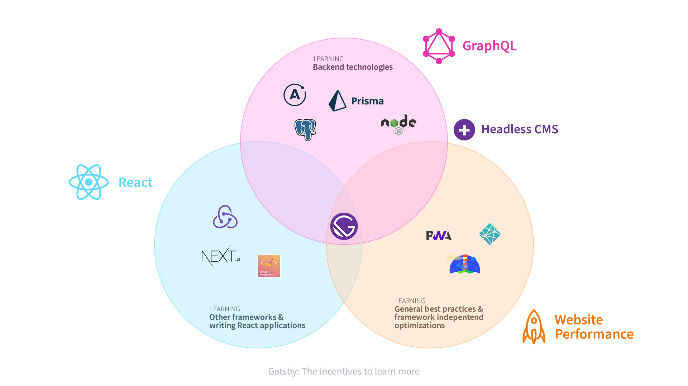

_This blog post was originally posted on the [LekoArts Blog](https://www.lekoarts.de/en/blog/how-gatsby-scales-with-your-expertise-and-scope)_

Many who use Gatsby are not React professionals, or were not React professionals when they began using Gatsby. Some have used other frameworks before. Some knew JavaScript. Others still may have been entirely new to programming!

In any scenario, this individual of disparate experience and expertise was able to use, enjoy, and love using Gatsby.

I myself am even an example of this general scaling idea. I began my career doing UI design, and have since been doing HTML, CSS, and JavaScript for several years now. As my skills have broadened, so too have they improved and scaled by adding Gatsby to my go-to toolchain.

In this post, I want to explain how Gatsby led me into learning React and how your Gatsby project can scale by considering my [personal site](https://www.lekoarts.de/en) and experience, as an example. Gatsby seamlessly scales from basic React usage to complex React patterns, from basic Markdown to full-featured [headless CMS](/docs/headless-cms/) — Gatsby scales with your expertise and scope.

## The beginnings

When I first discovered Gatsby two years ago, React was already quite popular. I decided to learn it to get more into modern frontend development and to step up my game. Before that I did **static** HTML/CSS/JS websites with the help of SCSS and Gulp. I never used a server-side scripting language (e.g. PHP) or a scripting engine (e.g. Nunjucks). So this was a big step, wasn't it?

<Pullquote>
Gatsby offers you a playground to learn React.
</Pullquote>

My design background (e.g. thinking in components), knowledge of JavaScript, and good tutorials definitely eased the learning curve but Gatsby also was of big help to me. My personal site always was a static site displaying my works. But now I wanted to update it more easily and also start blogging. That exactly sounds like one of Gatsby's use cases. It takes all the hard things away and offers you a **playground to learn React**, e.g. only using it as a templating language. So, to answer the question: I wouldn't say that it was a too big step for me 😊

After the v1 release of Gatsby (June '17) I also went live with my personal site which used Markdown as its source and the built in CSS Modules for styling. I didn't know much React at that point and hence used it more as a templating language — but still had a PWA and excellent Lighthouse scores!

## Move Fast and Break Things

After I launched my site I continued to learn React and Gatsby. As it doesn't limit you in how you can use React. I treated my website as an experiment. I experimented with new, cutting-edge React techniques just to see how they worked, and they worked quite well! Gatsby also had a lot more to learn: GraphQL, Node APIs and gatsby-image, to name a few.

Gatsby's rich plugin ecosystem allowed me to easily try other packages. I tried different styling approaches, different data sources, and so on... Most plugins work without manual configuration: Install the package, put it in your config and see it working — awesome!

Over the following couple of months I really moved fast and broke things, but learned a lot in the process. The important bit here is: Gatsby was never the bottleneck or the reason I couldn't try something.

## The incentives to learn more

I explained how good of a learning experience I have had with Gatsby. But now I want to tell you that taking the hard things away (at first) also can be a reason to learn more.

Why? You get a gentle introduction to topics like GraphQL. Certain restrictions can be bothersome in some edge cases, but at the beginning it's good to only have one way of doing things. This means that you don't have to fully understand all the bells and whistles to have a fast site or GraphQL for data querying — but you certainly have a feeling of how it could work in the end.

So many people say after using Gatsby: "Wow, GraphQL for data querying is so great, I don't want to miss it!" And I'd say that these people definitely will try to integrate GraphQL into their other projects afterwards.

The Venn diagram tries to show how the above example can also be applied to other technologies/tools that Gatsby uses. Besides GraphQL I chose React, Headless CMS, and general website performance.

You can try different React frameworks/components, you can learn how to setup your own GraphQL server or learn how to increase website performance. Headless CMS is another very interesting field to explore. And that's what I did. I used Next.js with Apollo and other great libraries, used Prisma to set up my own GraphQL server, and tuned my website performance (e.g. with optimizing fonts).

**Result:** My Gatsby projects can benefit from the gained knowledge!

## Final thoughts

Monolithic CMS applications are being replaced by specialized content systems as Sam Bhagwat already wrote in his series ["Delivering Modern Website Experiences: The Journey to a Content Mesh"](/blog/2018-10-04-journey-to-the-content-mesh). Gatsby embraces this modularity with its vast plugin ecosystem and the ability to bring your own data from anywhere. It is this very modularity that not only allows professionals to use their favorite services, techniques, and advanced practices, but also beginners to have a gentle introduction to the React and GraphQL ecosystems and standards. Gatsby is an **incredible platform** to gain an understanding and expertise in both. Start small and scale your expertise and understanding with Gatsby.

Furthermore it's also a great platform to learn other technologies and see web performance optimizations live in action. Without being entangled in low-level complexity, you can build up your stack and knowledge upon a solid and performant foundation which makes Gatsby perfect for your go-to React boilerplate.
