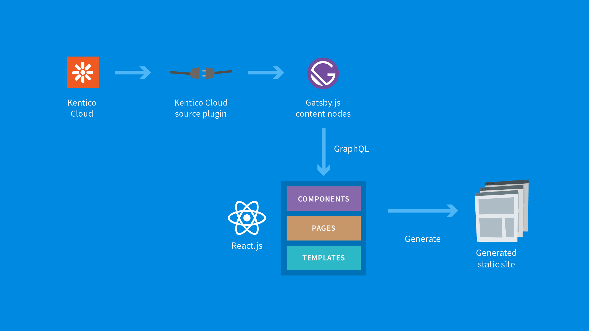
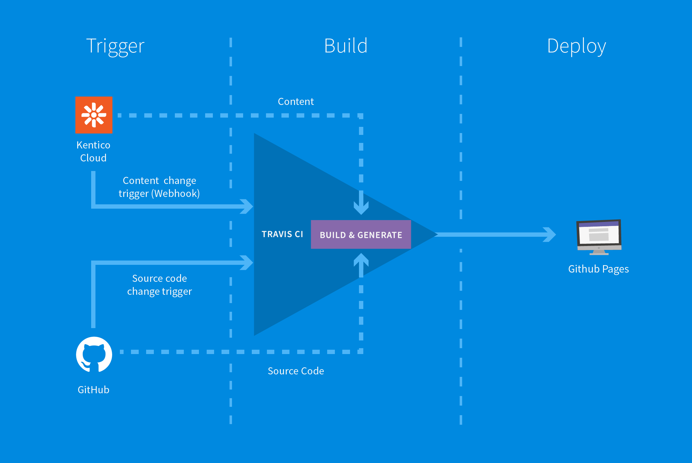

I have to admit I have never really been a fan of JavaScript. I know, shame on me! When I was finishing my studies, I was all about .NET as it was easy to understand, debugging capabilities came with Visual Studio out-of-the-box, and the inheritance and objects model was simple. I looked at JavaScript with thoughts like "what kind of language would allow you to create objects freely, clone them, add functions to only specific instances or allow anyone to see the source code?"

It was during the first years of my development time that I needed to use something on the frontend to enrich user experience on a client's project. That something was the first version of Angular and believe it or not; I loved it. Angular made it so easy to build a UI communicating with .NET backend. At some point, I think I even owned a mug with NG on it.

A few years ago I heard about static sites for the first time from a friend of mine who was very enthusiastic about them, especially their performance. I thought it was a nice idea, but very fresh at the time and with only a small community around it. It was earlier this year when I met some awesome guys from the [Gatsby community in Berlin](http://bit.ly/2ClmzcT) that changed everything for me.

## Why Gatsby?

The great presentation by Callum MacDonald explained basic Gatsby features and purpose as well as cool new features of version 2. I knew the basics of Gatsby-like using React for the website implementation and that I would need to generate the static pages before deploying. But what I found really cool was the ability of handling images - you know, preloading and resizing. And I also thought that the prefetching of linked pages could make a huge difference in user experience. That really puts Gatsby above other similar generators.

## Why static site?

One of the websites in our company stack is [Kentico Advantage](http://bit.ly/2T0ynXJ). It is a content-oriented website where we provide our customers with our own methodology on how to build amazing and successful websites with traditional CMS. The website was originally also built on top of a traditional CMS until we switched to MVC during this year. We did that to be able to use a [headless CMS](/docs/headless-cms/) as content storage and drop all the pieces that required maintenance like the database server. The business logic was in the MVC layer and we hosted the frontend on Microsoft Azure.

So why did I decide to make Kentico Advantage a static site? A key aspect was performance. We wanted to enable our clients to access the site while being on-site with their customers, using mobile devices and a slow internet connection. I personally wanted the source code to be as little as possible, in a language that everyone would understand. I won't be the only developer on the project for eternity and we tend to have more frontend developers in-house these days. And obviously I did not want to spend months on it. With Gatsby we were fine on all those counts. I was not familiar with React all that much before, but having the site content-oriented and well structured, the implementation was a piece of cake. Saving money on server costs was a nice side-effect, but more on that later.

## Why Content-as-a-Service?

Leveraging Content-as-a-Service with a headless approach has many benefits. Some traditional CMSs have REST APIs and are a good fit for many use-cases, but some can be limited in terms of scalability and flexibility, and require a high degree of maintenance. Nobody really likes to babysit a CMS, right? Content-as-a-Service platforms give you freedom in the ways you can consume the content. Yes, we initially started building just a website, a single channel, but if we decide to create a mobile app in the future, we can easily consume the same content there with no additional effort. In other words, content in a headless CMS is channel future-proof.

## Why Kentico Cloud?

Well, apart from all the [features every mature headless CMS should have](http://bit.ly/2BwwWsC), Kentico Cloud features a super friendly user interface that makes the job of content editor very productive. Users can collaborate on the content with each other using a single tool. There's no need to keep using other tools like Google Docs or MS Word in another window. We all know that the less tools we need to use the more effective we are. Actually, the article you are reading right now has also been created, collaborated on and approved using Kentico Cloud.

Kentico Cloud also makes it easy for editors to understand the hierarchical structures you as developer laid out for them as content models.

## Gatsby source plugin

For us developers, the headless CMS tools are very important. Apart from great technical documentation and many SDKs (including [JavaScript](http://bit.ly/2Gsq0Tb)), Kentico Cloud has a [source plugin for Gatsby](http://bit.ly/2S8ZzTO). If you decide to build a static site like I did, it's just another package that you install via npm.

```shell
npm install --save gatsby-source-kentico-cloud
```

which updates packages.json

```json
...
"gatsby-source-kentico-cloud": "^2.1.0",
...
```



The plugin acts as a middle layer between the headless CMS and your website implementation. It gets all content items, creates GraphQL nodes out of them, and it builds all kinds of relationships among them. This allows you to leverage GraphQL in any component or page to properly separate functionality into blocks and modules.

Whenever I code with a new framework or plugin, I like to take inspiration from existing implementations. The [Kentico Cloud Gatsby starter site](http://bit.ly/2LnLkYL) makes it easy to figure out the initial questions, like how to configure API keys or how to query for content.

## Generating pages from dynamic content

Almost every website has a set of content items that use the same template. It can be news articles, a list of offices, or products and other similar items. For these cases, [Gatsby allows us to programmatically generate](/tutorial/part-seven/) these pages using their content and a template. This is so cool as I was able to create the whole website using just three files representing static pages, two templates of dynamic pages and this simple piece of code using GraphQL and data from Kentico Cloud:

```js
graphql(`
  {
    allKenticoCloudItemPhase {
      edges {
        node {
          system {
            id
          }
          elements {
            url {
              value
            }
          }
        }
      }
    }
  }
`).then(result => {
  if (result.errors) {
    reject(result.errors)
  }
  result.data.allKenticoCloudItemPhase.edges.forEach(edge =>
    createPage({
      path: edge.node.elements.url.value,
      component: path.resolve(`src/templates/phase.js`),
      context: { id: edge.node.system.id },
    })
  )
  resolve()
})
```

## Where to Deploy?

Implementing the site using Gatsby and the Kentico Cloud source plugin is super easy and fun, but at the end of the day, there are two questions you should ask:

- Where should I host the static files?
- How can I automatically regenerate the site when there are content or implementation changes?

The first question is clear; you can keep using the same hosting provider and plan you have currently, right? But with the new implementation, all generated pages are just static files. You probably won't need the same amount of computing power or server memory. In our case, we decided to host the website on GitHub Pages, as the git repository is already hosted there, and the price is very tempting (0 USD). It also supports custom domains.



The answer to the second question is a bit more complicated. A static site needs to be regenerated every time the content or the site's source code is changed. We are using the Travis CI tool for automatic build and deployment to GitHub Pages. When there is an implementation change (push to GitHub repository), Travis is invoked automatically. For content changes, we are using [Kentico Cloud webhooks](http://bit.ly/2QzOdeS) - this works flawlessly! Whenever an editor publishes a new content item, webhook notification triggers a Travis build. Travis pulls the content from Kentico Cloud, fetches source code from GitHub, and after few moments of magic combines them into a nice set of static files - your static site. The last step of Travis is deployment to GitHub Pages.

## Build a Static Site Today

You see, a static site does not necessarily mean static content. Our Kentico Advantage website is not yet live as I am still finalizing full-text search functionality (integration with Azure Search). But I could not wait any longer to share my experience with you. If you want to check out a static site already running on Kentico Cloud and Gatsby, take a look at our [Developer Community page](http://bit.ly/2EqdlgO).

Do you want your website to be blazing fast, secure, and so comfortable to browse through? A static site is a way to go.

So, give it a try and take a look at the starter site in GitHub or sign up for a trial account at [Kentico Cloud](http://bit.ly/2QzUALM) and let me know what you think.

Season's greetings and have a "Static" New Year!
