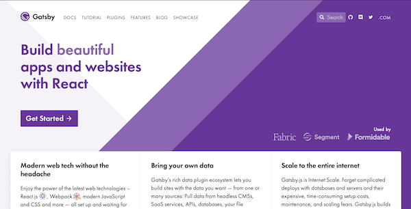
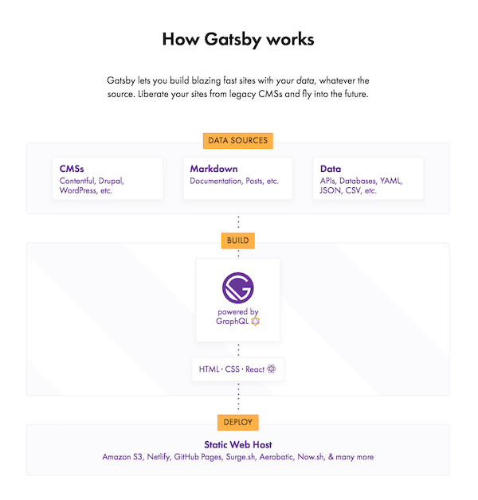

## What this article is about:

Recently, I gave a talk with this same title at Gatsby Days in the San Francisco Bay area ([watch and listen to the talk here](https://www.gatsbyjs.com/gatsby-days-uxresearch-shannon/). This article reviews the following:

- Why do UX research on your website?
- How to do high-impact, low-effort research
- Top 5 pain points we’re solving at Gatsby
- How to sign up to be a usability tester

## Why do UX research?

In October 2017, when I first started asking developers if I could interview them about what it was like to use Gatsby, many of them thought I was scamming them :). At an early-stage startup that’s going lean, a full-time UX researcher is rare, and especially rare in open source projects. People consider UX to be sort of expensive, in the sense that it takes time, resources, maybe hiring someone. It can also be sort of intimidating to think of how to hire someone with UX expertise, or to try to develop the expertise yourself. And people may doubt that the results of UX are worth the investment.

To make sure it’s clear why we do UX research at Gatsby, here is the reason:

We do UX research to live up to these two Gatsby values:

1. Create awesome DX
2. Create awesome UX

Creating awesome DX and UX are two of the company’s values. We know that developers who use Gatsby and anyone who visits a Gatsby site are the experts on what makes their lives easier, so we make efforts to empathize deeply with our users so we can create the best available developer experience (DX) for making websites and best user experience (UX) for using websites. I think of these both as UX in a way, so will just use UX from here on out.

## Can’t we live our values _without_ research?

You might wonder whether it’s possible to create awesome UX without research; valid question, especially since it’s always nice to save time, effort, and money. When done right, UX research:

- ensures meaningful work (e.g. you are focusing your efforts on what will make the most impact on your goals)
- saves time (because you focus on the right thing earlier and learn about your mistakes faster)
- is fun, surprising, and confidence building! (It’s incredibly fun to meet real users, and imagine having the confidence to _know_ that you’re building something that helps them, rather than just _hoping_ it helps them)

## How to do high-impact, low-effort projects

We’ve figured out low-effort, high-impact ways to do UX research that still allow me to also do lots of other things, like manage the docs. Many of these ideas have come from my own experience with a large portion of trial and error, great mentors like Dave Hora and Marisa Morby, the UX research google group, ProductHive in Utah, and plenty of reading articles and books.

## Do high-impact projects

Focusing on the biggest risks to your product’s success involves mitigating product risk and making sure the project’s results are actionable.

## Mitigate product risks

UX research focuses on mitigating product risks, while other departments focus on mitigating market risks. Product risk is the possibility that the system or software might fail to satisfy or fulfill some reasonable expectation of the customer, user, or stakeholder. [Risk-based testing](http://tryqa.com/what-is-risk-based-testing/) involves testing the functionality which has the highest impact and probability of failure.

An example of risk-based testing at Gatsby:

We had 90,000 new visitors to gatsbyjs.org homepage in October out of 100,000 total visitors, and most of them arrived at Gatsby via organic search. That’s a huge influx of new visitors, and we didn’t know anything about them!

_Question:_ Can you tell which number from the list below describes our scenario?
A few ways of thinking about risk-based testing:

1.  we need to test the functionality that probably won’t break but would be very bad if it did (high impact, low probability of failure)
2.  we need to test the functionality (and come up with contingency plans!) that probably will break and will be very bad when they do (high impact, high probability of failure)
3.  we don’t test the functionality of things that probably won’t break and it doesn’t matter if they break (low impact, low probability of failure)

_Answer:_
Because of the high number of visitors to the homepage, the homepage can make a large impact (positive or negative) and because we didn’t have data on how frequently the homepage succeeds or fails to meet user needs, we had an unknown probability of failure. So that matches number one and two (1 & 2) most closely, though we needed to do more research to calculate the probability of the homepage failing to reach its goals.

Identifying these risks to the homepage led us to our current research project.

## Current research project: .org homepage

We needed to know two things to assess how the homepage was serving user needs, e.g. calculate the probability of failure.

Question 1
_How accurate are people’s first impressions of Gatsby when they land on the homepage?_
Answer
_Not super accurate!_

When looking at the image above, users had a lot of unanswered questions about Gatsby. We found that the diagram below the fold (see image below) and [the README file in GitHub](https://github.com/gatsbyjs/gatsby#--gatsby-v2) gave the most accurate impressions of Gatsby, and those aren’t super visible.

Question 2
_How do people evaluate whether they want to use Gatsby for a project?_
Answer
_People look for answers to these questions: (1) how quickly they can set up a site, (2) how Gatsby compares to their other choices (Angular, Vue, etc.) (3) licensing info, (4) is it free, (5) how well does it scale._

The answers to the last question were also not very visible on the homepage, so this led us to a .org homepage redesign project! Stay tuned for the results of that, coming soon :)

## Make sure the project’s results are actionable

### Involve stakeholders early

We included two people on every usability test, whenever possible, and usually they are a person who is a stakeholder with .org. This helped us manage logistics, like one person taking notes and the other asking questions and was also helpful because each person observes different things, so afterwards, when we process the information together, we learn from each other and check the accuracy and significance of our observations. It’s really helpful and validating to have someone to correct you if you observed incorrectly or notice something you didn’t notice or notice the same thing you noticed.

### Have a plan for sharing results

Plan a meeting to present a summary of your research observations. Instead of telling them what to do, let everyone create insights and action items together, because "being a smart person is way more fun than listening to a smart person", like [Erika Hall said](https://vimeo.com/129039134).

### Only gather as much research as your team can turn into action

It can be tempting to start asking everyone about what they think about everything on your website. I know, because I’ve done it! In the past, I created giant spreadsheets and googledocs full of information that no one has read, and I don’t have the time to re-read.

If you have a way of anticipating what budget, timelines, and resources you have to devote to the project, that is great. If there isn’t a clear way to anticipate that, just do a very small project that someone could fix in a half day to start. Because then people will get used to the value of research and be ready/open for bigger projects in the future. Just start small.

### Recruitment

Another part of doing low-effort research is recruiting. Someone recently reached out to me to ask me how I recruit. Honestly, the Gatsby community is so enthusiastic, people volunteer when I just ask them on Twitter. And that has been incredibly valuable. I feel super lucky. The difficulties come in when you need to seek out people who are grumpy / don’t like Gatsby / haven’t heard of Gatsby. To find that audience, I used userinterviews.com, which was honestly a super easy experience and saved us so much time. This is in no way an official endorsement, just a report of what we did. Relationships really help with recruiting too.

### Recruit from people you know and do nice things for them

Try bringing dinner or lunch for a coworker, mom, dad, friend, your spouse or children and ask them if you can watch them try to complete a task for a few minutes. If you have a friend at another company that has people that would use your product, ask your friend for referrals and offer them and their referrals something nice like an Amazon gift card. If you go watch a group of people while they work, bring lunch as a gift. Relationship building efforts go a long way, and most people love food and Amazon gift cards.

Use a recruitment service
We used userinterviews.com and didn’t subscribe (just did a pay-as-you-go thing).

### Gather minimum data necessary

A key to making your project as low effort as possible is to gather the minimum data necessary.

### Sometimes you only need one person

To point out something painfully obvious, sometimes it only takes one person. Your best friend or spouse can point out a misspelling, a button with a nonsensical label, something that’s just totally missing or buggy in the UI. Someone told us they didn’t know how to sign up for the newsletter. So we asked them to poke around and see if they could find it. They couldn’t find it. That’s an example of one person pointing out something obvious to us.

### Sometimes you need 5-7 usability tests

This is the standard process for surfacing major pain points and problems in a workflow or task. This is what we did with .org homepage and recruited through userinterviews.com.

### Sometimes you need to aggregate thousands of data points for months

There is also value in gathering passive feedback from something like google analytics or event tracking. Be careful to gather this kind of data for a specific time period in response to a change on the website so you can compare data "before" and "after" the change. And make sure to gather data from time periods that are long enough to smooth out trends for which you will never find the cause. For example, let’s say a butterfly flapped its wings in Fiji, which started an air current which traveled to Novia Scotia and was so warm that everyone got 10x the number of smoothies as they do on other weeks. If you only gathered data on "how many smoothies do people buy in Novia Scotia" that week and reacted quickly to it, you would be reacting to something fickle and mysterious that probably won’t help your smoothie company anticipate demand effectively. Unless you have a way of influencing butterflies in Fiji, that is.

## How have we done this research at Gatsby?

Stay tuned for the next articles:

- "Solving the top 5 pain points uncovered by research in 2018"
- "Creating a smooth-as-butter onboarding experience for new users"
- "Redesigning the .org homepage"

## How to sign up for a user interview

Sign up for a 15, 30, or 60 minute interview to tell me your experiences with Gatsby so far. These interviews are extremely valuable--we use the information to guide product development! [calendly.com/shannon-soper](https://calendly.com/shannon-soper)

## Know someone who has never used Gatsby before?

If you know someone who might like to get an Amazon gift card for participating in a usability test for first-time visitors to Gatsby, [submit your contact info and your friend’s contact info here!](https://docs.google.com/forms/d/e/1FAIpQLSeP4Z-7OnBeR2gyaLOu-N9GHQ59EFhIPqvzdp0UU70Fj4Bw2w/viewform)
