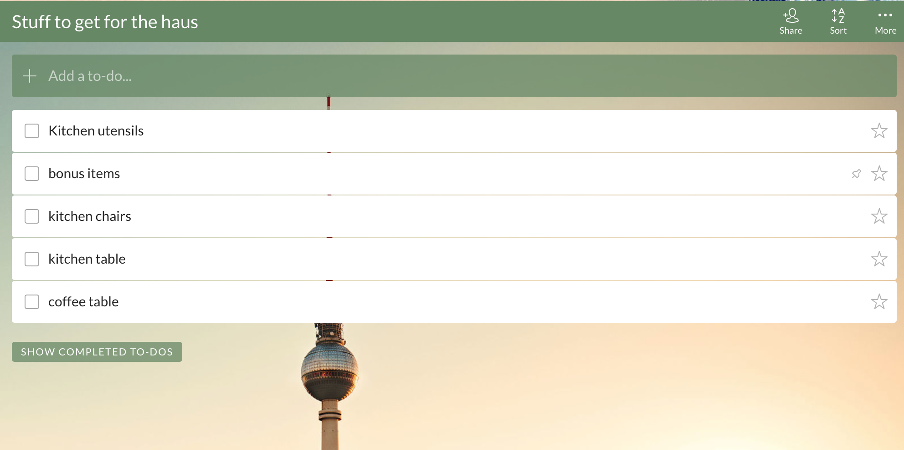

# What is React?

React is a fantastic and wildly popular tool for building websites and apps, and it creates a world where JavaScript and HTML live in happy harmony in the same files and efficiently renders your ever-changing data to the browser.

## Declarative

With React, you can create reusable components that will always render the same data in the same way, which wasn't always the case pre-React. Let’s say you’re a huge Olympics fan and you build a React website for tracking scores. Users who visit your site won’t need to wait for the entire tree to deconstruct and reconstruct when they click a button on your site or when the newest data on the half-pipe is available. React components will efficiently update to accommodate the changing data.

## Reactive

React uses a virtual tree reconciliation method to _react_ to changes in input data. Whenever any data changes, instead of rebuilding the whole DOM tree (which would be slow) — it decides what changed in its virtual DOM and then makes the smallest number of DOM changes necessary.

Almost all frameworks nowadays (e.g. Angular, Vue, etc.) are approaching similar mechanisms. The virtual tree is in contrast to something like vanilla JS or jQuery where you are setting/updating DOM nodes directly.

## Easy to add to the rest of your stack

Switching your site(s) to new technologies optimally involves incrementally transferring your site over, page by page, to the new technology. This is difficult to do with some new frontend technologies which want to control the entire page. These technologies are like your friend who wants to take over every social event they get invited to.

React is not picky; it is happy to be used in only parts of your site, so you can incrementally refactor your code in React. It's more like an easy-going friend who is happy to help with just part of the party you're throwing. It plays nicely with others!

## Component-Based

React components and subcomponents tend to come from breaking your website down into the smallest bits possible, using the [single responsibility principle](https://en.wikipedia.org/wiki/Single_responsibility_principle).

For example, in a To-Do list, the hierarchy of components would include:

* Whole list
  * Title
  * add a to-do line
  * to-do line
    * subtasks within to-dos
  * show completed to-dos button

The [Reactjs.org website recommends](https://reactjs.org/docs/thinking-in-react.html) that you work with your designer(s) when creating a hierarchy of React components and subcomponents, because the designers probably already have names for each small piece of the design, and you can make sure your components have the same names.

React components work just like other functions in any programming language because we call components with some input (called “property” in React) and spit out an output (a chunk of UI in React). Also, components are reusable and can contain other components. All these things are the same as other functions in other programming languages.

## Using React with Gatsby

GatsbyJS is a great way to build websites with React and actually solves some unique problems by making the following things more straightforward:

* _Pulling in data:_ In Gatsby, GraphQL and plugins help you use data from nearly any source (including both traditional CMSs and headless CMSs. Some people I’ve talked to recently even built their Gatsby sites with Google sheets as the data source.
* _Creating pages and routes:_ Gatsby also gives you an intuitive interface for creating pages and routes. So intuitive, in fact, that when I talked to a coworker, I said, “I remember creating pages and links to those pages from other pages, but I don’t remember creating any routes in Gatsby.” They responded, “Yeah, Gatsby took care of that for you.”
* _Solving performance problems:_ Gatsby sites rarely have performance problems due to Gatsby’s way of loading static files.

Gatsby combines the awesomeness of React with all the friendly helpfulness you’d hope for in a modern PWA framework. Happy coding, and let us know how it goes by joining us on [Twitter](https://twitter.com/gatsbyjs) and [Github](https://github.com/gatsbyjs/gatsby)!
