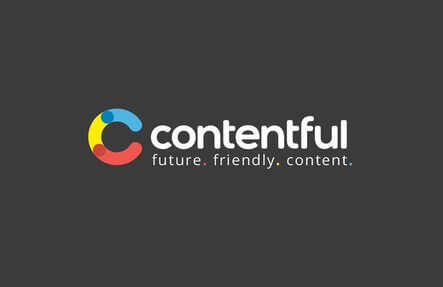
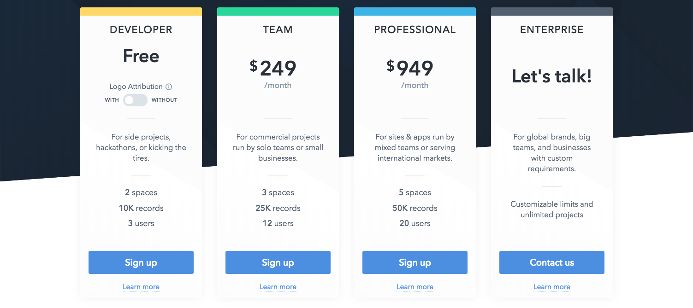
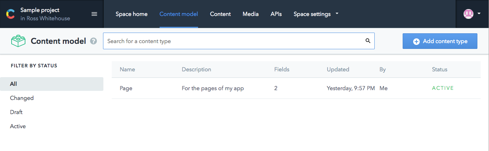
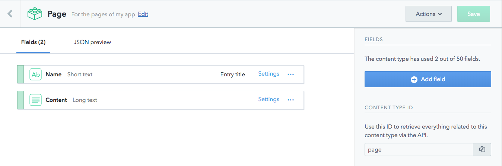
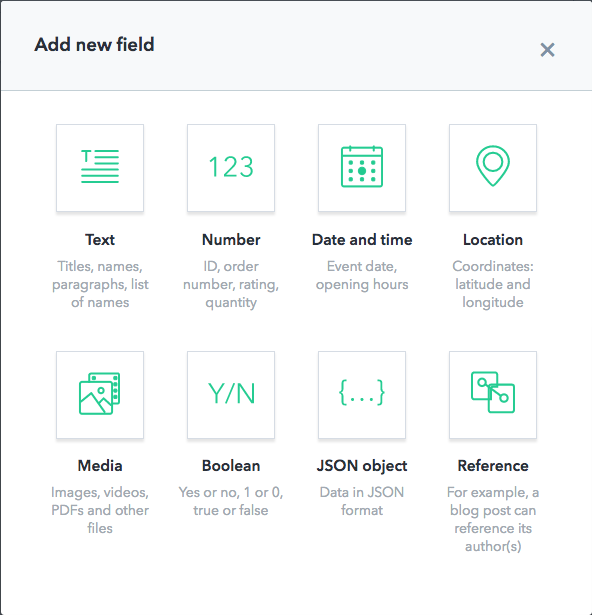
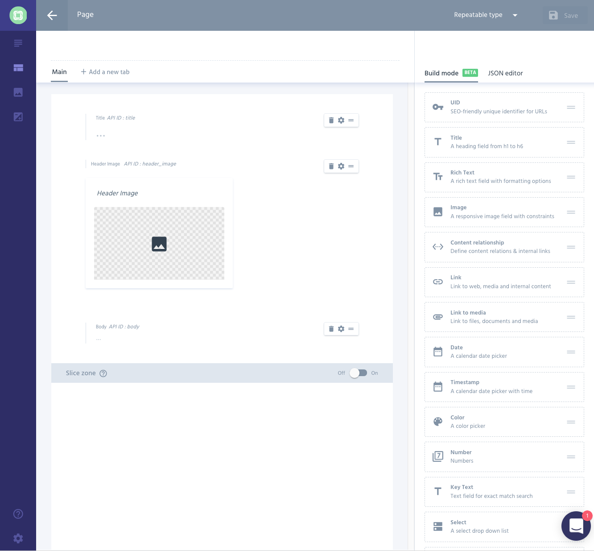
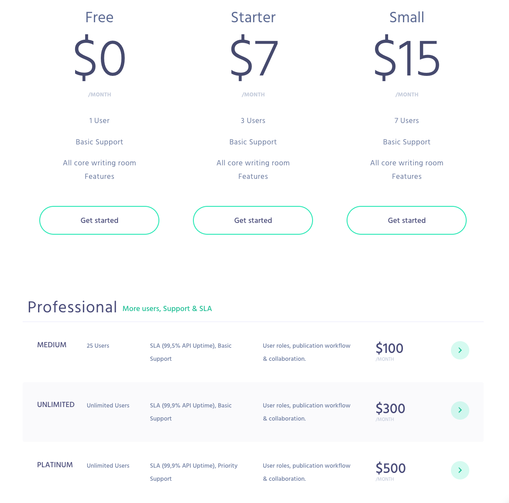

A little while ago I had the six-monthly itch to redo my portfolio site, and I decided I was going to learn to use Gatsby. But that seems to be only half the battle. After you’ve built your front-end, how do you decide on the back-end? There’s so many out there!

## Background - Why Gatsby?

The only thing as abundant than Headless CMS options is Static Site Generator options. From Hugo (built on Google’s Go language) to Jekyll (Ruby) and even Nuxt which is based on VueJS. I picked Gatsby out of the pack for a number of reasons, chief amongst which is that I’m professionally a React.js developer, so getting to use React in these quick projects is a great benefit.

Gatsby pitches as a “Blazing-fast static site generator for React”. So if I can build sites, but also encompass some React knowledge, all the better right? And I’m always looking for side-projects and sites for others, so if I can get a JAMstack sorted quicker and easier than my previous WordPress stack, then all the better going forward! I thought it was best to start with my own site, to test the viability.

> **What-stack?** JAM stands for Javascript, API, Markup. There are lots of benefits to this type of site, but the one I’m interested in is that your CMS is detached from your site - no hefty WordPress build for your tiny blog site.
> [You can read more on the JAMstack website](https://jamstack.org/).

I found Gatsby a real pleasure. You can find tutorials on their site for setup and once you see the code it’s fairly simple. I can personally recommend [Scott Tolinski’s series - available on Youtube](https://www.youtube.com/watch?v=b2H7fWhQcdE&list=PLLnpHn493BHHfoINKLELxDch3uJlSapxg). Gatsby nicely wraps up React and React Router with a nice folder structure, webkit, ES6, SASS support and - importantly - GraphQL.

> **What-QL?** GraphQL is a query language for APIs. Where in the WordPress Days I’d have to get the whole post just to display the title, with GraphQL I can tell the API to give me just the title.
> [Their site is pretty handy too](http://graphql.org/).

I got the site setup pretty quickly after learning about it. There’s a tonne of tutorials and instructional material around. And you can use as much or as little React as you want. There’s also a [massive list of available plugins](/docs/plugins/), which is only going to grow.

So if you have any experience with React, or if you’re just getting started, this is a great choice. Gatsby doesn’t tell you how your code has to look. In fact it’s setup so you can use Markdown files for pages, but I didn’t fancy that, so I don’t. Simple as that! Likewise, if I want to scale this to build websites for other people, I don’t want to spend ages teaching them how to use Markdown, clone a git repo and add it to the git repo. Queue a Headless CMS.

You build your site. You’ve got your SASS, you’ve got your Markdown files (or not), but everything’s blank! So now what? How do we populate it with content?

## The Next Step: A back-end

Now we need a system to manage and deliver our content in a nice API (instructed by our GraphQL of course). And there’s a whole bunch of them about. To help us out, Gatsby has plugins that cater to some Headless CMS like the WordPress API, Contentful, Cockpit, Prismic and NetlifyCMS - which Gatsby actually has a guide for. I’ll be going through a few of these to see which one might be more useful for this small project, and going forward.

> After posting this, I heard some really good thing about [GraphCMS](https://graphcms.com/) - It’s designed to work with GraphQL inherently and they have a [Gatsby Starter Project](https://github.com/GraphCMS/graphcms-examples/tree/master/gatsby-source-plugin-blog) example to check out.

Firstly, though, why do we want a Headless CMS and a JAMstack for the project? There are a few reasons most people use them, and some that are down to personal preference:

1. **Easy setup!**
2. **No back-end code.** I’m a front-end dev and honestly don’t want to spend hours setting up some PHP that I won’t enjoy. Gimme the good stuff.
3. **No server needed.** Cloud CMSs mean that I don’t need to pay the hosting people to setup an SQL database.
4. **Easy to edit.** If I need to edit a site on the fly or have a client who needs to do the same, they don’t need to touch any code or run to their home workstation to fix a spelling error. They can access it anywhere.

---

### Contentful

This is the one I’ve heard the most about in my research. Contentful is big and well-known - used by over 130 thousand developers if their website is to be believed. I also like their description “Fast. Flexible. Future-proof. It’s everything your CMS isn’t.” It might as well say “My CMS could beat up your CMS.”

With all the acclaim, however, can come a hefty price tag. Contentful does have a free tier if you display their logo in the footer, you can keep up to 10,000 records and have 3 users - which isn’t bad at all. For my personal site I’m happy to plaster whatever attribution on the bottom. If you wanted to use this for a client and they were dead against someone else’s logo being on there, you can go up a half-tier with the same spec for $39 a month.

From the paid Developer edition upwards, it seems a pretty steep fee, especially compared to some others. That said, if you’ve got a client willing to fork out a hot $949, why not?

As soon as you sign up (for free) you get access to a dashboard with some dummy content and links to tutorial videos\*. You can see the dashboard with all of your content types. I setup a ‘Page’ type for the text on my pages. You could do posts or other custom types.

> \* In the videos the guy pronounces Contentful like ‘content’ as in pleased or satisfied. I always thought it was Contentful with ‘content’ as in CMS. But what do I know? He works there.

You then setup your fields, choosing from a big list. If you want a simple Title/Body you can set it up as above, or you can use times and dates, images, whole JSON Objects and more. You can also localise fields to only show in certain countries, make them required, and how they appear in the CMS. For example, I couldn’t see how to create a checkbox (as there isn’t a field-type for it), but if you create a Short text field you have the option to only allow certain values. Then, you can set the CMS-appearance to a drop-down or some radio buttons. I’d have liked that to be an option as soon as I add a field - something like WordPress’ custom fields - but once you know it’s there it makes sense.

Contentful looks like a fantastic service. It isn’t perfect but it checks all my boxes — and what do you want for nothing? It’s definitely the one to beat.

---

### WordPress’ REST API

Ever since I started coding I’ve used WordPress as a traditional CMS. I’m familiar with how it works, the terminology and documentation. I know that WordPress is very very well-documented. The API includes ACF - a plugin known to most if not all WP devs and theme builders - which opens the posts out to accept all sorts of different fields. In fact, one of my issues about Contentful was based on my much-longer-term experience with ACF and WP.

I’m sure I don’t need to spend too much time telling you the benefits of WordPress. The support is great, the interface is great, and it scales wonderfully. In fact WordPress boasts 29% of the entire internet uses their service. That’s absolutely huge. There are a million and one plugins for everything from SEO to E-commerce, Custom Post Types, Custom Fields and more.

How does this hook up to our Gatsby build, then? Well if you have WordPress.com - WP’s free blogging platform - you can do it automatically for free. If you have WordPress.org - the big-brother that allows custom development - then you’ll need to host that somewhere (possibly free, but more likely paid-for if you get much traffic). My issue with the WP API is that I wanted something that would strip me of the usual server-database setup. But that’s what I’d need to run a WordPress.org CMS - even in a decoupled capacity. I really just one a one-stop-cloud-shop for my CMS like Contentful.

The WordPress.com option is one to consider. They have a [developer blog](https://developer.wordpress.com/2016/11/11/wordpress-rest-api-on-wordpress-com/) about how to get started, which links to a really cool [API console](https://developer.wordpress.com/docs/api/console/) where you can experiment with the different types of requests you can make. In fact Gatsby makes this easier with the [`gatsby-source-wordpress` plugin](/packages/gatsby-source-wordpress). In your Gatsby configuration file you set the URL of your WP install. Then in your WordPress site, [configure a new App](http://developer.wordpress.com/apps/), and your data is ready to be pulled down using a GraphQL Query.

A lot of this information came from a [fantastic tutorial by Jeremey Duvall](https://jeremey.blog/gatsby-photo/). He goes through Gatsby, WordPress.com setup and hooking it up with GraphQL. It’s the whole setup right there.

The only problem with the WordPress.com setup is that it’s restricted to posts and pages that boil down to title/image/content. If you want ACF or other plugins you’re going to need a paid-for WP package, which harks back to the WordPress.org issue: I can’t use it without paying for it.

---

### NetlifyCMS

We’ll be hearing more about Netlify in another article - their original product is a CDN for your entire site, and I’ll be writing more about serving your Gatsby site - but right now we’ll focus on their CMS. Firstly, it’s build on React, so it’s a good bet it’ll play nice with Gatsby (not to mention the Gatsby plugin I mentioned earlier).

One big difference from the others here is that the content in NetlifyCMS is kept in your Git repo, meaning that code and content are versioned together. You won’t ever lose content if you still have the repo, and you can see the history at the press of a button - same as you can with your code.

[Gatsby has a handy tutorial for NetlifyCMS](/docs/netlify-cms/) but they do stress that in order to save to Github etc, you will need your own server:

> To save your content in a Git repo, the repo will need to be hosted on a service like GitHub, and you’ll need a way to authenticate with that service so Netlify CMS can make changes through the service’s API. For most services, including GitHub, authentication will require a server.

They also say, however, that if you use NetlifyCMS with Netlify, they conveniently handle the authenticating for you. Netlify will watch your Git repository for changes and update automatically. This is important to consider that they’re designed to be used together, so if you’re in for one it would benefit you to be in for the other. This isn’t law, but you can see why they’d make it more convenient if you lock into their ecosystem.

Pedro Duarte has a [great article](https://medium.com/netlify/jamstack-with-gatsby-netlify-and-netlify-cms-a300735e2c5d) about using Gatsby with both Netlify and NetlifyCMS.

---

### Best of the rest - Prismic.io & Cockpit

Prismic is sort of a Contentful-like service that does basically the same thing with a few differences. I’m greeted to a post-type-creator similar to Contentful’s, I can create an editor with a number of fields similar such as Title, Body, Image, Location, Link, Color.

Prismic has a similar pricing structure to Contentful - but has a few more options at the budget-end. In fact the only difference between the 3 smaller tiers is the number of users you can add to the CMS. Further than that there are some more premium versions with up to an infinite amount of users and some fancy features like user roles and collaboration. Certainly for bigger projects and bigger clients that would be useful.

Cockpit also seems to share a lot of the same features except for two big differences:

* It’s open source - anyone can download it, anyone can contribute to the git repository and improve it, meaning it’s fully free and will be available - in one form or another - forever. I could see an issue with Contentful if the service ever stopped working. They have backups on AWS and create nightly backups on their premium plans, but the actual interface may become unavailable. Because Cockpit is open source they could go out of business or go offline for a night or just stop working altogether, and there’s a repo available with your CMS on.

* It’s self-hosted - this ties into the last point and if it did all come crashing down, as long as your site is still active so will your CMS be. Great news for the tech-paranoid!

---

## Conclusion - Which Back-End is right?

If nothing else, writing this article has given me a checklist that I need a CMS to fulfil. Some other CMSs have great features, but a couple of them are much more important to my use-case than others.

### Free Option

This is the top of the list. If I’m just messing about with the system, I don’t want to be forking out. If I have a larger project with a client who has actual money, then I’d reconsider. Also to this point I’d like it to be scalable. If I make a friend’s small site with Gatsby, and then overnight his company becomes million-pound business, I want to be able to upgrade the CMS to handle an increase in users or posts.

### Ease Of Use

Cloud-hosted or Git-hosted seem to be the best for this. I don’t need a server to run them and I can control it all in one place. The UI needs to be easy enough for a non-developer and it’d be nice if the system was well-supported so I could get help with issues when needed.

In terms of which CMS to go with, they all have great merits and I can see them all being useful for different projects. But for my needs - for smaller side projects and for personal sites - Contentful and Prismic seem like the ones to go for. They’re both cloud-based with minimal setup and work via an API so I can access them wherever I need to. Also their free tiers have great features, and scale easily so that if I have a ‘proper’ project, I can get a version that will suit any needs.

Was this post useful? Do you use any of these CMSs, or a different one? Please let me know, I’d love to hear about how you get one with them. And look out for a future post about hosting. I mentioned that NetlifyCMS runs great with Netlify, but there are other options! I’ll be looking at Github Pages, Heroku and more!

You can find me on [Twitter](https://twitter.com/RossWhitehouse) and [Instagram](https://www.instagram.com/ross.dw/), and [check out my other posts](https://medium.com/@RossWhitehouse)!
